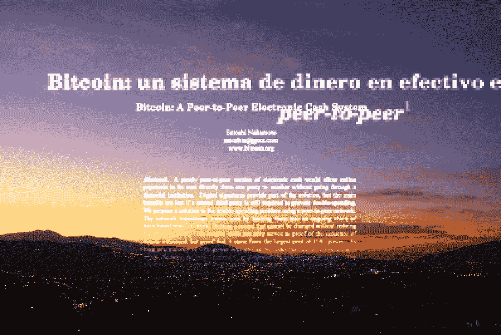
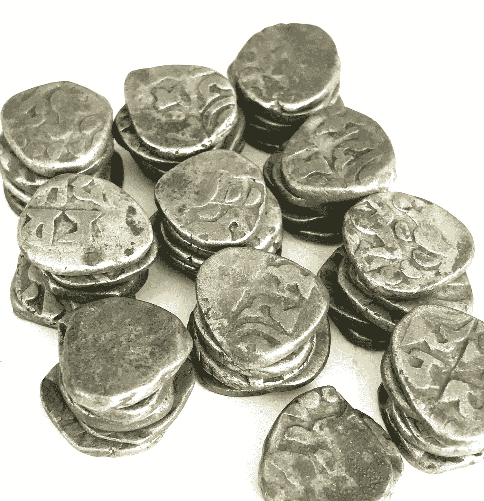
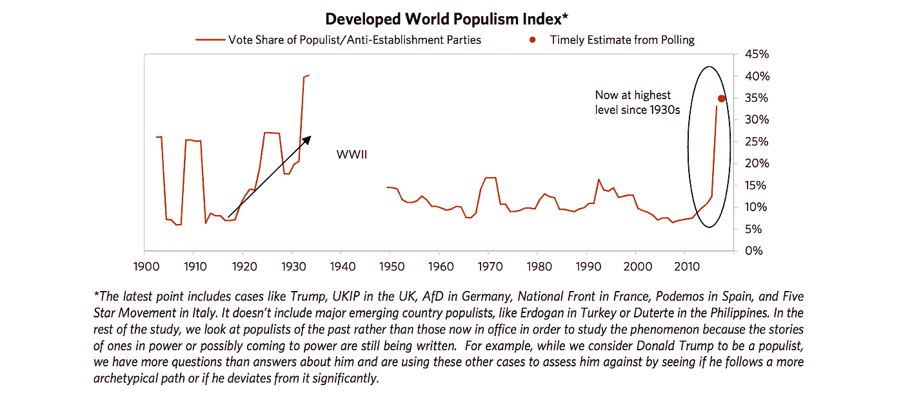
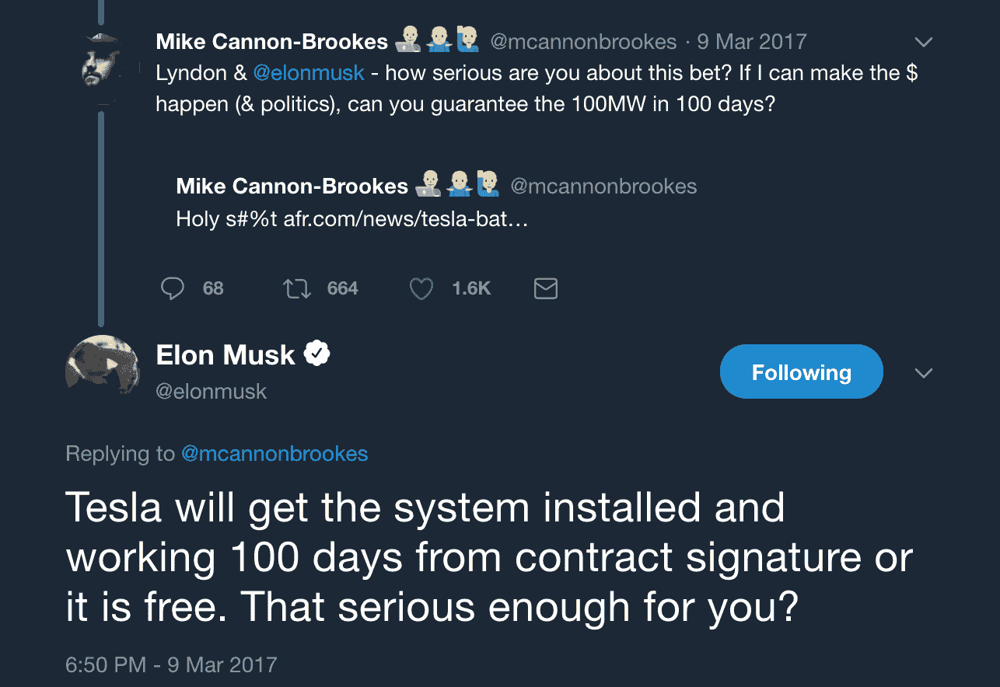
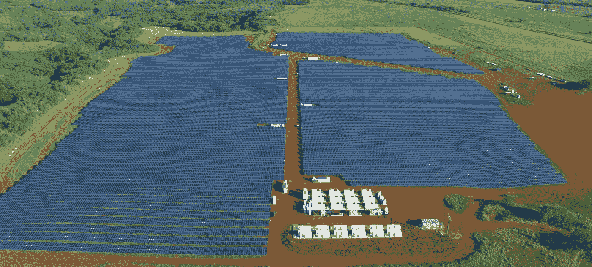
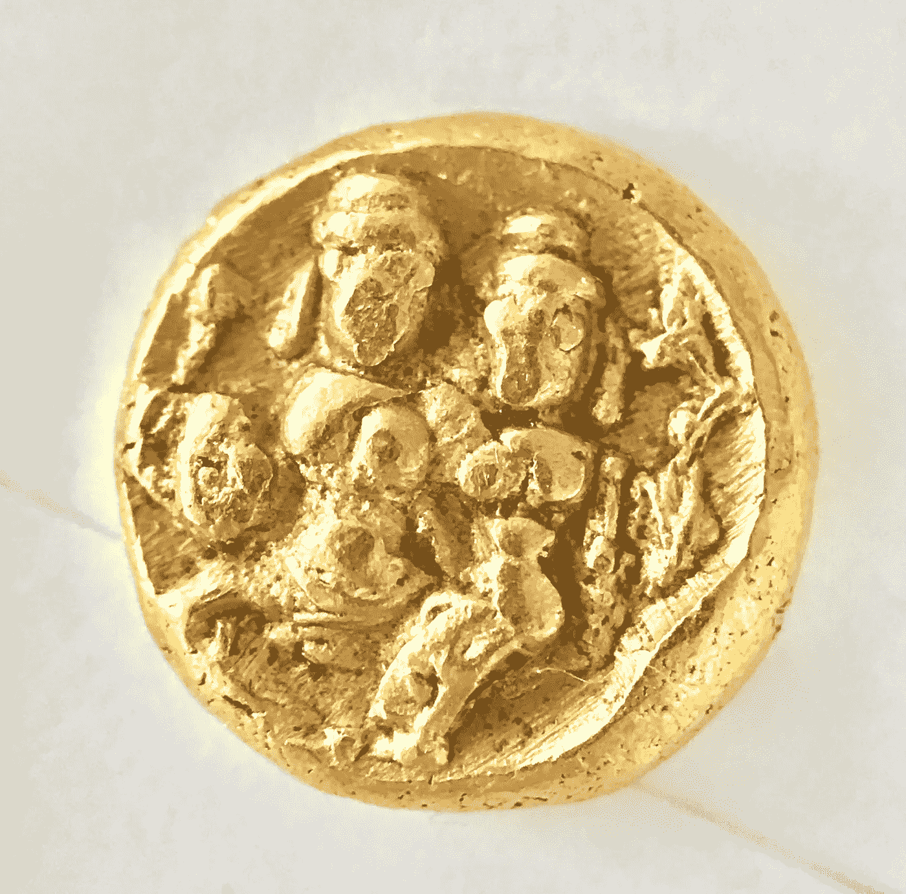

# 反乌托邦委内瑞拉:加密货币正在帮助一个崩溃的社会

> 原文：<https://medium.com/hackernoon/dystopias-philosophies-and-cryptocurrencies-venezuela-earth-19866bcb82c>

## (非虚构)对委内瑞拉王子的采访

CC 2.0 [franzconde](https://www.flickr.com/photos/79928508@N00/) Adapted [https://flic.kr/p/7wgGhd](https://flic.kr/p/7wgGhd)

注意间隙:这篇文章可能包含攻击性语言。

一个拨号音，因为我们建立了一个加密的网络电话。我的联系人对安全问题非常认真，而且相当认真，他这样描述他的祖国委内瑞拉。他描绘了一个被压迫政权控制的国家，一个他认为受到去中心化系统和加密货币挑战的科幻反乌托邦。他所描述的不仅适用于委内瑞拉，而且可以帮助我们定义下一个世纪的全球文明。

我们称我们的朋友为“秘密王子”，指的是他在委内瑞拉外求学时相对奢侈的生活方式。事实上，这位加拉加斯本地人告诉我们，他的家庭在革命前是中产阶级。他亲眼目睹了生活质量的迅速恶化。“我家的钱只够支付我在国外的学费，现在我支付他们的基本生活费用，”他告诉我们。

我的电话接通了，他接了电话。我听到有轨电车和咖啡馆的声音。他是一名学生，一名技术人员，亲眼目睹了加密货币如何改变他的祖国——一瞥去中心化技术将如何定义人类的未来。

*为简洁起见，对名称和措辞进行了编辑，以防止受到文体攻击。*

# **委内瑞拉王子**

**加勒特·金斯曼:委内瑞拉正在发生什么，加密是其中的一部分吗？**

**王子:**让我们把它往后拉一点。2007 年 3 月 7 日*他们*从国家货币中删除了 3 个零，并将其重新命名为“玻利瓦尔福尔特”。今年 3 月 22 日，政府宣布再次转换为主权货币玻利瓦尔，再减去 3 个零。如此多的新纸币被印刷出来，已经到了印不完的地步——光是印刷成本就比纸币的面值还要高。

> 有一个现金黑市——一月份保证金为 20 %- 30 %,现在高达 100%。

我们不知道那是什么，但是现金不见了。如果你用现金付款，人们会给你很大的折扣。有组织的犯罪集团可能参与将现金转移到海外，有太多的阴谋。也没有统一的汇率。政府有几个官方价格比黑市价格低得多。

因为人们不被允许通过官方汇率购买外汇，黑市变成了真实汇率。数百万美元在黑市上流动，没有指标，没有控制…太糟糕了！我们只是不知道发生了什么。

这就是加密的用武之地，它是一种创建负责任、透明的市场的方式，可以实现国际交易。有趣的是，加密对政府来说已经变得非常具有颠覆性。这使得绕过货币管制变得很容易。

当政府宣布他们热爱区块链时，我们就有了这种奇怪的二元性。委内瑞拉政府希望控制货币，并创建一个官方市场，让人们可以买卖外汇。问题是人们正在使用加密技术绕过委内瑞拉政府，而委内瑞拉正在使用加密技术试图绕过美国政府设定的制裁！

Petro coin(莫杜罗总统试图创造一种国家加密货币)没有技术栈，没有人，没有体积。这种石油都是非处方药。应该拍成电影，悲剧喜剧。要注册，你必须下载一份纸质表格，签名，邮寄到某个地址。没有任何技术。对于一个 ICO 来说，这应该是第一个危险信号。

**GK:所以石油是狗屎硬币？**

**王子:** 100%。大多数狗屎硬币有更多的优点！至少它们是存在的，你可以用它们来买卖东西。石油先从瑞士联邦理工学院，然后到 NEM，现在谁知道是什么！这是一场悲伤的演出。石油是宣传。

政府应该是创新的基础平台，而不是试图自己创新。这就是委内瑞拉政府出错的地方。现在每个无照从事加密的人都害怕坐牢。

**GK:彭博报道说在加拉加斯每家每户都有一台加密采矿机** **“这是真的吗？**

我不会说每个房子，但有一个在我的！我有两辆钻塔在开采 ETH。一个有 6 到 8 个图形处理器的钻机可以让你每个月赚 200 到 300 美元。为此，你可以在委内瑞拉过得相当舒适，这是你在这个国家能得到的最高收入。一个钻机大约要花费你 2000-3500 美元。有趣的是，即使旧钻机仍在运行。因为电力是有补贴的，矿工们即使每月挣 30 美元也很开心，因为这是最低工资的 10 倍！

> **我们将采矿视为一种反叛。如果政府把其他谋生方式都搞砸了，至少我们可以插上机器赚钱。这是你意识到一切都是循环的地方，我们插上采矿钻机，因为政府搞砸了每个行业。但是通过插入这些机器，我们正在给网络加油，这将使分散化成为可能，并且有一天可能拯救我们。**

GK:难以置信。你能每天用密码购买面包和蔬菜吗？

王子:目前没有。主要问题是基本的规则。如果你以加密的方式销售，在传统的商业会计中就没有办法把它登记为交易。点对点目前仅限于“信徒”之间。

Some old silver coins

**GK:印度去货币化后(印度政府制造了超过 80%的非法货币)，我试图用 2000 年前的银币在印度买蔬菜，他们也不接受。事实是，整个国家都转而使用 Paytm 应用。**

**王子:**【笑】其实我前阵子用比特币买过机票，超级简单。唯一的问题是他们弄丢了我的包！

GK:政府在用玻利瓦尔和食物供应来控制人口吗？

哦，是的，你在国外呆的时间越长，就越会意识到那里有多糟糕。你在乡下呆得越久，就越会意识到这是多么正常。

> 让我们来定义一下科幻反乌托邦:对我们来说外表看起来相当怪异但却存在的东西。这个国家里有所有这些定义生活的怪异和虚假的参数。在这种情况下，理性和逻辑并不重要。

**GK:在我和尼克·杨(一位来自中国的初创企业创始人)的一次谈话中，他声称民主资本主义无法在区块链革命后继续存在，因为分散的系统本质上是社会主义和共产主义的。亲眼目睹社会主义，你对此有什么想法？围绕区块链对文明的影响，东西方思想的这些差异令人着迷。**

王子:我认为这不是真的——我要给你一个残酷的例子。我在旧金山参加了一个设计思维活动，试图将*设计思维*应用到如何创建一个令牌上。我们被挑战去标记一些不可见的东西。我说 dof 是开玩笑，但不是真的，“让我们把人权象征化。”在接下来的几秒钟里，每个人都得出结论，这是他妈的。因为用不了多长时间，人们就会几乎免费地出卖他们的人权。

**GK:有一篇关于这个的论文叫做** [**【数字隐私悖论】**](https://people.stanford.edu/athey/sites/default/files/digital_privacy_paradox_02_13_17.pdf) **。有了 Snapchat 狗过滤器，谁还需要隐私！？**

王子:这就是我不同意你的中国朋友的原因，因为没有知识或没有钱的人会拿走他们能拿的任何东西。如果我们假设你可以以分散的方式注册一个企业，那么这可能就是共产主义。但我不认为区块链会取代人类的贪婪；这将使交易更有效率，这很好，也更透明，这很好。但是仍然有人拥有大部分代币。这确实是一个共产主义者对另一个共产主义者的问题，也许是一个喝酒时的好辩论。

去年我和朋友们在中国，我们一致认为:

> **没有什么比高效的政府更可怕的了。**

**GK:中国是一个迷人的文明实验。许多社会主义和共产主义国家有“信息壁垒”，例如中国的防火长城。几天前，我和中国学生就社会的抗脆弱性进行了一场精彩的辩论(根据纳西姆·塔勒布的《抗脆弱性》一书改编)。该理论认为，社会从尽可能多的信息和思想变化中受益，而信息壁垒会阻碍这一点。你有什么想法？**

**王子:**我第一次深入思考这个问题是在看了一本叫做*看看谁回来了，*帖木儿·弗默斯*，*关于希特勒在 2012 年回来的书之后。这本书并没有给你太多的背景，希特勒只是出现在现代德国的中部。人们认为他是一个冒名顶替者，给他一个 YouTube 频道。他在故事中说的一件事是他被社交媒体吹走了——“我的宣传机器会用它做的事情！”。希特勒没有意识到的是，现在每个人都可以广播自己。任何人都可能成为宣传机器的一部分。

**GK:愿意还是不愿意，因为穆勒委员会正在调查……**

王子:一旦我们意识到我们有能力免费向全世界传播任何东西，这是非常强大的。然而，任何人都可以畅所欲言的事实冲淡了信息的价值。我们生活在一个事实真的无关紧要的时代，因为你总能找到和你意见一致的人。如果你相信地球是平的，你会在网上找到一个支持团体。我们可能正处于一个大规模信息时代的开端，我希望这个时代最终会巩固。你不能用屏障来控制它。也许区块链会在其中扮演一个角色。

GK:我在中国遇到的大多数年轻人都是在 VPN 时代长大的。我很惊讶我们都是一样的，通过 Tinder、Snapchat 和 Instagram 联系在一起。我们甚至有一些相同的迷因。

**王子:**去打火！

GK:这个信息时代正在引领我称之为“信息引擎”的时代，这是一种在社会范围内设计思想的系统。 [**布里奇沃特资本公司(Bridgewater Capital 月发表报告**](https://www.bridgewater.com/resources/bwam032217.pdf) **称，民粹主义自二战以来从未如此盛行。我们能从委内瑞拉民粹主义中学到什么？**

Bridgewater Capital, used without permission (Sorry Ray)

我认为我们可以学到的是，今天的民主太复杂了。特朗普赢了，因为他在争论一个单一的问题。

**GK:今天，我们看到民主制度面临着自二战以来从未有过的压力。**

**另一个问题，像 PayTM 和支付宝这样的移动钱包改造了国家，crypto 能对委内瑞拉这样做吗？匿名很重要吗？**

**王子:**是的。匿名在委内瑞拉真的很有意思——它非常重要，但在今天似乎不是一个紧迫的问题。经济在黑市上运行，显然每个人都暴露在外。因为太普遍了，大家都忽略了。

> 对政府来说，停止黑市交易就会停止经济发展。

然而，由于政府在追逐人们的私有财产，任何有真金白银的人都把钱转移到了海外——在那里，外国司法管辖区提供的隐私保护保证了他们的财富安全。迪奥斯达多·卡韦略是这个国家的第二或第三号人物，他的女儿试图进入美国。她的美国签证被取消，8 亿美元资产被美国没收！(对着电话笑)社会主义……每次都管用！如果卡韦略是一枚硬币，那将是前 25 名！

必须有一种方法来抑制这种非法活动。我相信加密将在这方面发挥重要作用。

GK:如果每个人都在使用密码，这就产生了一个有趣的问题。 [**国际货币基金组织曾表示**](http://www.imf.org/en/Publications/GFSR/Issues/2018/04/02/Global-Financial-Stability-Report-April-2018) **“加密不会‘给全球金融带来风险……但如果利用杠杆或没有适当的保护措施，它们可能会带来风险。”**

**【补充说明:诺米·普林斯(Nomi Prins)在她的书《共谋:中央银行家如何操纵世界》中指出，加密货币在从中央银行获得自主权方面提供了一个稳定的选择。via**[**Google**](https://youtu.be/3JmWYRkMZRo?t=39m5s)**会谈**

****你能看到如果没有集中发行和货币政策，加密货币的市场饱和可能会破坏政府的稳定吗？我们正在进入一个尚未经受考验的全球经济理论的新时代。****

****王子:**是的。但我不认为这是件坏事。在我看来，一切都是循环的。如果有什么东西不工作，我 100%赞成打破它，所以我们解决它。这一切都是为了利用机会之窗。看看埃隆·马斯克，某个城市电力短缺，他看到了机会之窗。基础设施显然不起作用，一种全新的技术出现了:**

****

**同样的事情也适用于货币。如果你垄断了一种货币，而你的货币是狗屎。我将干扰视为间接反馈。**

****

**Kaua’I Island Utility Cooperative, Tesla Energy**

****GK:让我们深入国际政治领域。纵观** [**过去 50 年中情局是如何推翻政权的**](http://foreignpolicy.com/2013/08/20/mapped-the-7-governments-the-u-s-has-overthrown/) **，金融一直扮演着重要的角色。你认为加密货币会对暴虐政权构成重大威胁，还是会为这些政权提供一种秘密融资的方式？****

**王子:我觉得 crypto 公平竞争。是的，你可以资助任何事情，但是你有钱支持它吗？归根结底是融资问题。中情局的优势在于美元是强势货币，他们可以为所欲为。他们可以印 2000 万美元，但不会对经济产生影响。对于其他货币，你不能这样做。如果不稳定的政府或恐怖分子有现金，他们会想办法转移。加密能改善这一点吗？我不是那么不确定，尤其是当几十万美元就能改变市场的时候。**

**GK:很明显，这些地下组织正在走向场外交易。**

**王子:你现在看到的是巨大的场外交易。这就是为什么我告诉我的朋友不要担心比特币的价格。我认为现在发生的是，财大气粗的人(不一定是罪犯)正在购买场外交易，因为他们肯定会推动市场。数十亿美元正流向加密领域，却没有人看到。看看之后会发生什么会很有趣。这些都是我睡觉的时候想的事情。**

**GK:所以这不仅仅发生在我们的地球飞船的“恶劣”部分？**

**王子:如果你问我，我会说旧金山也是一个高度反乌托邦的现实。我朋友描述的方式是，SF 是一个无限的解决问题的机器，有无限的人才和资本。然而，问题的根源在于对问题的选择。我使用家庭自动化，这很好——但是谁*真的需要在睡觉前把灯调暗。我们可以利用这些资源的一小部分来创造突破性的技术，以解决其他地方的实际问题。***

****GK:我同意我们应该把注意力集中在登月上，比如火星定居和核聚变——这能引起年轻一代的共鸣。****

**王子:没错，我的意思是一旦你发现问题在于焦点的选择，这就很有趣了，但这是谁的错呢？**

****GK:市场决定谷歌在做什么，今天的年轻人还没有消费能力。****

**Prince: 我想找一些私人安保承包商，用飞机把人从旧金山送到委内瑞拉。我是说这个国家要回到过去了！我们正在倒退到用人类代替交通灯。人类的时间怎么会变得不如机器值钱？这就是区块链的用武之地，这些新系统必须是分散的。谷歌和亚马逊的人需要亲眼看看，这种观点会对旧金山有所帮助。**

**我最喜欢的一句话来自《三体问题》。这位美国环保主义者告诉中国科学家，当他们站在一片被烧毁的森林中时，就像是在说，“你周围看到的一切都是贫穷的产物，但我们与发达国家真的有多大不同？”。**

****GK:好的，那么量子计算将如何影响这一切呢？****

**王子:我的意思是，理查德·费曼曾经说过，“如果你认为你理解量子力学，你就不理解量子力学。”我显然不明白。真的是他妈的强大的电脑。发展中国家和发达国家之间的真正差距是技术。委内瑞拉的网速让你哭泣，智能手机的拥有率正在下降。家里的电脑也越来越少了。人们没有工具。毫无疑问，量子计算机将对一切科技产生巨大影响，问题是谁能接触到它？**

**我曾经向一个小组提出一个问题，“机器学习并不新鲜，数据集比以往任何时候都大，但谁在收集这些数据是一个大问题。几个美国巨头正在收集一切。我们将看到英语的巨大进步，但其他语言可能不会如此发达。”我不认为量子计算会很快进入委内瑞拉。**

****

**An Indian gold coin, (May be fake)**

**GK:让我们回顾一下古代技术，黄金呢？在印度，黄金被家庭用作价值储存手段。事实上，印度不允许进口免税黄金来保护这些资产。穷人不会持有现金，他们持有黄金，这是德西文化的一部分。**

****王子:**哇！我听过一些关于黄金的好故事。该国南部靠近亚马逊的地方正在进行非法金矿开采，一些“关系很好的人”用现金购买黄金，然后销往海外。这太操蛋了，他们绝对是在破坏景观，这太操蛋了。这个国家太穷了，人们买不起黄金，它就在那里，但黄金被一群极度腐败的精英所控制。**

**有趣的是，许多国家的下层阶级有一个工作的经济，甚至是增长的经济。在印度，他们有经济，可以渴望购买黄金。在委内瑞拉，我妈妈卖掉了她的黄金，说，**

> ***他妈的*如果我把这个留在身边，我会被杀的！**

**这场危机正导致人们清算资产以维持运营。我无法想象任何穷人会有任何可支配收入以黄金形式储蓄。**

****GK:看到 BTC 在许多情况下取代了黄金，在委内瑞拉交易的所有密码中，哪一种仍然是国王？****

**王子:我认为一年前，或许更久一点，比特币还有点地下，这很有趣。我的经验是，对 BTC 的了解非常基础和有限，唯一的参考就是在网上购买药物。主流媒体做得很好，他们谈论的越多，它就成指数增长。我们看到了一场草根运动。当你把钱投入到加密领域时，人们似乎会选择最大的。**

**比特币在委内瑞拉的最大问题是交易成本。由于人们一直在采矿，ETH 的交易成本更低，而且人们对 ico 的兴趣越来越大，ETH 已经获得了很大的吸引力。Dash 增长了很多，主要是因为他们可以从公司金库里得到一大笔 Dash。我喜欢其他货币，如恒星，法令。我认为比特币是可以被推翻的，但目前来看比特币仍然是王者。**

# **X**

****加勒特·金斯曼**是 Nodle.io 的联合创始人，让物联网设备随处可用。他在 20 岁时搬到印度，建立了 Ola Play，并对无线、分散系统和发展中国家出现的创新产生了浓厚的兴趣。**