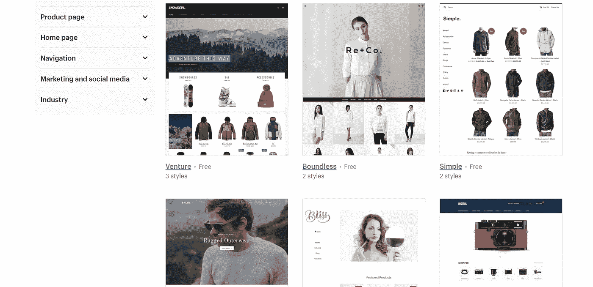
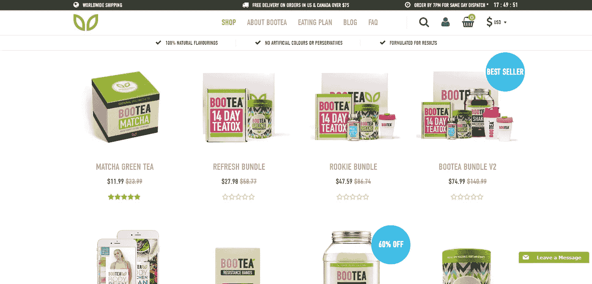
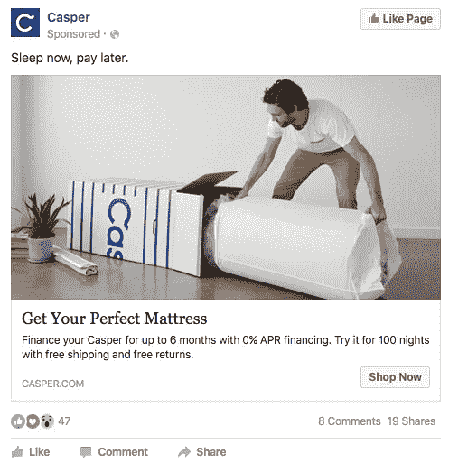

# 电子商务:如何用网上购物店赚钱？

> 原文：<https://medium.com/hackernoon/e-commerce-how-to-make-money-with-an-online-shopping-store-f90b4da11367>

## 电子商务是居家和旅游企业家最热门的行业之一。

**什么是电子商务？**

电子商务是指任何类型的在线交易。电子商务最流行的例子是网上购物，它被定义为通过互联网在任何设备上买卖商品。

电子商务是增长最快的零售市场，预计 2020 年销售额将超过 4 万亿美元。

电子商务是一种相当简单但有利可图的网上赚钱方法，本指南将重点介绍如何创建一个使用 [**Shopify**](https://www.shopify.co.uk/?ref=sole-trader1) 销售产品的网上商店。

# 入门指南

在你建立你的网上商店之前，你需要知道卖什么和如何采购。首先，你需要找到一个利基，例如，健身，技术，body con/夏装，宠物产品和婴儿产品现在非常受欢迎。

你也可以上 Instagram，看看所有受欢迎的 insta gram 都在宣传什么，从而知道你应该卖什么。排毒减肥茶以及露背、无肩带胸罩和衣服似乎很受欢迎。

另一个你可以做一些研究的网站是亚马逊，你只需要看看某个特定类别中最畅销的产品，然后把它们写下来。这种伎俩是众所周知的，但由于你将在自己的网站上销售这些产品，而不是亚马逊，你不需要担心任何直接的竞争。

最后，你可以在 YouTube 上输入“健身追踪评论”、“夏装评论”或任何你发现的产品的评论，以获得更多的灵感。

# 建立你的商店:开始

完成调查后，列出至少 20 种你想采购的产品，接下来:

使用 Shopify 创建一个在线商店，14 天免费，不需要信用卡，但是在试用期间，你应该已经做了足够的销售来启动你的商店并让它继续运营。

您可以从一系列免费和高级主题中进行选择，让您的商店充满活力。

一旦你注册了，你就可以使用强大的 [Oberlo 插件](https://www.shopify.co.uk/oberlo?ref=sole-trader1)，它可以通过 store builder 获得，这将通过允许你自动完成过程来处理存储和运输。

Oberlo 是一个 dropshipping 插件，这意味着你将不必物理存储，包装和运输任何产品。你只需将产品从 Oberlo 进口到你的商店并开始销售，供应商会做所有其他事情，这就是直运的好处。

如果你打算只使用 Oberlo，那么你可以在阅读完“完成步骤(Oberlo)”一节后跳过“完成步骤(阿里巴巴)”一节。

# 建立你的商店:最后的步骤(Oberlo)

接下来，您需要在您的 Shopify 商店上安装一个支付处理器，[您可以使用 Shopify 支付或第三方解决方案，如 PayPal 和 Stripe。](https://www.shopify.co.uk/payment-gateways?ref=sole-trader1)

在全球速卖通上创建一个帐户，使用 Oberlo 的 chrome 扩展在几分钟内导入您选择的产品。

# 建立你的商店:最后的步骤(阿里巴巴)

首先，设置一个支付处理器，Shopify Payments 或第三方处理器，如 PayPal 或 Stripe，[你可以在这里看到按国家列出的受支持的支付网关列表。](https://www.shopify.co.uk/payment-gateways?ref=sole-trader1)

如果你不介意自己完成订单，你有一些启动资金，你可以去[阿里巴巴](https://www.alibaba.com/)，搜索你列出的产品，找到 2-3 个供应商，订购一个样品，然后一旦你满意了，你就可以订购你的第一批。第一批最好从少量开始:

100-300 件真正便宜的产品(不到一美元)

100 件廉价产品(1-9 美元)

20-50 件昂贵物品(10 美元及以上)

运输不会花太长时间，所以当销售回升时，您可以随时补充您的首批产品。

最好从简单的开始第一批，例如，如果你销售健身追踪器，从一种颜色开始，50 件；如果你销售连衣裙，从 2-3 种颜色开始，3 种尺寸(S、M、L)，每种 20-50 件。

你的商店现在应该看起来不错，如果你需要产品图片，你可以随时要求供应商提供给你，这比你自己拍照更容易。

# 营销:利用社交媒体的力量

现在你的店已经开张了，接下来你需要让人们知道你的新生意！一旦你知道如何使用社交媒体，它会成为一个强大的营销工具。

# Facbook 广告

要运行脸书广告活动，你首先需要为你的企业建立一个 FB 页面，并运行两个广告，一个为你的脸书页面做广告，一个链接到你的商店。

Example of a Facebook Advert for Casper’s online store

根据你愿意花多少钱，设定每天 6-10 美元的预算，但要确保你设定的最高预算总额为 50-100 美元。

关于你的 FB 页面上的内容，张贴相关内容到你正在销售的利基市场，例如，如果你正在销售健身产品，张贴与健身相关的文章来吸引你的观众。

你的脸书页面的目的是吸引人们的兴趣，所以只要是与你的产品销售领域相关的内容，就要坚持吸引人、有趣甚至搞笑的内容。

# Instagram 营销

还记得我之前提到的 Instagram 的例子吗？现在你可以自己联系受欢迎的 Instagram 影响者，问他们是否愿意为你推广你的产品。

请记住，影响者的追随者越多，他们期望你支付的费用就越多，较小和不太知名的影响者甚至可能会免费进行一些推广，以帮助他们起步，但我依赖免费推广作为一种策略。

检查影响者有多少追随者，并向拥有 100，000-250，000 追随者的影响者支付 25-50 美元。

你甚至可以联系粉丝少于 100，000 人(即 60，000-90，000 人)的 Instagrammers，但不要提供超过 25 美元的推广费用。

一旦你找到了你选择的 Instagrammer，给他们发一个 DM 然后开始协商！

# 营销:客户定位

当瞄准你的客户时，最好是具体的，这适用于 FB 广告和社交媒体页面。

如果你在卖健身手表，目标人群是那些经常去健身房锻炼的人，如果你在卖减肥配方，目标人群是那些试图减肥的人。

投放广告时，最好选择大城市(例如，如果你的目标是美国客户，那么选择洛杉矶和纽约；如果你的目标是英国客户，那么选择伦敦或伯明翰)。

# 包扎

所以总结一下:

1.  使用亚马逊搜索潜在产品，列出 20 种你最喜欢的产品
2.  使用 [Shopify](https://www.shopify.co.uk/channels?ref=sole-trader1) 创建您的在线商店
3.  使用 Oberlo 插件或使用阿里巴巴的源产品。
4.  设置您的支付处理器
5.  使用脸书和 Instagram 推广你的商店。

最后，不要忘记再投资你的利润，随着你的业务增长，需求也会增长，所以你需要把你的钱投入到你的业务中，以迎合新客户的涌入。

**如果您想访问 Shopify 网站，** [**点击这里。**](https://www.shopify.co.uk/channels?ref=sole-trader1)

您可以免费试用 Shopify 天，无需信用卡。

**如果您需要域名或虚拟主机解决方案，** [**点击这里查看 blue host**](https://www.bluehost.com/track/homegrowngroup/)

在 Medium 上跟踪自产收入: [@homegrownincomeblog](http://twitter.com/homegrownincomeblog)

在推特上关注家庭收入:[@家庭收入](https://twitter.com/HomeGrownIncome)