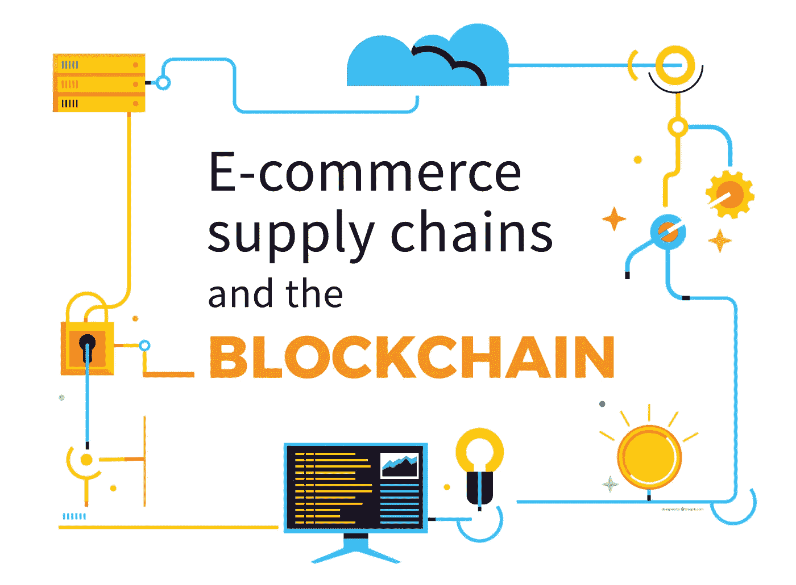
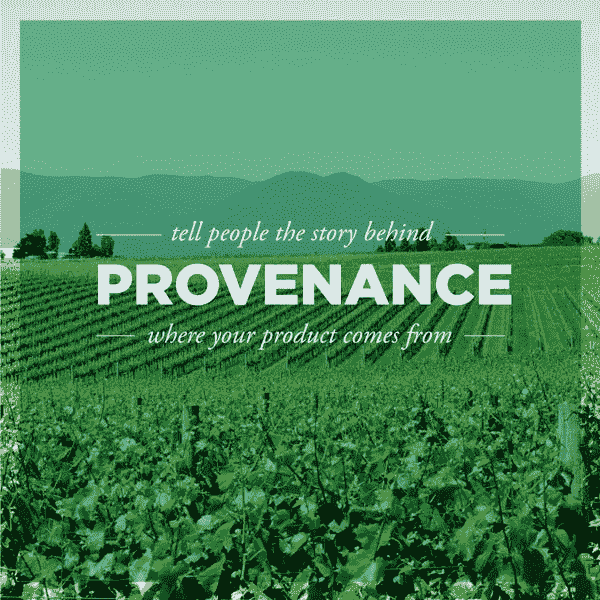
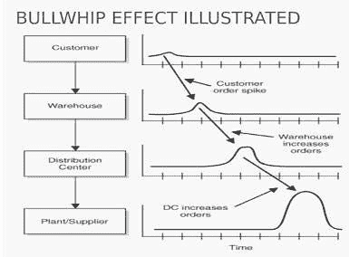
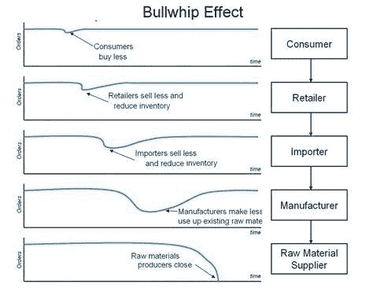

# 电子商务供应链和区块链

> 原文：<https://medium.com/hackernoon/e-commerce-supply-chains-and-the-blockchain-ad6634c57a5f>

对于在线商家来说，分散技术有一系列的价值主张。其中最主要的是供应链的完整性——这是传统解决方案难以维持的。

迄今为止，区块链技术仅限于两个主要应用。首先是在线货币:比特币开创的点对点价值转移。许多后续协议修改和改进了比特币的技术，但无论如何，数字现金目前是区块链的主要用例。这种点对点价值转移的功能已经被第二个主要应用所利用，即过去五年中出现的 ICOs 或分散式众筹，它在 2017 年成为全球瞩目的焦点。

但区块链提供的远不止是“成为自己的银行”的能力。使其非常适合用作数字货币载体的相同属性也可以用于解决不同部门和行业的大量其他痛点。随着分布式账本技术的成熟，以及数字现金成为生活中被接受的一部分，它的潜力正在被认可，并被部署到与金融交易无关的用例中。区块链的不变性——上传到它的所有内容的永久、公开记录——可以用来为受传统技术无法解决的问题困扰的行业带来透明度和信心。

**写在石头上的**

比特币之所以有效，是因为任何人都可以检查账本的完整性。为了知道哪些资金应该注册到哪些地址，比特币协议保留了曾经发生的每笔交易的记录。当你使用比特币汇款时，维护网络的矿工首先会检查这些钱是不是你的，以便消费——追踪到最初创建这些钱的“coinbase”交易。从那以后，它们可能已经移动了一百次，或者一直停留在同一个地址，但构成你余额的透明交易记录是比特币解决许多专家认为永远无法解决的问题的方式之一。

Everledger has built a supply chain solution over the blockchain that allows tracking the origin of diamonds, in order to verify its source without a single point of failure.

完全相同的方法可以用来保证供应链的完整性:跟踪整个生命周期的价值运动。这种技术现在开始在金枪鱼捕捞和钻石开采等完全不同的行业中得到应用。

Provenance allows costumers to track the origin of their food through a mobile, blockchain-based, application, with full transparency and traceability.

在这两个例子中，区块链技术可以让企业和消费者的行为更符合道德规范。金枪鱼捕捞是居住在沿海社区的 6000 万印度尼西亚人的主要就业来源，但过度捕捞、欺诈、奴役以及非法、未报告和无管制的捕捞活动普遍存在。这些是区块链平台[出处](https://www.provenance.org/tracking-tuna-on-the-blockchain)正在用一个端到端的跟踪系统来解决的问题，该系统提供了一个透明的、不可更改的记录——避免了对可信任的(并且很容易出错的)第三方的需要。 [Everledger](https://www.coindesk.com/everledger-blockchain-tech-fight-diamond-theft/) 对钻石行业采取了类似的方法，被盗和冲突钻石经常被冒充为合法宝石，每年给保险公司造成 20 亿美元的损失。无论是数字化的捕鱼记录还是钻石的独特指纹，解决假药问题还是阻止用于智能手机生产的矿物供应资助战争，[区块链可以提供一个单一的、普遍的真相，说明产品来自哪里](https://techcrunch.com/2016/11/24/blockchain-has-the-potential-to-revolutionize-the-supply-chain/)以及过程中的每一步。

**牛鞭效应**

A diagram explaining how the bullwhip effect works when there is an spike in customer orders. If there is no transparency in the whole supply chain, usually a small spike at the end of the chain will result in a disproportionate increase of production in the supplier side. This situation usually ends with over stock, and important economic losses.

透明度对供应链管理有纯粹的财务和道德好处。一个长期存在的问题是所谓的[牛鞭效应](http://www.aalhysterforklifts.com.au/index.php/about/blog-post/what_is_the_bullwhip_effect_understanding_the_concept_definition)。这是指消费者需求的微小变化对供应链的影响越大，从零售商到批发商、分销商、制造商，直到原材料供应商。例如，如果批发商看到零售商的需求增加，他们将订购额外的单位，以确保他们可以立即满足未来的需求。分销商将会看到订单的增加，并采取同样的措施，随着供应链的移动，这种影响会越来越大。如果零售需求的增加是暂时的或一次性的，结果将是库存过剩。

缺乏透明度和充分的沟通是牛鞭效应的主要原因。区块链再一次很好地解决了这个问题，它提供了一个单一的、统一的关于供应链各个层面的真相。这彻底改变了供应链管理，颠覆了传统的方法。[正如 HBR 指出的](https://hbr.org/2017/03/global-supply-chains-are-about-to-get-better-thanks-to-blockchain)，“我们最终得到的是动态的*需求*链，而不是僵化的*供应*链，从而让所有人都能更有效地利用资源。”由于区块链优于当前的软件解决方案和服务，许多大公司，包括 IBM 和沃尔玛都在积极探索它在电子商务中的应用。

The same bullwhip effect happens when customers buy less. A small decline in purchases often brings a great decline in production at the beginning of the supply chain, if its visibility is not good enough. The final result is a sharp decrease in production, together with problems all over the supply chain.

**最后一公里**

Last mile delivery is probably the most complex and expensive phase of any supply chain, especially for e-commerce retailers.

电子商务供应链在最末端经历了特殊的复杂情况:产品被委托给某种形式的快递服务的“最后一英里”。这通常是一个正式的、集中的实体——邮政服务或 UPS——经常遭受效率低下的影响，从而影响消费者并增加不必要的成本。 [Piloteo](https://www.piloteo.com/) 去年推出了智能交付电子商务原型，使用区块链来提高可追溯性和自动化程度。但是尽可能有效地覆盖最后一英里的问题激发了许多其他的区块链解决方案[,它们建立在分散的模式上，为供应链经理提供更快的交付时间和节约。正如 Quickquick 的首席执行官和 Volt 交付系统的创造者李必立解释的那样，优步式的服务可以带来更高的速度和效率。2018 年以后，外卖市场将会出现很大的分化。我认为未来的送货市场会分为亚马逊的集中式模式和我们的分散式模式。“虽然传统的中心辐射方式在人口密度低、移动距离长的地区可能更有优势，但 Volt 模式在城市或高密度地区的当天或实时交付方面更有优势。”](https://www.pymnts.com/news/delivery/2018/openport-last-mile-max-ward-blockchain/)

区块链为电子商务提供了许多改进，从安全、无边界和即时支付到供应链的有效管理。它还可以应用于存储管理，这是本系列的下一个主题。

