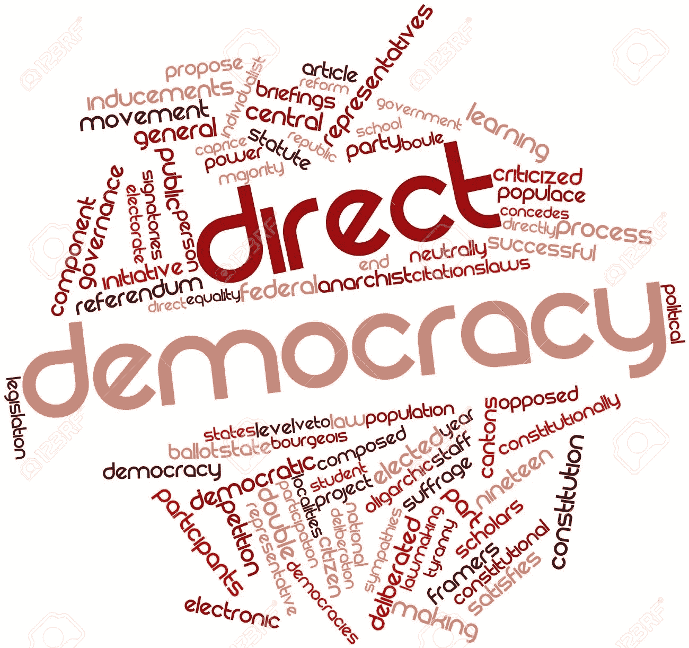

# 电子民主！是还是不是？

> 原文：<https://medium.com/hackernoon/e-democracy-yes-or-no-47ed5b277d88>

*由* [撰写*亨纳尔·拉姆瓦尼*撰写](https://www.linkedin.com/in/hunnar-ramwani-bbba27162/)

在一个大的民主国家，有些问题可能只影响一个特定的群体，但实际上对另一个群体有利，关于这些问题的决定可能会受到执政党的偏见和选票库的影响。这个问题的解决方案是直接[民主](https://hackernoon.com/tagged/democracy)即人们将投票并决定每一件对公众重要的事情，但这本身就是一个问题，因为在当今繁忙的生活中，没有人有时间经常考虑公共事务，因此投票比例是许多民主国家的一个问题。并不是所有有资格的人都去投票，即使是大选也是如此，如果经常举行小规模选举，投票率甚至可能会进一步下降，例如，当马德里市民被要求就该市最重要的广场之一的改造项目进行直接(和电子)投票时，只有 8%的有资格选民实际参与了投票过程，而且重复安排选举的成本太高。科技可能会帮助我们解决这个问题。我们可以使用人工智能机器人来研究一个人的行为，了解他的观点，它可以在投票中充当代理人，而这个人甚至不需要知道发生了什么，机器人会自己处理一切。听起来不错，不是吗？？

## 详细的讲解了！缉毒局。

让我们看一个例子来更好地理解它。Sylvia(一个人类)生活在一个世界里，每个有投票权的公民都与一个投票化身配对，投票化身是一个能够与她通信的自治代理，并且由中央投票机构验证以代表她投票。Sylvia 是唯一被授权与其投票头像进行交流的人(例如，语音识别、指纹认证等)。中央选举机构是一个民主选举产生的政府，拥有行政权力，由一个选举产生的官僚机构支持，该机构制定在全体选民中进行辩论、民意调查和投票的议程。每天早上，西尔维娅都会收到每日政治议程，议题按照主题和兴趣分类:地方、地区、国家和全球(西尔维娅生活的世界很可能是一个世界联邦)。西尔维娅可以简单地忽略这条消息，然后好好喝一杯咖啡，就像她在大多数日子里做的那样:她的投票头像已经在互联网上搜索意见，咨询熟悉的头像，并为她的日常议程建立了初步的投票行为。白天，投票头像将跟踪所有讨论和相关投票，并根据这些信息和她设置的策略行为级别更新 Sylvia 的投票行为(目前她没有选中“策略投票”按钮，就像她的大多数朋友声称的那样)。她的投票化身多年来一直在训练西尔维亚每个月直接进行的一些投票，以及通过观察她在社交媒体上的对话，阅读她的电子邮件，以及每当化身代表她做出错误或有争议的决定时与她直接对话。例如，昨晚西尔维娅意识到，化身建议投票反对向来自火星殖民地的难民发放额外签证，这是基于几天前她出于好奇查阅的一些可疑来源。他们就这个问题讨论了足足 5 分钟，澄清了她在移民、就业市场和慈善方面的立场(她实际上发现讨论非常有助于构建对这些问题的坚实观点)。今天，西尔维娅对关于全球冻结的辩论非常感兴趣，她的投票化身正在提议投票支持当前的法案(具有长期影响的决策涉及一系列关于改进提案的重复投票，以便最大限度地达成共识)。Sylvia 可以获得支持头像建议的理由的简短摘要，链接到她认为可靠的作者的许多文章，她与一位朋友就此话题进行的电子邮件讨论的摘录，以及她过去在相关问题上的决定列表。她注意到一致性警告是黄色的，这表明她的投票与她几个月前在能源市场上捍卫的一些立场相冲突，但作为公众人物，她选择忽略该警告…

## 支持电子民主的观点。

1.  所有重要的决定都可以考虑每个人的观点。
2.  该系统将变得更加透明。
3.  选举舞弊可以减少。
4.  有人可能会说，我们不能相信它会做出这样的决定，但我们已经相信它会做出我们的其他决定，为什么不呢？此外，许多政党已经使用政治咨询公司利用这些数据来制定他们的战略。那么这个为什么不能正式使用呢？

## 反对电子民主的观点。

1.  一旦人们习惯于将他们的消费者权力委托给艺术代理人，他们是否也准备好了委托他们的公民权力？
2.  我们所有的个人数据都将用于训练投票头像，因此这可能会有点风险。
3.  任何安全漏洞都可能导致重大失误。

你认为这是个好主意吗？？请在下面的评论中告诉我们..

你也可以加入我们的*和 ***推特*** 投票*

****跟随 TechnoReview 上的*** [***推特***](https://twitter.com/NTechnoreview) ***和*** [***脸书***](https://www.facebook.com/NTechnoReview/)*