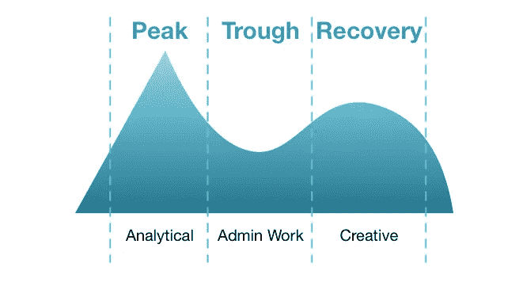

# 赢回你的一天

> 原文：<https://medium.com/hackernoon/earn-back-your-day-d40c17bbdf27>

赚回你一天的时间将会提高生产力，增加自由，在理想的世界里，还会增加幸福感。

我说*赚*的时候是很刻意的。

这并不容易——这需要调整习惯、睡眠模式，在某些情况下，还需要与你一起生活和工作的人做出改变。

# 1.仔细计划你的一天

前一天晚上，写下你想在第二天完成的任务清单。

如果可能的话，要具体，列表要简短。

如果你还没有这样做，写下今天的清单…我会等。

好的…准备好了吗？

以下是我今天的任务:

1.  写一篇关于 11 月标签趋势的公司博客
2.  写一篇关于时间管理的个人博客
3.  进行 2 次演示(已经提前计划好)
4.  向客户展示新功能
5.  见一个朋友吃午饭
6.  去攀岩

您应该注意到这里的一些事情。

我把个人目标和工作目标都包括在我的清单中，因为事实上，它们都在争夺我的时间。

我也尽量具体。我今天不在*做营销工作。*我正在写两篇非常具体的博文。

每天结束时，检查你的进度，以确保你完成了所有你想做的事情。如果你没有，花点时间思考一下为什么。也许优先级改变了，你忘记了时间，或者你认为任务不再重要。

没关系——只要确保这不会成为一个重复出现的习惯。

让一个朋友让你承担责任也有助于让你保持诚实，尤其是如果这个朋友是你尊敬的人。

我每周给我的女朋友和我的两位顾问——诺亚·卡根和塔兹·帕特尔发送责任检查报告。

足够巧合的是，我从诺亚的 OkDork 播客中学到了这个技巧。如果你没有听过它，[把它添加到你的 iTunes](https://okdork.com/podcast/) 。

# 2.组织你的一天

现在你已经知道今天你想要完成什么，是时候计划如何以及何时完成它了。

首先，总是从委派他人正在等待的任何阻塞任务开始。

偶尔，我的商业伙伴罗斯需要我发布一些更新，创建一个图形，或者只是回复一封电子邮件，然后他才能继续他的工作。

通过解除他的障碍，我们现在可以并行工作，并在给定的时间内完成两倍的工作。

**接下来，评估自己的认知能力。**

对每个人来说，它每天都在变化，模式几乎总是相同的——高峰、低谷和复苏。

Cognitive Ability Throughout the Day

因人而异的是他们到达认知旅程的每个阶段的时间。

有些人，像我一样，在早上达到高峰，在午餐时间左右陷入中午低谷，然后在下午/晚上恢复。

其他人在晚上是更好的分析思考者，当他们在早上困倦和昏昏沉沉的时候会陷入低谷。

第一步是弄清楚你的时间表。

作者[丹·平克](https://www.danpink.com/)详细阐述了这一认知趋势理论。

现在你知道你的日程安排了，是时候计划你的一天了。

当然，任何高优先级或不可协商的事情都应该首先发生。**然后将你的任务/目标分成三个部分——分析、管理工作、创意。**

因为我是一个早起的人，我把早上的时间都花在了分析任务上。对我来说，这通常包括编程和其他产品工作。

我的下午是一些个人任务和行政工作。跑腿、进行演示、会见客户等…

因为我的恢复期是在下午，所以我把一天的最后一点时间花在创造性的任务上——营销、博客、战略规划等等…

# **3。改变你的一天**

如果从第二步开始，你发现你的认知能力并没有在正常工作时间达到顶峰，那么是时候改变你的一天了。

这一部分可能需要其他人——和你一起生活或工作的人——做出改变。

我在早上达到高峰，所以(最近)我努力在早上 5:45 醒来。在这个时候，我不仅是一个更好的分析思考者，我也更少分心。我的狗通常在打盹，没有快递员每小时敲门，在城市喧嚣之前醒来是一件令人欣慰的事情。

如果你是个夜猫子，早上跑跑腿，做做管理工作是有意义的。也就是说，在恢复期，你可能要到上午 10 点或 11 点才开始工作。

有没有你认为会帮助别人的提高效率的建议？请在下面的评论中添加它。