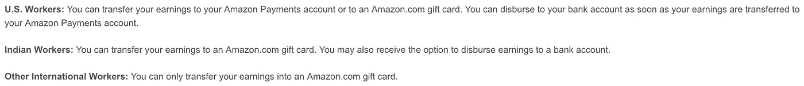
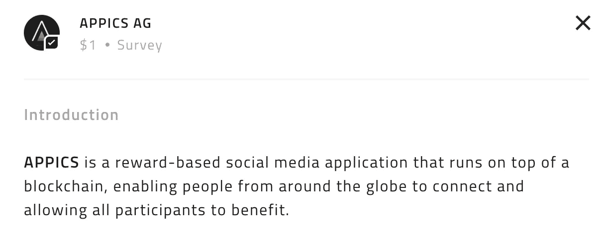

# Earn.com——不适合工薪阶层

> 原文：<https://medium.com/hackernoon/earn-com-not-for-wage-earners-28fd5f35ad0>

## 我们真正需要的解决方案。

过去几周，随着比特币基地收购 Earn 的传言开始传播，人们对 Earn.com 的业务价值进行了大量讨论。

随着 Earn 的首席执行官[巴拉吉·s·斯里尼瓦桑](https://medium.com/u/f5a2e83d6d8f?source=post_page-----28fd5f35ad0--------------------------------)最近宣布被比特币基地收购，许多人对报道的估值(*【每笔 1 亿美元* [*Recode*](https://www.recode.net/2018/4/16/17242796/coinbase-acquisition-earn-balaji-srinivasan) )以及 Earn 代表今天的什么(*一个 ICO 垃圾平台)*与 Earn 可能代表未来的什么( ***基于加密货币的工资****——可以说是采用的圣杯*

Great Scott!

虽然这种未来听起来很神奇，但对于 Earn 来说，要走到今天还有很长的路要走。Earn 有着辉煌的更名历史(21e6 LLC，21.com，最后是 Earn.com)，在隐形模式下筹集了巨额资金，多次枢轴转动，以及濒临死亡的失误。

巴拉吉写了一篇关于“[转变](/@balajis/the-turnaround-2d145589d814)”故事和出售给比特币基地的伟大文章，而[蒂姆·斯旺森](https://medium.com/u/5409ba11bd08?source=post_page-----28fd5f35ad0--------------------------------)在他的帖子中补充了许多优雅地省略的细节，“[皮塔托为什么我们不能拥有美好的东西？“这两本书都很棒，但是不要离开！我才刚刚开始。](http://www.ofnumbers.com/2018/04/18/is-the-pitato-why-we-cant-have-nice-things/)

我真的很喜欢跟随巴拉吉，听他对空间的看法。但是，我认为 Earn 对于加密货币工资的做法是错误的(*好吧，至少对于今天来说是错误的*)。这是错误的，因为它需要企业和工薪阶层或服务提供商都采用。如果支付只需要工薪族选择加入呢？够简单吗？算是吧。让我来告诉你为什么 Earn 不是今天的正确方法，以及为什么允许员工选择加入而不改变其雇主的流程是更好的方法。

# 亚马逊土耳其机械公司 vs. Earn

## 亚马逊土耳其机械公司

Earn 的方法本质上是亚马逊土耳其机械公司的方法，为分散的劳动力创造一个市场，让他们重复执行相同的任务。亚马逊所说的“MTurk”本质上允许企业向世界各地的独立承包商支付费用，以程序化的方式执行大型项目，同时仍然使用真实的人类来完成任务(*思考:使用人类训练计算机视觉的验证码商业模式*)。

I say, “I’m a real boy” more often than I’d like to admit.

## MTurk =亚马逊礼品卡支付的问题

MTurk 通过亚马逊礼品卡向非美国公民付款([FAQ-我如何获得付款](https://www.mturk.com/worker/help))。

How are you supposed to eat an Amazon gift card?

对于非美国国家的人来说，这是一个巨大的问题。他们不想要购物卡。他们想要他们的本国货币和他们可以用这些货币购买的东西(“东西”真的是一个粗俗的词，抱歉)。MTurk 礼品卡问题的解决方案？[purple . io](http://purse.io)，满足您所有亚马逊购物需求的一站式商店。你说出你的折扣(平均 10-15%)，然后用比特币支付。一个随机的人用他们的礼品卡为你购买商品，并收到比特币作为付款。嘣。这就是由 MTurk 和亚马逊礼品卡支持的钱包的整个商业模式(*不要告诉* [*安德鲁*](https://twitter.com/2drewlee) *我泄露了秘密。*)。 ***旁注:如果你在美国，钱包也是很好的服务。用我的*** [***推荐码***](https://purse.io/?_r=RXNY7h) ***来支撑我的比特币瘾。***

## Earn = MTurk +比特币钱包

那么，Earn 和 MTurk 有什么不同呢？Earn 在上面绑了一个比特币钱包，并招募了专家和加密货币爱好者作为基于电子邮件的投票的早期采用者。结果呢？来自 ICO 的垃圾邮件推动了基于 STEEM 的区块链构建的社交媒体平台。

Yes, really. This is the survey I got a week or so ago.

虽然我很感激几周前从我的账户中取出的几百美元的比特币，但项目的质量已经开始让我厌倦，我厌倦了/被垃圾邮件淘汰。前阵子不回消息和任务了。归根结底，我不会通过回答基于电子邮件的调查或执行类似 MTurk 的任务来赚钱。 **我在做生意。**

I’m not done with Earn. I’m just done with time-based spam messages.

# **如何赚取加密货币？**

像 Relayzero*这样的工薪族和商家如何赚取加密货币？

**我最近* [*推出了*](/@lwsnbaker/a-10-year-problem-4ae906627763) *Relayzero 对空间的创始人进行种子投资和建议。为加密货币空间而建？寻找种子投资或需要帮助等等？我可以帮忙。*

## 服务+商品的加密购买者=已经解决的问题

*一种已解决的问题——*如果你在网上经营一家企业或有一个位置 IRL(对于那些不好意思问的人来说是*“在现实生活中】 )，那么有多种解决方案可供你接受加密货币作为支付方式。您可以设置一个钱包来接受和保存在线或 IRL 加密货币(*如果您忽略 POS 的集成问题，为那些有幸从未在餐馆或零售行业工作过的人提供“销售点”系统*)。或者，您可以使用服务将加密货币自动转换为美元来支付您的账单和员工。如果我们忽略缩放和交易费用问题，这个问题就解决了。查看 [Bitpay](https://bitpay.com/) 或[比特币基地商务](https://commerce.coinbase.com/)作为自动转换选项的几个例子。*

## 工薪阶层——我们需要一个解决方案。

但是，工薪阶层呢？

你到底是如何让你的雇主或商业客户用你选择的加密货币支付给你的呢？

大多数企业都在经营他们的业务。他们不想经营一家迷你加密货币对冲基金，购买加密货币支付给员工或服务提供商，同时对冲价格变化和管理安全风险。商业合同以美元计价，工资也以此为基础进行谈判。加密货币价格和估值方法的波动使得企业很难使用加密货币支付服务。更不用说，他们的工资部门可能缺乏管理一个比特币地址的私钥的技术成熟度，这个地址有几十万美元或几百万美元的比特币，以支付每月的工资。输入审计问题和一个人控制公司资金缺乏财务控制。多 sig 钱包在哪里？你明白了。从技术上来说，商家试图用加密货币来应付账款是一个烂摊子。然后，从实际角度来看，雇主必须为所有收入纳税。像 Gusto 这样的工资单供应商通过自动化所有的计算和纳税使这变得容易。对于大多数会计部门来说，为工资之外支付的加密货币收入运行一个特殊的工资是一件很难做到的事情。此外，所有这些服务都与会计软件集成在一起，不会让管理人员心痛。简而言之，工资和应付账款将继续在菲亚特支付，直到有一个更好的解决方案在工资和应付账款的业务。

# 解决办法？

## 仅工薪阶层选择加入

让企业用加密货币支付工薪族和服务提供商的方法是首先不要问企业。教育企业并让他们改变方式是浪费时间。只有工薪阶层可以通过两种方式选择加入:

第一种方式是工薪族或服务提供商在收到他们的工资存款时，将他们的美元投资于他们选择的加密货币。

Seriously, what a horrible solution.

工薪阶层可以用他们的美元购买加密货币。他们可以手动操作，或者设置比特币基地和其他交易所提供的自动投资功能([比特币基地常见问题—经常性交易](https://support.coinbase.com/customer/en/portal/articles/2168187-how-can-i-create-or-cancel-a-recurring-transaction-))。这些方法的问题在于，它鼓励投资而非支出，鼓励市场时机而非定期积累。真正的问题是，“我们如何在加密货币中生活？”

2 第二种方案？ ***为基于加密货币的存款账户创建账户和路由号。*** 企业向员工发送美元，就像任何工资存款一样。工薪族在钱包里收到加密货币。在上面绑一张借记卡，支付贷款和租赁费用。那是你的桥梁[技术](https://hackernoon.com/tagged/technology)而我们在等待世界其他地方醒来。

是的，不合法。想知道怎么做吗？下面联系我。

# **/结束**

***喜欢读什么？*** *想了解更多？你可以付钱让我在 Earn.com*[*这里*](http://earn.com/lawson) *或者* ***回复电子邮件你可以捐给 Manos Unidas*** *，这是一个非营利组织，旨在帮助秘鲁的特殊需要学校。我是董事会主席，如果你捐款的话，我很乐意和你谈谈。我们正在为我们的最新项目筹集资金，Cafe Daria 是一个为有特殊需求的年轻人提供工作培训的网站。*

 [## Cafe Daria:为有特殊需求的年轻人提供的工作培训网站

### 达里亚咖啡馆是秘鲁库斯科第一个为有特殊需要的年轻人开设的职业培训场所，是一个为…

www.crowdrise.com](https://www.crowdrise.com/o/en/campaign/cafe-daria-job-training-site-for-young-adults-with-special-needs) 

## Manos Unidas 捐赠钱包:

**乙醚**:0x 383 EFD BC 8117 a 678 ACF BD 475312421 b 36fa 13751

**比特币**:3211 ifqvrhjchmmpwb 52 jzwz 2 wf 3 kaler

**比特币现金**:1 lhb 7 V6 mv 7 mdk xeath6h kfcprgnpkybngf

**Zcash** (可根据要求提供 z 地址):t1 b 7 zgh 7 gknrkjrnca 59 yvbwaiubi 35 r8sf

**lite coin**:mcsq2v 27 fmlmsl 7 qkkw 5v 64 hwgbfqygmru

**破折号**:xpxmyqxgnt 433 aiqbdxijqssbgxxj 6 elaa

[https://upscri.be/hackernoon/](https://upscri.be/hackernoon/)