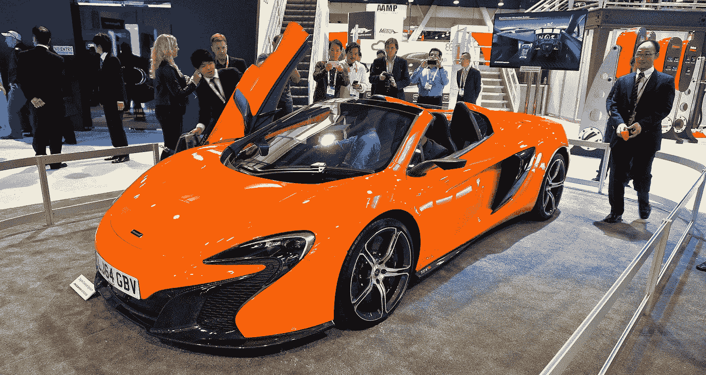

# 通过在 CES 上收集物联网信号获得加密

> 原文：<https://medium.com/hackernoon/earn-crypto-by-collecting-iot-device-signals-at-ces-22dc1de0fc15>

CES is filled with millions of IoT devices, CC 2.0 2015 moto_club4ag Adapted

## 参观展会时，帮助构建物联网网络

对于本周参加 CES 的所有人来说，在经历疯狂的同时，加入我们的 CES 挑战赛，享受一些秘密的乐趣。 [**下载我们的安卓应用**](https://play.google.com/store/apps/details?id=io.nodle.noodle&hl=en) **，帮助寻找物联网设备，竞争赢得 1000 恒星流明。**

## 它是这样工作的

当你漫步在拉斯维加斯世界上最大的贸易展时，你会赢得面条！硬币。用户每次遇到物联网设备都会获得一枚面条硬币，这在 CES 上经常发生。
Nodle.io 已经与 Stilla、Trackr、Joy 等物联网制造商以及 DevicePilot 等 LifeKit 和物联网平台支持者建立了合作关系。你也可以在 CES 上找到它们。

## 赚取 1，000 恒星流明

我们将奖励收集最多面条的人！CES 期间的硬币，1000 [恒星](https://medium.com/u/99518a49d085?source=post_page-----22dc1de0fc15--------------------------------)流明换取他们收集的面币。

## 加入公民网络

面条！Coins 应用程序允许 CES 上的每个人通过他们的 Android 手机收集物联网信号。我们称之为“ ***”公民网络*** ”，因为我们专注于社区和网络。除了收集面条！硬币，这是我们的概念证明，我们的“公民网络”也使用户能够找到丢失的物品，找到最近的自行车出租或从当地空气污染传感器收集数据。这些加入者有助于降低连接成本，并为制造商提供一种新的方式来使他们的设备上线。

我们的激励？虽然我们的加密实验是对 Nodle 概念的证明，但它也展示了我们可以创建的潜在网络。Nodle 的目标是证明[加密货币](https://hackernoon.com/tagged/cryptocurrency)可以在手机上使用，而不会耗尽你的电池和 CPU 过热。面条！Coins App 是在整个无线环境中验证这种移动的第一步，可以有效地收集物联网数据，并将数据传输到各个物联网制造商。

[**下载面条！币现**](https://play.google.com/store/apps/details?id=io.nodle.noodle&hl=en) **！**