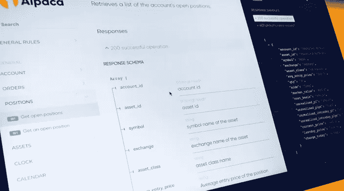
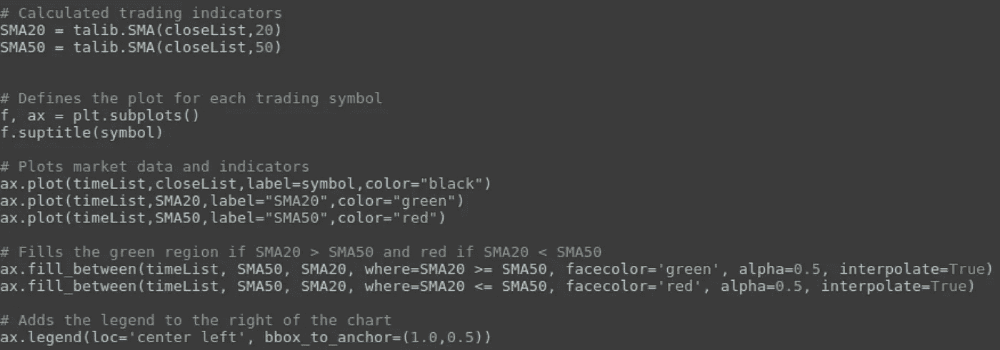
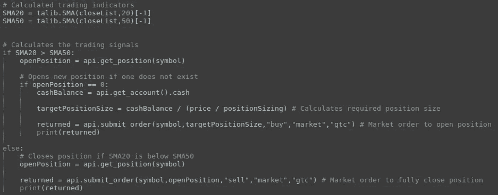

# 使用 Broker API 轻松构建股票交易机器人

> 原文：<https://medium.com/hackernoon/easily-build-a-stock-trading-bot-using-broker-api-6bfbdc8d48c9>

# 视觉策略开发

[视觉策略创建](https://hackernoon.com/tagged/visual-strategy-creation)是快速高效开发的重要组成部分，因为它允许您通过观察信号如何随着市场变化而发展和变化，来轻松调试和调整想法。

我发现 Python 是这种类型的数据科学的好语言，因为它的语法容易理解，并且有大量的工具和库可以帮助您进行开发。最重要的是，[羊驼 Python API](https://github.com/alpacahq/alpaca-trade-api-python) 为我们提供了一种简单的方式来集成市场数据，而无需实施新的 [API](https://hackernoon.com/tagged/api) 包装器*。

****免责声明:截至今日(2018 年 7 月 27 日)，*** [***羊驼交易 API***](https://docs.alpaca.markets/) ***只能由在羊驼证券开户的受邀 beta 用户使用。***

 [## 羊驼 HQ/羊驼-贸易-api-python

### 羊驼贸易 api 的 python 客户端

github.com](https://github.com/alpacahq/alpaca-trade-api-python) 

对于数据处理和绘图，我推荐使用 [TA-Lib](https://mrjbq7.github.io/ta-lib/) 和 [Matplotlib](https://matplotlib.org/) 。Ta-Lib 提供了一个很好的库来计算常见的市场指标，这样你就不用自己重新实现它们了；而 matplotlib 是一个简单而强大的绘图工具，可以很好地服务于所有类型的数据可视化。

下面是我整理的一个示例框架脚本的代码片段(完整的脚本在本节末尾)。

(Code Snippet of an example trade visualizer script I put together— full script at end of this section)

该脚本针对几个不同的交易符号添加了一个简单的移动平均交叉策略，以提供一个在现场交易中如何公平的小样本。这允许对新策略的信号进行第一次健全性检查。一旦一个策略通过了视觉检查，你就可以通过回溯测试工具来运行它，比如在“[模拟算法交易](https://hackernoon.com/algo-trading-for-dummies-building-a-custom-back-tester-part-3-1cc1318987e3)”系列中讨论的那种。

 [## 模拟算法交易——构建一个定制的回溯测试器(第三部分)

### 自定义回溯测试和订单处理

hackernoon.com](https://hackernoon.com/algo-trading-for-dummies-building-a-custom-back-tester-part-3-1cc1318987e3) 

你甚至可能希望在每笔模拟交易中添加可视标记，对于高级交易策略，还要添加产生信号的指标。这使得分析信号集的弱点变得更加容易，这样您就可以调整它的参数。

# 简单交易机器人

一旦你通过了回溯测试阶段，你就需要一个简单的交易框架来整合你的策略进行实时测试。然后可以在纸上交易账户上运行，根据实时数据测试信号。

这是开发过程中的重要一步，因为它测试了策略是否与其数据集过度匹配。例如，可以很容易地调整策略，在回溯测试期间完美地交易特定的符号。然而，这不太可能很好地推广到其他市场或不同的时间段——导致无效的信号和损失。

因此，在用真实的交易账户向他们投资之前，你需要一个简单的方法来测试你的策略。这既是为了测试策略，也是为了测试实现，因为如果不加检查，代码中的一个小错误就足以毁掉一个帐户。

这是另一个交易机器人的例子片段，它实现了移动平均线交叉策略(完整的脚本在本节末尾)。

(Code Snippet of a trading bot which implements the moving average cross strategy — full script at end of this section)

要使它成为一个完整的交易机器人，你可以选择给代码本身添加一个定时循环，或者让整个脚本定期运行。后者通常是更好的选择，因为如果交易机器人是一个自包含循环，导致意外崩溃的异常将完全停止交易机器人。而在 as 中，计划任务没有这样的问题，因为每个轮询步骤都是脚本的一个单独实例。

除此之外，您可能希望实现一个日志记录系统，这样您就可以轻松地监控 bot 并在它运行时识别任何 bug。这可以通过在每个过程结束时添加一个函数来编写一个包含任何相关信息的文本文件来实现。

一旦你有了一个可行的策略，羊驼 API 应该可以很容易地将你的交易机器人扩展成一个完整的生产系统，让你可以快速开始交易。

马修·特威德

## 请关注[羊驼](/@alpacahq)和[自动化世代](https://medium.com/automation-generation)关于金融市场、算法交易、技术的新帖子。

## 你可以找到我们[@羊驼 HQ](https://twitter.com/AlpacaHQ) ，如果你用 twitter 的话。

如果你是一名黑客，并且能够创造出在金融市场上运行的很酷的东西，**请查看我们的项目“** [**免佣金股票交易 API**](https://alpaca.markets/?utm_source=medium&utm_medium=blog&utm_campaign=strategy_list&utm_content=part1) **”，在这里我们免费提供简单的 REST 交易 API 和实时市场数据。**

经纪服务由 FINRA/SIPC 成员 Alpaca Securities LLC([Alpaca . markets](https://alpaca.markets/?utm_source=medium&utm_medium=blog&utm_campaign=strategy_list&utm_content=part1))提供。羊驼证券有限责任公司是 AlpacaDB，Inc .的全资子公司。