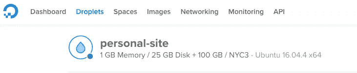
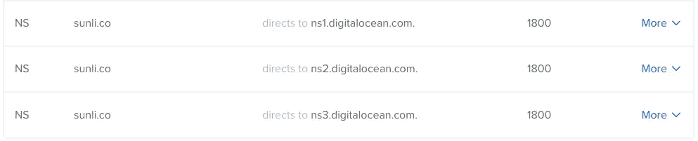
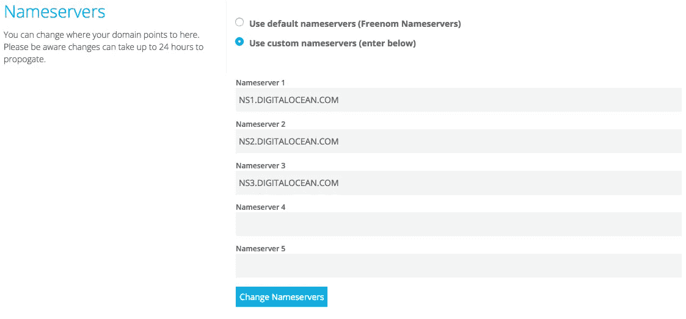
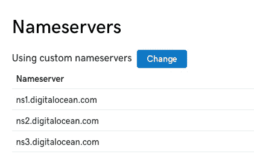
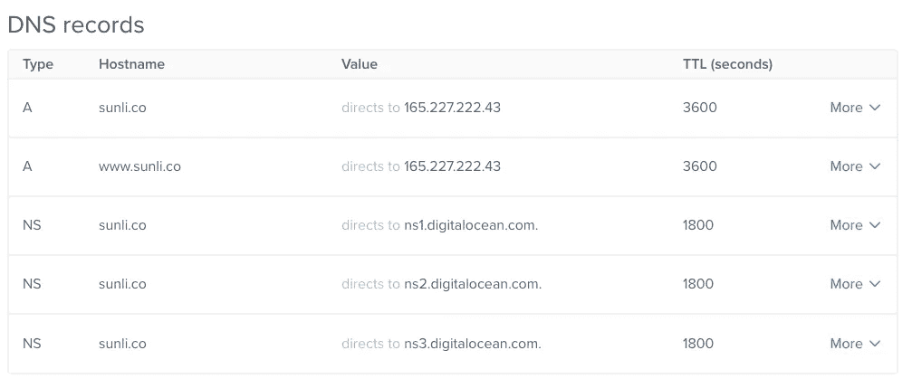

# 使用 Docker 轻松将您的 Sinatra 应用程序部署到 DigitalOcean

> 原文：<https://medium.com/hackernoon/easily-deploy-your-sinatra-app-to-digitalocean-with-docker-293b71ea7350>


Credit: [DigitalOcean](https://www.digitalocean.com/products/droplets/)

作为一名 web 开发人员，在我职业生涯的最初几年，我不需要学习太多关于服务器维护的知识。在部署我自己的个人应用程序时，Heroku 是我最好的朋友。几个命令行界面命令，我有一个活的网站。没有麻烦。

然而，当我加入 DigitalOcean 时，我很快意识到这需要改变。我将参与维护基础设施和建设管道。一开始这很吓人，但我决心要学。

虽然在生产服务器上工作给了我实践经验，但我发现有一些实践方法不会将数百万美元置于危险之中。

就在那时，我产生了将我的[个人网站](http://www.sunli.co)从 Heroku 转移到数字海洋 [Droplet](https://www.digitalocean.com/products/droplets/) 的想法。有什么更好的做法？这是一个小型静态网站，使用 Sinatra 进行一些轻量级路由。我觉得部署起来不会太难。

注意:我正在进行一些网站维护，所以当你读到这篇文章时，我的网站可能无法运行。

有一个警告。作为一个懒惰的开发者，我喜欢 Heroku 的易用性。为了实现这种迁移，我需要找到一种方法，只用一个 CLI 命令就能启动我的网站。这样，无论何时我做了更改，我都可以在几分钟内更新网站。

幸运的是，有了`docker-compose`，这是可能的。

在这篇文章中，我将讨论如何在一个[乘客](https://www.phusionpassenger.com/)应用服务器和 [Nginx](https://www.nginx.com/) 的帮助下，使用 Docker 将我的网站部署到一个 DigitalOcean Droplet 上，以提供我的静态文件。

最终，您将拥有部署和更新自己的 Sinatra 应用程序所需的工具，只需一个命令`docker-compose up`。

*注意:如果你对 Docker 不熟悉，这是一项让在容器中运行应用程序变得非常容易的服务。Docker 如何工作以及虚拟机和容器之间的区别超出了本文的范围。如果你很好奇，可以在这里阅读*[](https://blog.netapp.com/blogs/containers-vs-vms/)**。**

**另外，我从* [*其他*](http://coding.jandavid.de/2016/02/12/dockerized-databases-with-sinatra/) [*教程*](https://www.phusionpassenger.com/library/walkthroughs/deploy/) *中整理了很多这方面的信息。虽然我添加了额外的信息并简化了许多步骤，但如果您遇到了困难，请参考它们以获取更多信息。**

# *先决条件*

*将 Sinatra 应用程序轻松部署到 DigitalOcean 需要一些前期步骤:*

*   *[创建数字海洋账户和 API 密钥](https://cloud.digitalocean.com)*
*   *用一个 [config.ru 文件](https://www.phusionpassenger.com/library/deploy/config_ru.html#sinatra)构建一个 Sinatra 应用*
*   *将[乘客](https://rubygems.org/gems/passenger/versions/5.0.30)宝石添加到你的宝石档案中*
*   *安装[对接](https://docs.docker.com/install/)、[对接机](https://docs.docker.com/machine/install-machine/)和[对接机](https://docs.docker.com/compose/install/#install-compose)*

## ***为什么是 Docker-Machine？***

*如果你的机器上已经安装了 docker，你可能看不到安装`docker-machine`的必要。然而，我们将在远程虚拟机上运行我们的容器。我们将使用`docker-machine`来帮助我们管理它。*

*一旦你具备了所有必要的先决条件，我们就可以开始了。*

# *1.旋转一滴*

*该流程的第一步是启动我们将托管应用的虚拟机(VM)。DigitalOcean 使用他们的云仪表板使这变得非常简单。然而，使用`docker-machine`还有一种更简单的方法。*

*先决条件之一是创建一个数字海洋 API 密钥。有了这些，你可以用一个简单的命令创建一个数字海洋水滴:*

```
*docker-machine create --driver digitalocean --digitalocean-access-token <your API Key> <droplet name>*
```

*我将 API 令牌保存为环境变量`DO_TOKEN`，因此我的命令如下所示:*

```
*docker-machine create --driver digitalocean --digitalocean-access-token $DO_TOKEN personal-site*
```

*正如您在终端上看到的输出，这是创建一个 Droplet，并代表您给它分配一个 ssh 密钥。你甚至可以在你的数字海洋仪表板上看到它。*

**

*The default configuration is a 1 GB Ubuntu Droplet in the New York datacenter. [Use additional flags](https://docs.docker.com/machine/drivers/digital-ocean/) if you have different configuration needs.*

*从这里，您应该能够 ssh 到虚拟机:*

```
*docker-machine ssh <droplet name>*
```

*您应该会发现自己在 VM 中的一个 shell 上。它看起来会像这样:*

```
*root@<droplet name>:~#*
```

*创建的默认 Droplet 有 1 GB 的内存和 Ubuntu 16.04.4 操作系统。对于一个小 app 来说，这个应该没问题。如果你的应用需要不同的东西，[使用额外的标志](https://docs.docker.com/machine/drivers/digital-ocean/)。*

# *2.创建 Dockerfile 文件*

*关于如何在 VM 中手动配置 Nginx 和 Passenger，Passenger 有一个[深度教程](https://www.phusionpassenger.com/library/walkthroughs/deploy/ruby/)。这是一个漫长而彻底的过程，但是如果你更喜欢手动操作的话，这也是可行的。*

*我们可以通过使用 Docker 来避免所有这些步骤。*

*为了在我们的应用程序中使用 Docker，我们需要包含一个 Docker 文件。乘客提供了各种[基础图像](https://github.com/phusion/passenger-docker#image_variants)，我们可以在此基础上进行构建。因为我的个人网站使用的是 Ruby 2 . 3 . 3 版本，所以我选择了`phusion/passenger-ruby23`基本映像。*

*我们可以通过将基础映像包含在 docker 文件中来获取它。*

```
*FROM phusion/passenger-ruby23:0.9.33*
```

**注:截至本文发布时，* `*0.9.33*` *版本是* `*phusion/passenger*` *基础文件的最新稳定版本。最好包含一个特定的版本，而不是* `*latest*` *，这样你的应用就不会出现重大更新。**

*接下来，我们要为 Docker 设置正确的环境，运行 Passenger 的 init 脚本，并启用 Nginx:*

```
*# Set correct environment variables.
ENV HOME /root

# Use baseimage-docker's init process.
CMD ["/sbin/my_init"]# Enable Nginx (it is disabled by default)
RUN rm -f /etc/service/nginx/down*
```

*接下来，我们要删除默认的 Nginx 配置，并添加我们自己的配置。*

```
*RUN rm /etc/nginx/sites-enabled/default
ADD app.conf /etc/nginx/sites-enabled/app.conf*
```

*如果您不确定这个`app.conf`文件来自哪里，也不用担心。我们还没有创建它。我们将在下一节中讨论这一点。*

*下面几行需要一些解释:*

```
*WORKDIR /home/app/<app name>
COPY --chown=app:app . .
RUN bundle install*
```

*第一行告诉 Docker 创建目录`/home/app/<your app name>`并移动到其中。和跑步是一样的:*

```
*RUN mkdir /home/app/<app name>
RUN cd /home/app/<app name>*
```

*为什么把我们的应用放在`/home/app`里面？根据乘客-码头工人自述:*

> *[Passenger base]映像有一个 UID 为 9999、主目录为`/home/app`的`app`用户。您的应用程序应该以这个用户的身份运行。尽管 Docker 本身提供了与主机操作系统的某种隔离，但在没有 root 权限的情况下运行应用程序是一种良好的安全实践。*
> 
> *你的应用应该放在/home/app 里面。*
> 
> *注意:当复制您的应用程序时，确保通过调用`COPY --chown=app:app /local/path/of/your/app /home/app/webapp`将应用程序目录的所有权设置为`app`*

*乘客基本映像被配置为作为`app`用户在`/home/app`目录下运行。这就是为什么我们有这条线:*

```
*COPY --chown=app:app . .*
```

*它将我们的应用程序文件复制到 Docker 容器中，同时让`app`用户拥有我们的应用程序目录。然后我们运行`bundle install`从我们的`Gemfile.`安装 gem 依赖项*

*最后，剩下的就是清理我们的图像中的任何多余文件，以保持其较小的大小并易于部署。*

```
*RUN apt-get clean && rm -rf /var/lib/apt/lists/* /tmp/* /var/tmp/**
```

*最后，你的 docker 文件应该是这样的(我把`personalSite`换成了`<app name>`，因为那是我的应用程序的名字):*

# *3.用`app.conf`配置 Nginx*

*因为我们在应用程序中使用 Nginx，所以让我们来设置它。如果您以前使用过 Unicorn 或 Puma，您可能习惯于长配置文件。乘客为我们处理所有的代理样板文件，所以我们的`app.conf`不需要复杂。*

*我的看起来像这样:*

*不必将这个文件命名为`app.conf`。我这么做只是为了简单。*

*在`server`块的底部，我们传入一些乘客数据。`passenger_user`字段告诉 Nginx 将在虚拟机上运行应用程序的用户名。*

*从上一节我们知道这个用户是`app`。我们还知道应用程序目录的位置在`/home/app`里面。这就是我把`root`值指向`/home/app/personalSite/public`的原因。`personalSite`是我的应用程序的名称，`public`是我的静态文件文件夹。*

*最后，`passenger_ruby`字段告诉乘客应该使用哪个版本的 Ruby 来运行应用程序。因为我的网站使用 Ruby 2.3.3，所以我使用的是`/usr/bin/ruby2.3`二进制。*

*Passenger 自带了四个主要版本的 Ruby 可供选择:*

*   *`/usr/bin/ruby2.1`*
*   *`/usr/bin/ruby2.2`*
*   *`/usr/bin/ruby2.3`*
*   *`/usr/bin/ruby2.4`*

*选择最适合您应用的产品。*

*包含了`app.conf`文件后，您的项目目录将如下所示:*

```
*$ tree .
.
├── Dockerfile
├── Gemfile
├── Gemfile.lock
├── Rakefile
├── config.ru
├── lib
|  └── removed for brevity...
├── public
|  └── removed for brevity...
├──app.rb
├──views
|  └── removed for brevity...
└── app.conf*
```

*此时，我们已经拥有了在 Docker 上运行应用程序所需的所有文件。在您的终端中运行这些命令，亲自查看:*

```
*# This points our local Docker client at your remote machine
**eval $(docker-machine env <droplet name>)**# This will build and run your docker container
**docker build -t <image name> . && docker run -p 80:80 <image name>***
```

*您可以通过在浏览器中键入 Droplet 所在的 IP 地址来查看您的应用程序。您可以通过查看您的 DigitalOcean 仪表盘或询问`docker-machine`来找到 IP 地址:*

```
*docker-machine ip <machine name>*
```

# *4.(可选)安装 docker-compose.yml*

*由于我们的应用程序已经可以在 Docker 上运行，这是一个可选步骤。然而，Docker Compose 可以进一步简化部署过程。*

*Docker Compose 旨在帮助协调多个容器的复杂部署。然而，即使我的网站很小，它也能让我用一个简单的`docker-compose up`来运行我的应用程序。*

*如果你想做同样的事情，添加一个简单的`docker-compose.yml`文件到你的项目报告中。*

*这个文件将 VM 上的端口`80`映射到 Docker 容器的端口`80`。于是有了`80:80`。通俗地说，这意味着任何在端口`80`上访问你的 Droplet 的人都将被定向到你的 Docker 容器上的应用。*

*这很重要。如果不将这两个端口映射在一起，您的应用程序将与互联网隔离，没有人能够访问它。*

*属性给出了包含 Dockerfile 的目录的相对路径。因为 Dockerfile 在主目录中，所以相对路径是`.`。最后，您的应用程序的名称出现在`<app name>`部分。*

*这个例子`docker-compose.yml`对于一个简单的 Sinatra 应用就足够了。如果你需要一个更复杂的设置，比如附加一个数据库，我会推荐 Jan David 的教程。*

*有了这个文件，您应该能够使用`docker-compose up`运行您的应用程序。如果您想在后台运行应用程序，使其不占用您的终端，只需添加`-d`标志。*

```
*docker-compose up -d*
```

# *5.获取一个域并配置名称服务器*

*有了运行的应用程序，是时候把你的域名指向数字海洋的域名服务器了。*

*如果你还没有域名，有很多供应商可供选择。如果你不挑剔，可以从 [dot.tk](http://www.dot.tk) 免费得到一个。*

**

*对于付费域名，我一般用 [GoDaddy](https://www.godaddy.com/) 。*

**

*拥有一个域名还不够。它没有指向任何东西。这就是域名服务器的用武之地。一旦你有了自己的域名，进入数字海洋仪表板上的[网络](https://cloud.digitalocean.com/networking/domains)标签，将域名添加到你的账户中。*

*您现在应该能够看到 DigitalOcean 提供的三个名称服务器。*

**

*回到你购买域名的地方(dot.tk，Godaddy 等)并将它们添加到你的 DNS 配置中。*

**

*dot.tk*

**

*Godaddy*

*我还建议将`www`和`@` A 记录添加到 DigitalOcean dashboard 中的您的域中，并将它们指向运行您的应用程序的 droplet。最后，您的域名的 DNS 记录应该看起来像这样*

**

*DNS 是一个棘手的问题。如果你在设置域名服务器或记录方面有任何问题，请查看这些[有用的](https://www.digitalocean.com/community/tutorials/how-to-point-to-digitalocean-nameservers-from-common-domain-registrars) [教程](https://www.digitalocean.com/community/tutorials/an-introduction-to-digitalocean-dns)。*

*这就是了。按照这些步骤，你应该很快就能拥有一个小型的 Sinatra。最好的一点是，如果您对您的站点进行了更改，并希望在尽可能短的停机时间内进行更新，只需运行:*

```
*docker-compose up -d --build*
```

*如果将来你需要复习，但不想再次阅读整篇文章，我在[要点](https://gist.github.com/sunny-b/04e0fb63854798961952810a1e121516)中列出了本教程的所有示例文件。您还可以在我个人网站的 repo 上看到我如何在生产环境中使用这些文件。由于我不是 Docker 专家，如果您发现任何错误，请让我知道！*

*所以你自己试试吧，在下面的评论里告诉我效果如何！*

*永远不要停止督促自己学习新东西。编码快乐！*

*[*订阅我的个人资料*](/subscribe/@SunnyB) *如果您想在我上传新故事时收到通知。**