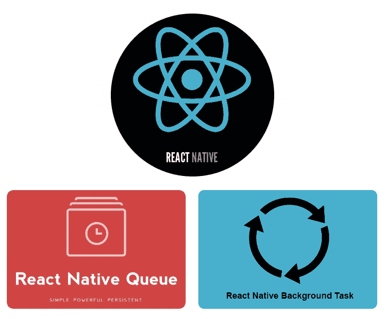

# React Native 中简单的操作系统后台任务

> 原文：<https://medium.com/hackernoon/easy-os-background-tasks-in-react-native-bc4476c48b8a>



多亏了几个相对较新的库，当你的 react 原生应用关闭时，在后台线程(也称为服务)中运行任务变得前所未有的简单。

今天，我将带您完成设置任务的过程，这些任务会定期运行，即使您的应用程序已关闭。如果您已经有了 React 本机设置，并且现在正盯着您的 IDE，那么您只需要大约 15 分钟就可以完全启动并运行这个完整的示例。

**我们将使用两个库来完成这个任务:**

*   [React Native Queue](https://github.com/billmalarky/react-native-queue) :控制流程和作业管理。
*   [React 原生后台任务](https://github.com/jamesisaac/react-native-background-task):注册关闭 app 时将执行的 js 处理函数。

**在我们的示例中，我们将进行基本的图像预取(是的是的，这有点无意义，但出于说明的目的，这很容易理解)。**

**该功能更现实的用例示例:**

*   下载内容以供脱机访问。
*   媒体处理。
*   缓存预热。
*   *对外部服务的持久* API 调用，例如向各种第三方发布渠道 API 发布内容。
*   无论应用程序是打开、关闭还是反复打开和关闭，您都希望始终如一地处理复杂且耗时的作业。

# 装置

首先在您的工作目录中创建 React 本地应用程序的框架

```
$ react-native init backgroundexample
```

快速安装 [react-native-queue](https://github.com/billmalarky/react-native-queue#installation) 和[react-native-background-task](https://github.com/jamesisaac/react-native-background-task#installation)包并链接(注意 react-native-background-fetch 是 iOS 支持所需的 react-native-background-task 的可选依赖项)。

```
$ yarn add react-native-queue
$ react-native link realm
$ yarn add react-native-background-task
$ react-native link react-native-background-task
$ yarn add react-native-background-fetch@2.0.x
$ react-native link react-native-background-fetch
```

手动更新 MainApplication.java 的 onCreate()方法，如下所示

```
// Update the following file as seen below
// android/app/src/main/java/com/backgroundexample/MainApplication.java@Override
public void onCreate() {
  super.onCreate();
  SoLoader.init(this, /* native exopackage */ false);
  BackgroundTaskPackage.useContext(this); // ADD ME HERE!
}
```

# 构建特征

首先，让我们更新 react 原生骨架应用程序，以包含一个通过按钮切换的图像屏幕。没什么特别的。

## 切换屏幕 App.js 更改

这里没什么特别的。只需添加 ScrollView，Button，Image 导入，修改容器样式，添加图片样式，对 skeleton App 类做一些小的更新。

## 集成后台任务

**在 App.js 的顶部，我们将定义我们希望操作系统在应用关闭时在后台定期调用的 js 函数(“后台任务”)。**

我们希望在这个后台任务函数中发生的事情是初始化队列，并在达到 iOS 强制的 30 秒超时(Android 没有这个超时限制，但我们需要遵守跨平台支持的最严格约束)之前，立即开始从队列中取出作业并处理尽可能多的作业。**由于这个硬性超时限制，我们将调用 queue . start(lifetime)的寿命为 25 秒**。这样，队列将最多在 25 秒内开始处理作业(或者直到队列被清空)，然后停止处理，保证我们有时间在操作系统超时之前调用所需的 Background.finish()。

在我们的例子中，25 秒足够处理整个队列，因为我们只预取 3 张图片。然而，想象一下，如果我们预取 10，000 张图像。**队列保持作业的持久性**(作业完成后才会被删除，失败后可以自动重试)，所以每隔 15 分钟左右，当操作系统在后台再次启动该功能时，就会预取另一批图像，迟早所有的图像都会在后台被预取。

然后将 componentDidMount()生命周期方法添加到应用程序组件，以便在应用程序挂载时调度后台任务。

您的 App.js 文件现在应该看起来像这样:

## 添加队列作业

现在我们已经设置了后台任务来初始化队列，并在应用程序关闭时处理作业，我们需要一种方法来向队列添加作业！

首先，我们将初始化应用程序中的队列，以便我们可以使用它来创建工作。

参考下面第 41–54 行的最终 App.js 文件，对构造函数()进行必要的更新，以初始化应用程序中的队列。

初始化队列后，创建 createPrefetchJobs()类方法，如下面第 60–86 行所示。在这个方法中，我们将引用存储在 app 组件状态中的队列实例来创建 3 个作业，这些作业预取图像并将其放入队列中。注意，我们将 false 作为最后一个参数传递给 createJob()，这将阻止队列立即启动处理(这是默认行为)。在本例中，我们不希望队列在主应用程序线程中处理，所以我们将只在后台任务中调用 queue.start()。

最后但同样重要的是，更新第 92 行中的 render()以添加“Pre-fetch Images”按钮，并将其连接到我们之前创建的 createPrefetchJobs()方法。

## 你完了！

现在在一个真实的设备上启动你的 react 本地应用**(后台任务不会在模拟器中启动)**。应用程序启动后，单击预取按钮将作业排队。

现在剩下的就是分散应用程序的注意力，然后等待。如果应用程序处于焦点状态，操作系统后台任务将不会触发(这可能有点违背要点)。大约 15 分钟后，操作系统将启动后台任务，初始化队列，并通过您的 3 个预取作业启动队列。

此时，您的远程图像已经预存在手机的本地磁盘中，当您单击“切换屏幕”查看图像时，它们将从您的本地磁盘而不是网络中提取。

## 有问题吗？故障排除。

如果你有任何问题，或者有任何疑问，欢迎发表评论，我可以直接帮助你。