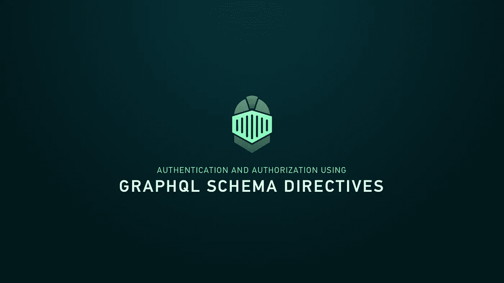
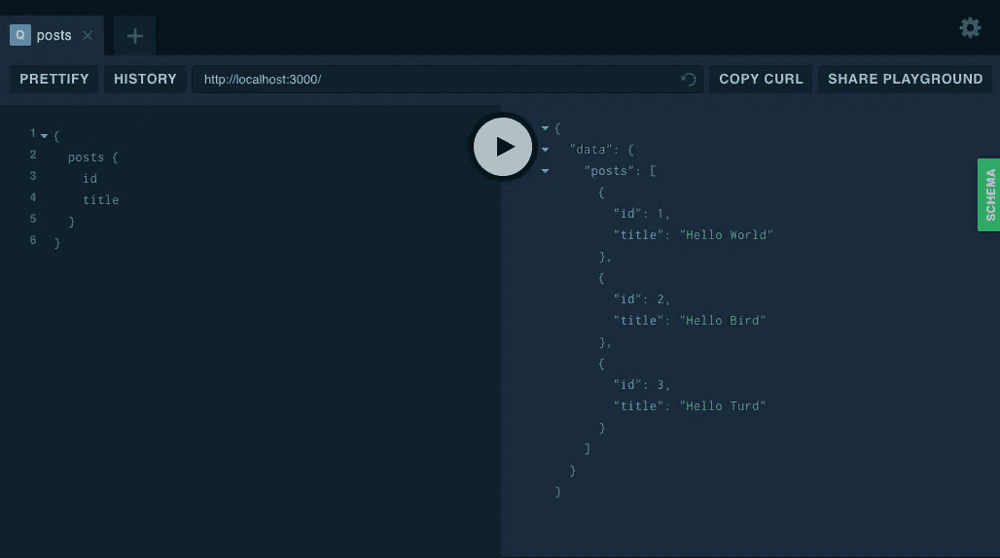
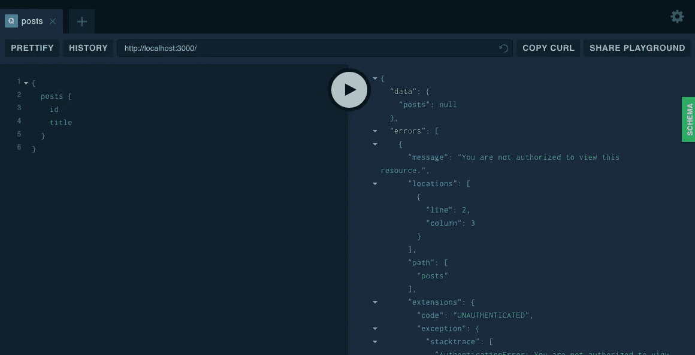
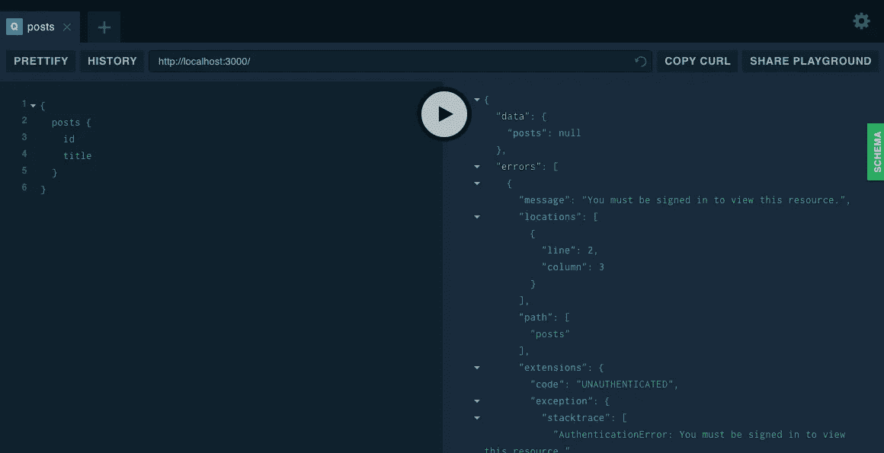

# 使用模式指令进行简单的身份验证和授权

> 原文：<https://medium.com/hackernoon/easy-peasy-graphql-authentication-and-authorization-using-schema-directives-f28f1845da20>



你可以在这里找到本教程的回购；
https://github . com/mhaagens/graphl _ authentic ation _ authorization

# 入门指南

我们将使用 Apollo 惊人的 GraphQL 工具来设置我们的 GraphQL 服务器并创建我们的模式。首先我们需要为我们的项目安装一些依赖项；

首先，让我们创建我们的 package.json

```
npm init -y
```

然后让我们安装我们的依赖项；

```
npm install apollo-server graphql lodash
```

接下来，我们将安装 nodemon，这样我们就可以在发生变化时自动重新加载我们的服务器。如果你想学习如何使用 Webpack 和 ES6 模块热重装你的服务器——不重启服务器——你可以在这里查看我的另一个教程；[*https://hackernoon.com/hot-reload-all-the-things-ec0fed8ab0*](https://hackernoon.com/hot-reload-all-the-things-ec0fed8ab0)

```
npm install nodemon --save-dev
```

最后，让我们将我们的启动脚本添加到 package.json 中；

```
'scripts': {
  'start': 'nodemon ./src/app.js'
},
```

# 设置应用程序结构

在设置 package.json 和 node_modules 的文件夹中重新创建这个树结构；

```
src/ 
  directives/ 
    - requireAuthDirective.js
  models/ 
    - post.js
  - app.js
  - schema.js 
node_modules/
package.json
```

现在我们已经有了我们的结构，让我们粘贴一些样板代码让我们开始；

## src/app.js

这段代码使用令人惊叹的 Apollo Server 2.0 来设置我们的 GraphQL 服务器🔥。
我们导入我们的类型定义、解析器和模式指令，最后我们根据服务器上下文对象的请求属性对用户进行硬编码—
在生产中，您需要使用密码哈希、JWT 或会话 cookie 中间件等来设置数据库。—但是为了只关注 GraphQL 部分，我们跳过了所有这些，现在只对用户进行硬编码。我们还将我们的`requireAuthDirective`(我们稍后将创建它)添加到我们的`schemaDirectives`中。

## src/schema.js

在这里，我们定义我们的模式，用我们的 Post 类型定义扩展我们的根类型定义，然后将 Post 解析器与根解析器合并。我们将在下一步创建 Post 类型定义和解析器。我们还为模式指令创建了角色枚举。

## src/models/post.js

现在我们有了模式，让我们创建我们的 Post 类型定义和解析器。我们只是硬编码一些要返回的帖子，然后我们用`posts`的查询解析器扩展根查询，它将返回我们所有的帖子——假设您已经过身份验证和授权。

注意 posts 查询定义后面的`@requireAuth`指令。这就是我们如何告诉我们的模式使用字段定义的指令。

## src/directives/requireautdirective . js

这是我们为模式指令定义规则的地方。
我们创建了一个从 apollo-server 扩展“SchemaDirectiveVisitor”的指令。我们检查一个用户是否存在于我们的`context.req`对象上，如果指定了一个角色，那么这个角色与用户的角色相匹配。如果是，我们解析该字段，如果不是，我们抛出一个 AuthenticationError。

# 我们来试试吧！

运行`npm start`进入 [http://localhost:3000/](http://localhost:3000/) 。
现在您应该看到 GraphQL 平台，在这里您可以针对您的模式运行查询。

对帖子运行一个查询，它*应该*返回帖子
，因为我们是用硬编码的用户“登录”的；



但是如果我们想要求一个角色来访问这些帖子呢？
我们的用户被硬编码为用户角色，因此我们需要管理员角色来访问帖子。

打开`src/models/post.js`，将`@requireAuth`指令改为`@requireAuth(role: ADMIN)`。在操场上再次运行查询，现在应该会得到一个 AuthenticationError。



最后，让我们将用户从我们的服务器上下文中完全删除，以检查您是否需要登录才能访问帖子。

打开`src/app.js`，从服务器中移除`context`对象，像这样；

您现在应该得到另一个 AuthenticationError，告诉您需要登录才能查看资源；



# 包裹

原来如此。这是对使用模式指令进行身份验证和授权的简单介绍。现在，请不要在生产中使用这段代码——可能还有很多检查要做，当然，您需要安全地实现会话 cookies 或 JWTs 来使其正常工作——但是我希望您在阅读完这篇文章后，在 GraphQL web 应用程序中实现正确的 auth 方面有所进步！

更多关于 web 开发、GraphQL 和 Javascript 的文章，请在 Twitter 上关注我；
[https://twitter.com/mhaagens](https://twitter.com/mhaagens)

延伸阅读；
[https://www . apollographql . com/docs/graph QL-tools/schema-directives . html](https://www.apollographql.com/docs/graphql-tools/schema-directives.html)

## 谢谢

感谢 [**@** jbaxleyiii](https://twitter.com/jbaxleyiii) 帮助我弄清楚如何实现模式指令，感谢 Apollo 团队令人惊叹的工作！