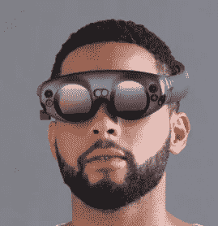
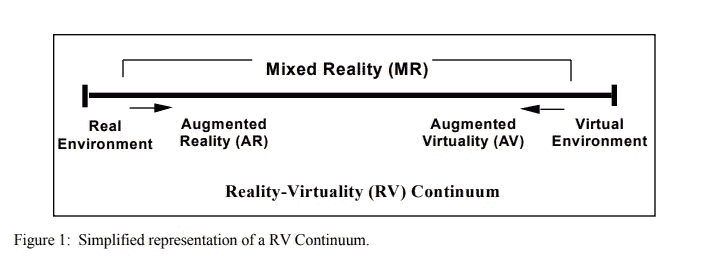
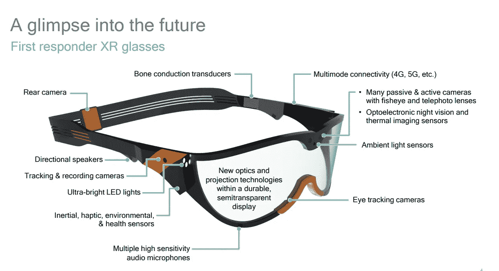

# 一双新鲜的眼睛

> 原文：<https://medium.com/hackernoon/eating-the-universe-40ac38a7400e>

## 扩展现实介绍

> 忒修斯和雅典的年轻人从克里特岛返回的船有三十只桨，被雅典人保存下来，甚至到德米特里厄斯·菲勒留斯的时候，因为他们带走了腐烂的旧木板，把新的和更强的木材放在他们的地方，以至于这艘船成为哲学家中的一个站立的例子，对于事物增长的逻辑问题；一方认为这艘船保持不变，另一方认为它变了——忒修斯悖论，普鲁塔克在《忒修斯》中

我们必须重现我们周围看到的一切吗？我们必须创造出我们想象中的虚构吗？这样做，这才是真正的现实。这个困境类似于上面的忒修斯悖论。自古以来，我们就试图再造宇宙。从虚拟现实(VR)和增强现实(AR)到扩展和混合现实的技术进步提出了一个问题:我们下一步将走向何方？在我们的大脑中植入芯片似乎是合乎逻辑的下一步。那么我们不再是人类了吗？本文试图回答这个难题。

# 未来展望

在我看来，随着我们沿着从虚拟现实到增强现实(AR)和混合现实的指数级破坏的道路前进，下一步是完全摆脱外部接口，即我们可能在大脑中有一个芯片，通过神经链接与其他控制论有机体或机器对话。如果控制论有机体(Cyborgs)是未来，扩展现实(ER)是这个旅程中的一个里程碑。已经有很好的证据指向那个未来。除了[医疗假肢](https://en.wikipedia.org/wiki/Prosthesis)，三个现实生活中的例子可以帮助我们想象电子人会是什么样子:

1。凯文·沃里克教授是控制论领域第一位也是最重要的专家之一。他开始在自己体内植入芯片。他也是一本书“我，电子人”的作者，根据他的网站，Kevin 是神经外科植入设备(犹他阵列/BrainGate)到他左臂的正中神经的先驱，以便将他的神经系统直接连接到计算机，以评估残疾人使用的最新技术。

2。威斯康辛州一家公司的员工- [三广场市场](http://www.32market.com/public/#about)可以在几秒钟内将 RFID 芯片植入手中。

3。畅销书《智人:人类简史》的作者尤瓦尔·诺亚·哈拉里说，所有生物都是算法。根据尤瓦尔的说法，如果我们能够解码生物算法，并利用先进的计算技术将其转化为人工智能，我们应该能够创造一个完全不同的人类物种——从智人开始的下一次进化跳跃。Yuval Noah Harari 教授在世界经济论坛上发表讲话时，想象了一个未来，智人将被利用生物技术和信息技术特别是人工智能的进步创造的完全不同的实体所取代。

# 什么样的现实会到来

**虚拟现实**

Source: Virtual Reality by Wikipedia

虚拟现实并不是一项新技术。这个概念可以追溯到 20 世纪。然而，建立一个商业原型最近已经成为现实。今天，它主要用于游戏。然而，它的应用已经发展到包括在中国看房和模拟真实生活条件。虚拟现实面临的挑战是一个真正沉浸式体验所必需的突出的耳机。此外，如果长时间使用 VR，会导致头晕。就个人而言，任何超过 30 分钟的事情都需要重新定位。

**增强现实**

Source: Augmented Reality by Wikipedia

下一个合乎逻辑的发展，在某种意义上几乎是同时的(记得谷歌眼镜)，是增强现实(AR)。随着智能手机摄像头和应用程序在现实世界中容纳一层数字信息，AR 变得更容易使用。智能手机和智能眼镜都在今天的 AR 中使用。《哈佛商业评论》和《纽约时报》等许多出版物今天都在使用 AR。

**混合现实**

Source: Magic Leap

虽然不再神秘，Rony Abovitz 的创作可能是下一次进化。根据维基百科的说法，他的初创公司 MagicLeap 正在创建一种“混合现实”，通过将数字光场投射到用户的眼中，将计算机生成的 3D 图像叠加到现实世界的物体上，这涉及到可能适用于增强现实和计算机视觉的技术。它正试图利用[硅光子学](https://en.wikipedia.org/wiki/Silicon_photonics)构建一个光场芯片

Source: Magic Leap

# 扩展现实

考虑到它的前辈仍在寻找更新的应用和增长领域，扩展现实仍处于起步阶段。我们可能需要几十年才能实现真正的功能和商业化的 XR 体验。

**根据维基百科，扩展现实** ( **XR** )是一个术语，指的是所有由计算机技术和可穿戴设备产生的真实和虚拟结合的环境和人机交互。包括[增强现实](https://en.wikipedia.org/wiki/Augmented_reality)(AR)[增强虚拟](https://en.wikipedia.org/wiki/Augmented_virtuality)(AV)[虚拟现实](https://en.wikipedia.org/wiki/Virtual_reality) (VR)等代表性形式。[【1】](https://en.wikipedia.org/wiki/Extended_reality#cite_note-1)以及其中插值的区域。虚拟的层次从部分感官输入到沉浸式虚拟，也称为 VR。

XR 是一个超集，包括从“完全真实”到“完全虚拟”的整个范围，这是由 Paul Milgram 提出的[现实-虚拟连续体](https://en.wikipedia.org/wiki/Reality%E2%80%93virtuality_continuum)的概念。

Source: Augmented Reality: A class of displays on the reality-virtuality continuum Paul Milgram, Haruo Takemura , Akira Utsumi†, Fumio Kishino, 1994

然而，其内涵在于人类经验的延伸，特别是与存在感(以虚拟现实为代表)和认知获得(以增强现实为代表)有关的经验。随着[人机交互](https://en.wikipedia.org/wiki/Human%E2%80%93computer_interaction)的不断发展，这个内涵还在不断演变。

Source: [http://usblogs.pwc.com/emerging-technology/the-road-ahead-for-augmented-reality/](http://usblogs.pwc.com/emerging-technology/the-road-ahead-for-augmented-reality/)

真正的扩展现实(XR)体验需要 5G、真正的高清显示器、运动传感器、先进的微芯片和更持久的电池。所有这些技术都可能需要一个联盟的努力才能更快地取得成果。

换句话说，虚拟物体必须变得真实，而真实物体必须更加虚拟。

Source: Qualcomm AWE 2017 Presentation on Extended Reality

# 一个精神的视角:Trikaal Gyana

在古代[耆那教哲学](https://en.wikipedia.org/wiki/Jainism)中，有一个概念叫做 Trikaal Gyana(意思是对事物过去、现在和未来状态的认识)。人类试图创造的是一个知识体，它将我们所知的世界三个时期的点串在一起。在我看来，吃东西是为了消化整个宇宙中的信息。

想象一下如果事情出错的潜在风险。过多的数据集中在少数人手里可能会改变我们未来的结构。信息不对称刚刚获得了一个非常危险的含义。自古以来，许多人，尤其是当他们意识到自己所剩时间不多的时候，就在世界各地游荡，寻找神奇的“长生不老药”、“不老泉”、“圣杯”等等。因此，寻找生命目的的神秘答案并不新鲜。当目的变成统治世界时，它就变得危险了。

因此，从精神的角度来看，科学必须由更高的力量来指导。否则，它就成了大规模杀伤性武器。当奥本海默看到原子弹爆炸时，人们很容易想起他的话。借用古代《薄伽梵歌》中的一句诗，他说:

> “现在我变成了死神，世界的毁灭者”。

# 电子人

要回答这篇文章开头的问题，人类将作为一个完全不同的物种存在。称之为进化或转变，但在大脑中植入芯片似乎是我们下一个合乎逻辑的目的地。

当然，这仍然可能被证明是幻想，但对未来的简单推断似乎表明我们正在走向成为“电子人”。是的，这个术语对我来说也很陌生。在那之前，我只是一个介于凯文·沃里克教授定义的光谱之间的哲学家:

> “我觉得我们都是哲学家，那些把自己描述为‘哲学家’的人根本没有日常工作可做。”