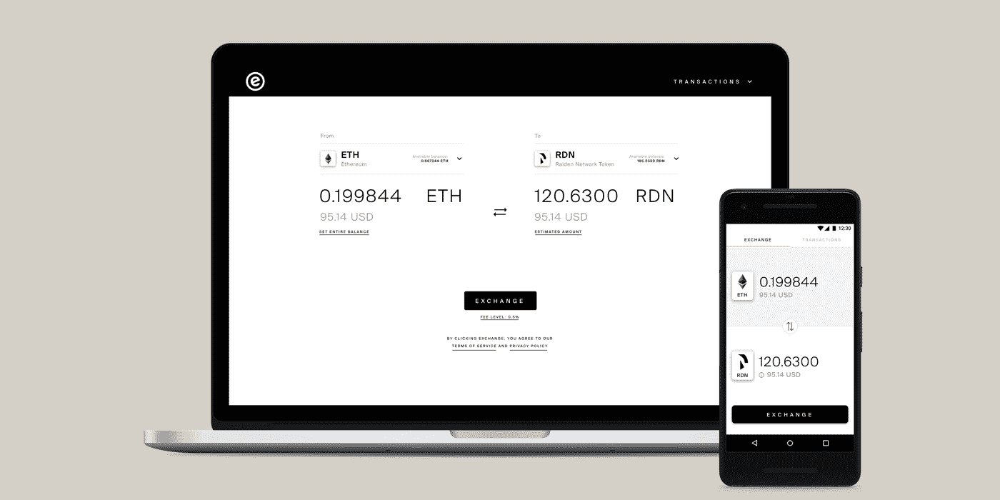
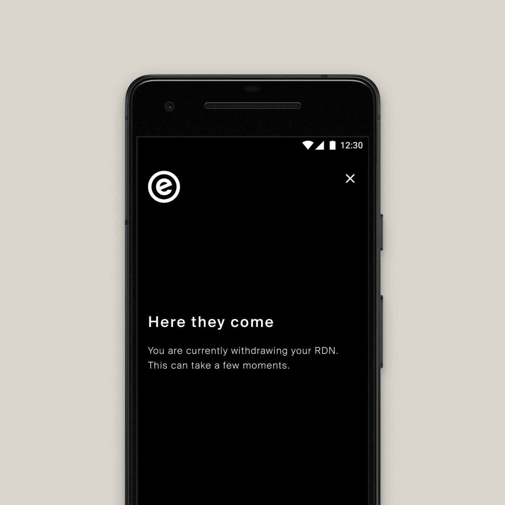
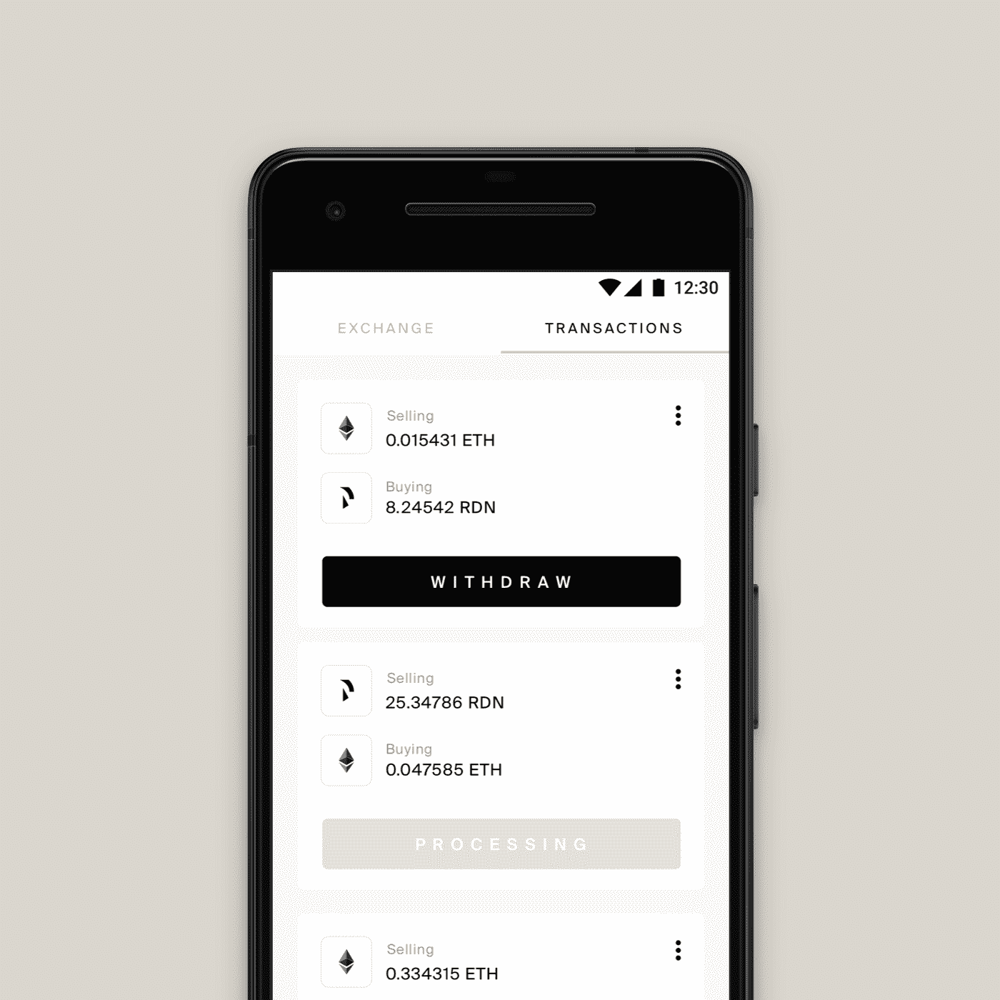
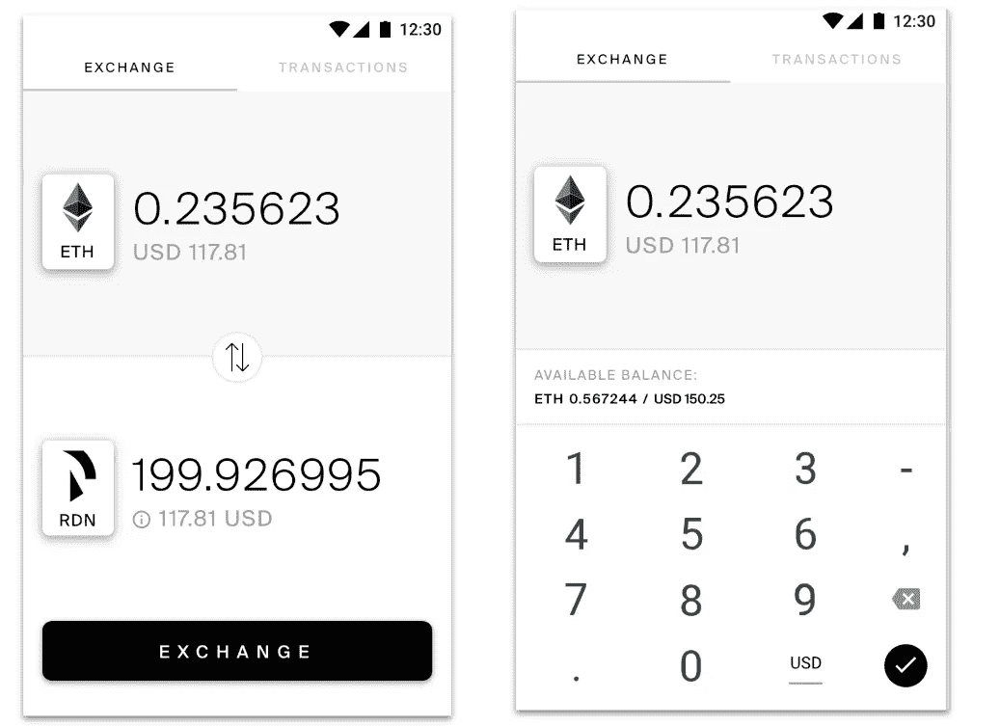
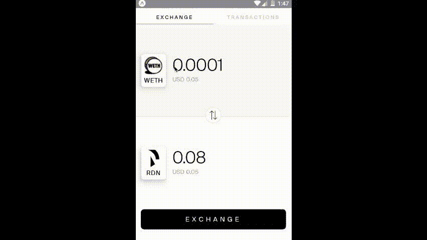

# EazyX 应用程序—分散的 Exchange 走向移动

> 原文：<https://medium.com/hackernoon/eazyx-app-decentralized-exchange-goes-mobile-a6e79daed1ad>

*上个月推出*[*eazyX*](http://eazy.exchange)*(Rinkeby testnet 上的 Beta 版)之后，我们想到了更进一步。为什么把我们的用户限制在桌面版？为什么不在手机上也提供公平价格机制呢？同样，我们把重点放在易用性上，以解决没有*[*crypto*](https://hackernoon.com/tagged/crypto)*专业知识的临时用户，并试图尽可能地构建干净和清晰的产品。让我带您浏览一下界面，并简要总结一下我们的主要设计决策。*

eazyX 移动设备的大部分设计原则与 eazyX 桌面设备的相同，在之前的文章中已经讨论过。我们也在今年柏林 [Dappcon](http://dappcon.io) 的这个[演讲中分享了我们的一些观察。然而，新平台带来了新的设计挑战。一些是显而易见的:更小的屏幕尺寸；跨平台可操作性；使用习惯不同。](https://www.youtube.com/watch?v=EWW2AglMBqs)

EazyX — cross-platform dApp UX

如果你看屏幕，你会立即看到一个网页版的相似之处。颜色是相同的，保留了颜色对比，显示了最小的阴影。

但是为了保持用户流量，我们必须有点创意。例如，两个版本的入职流程有很大不同。对于 web，您可以使用元掩码帐户登录，也可以在元掩码插件中更改您的钱包。然而，对于移动应用程序，我们不能依赖第三方服务(作为插件)进行签名。相反，我们在应用中集成了一个钱包。

Simple. Transparent. Eazy.

你不用做任何事就可以开始使用该应用程序，一个新的钱包就创建好了。同时，您可以使用您现有的钱包，只需用您独有的助记符进行签名。

多亏了这个内置钱包的应用程序，我们现在可以代表用户签署交易。因此，没有元掩码弹出窗口。我们已经能够完全摆脱 metamask 弹出窗口。从四个到 Z-E-R-O。这使得一切对用户来说都很容易和顺利，但同时我们面临着不透明的困境。因此，我们的加载屏幕清楚地描述了令牌的实际情况。

我们面临的另一个挑战是在更小的移动屏幕上显示交易。这同样适用于其他不能立即显示的信息屏幕。所以我们有意识地决定只在网上保留一些信息。

手机版的设计是快速和简单的，这正是它所做的。例如，撤销屏幕已经从一个长表缩减为一个细长的 listview，只显示必要的信息和一个快速撤销按钮。

随着屏幕变得越来越窄，连续显示的文本长度也在减少。但在加密中，代币金额可以超过 18 位数字，加上一个小数。这些可以在大屏幕手机上直接显示出来。但在更小的手机上测试时，我们不得不加上省略号(…)。在寻找最优雅的解决方案时，我们假设人们不想交易少于 1/10 美分的金额。基于此，我们现在使用一些数学方法来计算您的代币的整数，最高为 0.001 美元，然后将其转换为代币价值。如果这个值是零或者可以忽略不计，我们再加一个小数点。这不仅使它看起来更漂亮，而且更有用。

够了。如果你还没试过 eazyX 试试桌面版[这里](http://eazy.exchange) (Rinkeby testnet)。

我们将很快在 Android Play 商店为测试版用户推出它。这是第一个预览:

为了让我知道你对这一切的看法，[给我们发推特](https://twitter.com/eazyXchange)或者加入讨论并给我们反馈，在 [eazyX Telegram](https://t.me/eazyXchange) 上。我们将邀请用户对该应用程序进行测试，请密切关注。