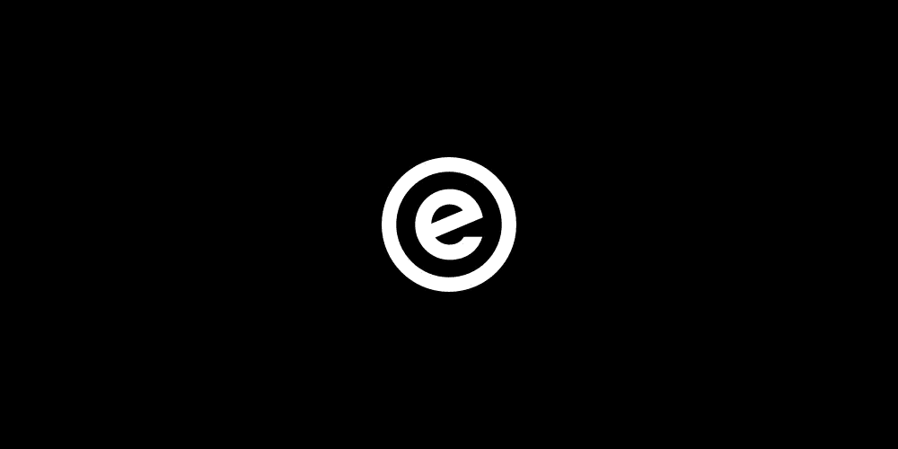
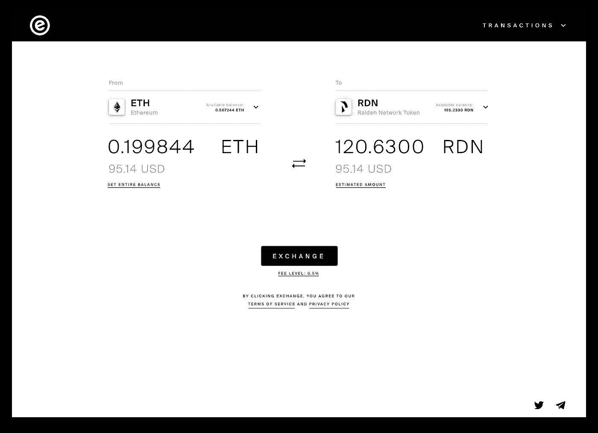

# eazyX——用于分散交换的简单 UX 接口

> 原文：<https://medium.com/hackernoon/eazyx-simple-ux-interface-for-a-decentralized-exchange-51bafba65b3e>

*在最近的一篇* [*的博客*](/midas-app/we-give-the-dutchx-a-new-face-d441a387ea1f) *中我们宣布要建立一个去中心化交易所 DutchX 的接口，由* [Gnosis](https://gnosis.pm/) *开发。作为一个有效率的(公平的)价格机制的交换，我们认为它对我们的目标群体，非专业投资者或临时用户最有利。为了给这些用户提供无缝的 UX，我们不得不为 UX dApp 提出一些通用策略，下面将简要介绍。已经厌倦了？在 Rinkeby testnet 上试用 eazyX->*[*转到 eazyX！*](http://eazy.exchange/)

**不同的分散式交易所**

DutchX 是一个基于荷兰拍卖机制的分散式交易所。这些拍卖起源于 17 世纪的荷兰花卉市场，通常以较高的要价开始，然后逐渐降低，直到拍卖参与者接受这个价格。在荷兰交易所的情况下，卖家在拍卖前存放代币。一旦开始，初始价格根据递减函数下降，买家在当前价格反映他们最大支付意愿的时间点提交他们的出价。他们只能提交他们的出价，直到拍卖结束，价格清除出售和购买的代币数量。要获得更深入的解释，请阅读[这个由 Gnosis](https://blog.gnosis.pm/introducing-the-gnosis-dutch-exchange-53bd3d51f9b2) 编写的关于 DutchX 的解释系列。

我们给它一张性感的脸

我们的主要项目——Midas 是一个基于 Melon 协议的投资应用程序，面向普通用户。这款移动应用将基金管理和投资游戏化，同时允许访问一系列新的零售资产，如预测市场(通过 Gnosis 集成)和[加密](https://hackernoon.com/tagged/crypto)收藏品。交易所的整合对我们来说至关重要。牢记我们的目标用户的需求，DutchX 的公平价格模型是一个强大的功能，并使 DutchX 成为 Midas 的一个有趣的产品。看看今天的分散交易所的 UX/用户界面，对于临时用户来说，不同的选项是非常不清楚的。因此，我们决定构建 eazyX，这是一个不言自明的交易所，提供一种简单的服务:以合适的价格轻松交换代币。

不是每个人都是密码呆子

Midas 和 eazyX 这两个项目都有相同的目标:为基于区块链的应用程序提供一个干净简单的 UX。我们不期望用户在使用我们的产品之前已经阅读了数百篇博文。对于 DutchX，我们特别假设我们的用户不习惯荷兰式拍卖或 DutchX 术语和逻辑。我们的主要挑战是复杂的区块链逻辑和程序与 UX 习惯或普通用户的期望相冲突。因此，我们需要抽象出复杂性，同时在必要时仍能访问关键信息，并创建一个良好的 UX。

**给他们他们需要的**

为了促进与 DutchX smart contract 的交互并提供无缝的 UX，一个界面抽象出了与临时用户无关的复杂逻辑，并避免了复杂的术语。关于服务如何工作的细节不应被披露，因为它们可能会不必要地混淆用户。但是当然，用户需要能够访问关键信息，以防他们想要或需要知道更多。任何不直截了当的事情都应该解释清楚。归根结底，eazyX 是一项金融交易服务，用户需要知道他们的钱在任何给定的时间都在哪里。因此，在构建界面时，我们遵循了三个简单而有效的原则:

1.  **定制**
    界面应该能够为用户提供量身定制的优化体验。
2.  **层(“边做边学”)**
    根据用户想要理解机制和底层服务的深度，越来越多的信息被相应地公开。
3.  **Justin Time** 在错误的时间显示的冗余信息或过多的信息会分散用户的注意力，使用户感到困惑。因此，只保留执行所需操作所需的最少元素。更多功能仅在适用时显示。

**试试看！**

您现在可以在 Rinkeby testnet 上测试 [eazyX](http://eazy.exchange/) 并亲自查看。我们的 MVP 是基于我们在本帖中解释的主要假设。随着越来越多的用户采用和反馈(加入 eazyX [Telegram](https://t.me/eazyXchange) 或 [tweet](https://twitter.com/eazyXchange) 获取反馈)，我们将相应地迭代和调整界面。

[去 eazyX](http://eazy.exchange/)