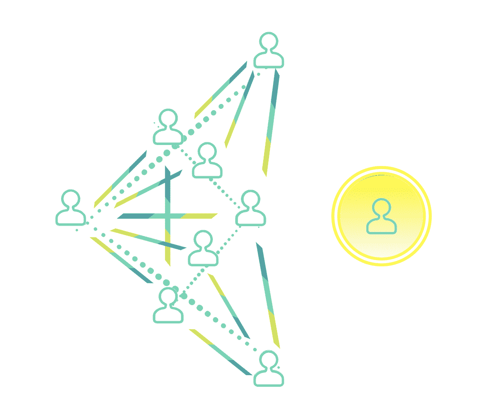
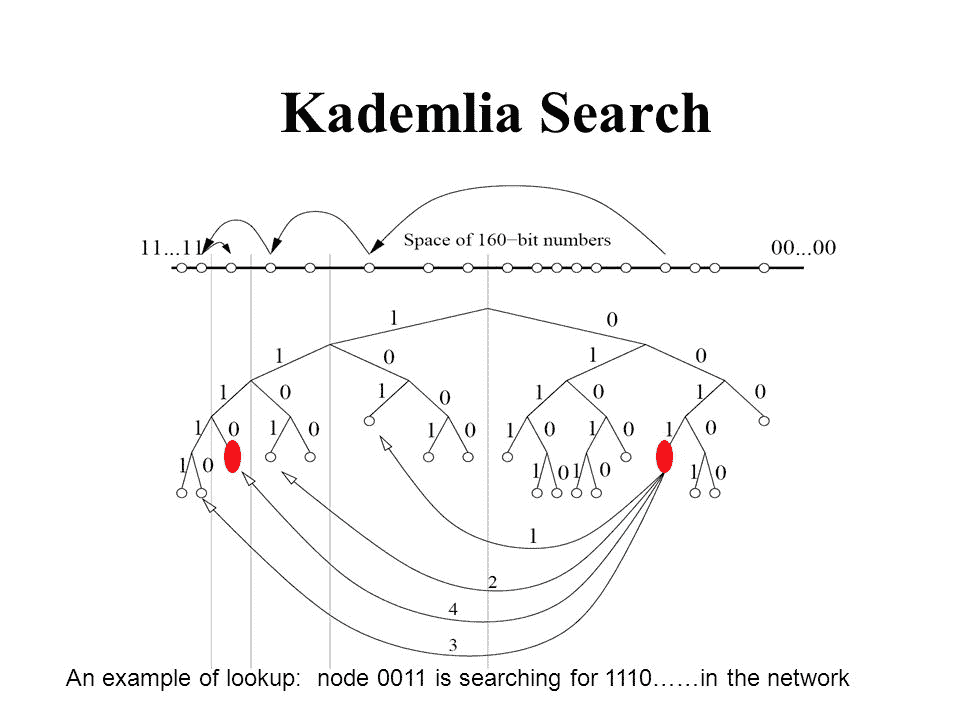

# Eclipse 对区块链对等网络的攻击

> 原文：<https://medium.com/hackernoon/eclipse-attacks-on-blockchains-peer-to-peer-network-26a62f85f11>

从系统的角度来看，区块链按照其层次结构大致由四个模块组成:

*   共识引擎
*   脚本和虚拟执行环境
*   事务、块和链逻辑
*   对等网络

大多数相关主题的研究都集中在**共识引擎**(提高交易吞吐量)和**脚本语言**(使区块链更有用)，对对等网络的属性基本上没有探索。

区块链的安全属性实际上取决于对等网络。对 eclipse 攻击的研究是由 Ethan Heilman、Alison Kendler、Aviv Zohar 和 Sharon Goldberg 在 2015 年开始的。他们的研究说明了通过控制数百个节点对比特币点对点网络的首次攻击，这在他们的研究论文中被建模为非结构化随机图。另一篇题为“[对以太坊对等网络的低资源 eclipse 攻击](https://eprint.iacr.org/2018/236.pdf)”的有趣研究论文展示了仅使用两台机器对以太坊的 P2P 网络层(通常建模为类似 Kademlia DHT 的结构化图形)发起 Eclipse 攻击的可行性。Eclipse 攻击证明了在构建复杂的 P2P 系统时需要跨层设计。

# Eclipse 攻击

像 [limewire](https://en.wikipedia.org/wiki/LimeWire) 这样的 P2P 系统是一种计算或网络分布式应用架构，它在对等点之间划分任务或工作负载，而不需要中央协调服务器或稳定的主机。对等体通过八卦协议进行通信:

*   对等体 A 在线&与对等体 B 连接，这是预先配置的；
*   对等体 A 咨询对等体 B >了解对等体 C 的存在，并且 D >与这些新的对等体连接；
*   对等体 A 向 B、C 和 D 广播一条新消息。一旦 B、C 和 D 接收到该广播，它们就会将其发送给 E、F、G、H…等等。

对等体 A 对整个网络的视图完全依赖于 B、C 和 d。在攻击期间，对等体 A 基本上与网络的其余部分隔离，并且其视图可以被攻击者操纵。这就是我们所说的 Eclipse 攻击，一种攻击包括区块链在内的 P2P 系统的简单方法。

当每个对等点都**总是**监听和与其他对等点通话(一种理想状态)时，发起椭圆攻击的成本很高，因为黑客需要控制整个网络才能入侵 P2P 系统。出于实际考虑，现实中每个对等体只与一小群对等体交换信息。因此，入侵系统的成本并不高。以太坊之所以选择像比特币一样将传出连接数设为 13 而不是 8，是为了让以太坊网络的整体安全性更强大。

尽管如此，以太坊 P2P 网络仍然存在缺陷，使得黑客能够发起 eclipse 攻击。

# 设计缺陷

## 设计缺陷#1:对等体的身份

以太坊网络中的对等体通过它们的节点 id 来标识，节点 id 是可以生成的 64 字节加密 ECDSA 公钥。多个以太坊节点，每个都有不同的节点 ID，运行在具有单一 IP 地址的单一机器上。由于“对等体”的这种弱定义，黑客可以很容易地生成一大组以太坊对等体，将它们托管在一台具有相同单个 IP 地址的机器上，并战略性地协调它们，以阻止任何进出受害者节点的通信。这是 Yuval Marcus 等人的论文中使用的主要载体。铝..**对等体的身份应该与一些物理资源捆绑在一起，例如 IP 地址，以避免无限制地提供对等体并修复这样的设计缺陷。**

## 设计缺陷#2:对等选择策略

以太坊没有使用随机的节点选择策略，而是使用 Kademlia 来选择新的节点。在 Kademlia 网络中，每一项内容都与一个密钥相关联，并且只存储在其节点 ID“接近”其相关密钥的对等体上。“接近度”被定义为关键字和节点 ID 之间的二进制汉明距离。为了查找与关键字 t 相关联的内容，Kademlia 节点在其桶中查找“最接近”t 的节点 id，并要求它们(a)返回与 t 相关联的内容，或者(b)返回甚至“更接近”t 的一些节点 id。在以太坊的例子中，一个节点:

1.  选择一个随机字符串 t
2.  在其桶中查找 k = 16 个最接近字符串 t 的节点 id
3.  要求每个节点从其桶中返回 k 个节点 id，这有助于原始节点“更接近”字符串 t

这个过程的结果是收集了多达 k × k 个新的节点 id。

Image Credit: [Kurtis Jolly](http://slideplayer.com/slide/3952039/)

然后，从这些 k × k 个新发现的节点 id 中，要求最接近字符串 t 的 k 个节点返回更接近 t 的 k 个节点。这个过程迭代地继续，直到没有发现新的节点。因此，这使得攻击者能够创建一组节点 id，用于填充受害节点对等体数据存储中的所有存储桶。这个漏洞需要用一个好的对等选择策略来修复。理想情况下，所选择的对等体 **应该分散在网络中以最小化这样的风险。**

# 设计缺陷 3:入站 vs .出站连接

从对等体的角度来看，有两种类型的连接—入站(如果它是由另一个对等体发起的)和出站(如果它是由这个对等体发起的)连接。以太坊对入站和出站连接的总数设置了一个限制，称为 maxpeers(默认为 25)，但没有为每个连接设置限制。受害节点可能会在 100%的入站连接来自黑客的情况下最大化 maxpeer 限制。**对传入连接的数量设置上限，迫使对等点混合传入和传出连接，将是解决这个问题的一种方法。**

# 设计缺陷#4:重启并删除

在以太坊中，一个对等体将关于其他节点的信息存储在两种数据结构中:

1.  **硬盘上的长期数据存储**，重启后仍然存在(word choice)
2.  **短期数据存储**包含类似 Kademlia 的桶，当对等体重启时，这些桶总是空的。

聪明的黑客可以利用设计缺陷#3 和#4，在对等体重新启动后立即填充短期数据存储，从而快速将受害者的所有入站连接替换为恶意连接。**这个问题可以通过对传入连接进行采样来填充短期存储，并在重启后在短期数据存储中保留一些对等体，而不是将整个短期数据存储清除干净来解决。**

# 含义

Eclipse 攻击可用于打破网络共识，并导致:

*   双倍支出；
*   针对第二层协议(如闪电网络)的攻击，例如，攻击者可以通过欺骗他的受害者，使其认为支付通道仍然开放，而网络的非重叠部分看到支付通道关闭，从而无需支付就可以获得产品；
*   如果用户看到不一致的区块链视图，智能合约可能会受到攻击。

# 播种

此外，通过增加受害者与合法对等方建立传出连接的可能性，更积极地播种无疑有助于抑制 eclipse 攻击。以下是优化播种的一些方法:

*   **频率**:播种可以在对等体重启后立即执行，或者每 30 分钟定期执行一次
*   **覆盖范围**:播种可以针对更多的节点执行(不限于以太坊网络中的六个引导节点)。重新启动后，以前使用的对等机仍然可以再次使用。
*   **选择性**:在播种过程中可以更严格地选择对等点。例如，可以使用具有不同网络特征(如延迟、跟踪路由、IP 范围和 ISP)的对等体。

# 这对 IoTeX 有何影响？

当我们设计 IoTeX 区块链时，我们特别关注对等体的身份、对等体选择策略、连接限制和播种策略。此外，我们正在积极探索通过利用网络统计使选定的对等点多样化的可行性。

# 关于 IoTeX

IoTeX 致力于打造下一代面向物联网的区块链平台。尖端的区块链区块链架构将解决与物联网 DApps 和生态系统增长相关的可扩展性、隐私性、隔离性和可开发性问题。通过将象征性激励与我们充满活力的全球社区相结合，我们相信我们可以众包顶级行业和社区人才，以推动区块链 3.0 的发展。

【https://iotex.io/telegram】电报: [*电报:*](https://iotex.io/telegram)

*推特:*[*https://twitter.com/iotex_io*](https://twitter.com/iotex_io)