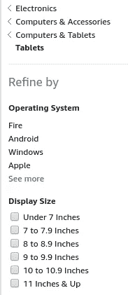
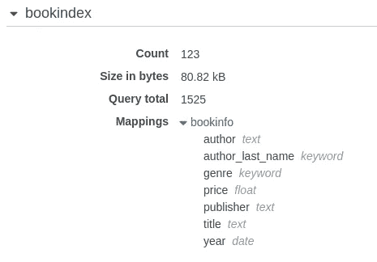
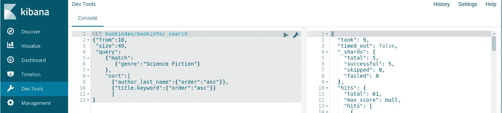

# 带弹性搜索的电子商务

> 原文：<https://medium.com/hackernoon/ecommerace-with-elasticsearch-4ab5685fcc2>

# 介绍

自 20 世纪 90 年代中期互联网普及以来，在线购物一直是网络的核心应用。本文讨论了如何使用开源的 Elasticsearch 数据库和 Amazon Web Services(AWS)elastic search 服务作为在线购物网站的基础。

为了说明 Elasticsearch 的这个应用程序，本文讨论了一个用 Java 编写的演示应用程序。这个应用程序是使用 Spring 框架(Spring Boot 和 Spring MVC)实现的。

[Topstone 软件咨询公司](http://topstonesoftware.com/)在构建电子商务应用程序时同时使用了 Spring 框架和 Elasticsearch。

这个演示应用程序的 Java 代码在 Apache 2 软件许可下发布在 GitHub(【https://github.com/IanLKaplan/BookSearchES】)上。

这个应用程序是一个类似的演示应用程序的扩展版本，它使用 AWS DynamoDB 数据库(参见 [Spring 和 DynamoDB](http://topstonesoftware.com/publications/spring_and_dynamodb.html) 和 GitHub 库[https://github.com/IanLKaplan/booksearch](https://github.com/IanLKaplan/booksearch)

# 分面搜索



**An example of search-by-category**

分面搜索是大多数在线购物网站的核心特征。

当你在亚马逊或 Lands End 这样的网站购物时，你经常使用分面搜索操作来找到你可能有兴趣购买的产品。例如，如果你正在考虑购买一台平板电脑，你可能会按照亚马逊分类

电子计算机和配件计算机和平板电脑平板电脑

您可以通过操作系统和平板电脑尺寸(英寸)进一步选择您感兴趣的平板电脑。

这些搜索类别(例如，10 到 10.9 英寸的平板电脑)有时被称为面。显示这些分面的搜索称为分面搜索。


**Search facets with an associated count.**

一些网站显示类别(方面)和相关的计数。这可以从一个在线服装零售商的截屏中看出。如果一个类别有大量的相关条目，这就告诉用户需要使用更详细的选择来找到他们感兴趣的条目。

非结构化搜索通常用于在零售网站上查找商品。例如，如果您正在搜索“G8”LED 灯泡，以取代卤素灯泡，您可能会搜索“g8 led 灯泡”，而不是试图找到亚马逊类别的 LED 灯泡。

当设计一个在线购物网站的系统架构时，应该选择一个支持分面搜索和非结构化搜索(搜索“G8”LED 灯泡)的数据库。

图书搜索演示应用程序展示了 Elasticsearch 数据库如何支持分面搜索和全文搜索。Elasticsearch 建立在 Apache Lucene 数据库之上，该数据库具有强大的全文搜索功能。

# 弹性搜索

Elasticsearch 是一个开源(Apache 许可)数据库，构建在 Lucene 全文索引系统之上。

Elasticsearch 是一个可扩展的数据库。当在一个基本的 AWS Elasticsearch 服务实例上运行时，这个应用程序使用一台服务器。对于较大的数据集或随着数据需求的增长，可以将 Elasticsearch 服务实例分散到多个处理节点上。通过将处理负载分布在多个处理节点上，Elasticsearch 服务可以快速提供大型数据集的搜索结果。

一个 Elasticsearch 实例将有一个或多个索引，每个索引将有一个关联的数据类型。Elasticsearch 数据类型相当于关系数据库的数据库表模式。Elasticsearch 类型定义被称为映射。

Elasticsearch 映射非常灵活，可以在映射中添加额外的字段，而不会影响现有数据(尽管现有数据元素不会为新字段定义数据)。

图书搜索演示应用程序的 Elasticsearch 索引如下所示。该索引的名称是 bookindex。与此索引关联的类型的名称是 bookinfo。



与 elastic search book index/book info index/type 关联的映射(模式定义)如下所示。

可以在文本字段中搜索任意字符串。例如，在 bookinfo“title”字段中搜索单词“venice ”,将返回图块中包含世界“venice”的所有 book info 条目。文本字段中的搜索忽略字符大小写。

这种类型的非结构化文本搜索将用于在亚马逊这样的在线购物网站上查找“G8 LED”灯泡。

关键字类型定义了通过精确匹配进行搜索的字段。对“流派”字段的搜索必须与该字段中的字符串完全匹配，才能返回 bookinfo 元素。例如，对“科幻小说”的搜索和对“小说”的搜索返回不同的数据元素。对于关键字字段，字符大小写很重要。

有些字段，如“publisher ”,同时存储为文本字段和关键字字段。这允许对图书出版商进行全文搜索，并且还支持 publisher facet，它将显示数据库中由该出版商印刷的图书数量。

当数据存储在“发布者”字段中时，它将更新字段的文本和关键字部分。

```
{
  "bookindex": {
    "mappings": {
      "bookinfo": {
        "_all": {
          "enabled": **false**
        },
        "properties": {
          "author": {
            "type": "text"
          },
          "author_last_name": {
            "type": "keyword"
          },
          "genre": {
            "type": "keyword"
          },
          "price": {
            "type": "float"
          },
          "publisher": {
            "type": "text",
            "fields": {
              "keyword": {
                "type": "keyword"
              }
            }
          },
          "title": {
            "type": "text",
            "fields": {
              "keyword": {
                "type": "keyword"
              }
            }
          },
          "year": {
            "type": "date",
            "format": "YYYY"
          }
        }
      }
    }
  }
}
```

# 亚马逊弹性搜索服务

您花在管理数据库、操作系统或服务器的系统管理工作上的每一分钟，都是您没有花在编写软件和改进产品上的一分钟。

Amazon Web Services 为数据库和 Web 服务器提供了各种“托管服务”。AWS 托管服务不需要任何系统管理工作，只需要决定何时更新数据库软件版本。

Amazon Elasticsearch 服务提供 Elasticsearch 的托管实例。这允许从 Elasticsearch 服务网页配置 Elasticsearch。这避免了直接配置 Elasticsearch 集群的复杂性。

Elasticsearch 搜索服务运行 Elasticsearch 的最新版本，并允许您按需升级该版本。

Elasticsearch 服务附带了一个 Kibana 实例。Kibana 工具允许您针对 Elastic search 服务实例中的数据测试弹性搜索查询。在开发图书搜索应用程序使用的查询时，这个特性非常有用。

下面的示例显示了左侧控制台窗格中的搜索查询和右侧面板中的查询结果(JSON 格式)。



# Elasticsearch 是一项休息服务

Elasticsearch 是一个 Web 服务，与 Elasticsearch 的所有通信都通过 HTTP 使用 [REST 操作](https://spring.io/understanding/REST) GET、PUT、POST 和 DELETE 进行。例如，下面的 Elasticsearch 查询使用了一个 GET 操作。

```
GET index/type/_search
{
  "query": {
     "bool": {
        "filter": {
           "match": {
              "author": "gibson"
           }
        }
     }
   }
}
```

查询结果作为 JSON 结构在 HTTP 响应中返回。

HTTP POST 操作具有与该操作相关联的实体(例如，字符串)参数。GET 操作最初设计用于获取与 URL (URI)相关的数据。用于查询 Elasticsearch 的 GET 操作是标准 HTTP GET 的扩展，包括一个实体(参见相关图书搜索应用程序 GitHub 源代码中的 HttpGetWithEntity 对象)。

## 弹性搜索和安全性

Amazon Elasticsearch 服务实例(域)可以配置为公共访问端点，可以从互联网访问，也可以配置为 Amazon 虚拟私有云(VPC)可访问的服务。

VPC 服务具有更高的安全性，但是调试和监控可能更加困难。当在 VPC 中配置 Elasticsearch 服务时，HTTP 事务更简单，因为它们不需要签名和授权。

图书搜索应用程序被设计为与互联网可访问的 Elasticsearch 服务端点一起运行。这使得调试和测试更加容易，并允许图书服务应用程序在本地计算机系统或 Amazon Elastic Beanstalk 服务器上运行。与大多数 AWS 服务一样，对 Elasticsearch 服务端点的访问可以“锁定”到单个 IP 地址或 IP 地址范围，以提高安全性。

## 签名的 HTTP

图书搜索应用程序使用 Java [Apache HTTP Client](https://hc.apache.org/httpcomponents-client-ga/) 库与 Elasticsearch 服务进行通信。

Amazon 已经发布了关于如何基于 Apache HTTP 客户端构建签名 HTTP 事务的文档。不幸的是，这种文档很难找到。图书搜索应用程序包括 AWSRequestSigningApacheInterceptor 类，它是这些事务的核心。与大多数 AWS 代码一样，这个类由 Amazon 作为开源发布。

下面的 Java 代码(可以在相关的 GitHub 存储库中找到)展示了如何使用这个类来构建签名的 HTTP 对象。

```
**protected** **static** CloseableHttpClient **signedClient**() {
        AWS4Signer signer = **new** AWS4Signer();
        signer.setServiceName( SERVICE_NAME );
        signer.setRegionName( region.getName() );
        AWSCredentials credentials = getCredentials(ES_ID, ES_KEY);
        AWSCredentialsProvider credProvider = **new** AWSStaticCredentialsProvider( credentials );
        HttpRequestInterceptor interceptor = **new** AWSRequestSigningApacheInterceptor(SERVICE_NAME, signer, credProvider);
        **return** HttpClients.custom()
                .addInterceptorLast(interceptor)
                .build();
    }
 **protected** **static** String **sendHTTPTransaction**( HttpUriRequest request ) {
        String httpResult = **null**;
        CloseableHttpClient httpClient = signedClient();
        **try** {
            HttpResponse response = httpClient.execute(request);
            BufferedReader bufferedReader = **new** BufferedReader(**new** InputStreamReader(response.getEntity().getContent()));
            httpResult = IOUtils.toString(bufferedReader);
        } **catch** (IOException e) {
            logger.error("HTTP Result error: " + e.getLocalizedMessage());
        }
        **return** httpResult;
    }
```

下面的代码显示了如何使用 sendHTTPTransaction()函数发送带有实体参数的 HTTP get(例如，用于搜索操作的 get 类型)。

```
**public** **static** String **getDocument**(**final** String index, **final** String type, **final** String suffix, **final** String jsonPayload) {
        String responseString = "";
        String url = buildURL(index, type, suffix);
        **try** {
            HttpGetWithEntity get = **new** HttpGetWithEntity( url );
            get.setHeader("Content-type", "application/json");
            StringEntity stringEntity = **new** StringEntity( jsonPayload, StandardCharsets.UTF_8);
            get.setEntity(stringEntity);
            responseString = sendHTTPTransaction( get );
        } **catch** (Exception e) {
            logger.error("HttpGet with entity failed: " + e.getLocalizedMessage());
        }
        **return** responseString;
    }
```

有关更多详细信息，请参考相关 GitHub 资源库中的 Java 源代码。

# 弹性搜索文档

如果你决定使用 Elasticsearch，你将面临的挑战之一就是文档。在开发图书搜索应用程序和相关的 Elasticsearch 支持代码时，我依赖于四个文档来源:

1.  *行动中的弹性研究*作者:拉杜·乔戈、马修·李·希曼和罗伊·鲁索，曼宁出版社，2015 年 11 月
2.  在[elastic.co](http://elastic.co/)网站上发布的 [*弹力搜索参考*](https://www.elastic.co/guide/en/elasticsearch/reference/current/index.html) 。
3.  关于编写 Java 代码使用 Elasticsearch 和 signed HTTP 的 Amazon Web Services 文档和博客帖子。
4.  很多谷歌搜索来回答我在上面的参考文献中找不到答案的问题。

*Elasticsearch in Action* 这本书对于理解 Elasticsearch 的功能及其架构非常有用。与大多数曼宁的书一样，写作质量很高，我推荐阅读这本书的前五章。

不幸的是， *Elasticsearch 在使用*作为开发使用 Elasticsearch 的软件的参考时存在几个问题。这本书是基于 Elasticsearch 2 . x 版本的。在撰写本文时，elastic search 是 6.X 版本。

弹性研究在 2。书中描述的一些查询和其他操作不适用于 elastic search 6 . x 版。

Elasticsearch 架构也发生了变化。例如，在 *Elasticsearch in Action* 中，作者声明每个索引可以有多种类型。Elasticsearch 的更高版本只允许每个索引有一种类型，使得索引和类型等价。

在 *Elasticsearch in Action* 中，大多数操作都以命令行 [curl](https://curl.haxx.se/) 操作的形式描述。例如，从动作中的 *Elasticsearch 开始的搜索操作如下所示。*

```
% curl 'localhost:**9200**/get-together/group/_search?pretty' -d '{
  "query": {
    "query_string": {
      "query": "elasticsearch"
    }
  }
}'
```

对于 Java 开发人员来说，除了 Amazon 文档(通常是不完整和零碎的)之外，很少有资源可以指导 Elasticsearch 的 Java 代码开发。

我希望这篇文章和 GitHub 上的相关代码能为 Java 开发人员提供有用的资源。HTTP 和 Elasticsearch 代码独立于图书搜索演示应用程序，您可以在自己的应用程序中自由使用它。

# 运行图书搜索应用程序

基于 Elasticsearch 的图书搜索应用程序可以从它的 [GitHub 库](https://github.com/IanLKaplan/BookSearchES)中克隆出来。

图书搜索应用程序是使用 Spring 框架(Spring Boot 和 Spring MVC)构建的。要构建应用程序，您需要安装 [Spring 工具套件](https://spring.io/tools/sts/all) (STS)，这是为 Spring 框架定制的 Eclipse 版本。STS 项目使用 Maven 加载必要的 Java 库。

要运行该应用程序，您需要一个 Amazon Web Services 帐户，并且需要配置一个 Elasticsearch 服务域。您还需要使用亚马逊的 IAM 服务来获得一个 ID 和一个密钥，以便完全访问 Elasticsearch 服务。ID 和键应该添加到代码库中的 IElasticsearch Java 接口中。您还需要将您的 Elasticsearch 端点 URL 添加到界面中。

当您运行图书搜索应用程序时，它将创建一个索引并加载一个映射。您可以使用 LoadESFromJSON 实用程序从 books.json 文件中加载测试数据。

# 图书搜索应用程序

图书搜索应用程序的 Elasticsearch 版本扩展了使用 DynamoDB 的[图书搜索应用程序，增加了一个“探索”页面，展示了 Elasticsearch 的一些功能。“浏览”选项卡如下所示。该选项卡允许用户按流派或出版商浏览图书数据库。](http://topstonesoftware.com/publications/spring_and_dynamodb.html)


“流派”可折叠标签被展开以显示书籍流派及其相关书籍数量。

“搜索一本书”标签允许用户通过作者、书名或书名和作者进行搜索。

DynamoDB 应用程序需要准确的作者姓名或书名。因为这个版本的 Boook 搜索应用程序使用了 Elasticsearch 数据库，所以可以在搜索中使用部分作者姓名或标题。例如，在标题搜索对话框中输入单词“venice”将返回标题中带有“venice”的书籍。

# 亚马逊云架构、Spring 和 Elasticsearch 咨询

Topstone Software 拥有在 Amazon web Services 上构建可伸缩 Web 应用程序的丰富经验。我们可以帮助您设计 AWS 应用程序架构，以提供可扩展性和优化的成本。

我们设计并建造了地下社交网络。地下世界是一个为隐私和安全而设计的社交网络。三年多来，nderground 一直保持着接近 100%的正常运行时间。

在 Topstone Software，我们有构建利用各种 AWS 服务的 Spring 框架应用程序的经验。其中包括 Elasticsearch、DynamoDB、S3、简单电子邮件系统和 Elastic Beanstalk。我们可以提供咨询帮助来加速您的应用程序开发，或者我们可以根据您的要求开发应用程序。

*本文最初发表在 Topstone 软件网站上。原文可以在* [*这里找到*](http://topstonesoftware.com/publications/ecommerace_with_elasticsearch.html) *。*