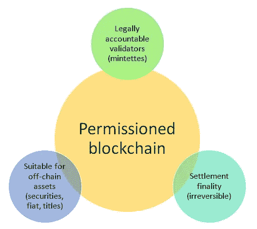

# 爱登堡 ICO 评论——可编程经济平台

> 原文：<https://medium.com/hackernoon/edenchain-is-creating-a-third-generation-smart-contract-blockchain-which-they-will-utilize-to-189cc648c8c9>

EdenChain 正在创建第三代智能合同区块链，他们将利用它来实现可编程经济。借助 EdenChain 平台，用户可以将有形/无形价值资本化，并通过区块链进行交易。EdenChain 还旨在为所有应用提供一个普及的区块链和令牌平台，包括物联网、能源、广告技术、P2P 金融、医疗保健等。

# 问题

***关于技术:***

*   随着与可编程经济相关的创新的增长，目前阻碍这些平台的两个因素是安全性和性能。
*   最初创建的平台非常安全，但处理交易的速度极低，使得主流采用的可能性变得不可能。
*   当前现有的平台提供了提高性能的解决方案，但是牺牲了安全性。

***关于全球市场:***

*   ***有形资产:*** 这些有形资产如房地产、家具、贵重艺术品、汽车等。在由中间商管理的市场上出售。交易双方需要这些服务是因为:缺乏这些交易的经验，完成销售的过程，监督的必要性，等等。这些费用可能高达 20%或更多。
*   ***无形资产:*** 缺乏为无形资产(时间、社会影响力、服务、关系网、名气等)提供经纪交易手段的平台。)导致目前为数不多的现有平台垄断并收取极高的费用来连接这些交易。

# 解决办法

EdenChain 试图创造最好的解决方案来解决当今全球市场经济中存在的全球性和技术性问题。他们在不牺牲用户安全的情况下解决效率问题的方法可以将他们的平台变成最有吸引力的新兴项目之一。

*   EdenChain 平台允许任何用户创建一个市场，附加他们的资产并通过加密货币进行交易，所有这些都不需要第三方。
*   该平台通过实施共识算法来确保链上和链下之间的数据完整性，从而在互操作性方面提供了高级别的安全性。
*   EdenChain 将名称空间与 Merkle 树相结合，通过名称空间隔离事务，并通过构建能够通过名称空间并行处理而无需一次处理一个事务的执行系统来确保性能和可伸缩性。

# 主要特性和技术概述

**建筑**

EdenChain 的区块链架构由 3 层组成:*分布式总账层、验证层和桥接层。*

*   **分布式账本层:**基于 Linux 基金会的开源项目 Hyperledger 锯齿，这个分布式账本层为 EdenChain 提供了去中心化的数据库功能。分发和存储区块链中使用的数据的层，只处理验证层中同意的交易数据。可以通过事务处理添加分布式分类帐数据。

*   *PoET(运行时间的证明)是一种共识算法，它使用软件卫士扩展(SGX)中的 CPU 命令来随机选择领导者，而不需要利用大量的能量来解决哈希问题。SGX 允许应用程序在受保护的环境中运行可信代码。*
*   **验证层:**执行和验证交易的层，包括运行智能合约的以太坊虚拟机(EVM)。交易在这一层执行和验证，包括 EVM。通过事务执行调度器，它根据名称空间将事务转发到相应的节点。路由器可以自动化，允许跨事务和节点的资源管理。
*   *还可以通过实时监控分配给可信执行环境的工作负载，以最佳的资源和计算能力运行区块链。*
*   *通过将相关交易分组为批次，验证层可确保高效执行，并消除任何数据依赖性问题。*
*   *验证层的事务调度功能对 EdenChain 的性能和可扩展性有重大影响。*
*   **桥接层:**这一层包括一个 e 桥，它通过安全的互操作性将 EdenChain 与外部数据源连接起来，使链上智能合约能够与链下模块连接。该层用于安全地导入区块链内的链上智能合约与链下智能合约合作所需的数据。

*   *在桥接层中，节点自然地存在于链上和链下，并且使用 ECC-TC(一种加密技术)的电子协议用于这些节点之间的可靠通信。*

**许可区块链的优势**

*   效率:在许可的区块链运行的智能合同更快更有效。
*   EdenChain 通过使用基于名称空间的一定数量的节点来实现这一点，并确保百分之百地处理所有事务。
*   **高可用性** : EdenChain 利用云服务来确保高可用性，并使用全球 DNS 和负载平衡器来运营具有多数据中心模式的 EdenChain 系统。
*   多数据中心模式是云服务提供商 Amazon 提供的一种模式。它被许多互联网公司使用，如阿帕奇基金会、网飞、CloudFoundry 和 Atlassian，此外，还被 Azure 女士推荐。

**hello den:一体化 ICO 解决方案**

HelloEden 平台是一个包罗万象的令牌化生态系统，它是结合分布式基础设施的 ICO 实现过程开发的。

通过 EdenChain 为其 HelloEden 平台建立的各种合作关系，现有企业可以执行“反向 ICO”，或者新企业可以在 HelloEden 的一站式解决方案上推出 ICO，以满足其所有需求。

*这些不同的伙伴关系将简化任何有意采用区块链技术的企业的流程。这些举措可能会使 EdenChain 成为广泛采用的平台之一，因为其简单易用。*

**总之:**最初发布的主要平台之一 HelloEden 将提供各种合作服务，例如:

*   ICO 营销
*   法律服务
*   KYC
*   钱包服务
*   硬币发行
*   ICO 评级

这些服务将有助于帮助任何现有的或新的业务，避免在其业务中采用区块链技术的压力。

# 路标

*   A 轮私人销售系列已经结束。
*   私人销售系列 B 轮将于 5 月开始。
*   众卖的白名单已经关闭。
*   众筹将于 5 月开始。
*   MVP / First Alpha 计划在 ICO(4 月)之前发布。

# 象征经济学

*   股票代码: EDN
*   **令牌类型:** EDN 将是 ERC-20 邮政众筹，并在 2019 年 mainnet 在 Q1 推出时转换为 EdenChain 的钱包格式。
*   **ICO 代币价格:** 1 EDN = 0.0600 美元
*   **硬上限:**:2400 万美元
*   **代币总数:**10 亿

# 潜在考虑因素

*   EdenChain 的项目非常雄心勃勃。他们试图同时解决各种问题和市场，最终可能会势不可挡。

# 团队+顾问

[**James Ahn**](https://www.linkedin.com/in/james-ahn-b5aa02140/) — Founder

*   在 IT 领域积累了 20 多年的经验
*   担任 CyberRenassance Inc .的首席技术官。
*   他曾担任 NIA 平台的顾问，国家计算和信息服务的技术顾问，以及韩国技术和标准局的云顾问。
*   为国会图书馆开发了一个大数据平台
*   在与政府合作期间，James 设法提高了性能、能耗、分析处理和处理大量数据的效率。

[**Jenny Ryo**](https://www.linkedin.com/in/jenny-ryoo-017626159/) — Co-Founder

*   在 IT 领域有超过 10 年的经验
*   在高丽大学和东国大学撰写了获奖的学士和硕士论文
*   基于国家信息社会机构/国会图书馆的云，为激活国家学术信息整合数据的知识服务开发了大数据分析服务
*   在政府研究项目的不同部门工作，例如:
*   韩国国家信息产业振兴院(帕尼)
*   实时大数据分析平台的开发(2014 年软件开发支持项目，帕尼)。
*   韩国能源技术评估与规划研究所
*   基于软件技术的服务器节能系统开发。

[**Hokyun Kim**](https://www.linkedin.com/in/hokyun-kim-b292a511/) — Blockchain Developer

*   在 IT 领域超过 18 年
*   他是世界上第一个发明锯子和钳子的人。
*   他开发了 SK Telecom 的 WAP 邮件网关，在 7 个门户网站上提供标准化的 API，在服务推出一个月内吸引了 20 万付费用户。
*   Hokyun 开发的其他企业产品包括信号检测和解码系统以及信号处理算法。

[**Brian Park**](https://www.linkedin.com/in/brian-park-2965a815b/) — Blockchain Developer

*   在 IT 领域超过 15 年
*   曾在 SK Telecom 工作，在那里他构建了一个基于沙盒虚拟化技术的业务专用虚拟工作空间
*   参与了韩国能源技术评估和规划研究所开发的适用于云环境的基于软件的节能技术。
*   为三星显示开发了一个共享外部数据的系统。
*   基于 SK Telecom 的 Window Mobile 开发了移动 outlook 连接的直推技术。

[**Kangho Kim**](https://www.linkedin.com/in/kangho-kim-83024079/) — Chief Strategic Officer

*   拜占庭合伙人事务所的合伙人
*   韩国区块链开发者协会成员
*   在金融市场工作了 10 年，在著名的全球投资公司担任衍生品交易员、分析师和投资组合经理。
*   在富兰克林邓普顿，他担任投资组合经理超过 6 年，管理超过 16 亿美元的固定收益、衍生品和另类资产基金。
*   作为 CEO 创立了一个成功的社交网络移动应用，并将区块链技术应用到他的服务中。

[**HJ Moon**](https://www.linkedin.com/in/hj-moon-96772b20/) — Chief of Business Development, Asia

*   高盛和巴克莱等全球顶级投资公司的研究分析师。
*   作为一家科技初创公司的联合创始人，HJ 推出了一款社交网络移动应用，并将区块链技术应用到自己的服务中。
*   在他担任研究分析师期间，他的知识和分析深度在机构客户中广受好评，因为他获得了机构和对冲基金的多次投票。

[**Richard Jahnke**](https://www.linkedin.com/in/richard-jahnke-554a7a3/) — Business Development, USA and Europe

*   硅谷风险投资家，拥有超过 16 年的专业投资管理、研究和交易经验，涉足广泛的技术领域
*   Columbus Nova Technology Partners(CNTP)的投资者，这是一家全球性的多阶段技术投资公司，在硅谷和纽约市开展业务。
*   与总部位于纽约的早期风险投资公司 Flatiron Investors 合作。
*   是 Olayan 集团的高级投资分析师，专注于技术相关投资。

[**Kathy Roe**](https://www.linkedin.com/in/kathy-roe-822b6015b/) — Marketing

*   毕业于波特兰大学，获得市场营销学位。
*   拥有在各种公司工作的经验，目前负责新成立的区块链领先公司 EdenChain 的市场营销和公共关系。

[**Jessica Park**](https://www.linkedin.com/in/jessica-park-387b5a15b/) — Marketing

东国大学硕士毕业，在 EdenChain 开始了第一份职业生涯。

*   有担任出版社编辑的经历，并对其感兴趣，从而加入了 EdenChain。
*   目前负责营销和公关。

[**Aaron Tay**](https://www.linkedin.com/in/aarontwl/) — Financial Advisor (Singapore)

*   从新加坡管理大学毕业后，在新加坡金融管理局、新加坡中央银行和金融监管局开始职业生涯。
*   加入在 AUM 拥有 160 亿美元资产的欧洲上市资产管理公司 Tikehau Capital
*   他在新加坡工作，负责寻找和执行亚洲多个行业的私募股权和风险投资机会。

**Kwangho Lee** — Technical Advisor

*   毕业于高丽大学，在 LG 集团建立了自己的职业生涯，参与了集团公司的许多关键项目。
*   领导数据仓库和商业智能领域的 IT 咨询和系统建立项目(LG 电子、LG Card、韩国铁路公司等)。)
*   负责审查“LG 创新者”项目中新业务项目的想法和原型
*   在 ICBM(物联网、云、大数据、移动)部门进行新业务开发和员工培训。

[**Mina Jeong**](https://www.linkedin.com/in/minajeongkoreaprspecialist/)

他们的顾问之一， [**Mina Jeong**](https://www.linkedin.com/in/minajeongkoreaprspecialist/) ，是韩国领先公关公司 M & K PR 的首席执行官兼董事总经理。EdenChain 正在推动在韩国建立一个大社区，并已经在他们的区块链社区中产生了大量的追随者。

顾问团队非常强大，拥有来自三星、诺基亚、甲骨文、美国航空、Visa、德勤、安永、英特尔、福特等公司的丰富经验。在韩国和硅谷都有影响力。

# 合作伙伴和投资者

***三大用户已经签约登上他们的第一个 alpha:***

*   **HelloEden** — HelloEden 将率先在 2018 年 Q2 奥运会上实施 EdenChain，主要针对韩国市场。EdenChain 将在一个平台的基础上提供 ICO 硬币发行、营销和投资的整体服务。
*   **CleanDeal** — Cleandeal 是一个 B2B 开放市场平台，由 YT Corp .运营，将于 2018 年第四季度推出。该平台为 Cleandeal 提供 B2B 服务所需的硬币和区块链技术。
*   **my credit chain**—my credit chain 正在利用 Edenchain 平台提供币和区块链技术提供 P2P 服务。这将在 2019 年初推出。

**其他资源:**

*   Github — [edenchain](https://github.com/edenchain)
*   [Reuters.com 文章](https://www.reuters.com/brandfeatures/venture-capital/article?id=30196)
*   [SmartIcoInvestor.com 文章](https://smarticoinvestor.com/edenchain/)
*   [Edenchain_Cathy 中型文章](/edenchainio/edenchain-third-generation-smart-contract-blockchain-a03b09402136)
*   [造字图的分析](https://coinstelegram.com/2018/04/07/edenchain-paradise-thickets-of-blockchain/)

## 这篇文章最初刊登在我们的网站上！你可以在这里找到[。](https://coincrunch.io)

# 想要了解区块链和加密货币的最佳新闻、评论和信息，请访问 [coincrunch.io](https://coincrunch.io) 或查看我们的网站:[Youtube](https://www.youtube.com/channel/UCXyrBCWaRJzHfOtnWaR47Qw)|[Twitter](https://twitter.com/coincrunchio)|[脸书](https://www.facebook.com/realcoincrunch/) | [Reddit](https://www.reddit.com/user/coincrunchio)