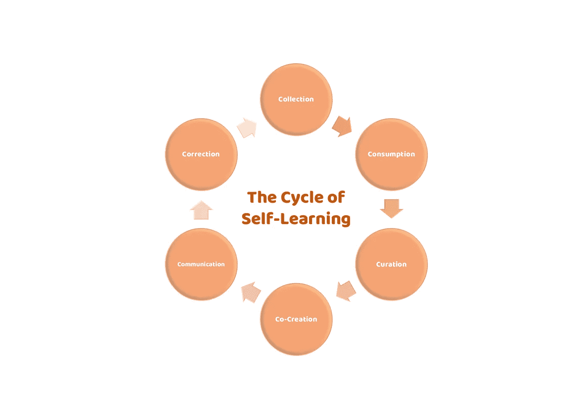

# 教育是更美好未来的关键，但是…

> 原文：<https://medium.com/hackernoon/education-is-the-key-to-a-better-future-but-6516903c547f>

## “我们必须教他们如何学习！”

Photo by [Martin Sanchez](https://unsplash.com/photos/JQ0YVavMKLo?utm_source=unsplash&utm_medium=referral&utm_content=creditCopyText) on [Unsplash](https://unsplash.com/search/photos/learning?utm_source=unsplash&utm_medium=referral&utm_content=creditCopyText)

> *成为一名更好的作家是一个永无止境的自我学习和发现的过程。*

这是我达到 100 个*中等*岗位后的结论。

一年多前我开始每周写一篇文章。我这么做的原因很简单:我喜欢在线平台提供的“自学”机会。在快速变化的数字世界中，不断“测试”自己并反思自己在做什么是至关重要的。

我是一名教师。所以,“教育”是我喜欢思考的主题之一也就不足为奇了。我已经写了几篇关于教育在数字时代如何被破坏的文章。在这些作品中，我主要关注了“数字对内容、教学方法和教育者角色的影响”。

这些回答表明，我们大多数人都同意，在“智能机器”的时代，教育必须改变。尤其是“软技能”和创造力变得极其重要。

例如，马云(阿里巴巴创始人)最近在世界经济论坛上明确表示，我们必须教会下一代去完成技术无法完成的任务。他指的是艺术、体育等。我们应该专注于建立一套适合自动化世界的“技能组合”，在这个世界里，人类将通过想象和愿景“增加价值”。

我真的相信教育必须改变。但是，我逐渐意识到，这种叙述中缺少了一些东西，有一个更基本的问题需要首先解决。

> 我们没有教会学生自学和自学的能力。

今天太多的教育被“程序化”和“标准化”，不可避免的结果是学生期望甚至要求被“填鸭式教育”。

当然，我理解建立严格的流程和标准的好处。我们试图保证某种统一的质量。然而，意想不到的缺点是，我们已经“编程”学生以预定的方式学习。总的来说，教学中的一切都侧重于一次考试中知识的再现。

结果呢？学生们想知道他们必须阅读哪本教科书的哪几页才能成功。而且这几页要直接和讲座内容匹配。不然就有怨言了。最重要的是，他们想知道会出现什么样的考试问题。

坦率地说，他们要求被告知思考什么和如何思考。学生们不把教育看作是提高生活能力的培养，而是获得进入市场的必要证书(或好大学/项目的学位或文凭)的快速手段。

先说清楚。这点我不怪学生。这是我们组织整个教育系统的自然结果。

因此，在我们进入马云令人兴奋的以创造力为导向的教育新世界之前，我们需要解决这个问题。我们不能把教学固定在剥夺教育所有灵活性的过程和程序中，而必须专注于帮助下一代如何自学。

或者，正如我最近对我的一个同事说的:

> “我们必须教他们如何学习！”

这在我们这个数字和快速变化的世界中尤为重要，在这个世界中，信息唾手可得，新技术相互促进，新的未知机遇和挑战以前所未有的速度出现。

# **数字时代“自我学习”的 6Cs**

那么，怎样才能“自学”呢？

这是我的数字时代自学必备技能矩阵。这些是我希望我的学生培养的能力，为新的教育方式和等待他们的新世界做好准备。

## *1 —集合*

学生需要知道如何收集必要的信息来处理手头的“数字”问题/议题/挑战。“导航”数字信息高速公路是一项重要的技能。我们倾向于假设“数字原住民”拥有这种技能。他们没有。被动使用不同于主动的、目标导向的“收集”

## *2 —消耗*

学生需要花时间“消费”他们收集的各种内容。这是在数字时代取得成功不可或缺的一部分。你经常读到关于阅读重要性的故事。接触不同的信息会激发好奇心，有助于开发更好的想法和解决方案。

## *3 —固化*

学生需要能够从他们“消费”的多个来源中过滤出(“筛选”)相关信息在这个看似无限的信息世界中，识别“正确”的信息尤其具有挑战性。

## *4 —共同创作*

学生必须能够利用他们收集和创建的“精选”信息，并(尤其是)基于这些信息“共同创建”新内容。

新内容的创造有助于建立独特和集中的技能，并发展个性化的品牌。

在现代工作场所，这一点尤其重要，传统的“工作”正在消失(或者至少正在转变)(想想零工经济)，而“终身雇佣”的想法是一个很大的转变。

## *5 —通信*

内容的“交流”在数字时代至关重要。在这个世界上，以清晰而有说服力的方式交流“解决方案”的能力是非常珍贵的，因为仅仅遵循传统的操作方法是不够的。

在一个解决方案不明显的世界里，说服他人你的答案是“最佳”的能力变得至关重要。

## *6 —校正*

最后，有能力反思和整合反馈，并重复解决方案。

这最后一步指的是不断调整和发展(“纠正”)的能力。同样，在快速变化的数字环境中，适应新信息或环境的能力变得至关重要。

# **永无止境的学习过程**

这种“收集-消费-管理-共同创造-交流-修正”模式与当前学校课程的不同之处在于，它不是关于即时满足、知识的复制，也不是用考试成绩来衡量“成功”。

相反，它是关于欣赏良好的自我学习的开放性(“自由”)和它提供的改变生活的能力。当然，这更加困难(对学生和教育者来说都是如此),但是新的可能性是无穷无尽的。

此外，我不认为我们有太多的选择，因为我们现在居住的世界是创新驱动的。如果我们不使教育适应新的世界，我们就是在伤害下一代。

最后，这里描述的模型教会学生如何耐心和坚持。我真的相信毅力(以及相关的不断适应变化环境的能力)是*我们在数字世界中保持相关性所需的关键素质，在这个世界中，我们(“人类”)被期望通过创新和创造的能力来增加价值。*

*感谢您的阅读！请点击*👏*下面，还是留下评论吧。*

每周都有新的故事。因此，如果你关注我，你不会错过我关于数字时代如何改变我们生活、工作和娱乐方式的最新见解。