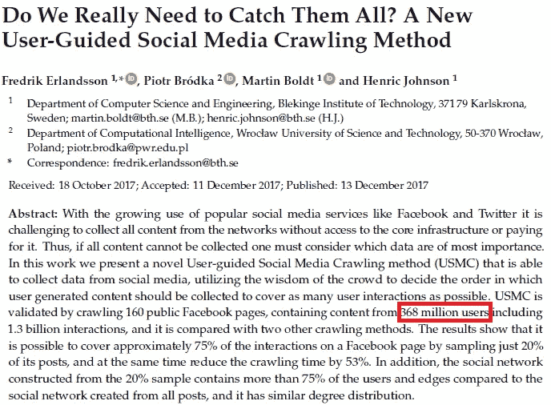
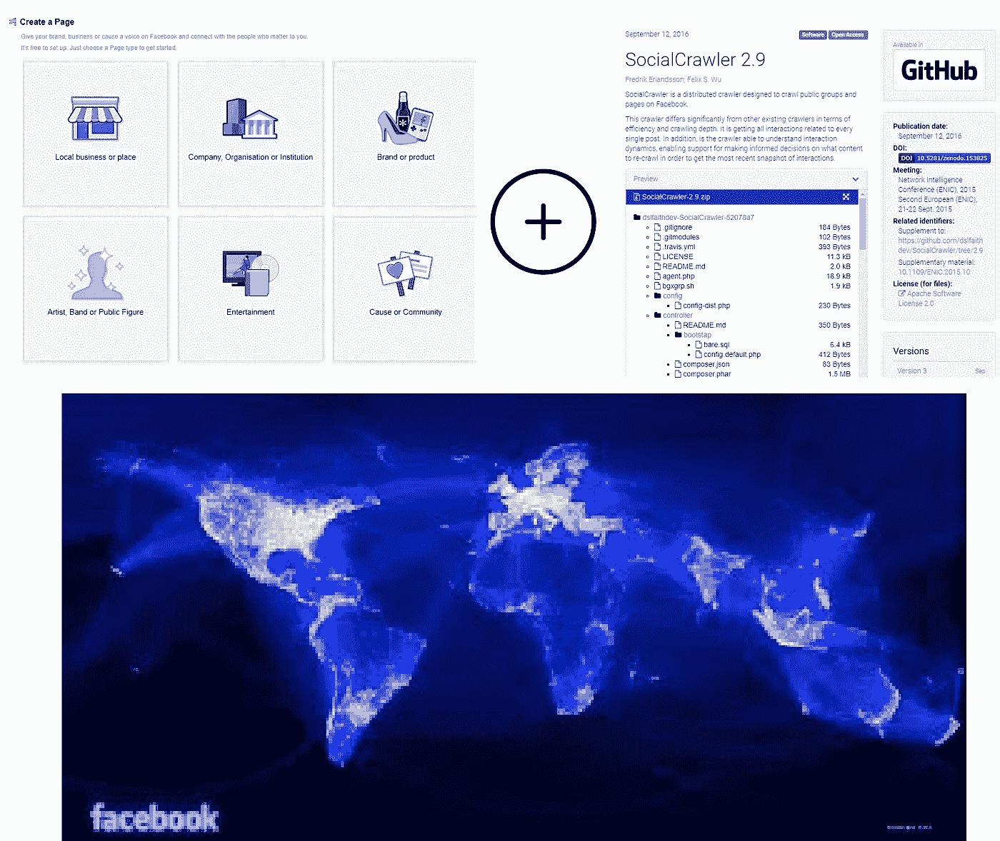
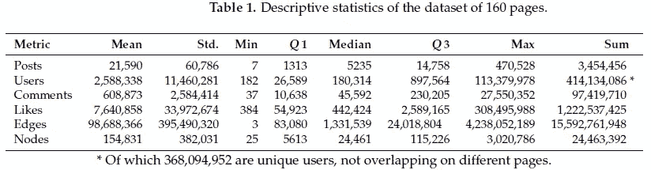
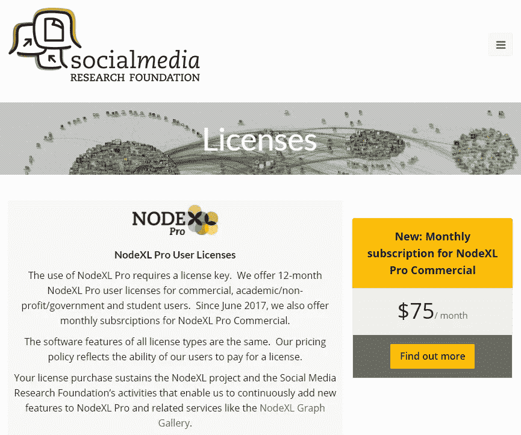
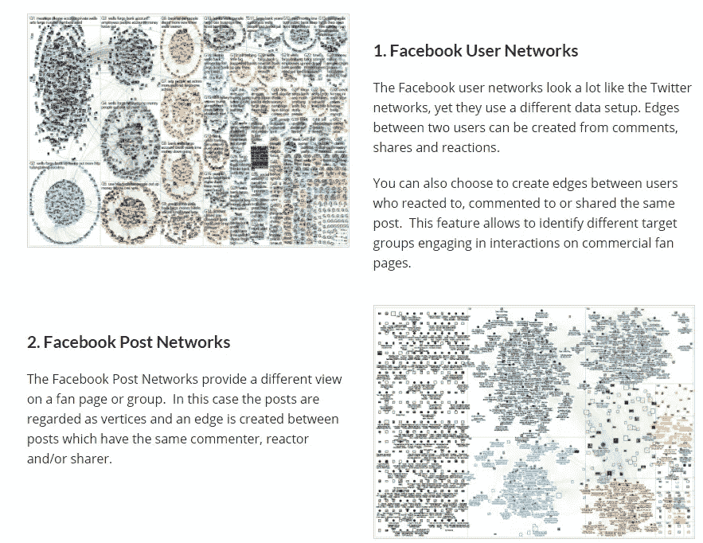
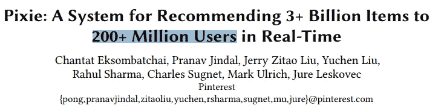
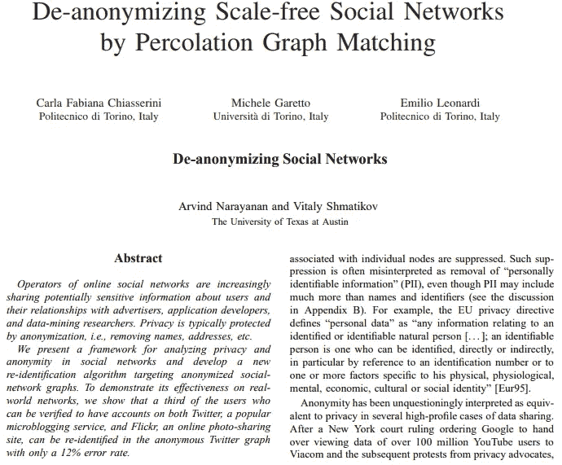
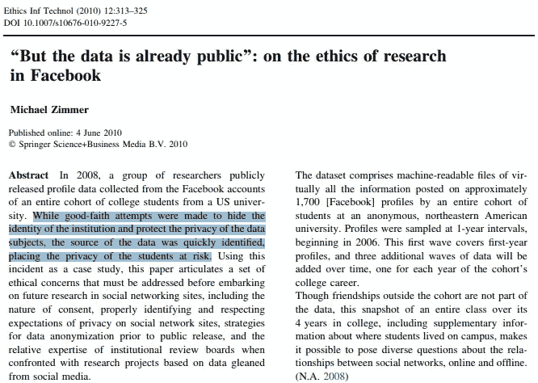
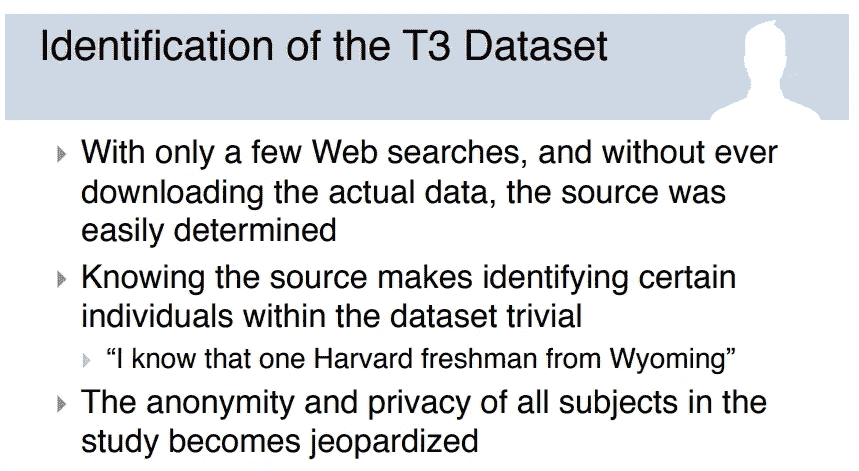

# 拥有 3.68 亿用户的“学术蜜罐”数据集。为什么没有人谈论这些！？

> 原文：<https://medium.com/hackernoon/eff-cambridge-analyticas-numbers-look-at-this-shit-855f378b4176>

随着这场剑桥分析的混乱被揭开，我的第一反应是*去他妈的！社交媒体[上的人们对数据掠夺的巨大规模失去了理智。即使是我的技术爱好者朋友也至少有一点印象深刻，那就是多达 3000 万到 5000 万**脸书**](https://hackernoon.com/tagged/social-media)[用户的数据以学术研究的名义被合法地*抽走，并被输送到充满不安的险恶统计管道中，委婉地说，是为了破坏政治恶作剧。*](https://hackernoon.com/tagged/facebook)*

*现在，剧情转折来了。对我来说，这是一个完全不同的时刻。作为一个博士论文是[网络科学](https://en.wikipedia.org/wiki/Network_science)领域的[字面上的](http://www.cmuportugal.org/tiercontent.aspx?id=5433)的人，我知道一个事实，5000 万是*微不足道的*。在我攻读博士学位期间，从事该领域大数据方面工作的学者在他们的出版物中例行收集和吹捧了更多的数据。*

*鉴于这一领域固有的浪漫性质，我仍然会在一些周日让自己跟上这一领域令人兴奋的发展。当我看到[第四频道的新闻曝光](https://www.youtube.com/watch?v=mpbeOCKZFfQ)时，我想起了今年早些时候读过的一篇令人印象深刻的论文(发表于 2017 年 12 月)。这篇论文吹嘘了一些数字，这些数字会让所有担心《剑桥分析》泄密事件的人陷入深深的沮丧。*

*你准备好了吗？你确定吗？*

*好吧，是这样的:*

# ***3.68 亿用户。***

*在一篇题为“T34”的论文中，我们真的需要把它们都抓起来吗？一种新的用户导向的社交媒体抓取方法，一个仅由来自两所普通学校(布莱金格理工学院和弗罗茨瓦夫科技大学)的 4 名研究人员组成的瑞典-波兰团队已经积累了一个拥有**3 . 68 亿独立用户**的数据集，他们在超过**13 亿次社交互动中进行互动**！*

**

*The abstract of the paper*

*但是一个四人小组是如何做到的呢？两个想法的结合:*

*a)智能“攻击点/种子点”:脸书页面。*

*b)一个漂亮的爬行引擎。*

**

*该团队已经建立了这个相当令人印象深刻的爬虫——自社交网络爬行引擎，他们用来收集公开可用的脸书数据。现在，你问哪 160 页？这些都可以在哈佛的*data verse 上公开获得。**

**他们描述性统计表上的数字绝对是高潮。看一看。**

****

**现在，如果一个读者/记者想要尝试一下呢？Sans 险恶用心，纯粹是为了求知欲？**

****

**不会编码？别担心。图形用户界面工具来拯救！如果你能抽出 [$75](https://nodexlgraphgallery.org/Pages/Registration.aspx) ，你可以使用[工具](https://www.smrfoundation.org/networks/facebook-analytics/)，就像上面那个，它将允许你基于一个相当有趣的后门**脸书粉丝页面**来间接锁定用户！**

**示例:**

****

**现在，请记住，这不是对上述优秀论文的作者或他们出色的工程研究的揭露或政治迫害。值得一提的是，作者确实生动地陈述了'**我们遵守脸书的数据隐私政策，将所有数据匿名化到只能回溯被分析的特定公共页面的程度，我**确实*相信他们的话。这项工作是由主流知名学者。***

**这里的要点是，如果您正在考虑图形探索甚至推荐引擎等领域的最新出版物，属于跨越数亿用户的用户集的数据是理所当然的。**

**证明？**

**这个:**

****

**那么，现在怎么办？脸书是否会逐一查看所有获得学术访问权限的学者名单，并让他们的一名数据工程师和一名律师确保数据是高度匿名的？**

**这是我有点不安的地方。在线社交网络本身就很难匿名。这不是毫无根据的恐惧。在我读博士期间，我知道一些研究人员正在积极研究去匿名化策略，并取得了大量成功。示例:**

****

**另外，信不信由你，我们以前也来过这里！在 CMU 的第一年，我读过迈克·齐默关于脸书臭名昭著的违反 2008 年的论文。**

****

**因为我们千禧一代在几个社交媒体平台上同时共存，并在其他地方发扬我们的社交忠诚，所以只需要一个或几个来自怀俄明州的哈佛新生(见下图)违规，我们将面临匿名的灾难性连锁反应。**

****

**所以，也许，唯一的解决办法就是从现有的每一个学术知识库中强制删除？**

**可能是这样。**