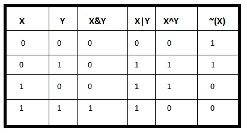

# 市场偏见的影响与互动系统的设计

> 原文：<https://medium.com/hackernoon/effect-on-bias-in-marketplaces-and-designing-interactive-systems-97128e4e6565>

## TLDR:如果你在建立一个市场，给人们提供选择。不要有偏见。如果你正在构建一个适合市场的系统，确保用户倾向于使用你的产品。

比特币是一个交易市场。人们广播交易，矿商收集交易，作为交换，他们收取费用。memopool 是一个比特币交易者和比特币交易记录者聚集的市场。

亚马逊也是如此，商品的买家和卖家聚集在一起。

偏见是我们今天观察到的大多数系统所固有的，然而偏见有时扮演着建设性的角色，有时扮演着破坏性的角色。

> 比特币在处理交易时没有偏见，这是它的优势所在。

在密码学中，我们对二进制对象的大多数运算都使用 XOR 函数。当我们查看真值表时，XOR 有 50–50%的机会假定数字可能是 0 或 1，而在大多数其他表中，我们观察到输出有 75%的机会是 0 或 1。

这是一种偏见。

对于给定的输入模式，大多数位函数都有偏差。在我看来，XOR 因其在密码学中的应用而广受欢迎，因为它没有偏见。

同样，我认为比特币之所以成功，是因为它在处理交易和矿工选择方面没有偏见。

早期，我们对集中化没有问题，事实上，集中化对于资源的明智流动是非常必要的。
我们在中央机构处理我们的交易时也没有问题。

这就产生了一个问题，即中央集权的机构表现出偏见。
他们对成人色情业、朱利安·阿桑奇和许多其他无辜的人有偏见。从这棵树上可以看出，他们是代表政府行事的，而政府当时是有偏见的。

随着偏见被引入一个没有其他选择来为我们的人民服务的系统，世界渴望一个喘息的机会。

如果一家银行不处理你的交易，你可以去另一家银行，但如果所有银行都有偏见，由于政府反对处理你的交易，你会怎么做？

只要不偏不倚，中央集权就不是问题。将偏见引入无法替代的大型中央集权实体是一个严重的问题。

[穆尼布·阿里的 Ted 演讲](https://www.youtube.com/watch?v=qtOIh93Hvuw)谈到没有一个实体应该拥有如此大的权力，以至于我们只能任由他们的善意摆布。

将偏见引入没有替代者的大型中央集权组织会让你走投无路。你将没有其他选择。

那不是我们想要生活的世界。我们想要选择。

在比特币领域，鉴于没人知道你是谁，矿商们不需要知道你是谁，甚至你自己也可以尝试处理你的交易，这为合理的选择开辟了道路。

即使大部分矿工拒绝或对你有偏见，这并不意味着你不能挖掘自己的交易，只要你遵守这个游戏的规则。

我们不再受易受偏见影响的中央集权机构的支配。

比特币只是一个例子。亚马逊是另一个。
如果一个人对你有偏见，你应该有其他选择。
如果一个卖家不愿意卖给你，你还有其他选择。
如果矿商对挖掘你的交易有偏见，你还有其他选择。

如果我们倾向于把这个结构看作一个游戏，它类似于一匹被胡萝卜牵着的马，除了它每隔一段时间都被喂以胡萝卜。

矿工或马是关键。
他们是这个系统如此运转的原因。
骑着马的人是广播交易的人，胡萝卜只是更多的比特币。

如果我们把这看做一个游戏，每个人都有机会成为那匹马并骑上那匹马，在这种情况下这是公平的。

在市场中，我认为诱导偏见是一个严重的错误。

在市场中，人们需要有选择，作为一个准备建立市场的人，在你的系统中引入偏见会阻止人们使用它。

作为一个市场，如果人们不使用你的系统，这不是一个很好的市场，也不是一件好事。

市场不应该有偏见。

然而，当一个人在构建一个适合市场的系统时，为了成功，必须引入偏见。

这种偏见的诱导是必要的，因为你的潜在客户一定会偏向于使用你的产品，而不是别人的。

将根植于人类心灵的积极偏见引入你的系统，将会确保你的商业前景。

你的系统结构需要让人们倾向于使用你的产品和服务，而不是其他可用的产品和服务。人们必须偏向你的系统，你的系统才能成功。

早期，我的想法倾向于激励一切，但我现在意识到激励只是在你的观众中造成这种偏见的一部分。

对于所有区块链的初创公司来说，他们致力于打造革命性的产品和服务，赋予人们改变世界的自由，你的系统是积极偏向还是消极偏向？

我听到的一个常见的负面偏见是缺乏采用的直觉(UI/UX)。那些打算用区块链认证的版本替换现有版本的人，你已经把现有的系统当成了竞争对手。
尽管你给人们提供了分散的自由，但这真的会让他们产生使用你产品的偏见吗？

干杯！

普拉哈拉德·贝拉瓦迪