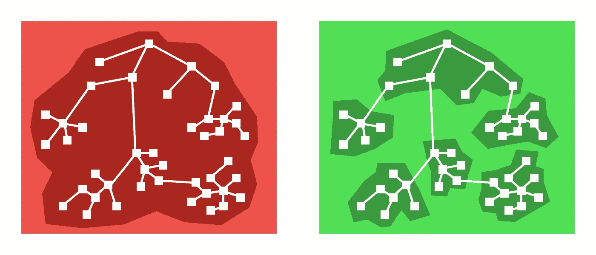
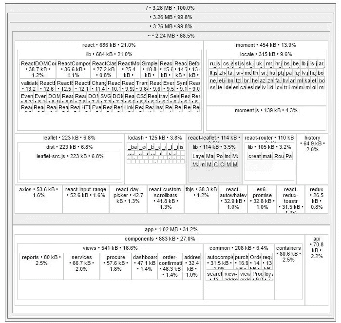

# React 中的有效代码分割:实用指南

> 原文：<https://medium.com/hackernoon/effective-code-splitting-in-react-a-practical-guide-2195359d5d49>

大的包大小和缓慢的启动是单页面应用程序(spa)面临的一个常见问题，因为它们通常在开始渲染单个像素之前下载应用程序每个页面所需的所有 JavaScript。

解决这个问题的一个简单方法是使用代码分割，即将应用程序的 JavaScript 分解成称为*块*的小型模块化包，当访问特定功能时，可以按需加载这些包。目标是将单个块保持在 100-150 KB 以下，以便应用程序在 4-5 秒内变得可交互，即使在糟糕的网络上也是如此。



Source: [https://github.com/jamiebuilds/react-loadable](https://github.com/jamiebuilds/react-loadable)

# 基于组件的代码拆分

开源库`[react-loadable](https://github.com/jamiebuilds/react-loadable)`为代码分割提供了一个 React 友好的 API，让你只需要几行代码就可以添加断点。如果您使用的是`[create-react-app](https://github.com/facebook/create-react-app)`， [Webpack](https://gist.github.com/aakashns/2bb0437b0770faa038798e1280872672) 会自动拆分包并在需要时加载块。

它是这样工作的:假设我们想要在用户点击特定的或者导航到特定的路线时，按需加载和呈现组件`SettingsPage`。我们需要做的就是使用`react-loadable`如下包装它:

现在我们可以像普通的 React 组件一样使用`AsyncSettingsPage`。模块`SettingsPage.js`及其依赖项不再是主 JavaScript 包的一部分，并且在第一次呈现`AsyncSettingsPage`时异步加载。

当程序块被加载时，组件`Loading`被呈现在它的位置上。下面是`Loading`的一个示例实现:

如果块加载失败，prop `error`被设置为非空值。

# 将多个组件放在一起

在某些情况下，简单的基于组件的拆分可能还不够。例如，您可能有一组几乎总是在几个不同的特性中一起使用的组件。在这种情况下，拥有一个包含所有相关组件的块是有意义的。

下面是我们通常如何导出一组相关组件:

假设上述代码在文件`item-list/index.js`中，我们可以用以下内容创建另一个文件`item-list/async.js`:

这里的关键变化是在动态`import`中:我们不是导入单个组件，而是导入所有的`index.js`，并在承诺回调中提取所需的组件。

# 区块命名和优化

当我们在实现代码拆分后构建生产应用程序时，我们会得到许多类似如下的 Javascript 代码块:

```
File sizes after gzip: 396.71 KB              build/static/js/main.3a8842c0.js
  178.51 KB              build/static/css/main.e32b4522.css
  68.31 KB               build/static/js/6.af93367f.chunk.js
  44.34 KB               build/static/js/2.6a7f1417.chunk.js
  23.61 KB               build/static/js/1.bdfdcd83.chunk.js
  22.24 KB               build/static/js/3.d9e4ee99.chunk.js
  19.29 KB               build/static/js/4.a66b3cdb.chunk.js
  17.1 KB                build/static/js/5.f1ce26f7.chunk.js
  7.63 KB                build/static/js/8.2e807534.chunk.js
  6.71 KB                build/static/js/9.409015da.chunk.js
  5.09 KB                build/static/js/7.1b95d8e8.chunk.js
  1.71 KB                build/static/js/0.6bea2af7.chunk.js
  1 KB                   build/static/js/10.ce9f2434.chunk.js
```

在查看了这个输出之后，我们可能想要删除最后几个块，因为它们真的很小。但是我们不知道哪一次分裂导致了哪一部分被创造出来。这就是块命名有用的地方。

我们可以在`import`中使用一个*魔法注释*,告诉 Webpack 使用特定块的给定名称:

一旦命名了所有的块，我们就可以识别导致更小块的分割:

```
File sizes after gzip: 312.09 KB  build/static/js/main.491eaaf4.js
  181 KB      build/static/css/main.ac06cedb.css
  68.88 KB   build/static/js/settings.1525d075.chunk.js
  45.08 KB   build/static/js/alerts.0f5ad4d6.chunk.js
  23.62 KB   build/static/js/profile.199c7f90.chunk.js
  22.24 KB   build/static/js/history.07ccea31.chunk.js
  19.3 KB    build/static/js/actions.903378a5.chunk.js
  8.87 KB    build/static/js/events.f540de3a.chunk.js
  7.62 KB    build/static/js/colors.89aa1e6f.chunk.js
  6.7 KB     build/static/js/posts.929f04fc.chunk.js
  5.1 KB     build/static/js/post-details.6c133f77.chunk.js
  1.71 KB    build/static/js/friend-list.be516e45.chunk.js
  1.01 KB    build/static/js/edit-avatar.33a4ff21.chunk.js
```

此时，我们可以选择删除或合并一些较小的块(< 20–30 KB in size), since the overhead of loading a 5 KB chunk might be higher than combining it with one of the larger chunks. Play around with different splits and see what works best for you.

# Analyzing the Bundle Size

[源地图浏览器](https://www.npmjs.com/package/source-map-explorer)使用源地图分析 JavaScript 包。这有助于您理解代码膨胀的来源。要将源地图浏览器添加到 Create React App 项目，请运行以下命令:

```
npm install --save source-map-explorer
```

然后在`package.json`中，将下面一行添加到`scripts`:

```
"scripts": {
    **"analyze": "source-map-explorer build/static/js/main.*",**
```

然后要分析包，运行生产构建，然后运行分析脚本。

```
npm run build
npm run analyze
```



[Source map explorer](https://www.npmjs.com/package/source-map-explorer)

寻找对包大小影响最大的部分，作为代码分割的可能候选。还要考虑从`node_modules`中移除或删除大的依赖项。

# 摘要

以下是在 React 应用程序中实现有效代码拆分的步骤:

1.  使用`react-loadable`实现基于组件的代码拆分，按需加载应用不同部分的 Javascript 包。
2.  使用`import("./index").then`技巧将经常使用的多个组件组合成一个文件。
3.  使用神奇的注释`/* webpackChunkName: xxx */`命名您的块，并优化包的大小，使它们既不太小也不太大。
4.  使用`source-map-explorer`识别可能的代码分割候选。

为了使本文简短，我跳过了许多细节，将重点放在代码拆分的实际方面。以下是一些了解该主题更多信息的好地方:

*   动态`import`:[https://developers . Google . com/web/updates/2017/11/dynamic-import](https://developers.google.com/web/updates/2017/11/dynamic-import)
*   反应官方文件:【https://reactjs.org/docs/code-splitting.html 
*   `react-loadable`:[https://github.com/jamiebuilds/react-loadable](https://github.com/jamiebuilds/react-loadable)
*   Webpack 中的块命名:[https://github . com/web pack/web pack/tree/master/examples/code-splitting-specify-chunk-name](https://github.com/webpack/webpack/tree/master/examples/code-splitting-specify-chunk-name)