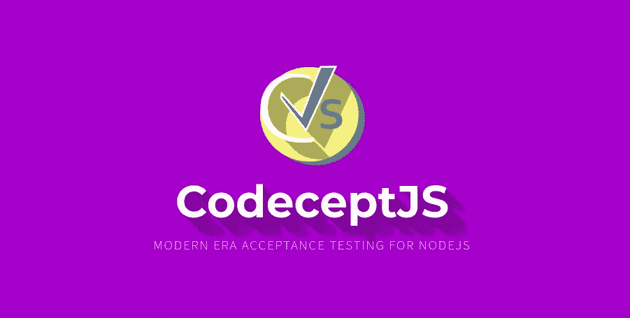
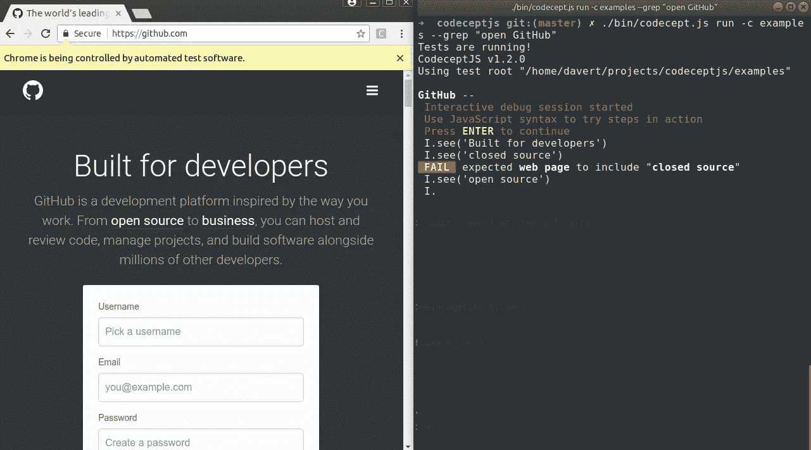
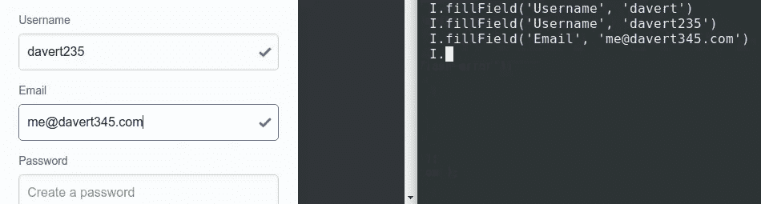
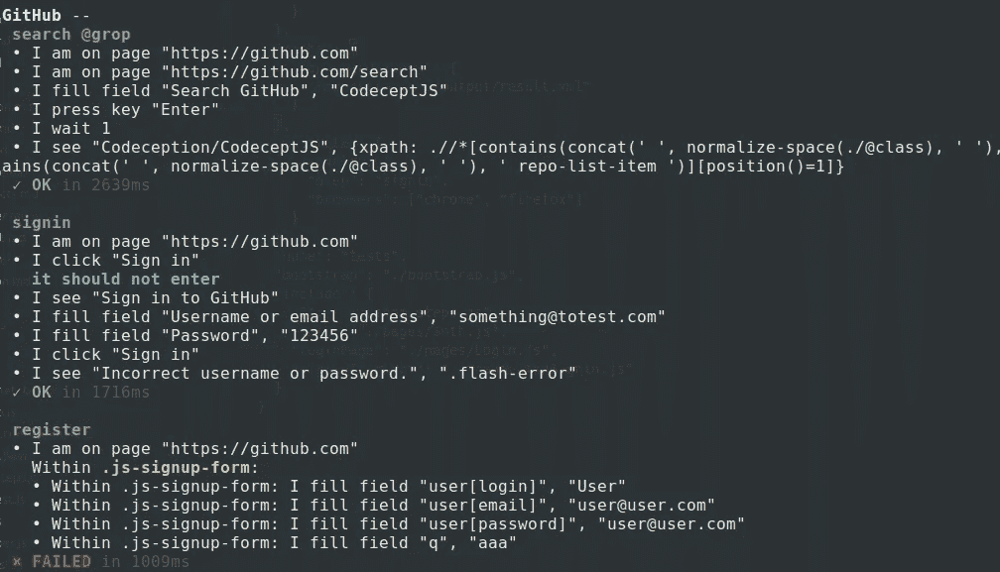

# 使用 CodeceptJS 在 JavaScript 中进行有效的 2 端测试

> 原文：<https://medium.com/hackernoon/effective-end-2-end-testing-in-javascript-with-codeceptjs-37c8d7d6a928>

现代 [JavaScript](https://hackernoon.com/tagged/javascript) 中有多种工具专注于端到端测试。然而，当你需要选择一种工具时，你可以花一周的时间来评估不同工具的利弊。你应该考虑它们的特性、语法、可维护性，最后，你仍然怀疑你是否做了正确的选择。选择一个库会使您的测试绑定到它的实现，因为 JS 中所有的 end 2 end 测试工具都有自己的语法。

比方说，你想用 Selenium 运行测试，然后你发现它们运行得太慢，你刚刚了解到 Google Chrome 有一个新工具 Puppeteer，它允许更快地进行测试。如果您决定迁移您的测试，您将需要重写它们。多痛苦啊！

这让我们想到了 CodeceptJS 的第一个关键思想。**你的测试不应该绑定到你的执行引擎上。无论你选择硒或木偶戏你的测试应该看起来几乎一样。**但是等一下……什么是[代码概念](https://codecept.io)？

# CodeceptJS 简介

你猜对了！CodeceptJS 是一个测试框架。但与其他 JavaScript 测试工具不同，它使用最流行的 JS 库来驱动您的浏览器，并在其上添加高级 API。这就是为什么为 webdriverio 编写的测试可以在量角器或木偶师中执行。

如果你感觉到一个引擎的局限性，你可以很容易地切换到另一个。而第二个关键思想，高级 API 呢？

让我们展示代码:

如您所见，**测试非常容易阅读。甚至非技术人员也能看懂**。

例如，当你需要填写一个字段时，你可以指定该字段的名称、占位符或标签，CodeceptJS 会帮你找到。不需要脆弱而冗长的 CSS 或 XPath 定位器，如果你的 HTML 设计正确，你可以通过语义值匹配元素:

如果您是经验丰富的 JavaScript 开发人员，您会注意到这段代码中的一些不寻常之处。测试场景中没有连锁调用。所有的动作都是一个一个写成一个线性的场景。

真的，没有承诺，没有等待？它是如何工作的？

# 不-等待？

问题不在于让事情工作，问题在于编写干净的可维护的测试。JavaScript 是一种非常富于表现力的语言，然而，用几十个`then`或`await`调用来维护代码库并不是一项简单的任务。或者大脑专注于处理承诺，而不是测试场景本身。这就是 CodeceptJS 帮助我们减少视觉噪音的原因。由于测试在大多数情况下是线性的，我们不需要知道承诺，现代的[软件](https://hackernoon.com/tagged/software)足够智能，可以自己处理所有的承诺。

**所以承诺由 CodeceptJS 处理，为你提供同步风格体验**。然而，当您需要中断承诺链并从浏览器上下文中获取一些值时，您仍然可以使用`async/await`:

这是 CodeceptJS 测试中需要异步函数的唯一原因。你应该在乎承诺的唯一事实是。

# 编写测试

首先，我们需要[安装 CodeceptJS](https://codecept.io/quickstart/) 。要开始测试，我们需要选择引擎(WebDriverIO，量角器，木偶师，噩梦),并指定所有测试的基本 URL。让我们在这里测试一下每个开发者都非常熟悉的东西:[https://github.com](https://github.com)。

对“github.com”的第一次测试可以从两行开始:

`I.amOnPage(‘/’);` —在基础 url 打开网站(``[https://github.com`+`/`](https://github.com`+`/`)` )
`pause()` —中断执行并切换到交互式 shell 模式

# 交互式外壳

在这种模式下，您可以并行使用浏览器，并通过简单的命令对其进行控制。键入“click”并选择一个元素，以查看是否可以通过这种方式定位元素，并且可以实际单击该元素。如果命令通过—将其添加到您的测试中。如果没有，请使用不同的定位器重试。

Interactive shell in action

因此，在交互式 Shell 模式下工作时，您可以写下一个完整的测试。

同样在调试期间，您可以在每一行中放一个`pause()`并切换到交互式 shell。这个特性甚至在无头模式下也能工作。使用交互式 shell 比用断点调试应用程序更强大。

# 场景驱动测试

测试被设计成由一个角色，即与系统交互的用户讲述的场景。当使用“codecept run — steps”命令执行此类测试时，您将看到实际的分步输出，以及某个步骤失败时的失败

Step-by-step output when running tests

在报告中，您将始终看到哪个步骤失败了，作为对每个失败测试的奖励，最后一页的屏幕截图将被获取，以便您可以轻松地查看哪里出错并修复它。

# 更多测试！

如您所见，CodeceptJS 非常容易上手。此外，CodeceptJS 是一个成熟的框架，您可以继续使用它。它提供了对页面对象的原生支持，它拥有为您的测试管理数据的工具，支持在多种浏览器中进行测试(多会话测试)，并且由于高级 API，您甚至可以用其他语言编写测试！

不，那应该是 JavaScript。但是你可以用除了英语之外的其他语言编写测试！

来点葡萄牙语测试怎么样？

也支持其他翻译。

CodeceptJS 还可以用 Appium 执行移动测试，并行运行测试，还有……嗯，这远远超出了入门帖子。所以你应该自己去发现。

如果你从来不喜欢端到端测试——试试[**CodeceptJS**](http://codecept.io)**这让测试变得有趣而有效。**