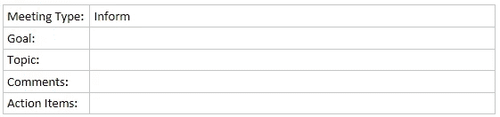
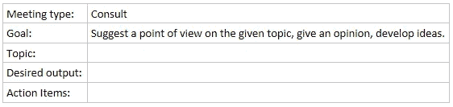
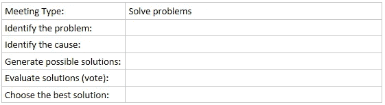
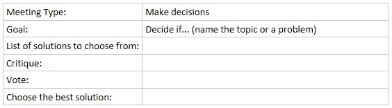

# 有效的会议。神话还是现实？

> 原文：<https://medium.com/hackernoon/effective-meetings-a-myth-or-a-reality-3a39035a52f4>

如果你想在工程师的脸上看到真诚的微笑——只要告诉他不必参加他日程安排中的下一个会议。真正的快乐。

随着我的日历开始堆积越来越多的[会议](https://hackernoon.com/tagged/meetings)，我已经记不清了，我注意到大多数会议结束时都没有结论或行动项目。这让我觉得我在浪费时间。情况变得更糟。因为会议没有结论就结束了，所以不得不安排一个新的会议。如此循环往复。

我想改善我们的会议文化，所以我花了一些时间[思考](https://hackernoon.com/tagged/thinking)这些会议的目的和期望的结果。每个会议都是有目的的。目的可以是发展想法、计划、解决问题、做出决策、创造和发展共识、鼓励热情和主动性、提供方向感等。这些会议可以分为四类:

*   通知
*   咨询
*   解决问题
*   做决定

# 通知

> 目标:给出/接收关于与会者的具体想法或重要事项的信息。

这种类型的会议应该在你需要与团队分享一些信息时举行，以便就某个主题达成共识。这类会议的议程应解决以下问题:

Meeting type: Inform — Agenda template

# 咨询

> 目标:产生关于特定主题的新想法。汇集和发展想法。

这种类型的会议有助于组织者从团队中获得一些新的想法、观点和反馈。这是一个经典的头脑风暴会议，但结果是，它必须产生某种输出——模型、草图、文档等等。这类会议的议程应解决以下问题:

Meeting type: Consult — Agenda template

# 解决问题

> 目标:讨论问题或冲突并决定如何解决。

当有特定的问题需要解决时，就会召开这种会议。这种类型的会议必须产生至少一个解决方案。这不同于头脑风暴会议，因为它需要一个具体的紧迫问题的解决方案。一个好的会议准备应该是一个好的描述问题，这样每个人都可以关注它。这类会议的议程应解决以下问题:

Meeting type: Solve problems — Agenda template

# 做决定

> 目标:决定哪种解决方案是最好的。决定方向或策略。

如果您有任何疑问，这种会议类型应该可以解决这些疑问。如果你有几个解决方案，你需要为其中一个投票，在邀请函中清楚地列出选项，这样与会者可以提前准备和考虑每个解决方案。这类会议的议程应解决以下问题:

Meeting type: Make decision — Agenda template

# 会议邀请

一段时间以来，我一直坚持每个会议邀请都要包含议程和会议类型。这样，如果需要相关人员提供一些信息，他们可以为会议做准备。因此，无论是谁安排会议，在发送邀请之前都必须考虑这些问题:

1.  目的是甚麽？(通知、咨询、解决问题、做出决定)
2.  开会合适吗？(见面还是不见面？我们可以用电子邮件来解决吗？)
3.  会议应该如何计划？(提供会议结构和准备材料。这将用于判断会议是否成功。)
4.  邀请函应明确说明:*目标*、*议程*和*期望产出*
5.  谁将参加会议？(决定者、PO、PM、UX 等。)

我们花了一些时间才开始把它应用到日常事务中，但是当我们这样做的时候，我们会议的成果显著提高了。至少后续会议更少了，这导致日程表不那么杂乱，这又导致有更多的时间做实际工作。

希望这能帮你打破无限开会的怪圈。