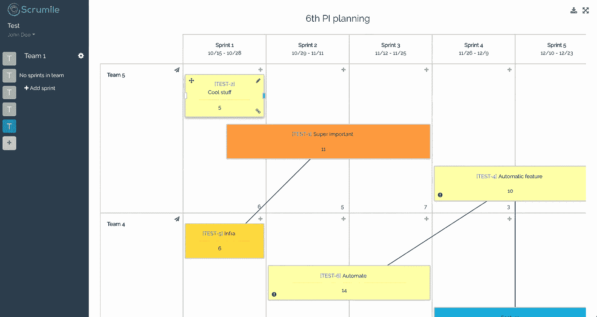
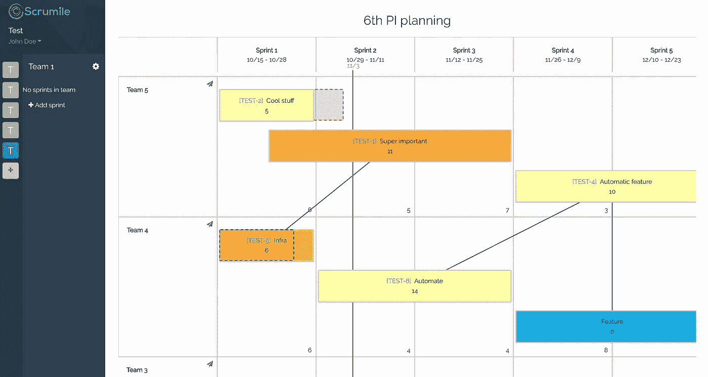

# 有效的在线敏捷路线图规划

> 原文：<https://medium.com/hackernoon/effective-online-agile-roadmap-planning-ae250fc8be1d>

我与来自多个地点的团队一起工作，创建我们的季度路线图已经拖了好几年。我们使用了 Google Sheets，它对于创建表格非常有用，但是对于有效地计划和可视化我们的路线图却非常糟糕。

在第三季度，我有机会参加了对 Scrumile 的新高级 PI 规划器的测试版测试。因为我们已经在使用 [Scrumile](https://www.scrumile.com) 进行站立、反身、故事提炼和团队 NPS 追踪，所以我们尝试了一下。

# **策划**

我们所有团队的计划都非常顺利。这是我们在这一季度遵循的流程:

*   我们有几个任务可供各队选择，所以我们给了所有队 2 个小时的时间，让他们自己找出最有效的方法来完成任务。让我惊讶的是，为了能更快地完成任务，团队甚至交换了成员。
*   在所有的团队都有了任务之后，每个团队坐下来，花一天的时间更好地理解任务。我们做了用户故事到史诗的映射，得出了史诗。
*   第二天，每个团队都开始用用户故事到故事的映射将史诗分解成故事。
*   随着我们的发布系列在每个 sprint 之后投入生产，所有的团队都确保组织好史诗和 sprint，这样他们就能在每 2 周交付一些有意义的东西。
*   在这两天中，团队与其他团队一起工作，确定他们之间潜在的依赖关系。

Scrumile 的 PI planner 通过在线实时编辑路线图，极大地支持了我们的规划工作。我们添加了史诗，大小和描述以及它们之间的依赖关系。

Image from https://www.scrumile.com

# 跟踪季度

众所周知，一个计划听起来总是很好，但接下来现实就来了。令人欣慰的是，Scrumile 的 PI planner 与 JIRA 有很好的集成，我们可以根据我们的计划跟踪我们的进展。

它显示了我们是提前完成了一部史诗还是推迟了一部。

Image from [https://www.scrumile.com](https://www.scrumile.com)

有了这种视觉辅助，我们能够比过去更快地做出艰难的决定。

我们非常喜欢 scrum mile 的高级 PI 规划器，我们肯定会在接下来的季度中使用它。

《腓力比书》T