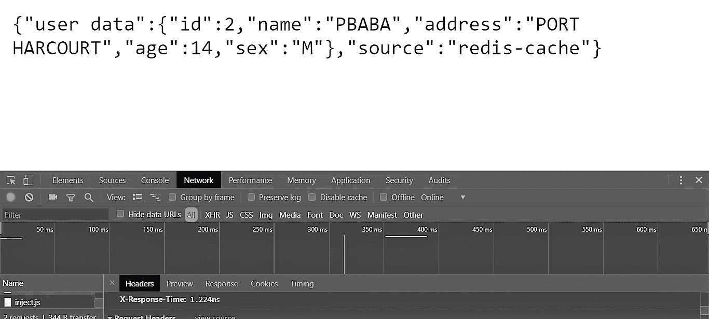

# Redis 对 API 服务器的影响

> 原文：<https://medium.com/hackernoon/effects-of-redis-on-an-api-server-1e228a624f15>


Photo by thomas kvistholt on [Unsplash](https://unsplash.com/search/photos/robots?utm_source=unsplash&utm_medium=referral&utm_content=creditCopyText)

你好！我们将研究 redis 对我们的 API 服务器性能的影响。 [Redis](https://redis.io/) (远程字典服务器)可以作为数据库，缓存和其他几个东西。对于这个项目，我们将使用 Redis 进行缓存。

# **我们为什么需要缓存？**

*   它帮助我们减少了服务器必须处理的大量 API 请求和响应所带来的开销。
*   由于减少了等待时间，用户请求或服务器响应将得到更快的响应。

Redis 基本上会帮助我们缓存数据，然后在发出特定请求时提供数据。

例如，如果我们使用一个允许用户注册并在网站上购物的服务器，我们知道“购物数据”(向购物车中添加商品、向钱包中添加钱、从购物车中移除商品、使用不同的网关支付订单等。)与注册时使用信息形成的用户简档相比更加动态。“注册数据”(用户名、用户地址、用户邮件等。)不太可能改变，并且这种类型的数据可以存储在高速缓存中，然后周期性地更新或刷新高速缓存。这将有助于提高时间效率。如果服务器试图通过查询数据库或 API 来访问网络(互联网),则比访问 L1 缓存或 RAM 更消耗 CPU 资源。这意味着访问缓存比持续查询数据库更有效。

# 创建服务器

用于实现该服务器的堆栈将是:

*   节点 JS + Express
*   [PostgreSQL](https://www.postgresql.org/) (数据库)
*   Redis(缓存)

首先，我们下载 [PostgreSQL](https://www.postgresql.org/) 安装程序，它带有 psql(SQL shell)和 pgAdmin(确保在安装过程中注意‘用户’、‘密码’和‘端口’)。澄清一下，我在这个项目中使用的是 windows 操作系统。


A snippet of the pgAdmin home page.

我们可以为自己创建一个数据库，只需打开在浏览器中运行的 pgAdmin 应用程序，然后单击“Servers/postgreSQL/Databases ”,右键单击“Databases ”,然后单击“create”即可创建一个新的数据库。对于这个项目，名称是“用户”。

然后，我们可以通过单击“用户/模式/表”来创建一个表，然后右键单击“创建”来创建一个新表。该表的名称是“数据”。

我们现在可以使用 express generator 创建我们的文件夹。

```
express myapi
```

The files and folders needed in the ‘myapi’ folder.

“myapi”文件夹中应该有所有这些文件，让我们做好，以确保我们的路线工作正常。

# 索引. js

The index.js file

这个文件只是为我们的基本 CRUD 应用程序创建了路由，并包含了 crudController，它具有处理所有路由的功能。

# crud-controller . js

首先，我们需要安装一些软件包。

```
npm install --save redis response-time pg-promise
```

crud-controllers.js

这个文件只是创建 redis 客户机，然后设置连接到 postgreSQL 数据库的“初始化选项”。

要连接到数据库，我们需要获取数据库的 URL，通常采用以下形式:

```
postgresql://[user[:password]@][netloc][:port][/dbname]
```

默认情况下:

*   用户: **postgres**
*   netloc : **本地主机**
*   港口: **5432**
*   数据库名:我们数据库的名称是**用户**
*   然后，您可以输入安装时设置的密码。

A continuation of the crud-controller.js file

我们安装了“pg-promise ”,它帮助我们使用 promises 来处理 postgreSQL，而“initializationOptions”帮助我们检查错误。

然后，我们使用“connectionString”连接到我们的数据库。如果一切都做得正确，我们应该看到“成功！！!"当我们启动服务器的时候。

最后，我们将在由“crudController.getSingle”控制的“/get/:id”路径上使用 redis 客户端。我们可以在 index.js 文件中看到这条路线。

The crudeController.getSingle function

首先，在 getSingle 函数中，我们获取用户的 id。由于 redis 基于键和值工作，我们**设置**键并获取**值**。

因此，我们检查是否可以从用户 ID 中获得任何值，如果有结果，我们发送一个响应，说明数据是从 redis-cache 中获得的。如果没有结果，我们查询数据库，然后当得到结果时，我们现在将它存储在缓存中。

这肯定会在每个新请求期间发生，然后在第一个请求之后，数据将被保存。我们使用了 **setex** 以便我们可以设置**键**即用户 ID，以及到期时间 **60** 秒。因此 **setex** 是 SET 和 EXPIRY 的组合，最后我们添加数据作为**值。**所以 60 秒是这个键-值对的 TTL(生存时间)。

现在，我们可以检查 API 服务器查询 db 所用的时间，然后检查从缓存中获取数据所用的时间。

我们需要将响应时间包添加到 app.js 文件中

```
//At the top
varresponseTime= *require*('response-time');
.
.
.
//Above the routes
app*.*use(responseTime());
```

响应时间包在我们的头中添加了一个“X-Response-Time”键，并向我们显示花费的时间。

现在，我们可以将数据添加到我们的“数据”表中，这样我们就可以使用数据了。


A snippet of the DB.

因此，让我们使用 **npm start** 启动我们的服务器，然后转到我们的浏览器，键入 URL**“localhost:3000/get/2”**，因为我们有 id 为 1、2 和 3 的项目。

然后我们可以打开 chrome 开发者工具，进入网络，点击 id。


Response from DB

因为这是第一个请求，所以它不在缓存中，然后直接查询数据库。在屏幕底部，我们可以看到 X 响应时间为**124.092 毫秒。**



Response from cache

从响应中，我们可以看到源是 redis-cache，X-Response-Time 是**1.224 毫秒。**

因此，我们可以看到缓存更加有效，特别是当我们有更多的用户并且数据库不再本地托管时。

非常感谢您的阅读！