# 效率是关键。介绍我的新公司[演示]

> 原文：<https://medium.com/hackernoon/efficiency-is-key-introducing-my-new-company-presentation-6240e1e2c88e>

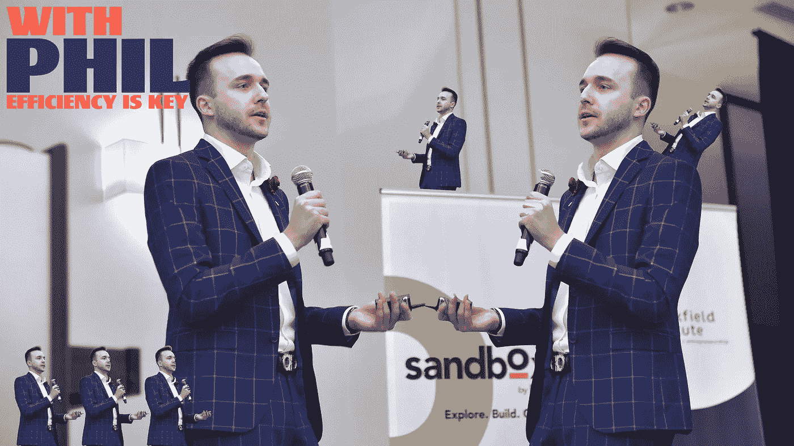

I love myself so much, there’s 7 of me

进入某个背景故事，我很抱歉消失了一小会儿，我一直在做一些非同寻常的事情，这将破坏活动和营销行业的培训工具。我的公司叫做 Onboarding Company，我在一次比赛中向数百人展示了这个想法。如果您错过了演示，我很乐意为您展示我为大家准备的东西，以及可爱的幻灯片！享受

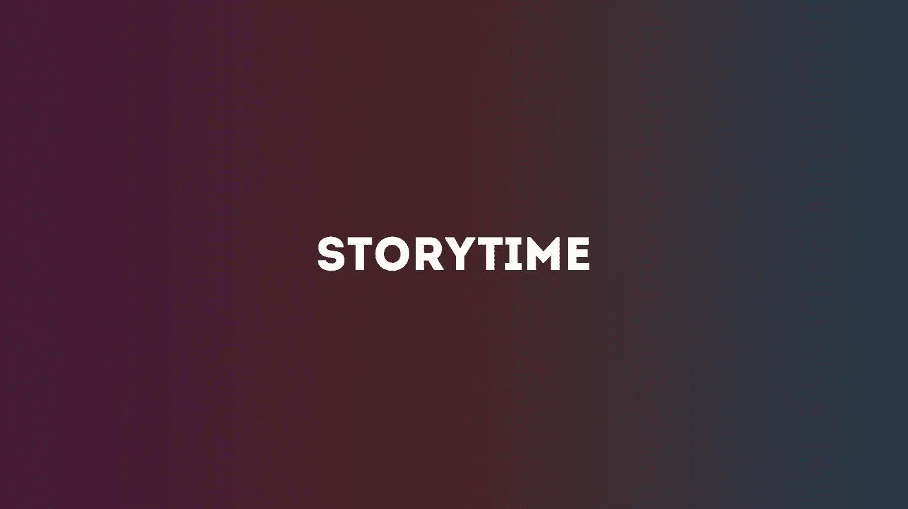

我给你讲个故事吧。2 年前的夏天，我被一群大学生创办的清洁服务公司聘为品牌大使。这个想法就像任何一个孩子的暑期工作一样:修剪邻居的草坪，清洗他们的窗户来赚钱。这听起来很有趣，我和其他 9 位大使一起销售这项服务，因为我们得到了佣金。只有一个问题，就是这个。

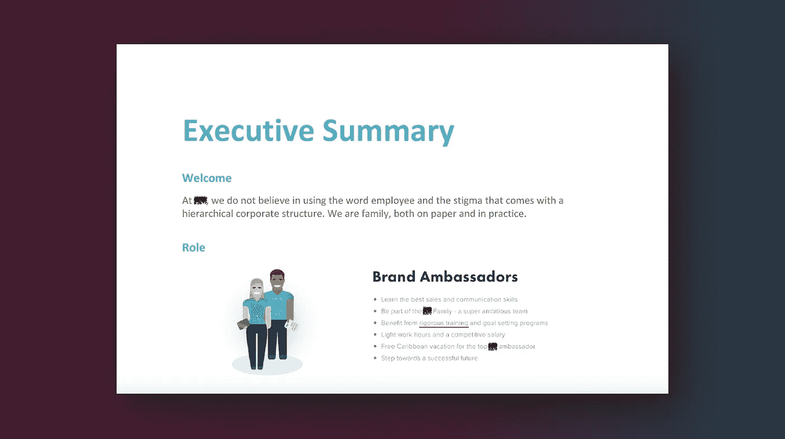

这是我们都收到的 PDF 手册的一部分，你可以从第三行看到，美国大使将从严格的培训和目标设定项目中受益。只有一个问题，这是我们得到的所有训练。之后，我们收到了一件印有他们标志的 t 恤，在我们出售他们的服务时穿着，希望我们会成为有史以来最好的员工。因为那次“训练”，我在一个半星期后辞职了，回到我原来的工作岗位过暑假。也不是因为我放弃了什么的，我们这些实习生没有受过适当的训练。现在我们在这里，差不多 2 个夏天后，我终于找到了解决这个问题的方法。提示，我和入职公司。

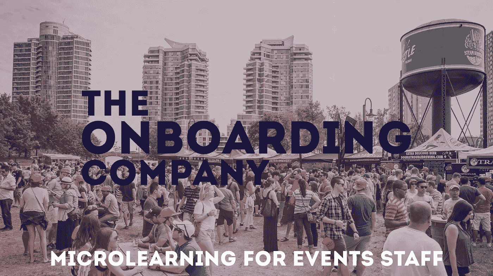

这是我的创业，它是活动员工的一个微型学习平台，让品牌大使受益。

我们所做的是为营销和活动机构自动化培训。我为什么要这么做？

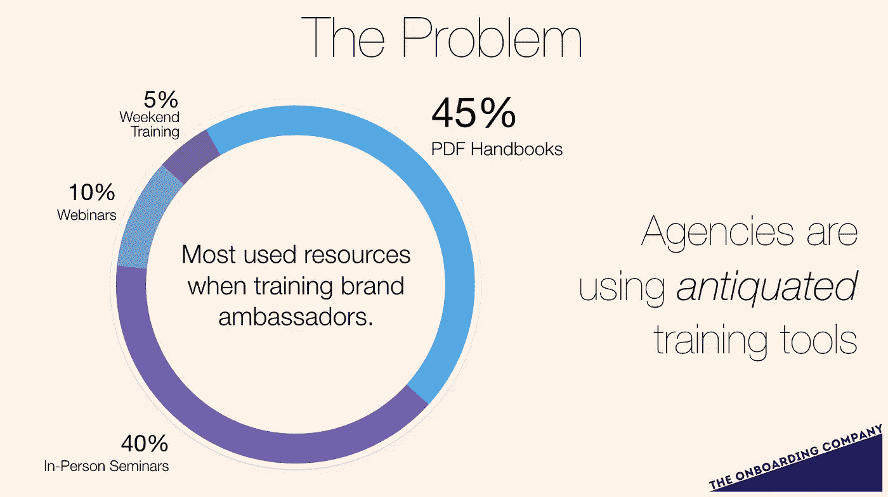

问题是:在所有的周末培训、网络研讨会和现场研讨会中，代理机构和公司使用的培训工具中，使用最多的资源是 PDF 手册，就像我在夏天必须阅读的一样。代理机构正在使用过时的培训工具，这一切的结果是什么？

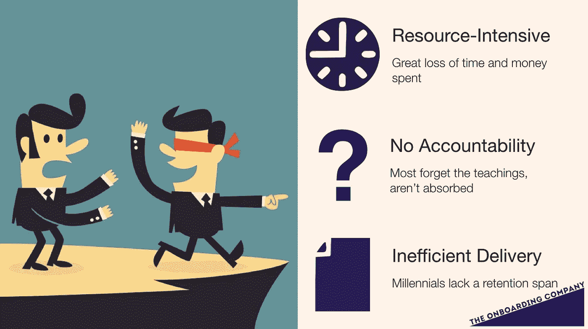

缺乏自动化，所以在资源上浪费了大量的时间和金钱。几乎没有责任，所以大多数人忘记了他们读到或听到的教导，信息没有被正确吸收。最后，由于美国千禧一代缺乏适当的保留时间，内容传递效率低下。可以这样想:PDF 是在 1993 年发布的，而面对面的研讨会从一开始就存在了。我不知道你怎么想，但我认为应该有所改变。这就是为什么，入职公司推出了 OBC 应用程序。

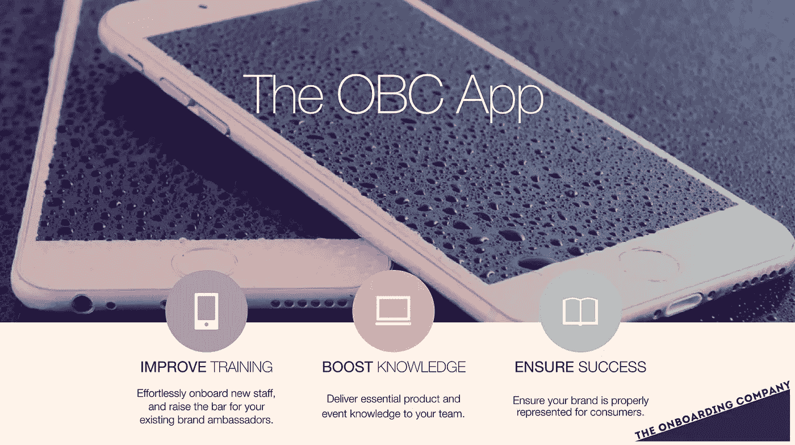

这就是应用程序的功能。它改善培训，增加知识，并确保员工的成功。

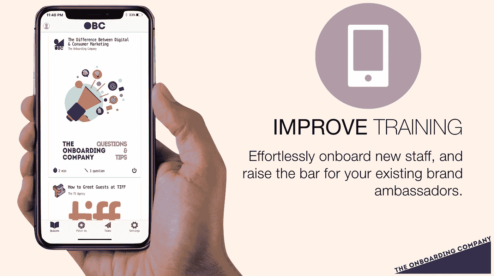

从截图中可以看到，在某个团队下注册该应用程序的工作人员将被介绍到一个模块提要，他们可以在那里选择某个测验。

一旦他们进入测验，他们将被引导观看一个关于品牌、产品或服务的视频。看完视频后，他们必须回答视频上的几个问题，确保用户真正理解和领会了他们需要知道的内容。

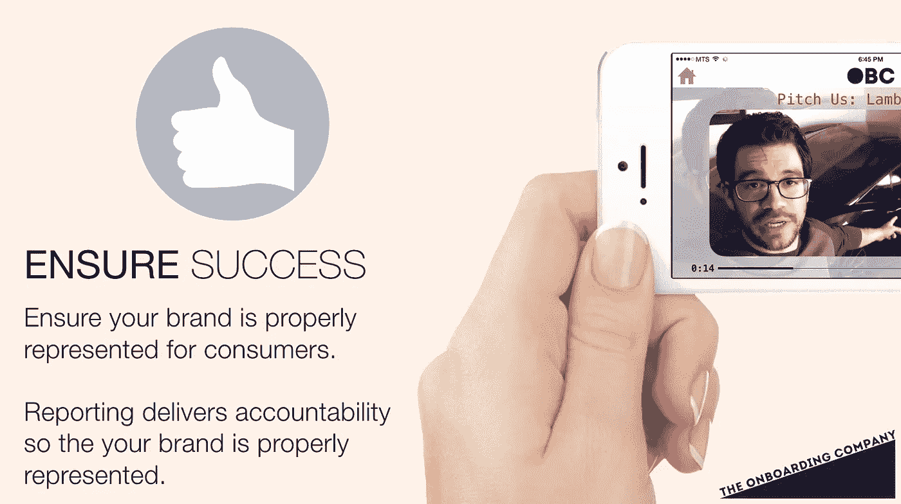

另一个可用的功能是，如果经理或团队领导不能 100%确定他们的员工是否知道品牌产品或服务是什么，用户可以向他们推荐一个视频，这样团队中的每个人都可以确保成功，这样你的品牌就可以得到正确的展示。

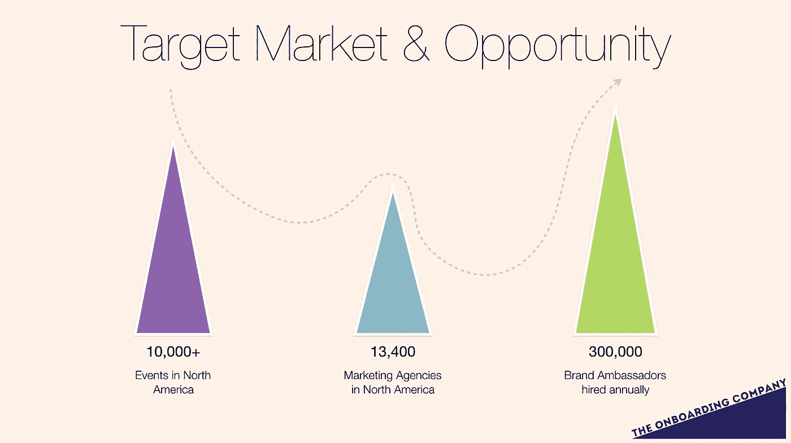

我们攻击这个市场的原因就在于此。北美每天都有数以万计的活动发生，这些活动可以是在 Yonge 和 Dundas 分发地铁报纸的人，也可以是在希尔顿酒店举办庆祝活动的餐饮和活动公司。北美有 13，400 家营销机构在这个市场运营，他们每年雇佣 300，000 名品牌大使，这最终成为一个令人难以置信的消费者群体。

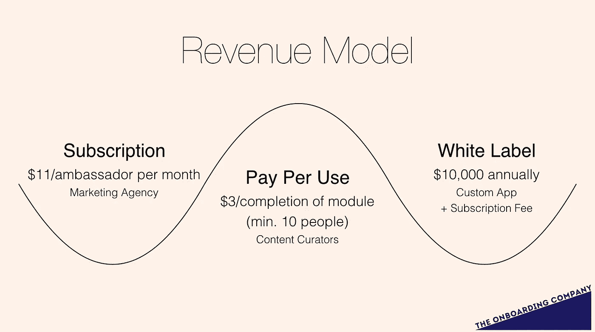

这张幻灯片不错，数字。入职公司将有 3 个收入来源，首先是基本来源，即订阅。如果一家营销机构计划与我们合作，每个大使每月将花费 11 美元。对于那些不想花时间联系营销机构和支付各种费用来聘请大使的小企业来说，他们将能够策划自己的内容，以便有兴趣推广自己品牌的大使能够在平台上进行测试，这样这些企业就能够聘请个人大使参加一两个活动，这对双方都有利。最后，我最喜欢的流，可能是因为它是幻灯片上最大的数字。对于像可口可乐或宝洁这样的白标公司，并不是说他们没有这项技术，但是如果他们想使用这项技术，他们将能够以每年 10，000 美元的简单费用获得许可。

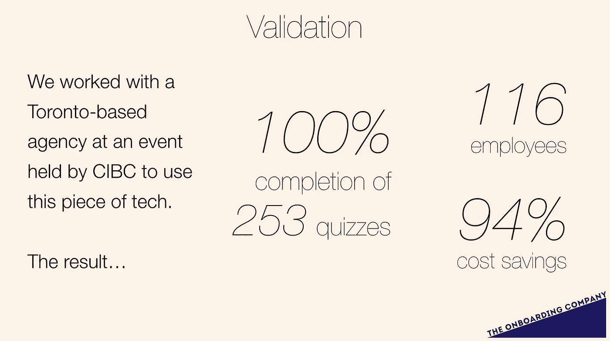

这里有一些数据来验证这一点。不久前，在 CIBC 举办的一次活动中，我们与一家总部位于多伦多的机构合作，运用了这一理念。结果是这样的:116 名员工完成了 253 个测验，完成率为 100%。在回顾了这些模块后，该应用程序节省了 94%的成本。难以置信！由于我们提供的帮助，该机构正在支持这项冒险。

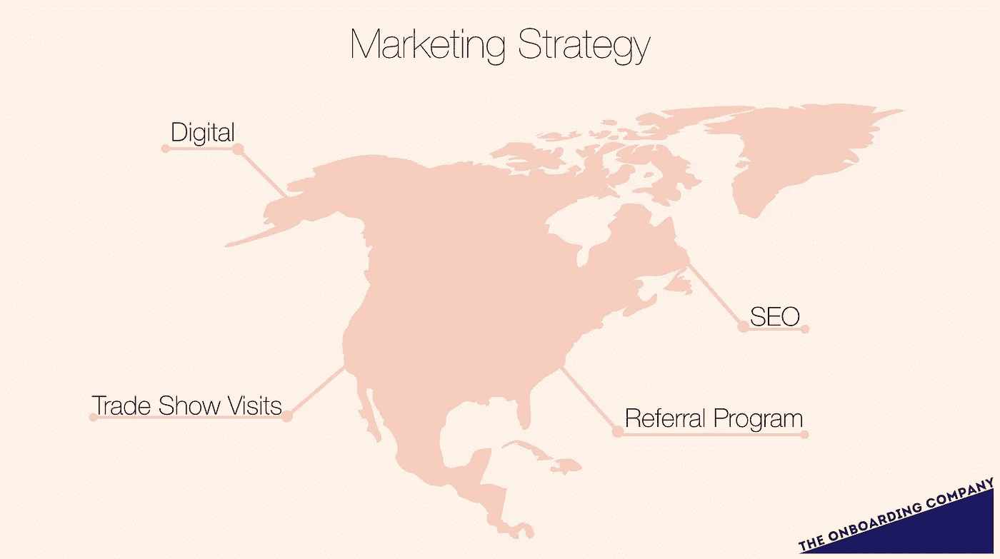

我可能会谈论超过 8 分钟的营销策略，但这里只是简单概述了入职公司将采取的策略，如数字营销、贸易展览访问、SEO 营销和推荐计划。

在这一切之后，你可能会对我可能赢得的钱的资金用途感到疑惑。大部分资金将投入到应用程序的开发中。最棒的是成本降低了，因为我们有可以授权的技术，所以资金可以支付大部分成本。其次可能是营销费用。至于销售策略，我只想指出，预计的核心利润可能来自订阅费，以及与白牌公司达成的交易。这里有一句引语与我们试图改变的东西产生了共鸣，它来自我们的一个潜在客户。Michelle 是纽约 eventive 的客户服务部副总裁，她说她很想了解更多关于我们平台的信息。她总是和品牌大使一起工作，我们是对的，有时很难训练他们。了解到我们能够为这些机构和公司节省一半的时间和金钱，这让我们确信这个市场是有潜力的，我们需要拯救它。

总的来说，我感谢大家的聆听。

仅此而已。这是在 Ted Rogers 管理会议上的演讲。我知道这不是一篇一流的文章，但它是一流的激情，来建立一些东西，让世界变得更美好。

如果你有一个想法，建议，要见的人，任何事情，给我发消息或在下面评论！我很乐意为入职公司尽可能多的吸引人，因为这在今天可能只是一个想法，但它可能是行业的下一件大事。

下次见，干杯。