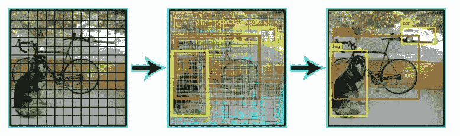
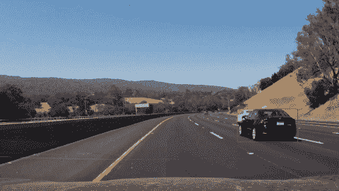
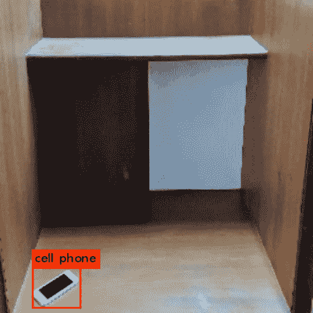

# 用于图像标注的移动网络和 YOLO 目标检测算法的高效实现

> 原文：<https://medium.com/hackernoon/efficient-implementation-of-mobilenet-and-yolo-object-detection-algorithms-for-image-annotation-717e867fa27d>

> 该问题的目标是实现分类和定位算法，以实现高的对象分类和标记精度，并以尽可能少的数据和时间训练模型。下面的博客考虑了问题的解决方案。

模型的效率取决于各种参数，包括模型的架构、模型中权重参数的数量、网络已被训练的图像的数量以及可用于实时测试模型的计算能力。第三个参数无法控制，因此我们依赖于前两个参数。因此，迁移学习在这种情况下工作得最好，因为预训练的权重根据我们的数据集进行调整，尽管获得了最小的误差和可靠的准确度。

# **型号**

F 对于图像分类，我们使用一个 keras 模型，通过运行下面的代码**获得模型摘要。**调整模型的参数，以适应尽可能少的数据的最大信息变化。这样，我们就有了批量标准化层，这些层随机调整权重以使模型一般化。

# 实验

我们使用 MobileNet 模型在数据集上进行训练。该数据集来自黑客地球深度学习挑战，用于对动物进行分类。

如果您需要任何其他特定于域的数据集:

**你可以在这里**找到上千个这样的 [**开放数据集**](https://dataturks.com/projects/trending) **。**

我们从数据集中随机选择 10 个类，改变每个类的图像数量和完全连接的层的大小，并报告结果。

# 结果

这些模型在英特尔 i7 处理器上运行了 15 个时期。

模型 1: Mobilenet : 1000 步/时段:较大的 FC 层:训练时间:18 分钟/时段:数据集:50 幅图像/平均:精度:82.2%
模型 2: Mobilenet: 500 步/时段:较小的 FC 层:训练时间:12 分钟/时段:数据集:50 幅图像/平均:82.47%
模型 3: Mobilnet 500 步/时段:较小的 FC 层:训练时间:11 分钟/时段:数据集:每类 30 幅图像:精度

# **图像检测:**

> 有一些方法将检测作为一个回归问题。最受欢迎的两个是 YOLO 和固态硬盘。这些探测器也被称为单触发探测器。让我们来看看它们:

你只看一次。
YOLO 将每幅图像分成一个 S×S 的网格，每个网格预测 N 个边界框和置信度。置信度反映了边界框的准确性以及边界框是否实际包含对象(不考虑类别)。YOLO 还预测训练中每个类的每个盒子的分类分数。您可以结合这两个类别来计算每个类别出现在预测框中的概率。

因此，预测了总 SxSxN 盒。然而，这些框中的大多数都具有低置信度得分，如果我们设置一个阈值，比如 30%的置信度，我们可以删除它们中的大多数，如下例所示。

YOLO predicts one type of class in one grid! Hence small objects are not identified…

# 单发探测器

SSD 仅对输入图像运行一次卷积网络，并计算特征图。现在，我们在这个特征图上运行一个小的 3×3 大小的卷积核来预测边界框和分类概率。SSD 也使用类似于 fast-RCNN 的各种纵横比的锚盒，并学习偏移而不是学习盒。为了处理规模，SSD 在多个卷积层之后预测边界框。由于每个卷积层在不同的尺度下工作，它能够检测各种尺度的物体。

我们比较了两种模型，最初是 YOLO(darknet)和后来的固态硬盘，并比较了它们的精度和速度。由于我们的输入是图像，FPS 参数不用于区分模型。此外，SSDs 是快速 RCNN 模型和 YOLO 模型之间的平衡。让我们看看实验告诉了我们什么？

在 openCV 库中 Adrian Rosebrock 的帮助下，使用 dnn 模块实现了 SSD 模型。

YOLO 预训练的重量是从我们选择 YOLOv3 模型的作者网站下载的。因为它是暗网模型，锚盒与我们数据集中的不同。因此我们最初使用来自[这里](https://github.com/ssaru/convert2Yolo)的代码将边界框从 VOC 形式转换成暗网形式。然后我们通过改变配置文件来训练网络。

**结果:**

SSDs: IOU= 0.74，mAP: 0.83 时间/纪元:12 分钟
YOLOs: IOU= 0.69，mAP: 0.85 时间/纪元:11 分钟

**输出图像**

SSDs used for Vehicle Detection

Output with YOLOv3 Pretrained Weights

# **结论**

> 总的问题是我们需要权衡速度和准确性。整体解决方案被提议为用于各种类型图像的两种不同模型。

速度和精度之间的权衡伴随着可用的计算能力。YOLO 模型适合精度不是很高的高速输出，而固态硬盘在高速输出时精度更高，计算时间也更长。

因此，在好的微处理器上选择固态硬盘，否则 YOLO 将成为基于微处理器的计算的首选。

无耻插件:我们是一个在线工具，可以让你非常容易地建立 ML 数据集，比如做图像包围盒，NER 标记等等。快来看看:最好的 [*图像标注工具*](https://dataturks.com/features/image-bounding-box.php) *！*