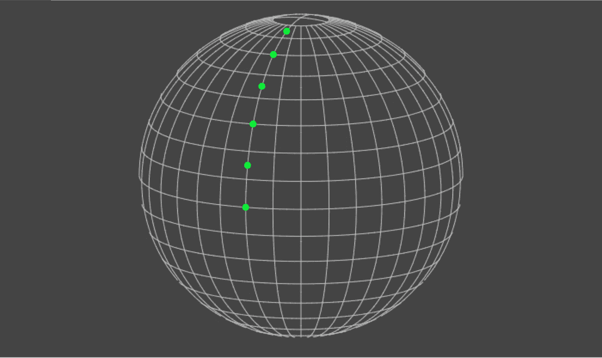
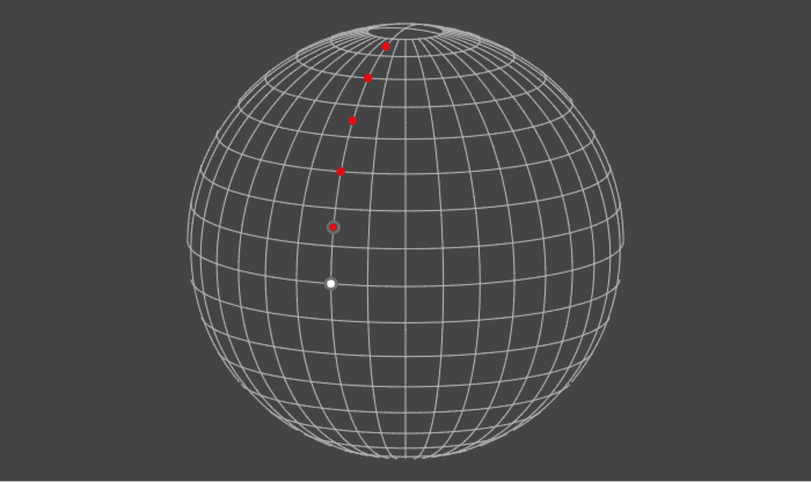
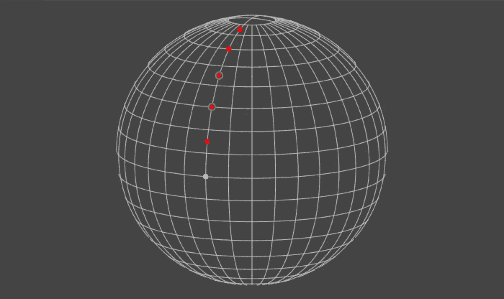
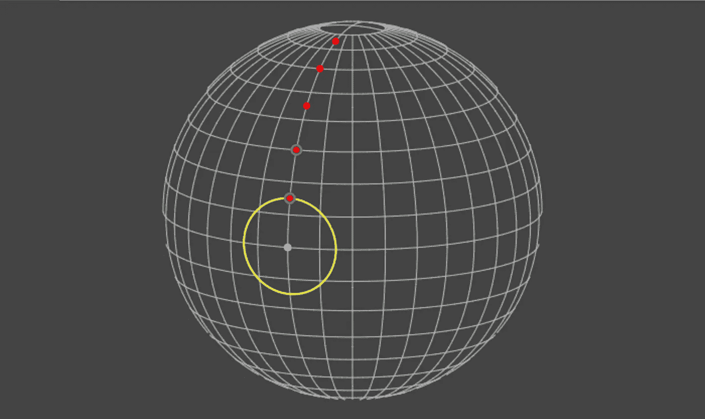
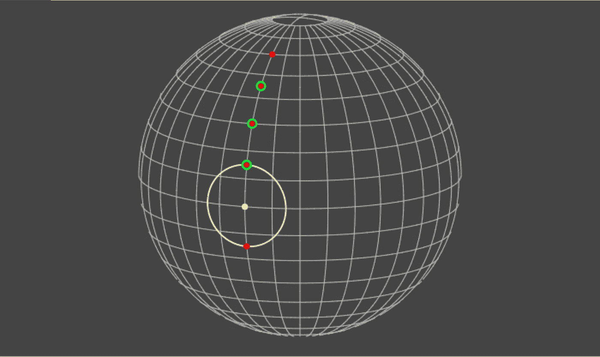

# 使用 MongoDB 高效地分页地理空间数据——向前和向后(第 1 部分)

> 原文：<https://medium.com/hackernoon/efficiently-paging-geospatial-data-with-mongodb-forwards-and-backwards-part-1-685e059a67b0>

Photo by [NASA](https://unsplash.com/photos/Q1p7bh3SHj8?utm_source=unsplash&utm_medium=referral&utm_content=creditCopyText) on [Unsplash](https://unsplash.com/search/photos/earth?utm_source=unsplash&utm_medium=referral&utm_content=creditCopyText)

在本系列文章中，我将描述在 MongoDB 中查询地理空间数据的一些基本技术，如果您希望您的应用程序或 API 提供对基于特定位置的距离排序的信息的访问，这些技术会很有用。例如:

*   商业(餐馆、商店等。)或其他名胜古迹，
*   应用程序的其他用户(如约会应用程序)。

这些技术将允许您的服务扩展并保持高效，因为它们支持对数据的持续时间访问(不管数据库中的数据量有多少)并最小化客户端所需的缓存。

# 你将学到什么

在以下几节中，我将向您展示如何:

1.  在 MongoDB 文档中存储位置数据(经度、纬度对)
2.  使用位置数据查询此类文档，结果按离指定点的距离排序(从最近到最远)
3.  高效地翻阅这些查询的结果

即使你以前没有使用过 MongoDB，你也应该能够理解这篇教程。另一方面，如果前两点听起来很熟悉，你可能想直接跳到第三部分。

我们将使用 Node.js 和官方的 Javascript MongoDB 驱动程序。代码片段将在 Coffeescript 2 中。

如果您想在本地运行代码示例，克隆伴随 repo 的[，并遵循`README.md`中的指令。](https://github.com/adrian-gierakowski/paging_geospatial_data_code)

# 存储位置数据。

对于经度、纬度对，我们需要使用 [GeoJSON](https://docs.mongodb.com/manual/reference/geojson/#overview) 点[对象格式。](https://docs.mongodb.com/manual/reference/geojson/#point)

上面的`doc`是您将插入到 mongo 集合中的内容，它有一个名为`location`的字段，其值是 GeoJSON 点对象。字段的名称并不重要，我们可以使用任何其他有效的键名来代替`location`。我们也可以将 GeoJSON 更深地嵌入到对象结构中，但是将`type`和`coordinates`放在`doc`的顶层是行不通的。还可以在一个文档中存储多个 GeoJSON 对象，例如:

请注意:

*   首先是经度(这与您可能习惯使用的相反，例如，google maps 查询)
*   经度值需要在-180 到 180 之间(包括 180 和 180)
*   纬度值需要在-90 和 90 之间(包括 90 和 90)

现在您已经了解了基础知识，让我们生成一些数据来使用。

我们已经创建了 6 个文档，位置从赤道开始，以相等的间隔增加纬度，同时保持经度固定为 0。以下是绘制在球体上的点:

See code used to generate this on [JSFiddle](https://jsfiddle.net/adrian_gierakowski/8jqx0mr9/).

注意，在下面的代码示例中，我们将省略获取 mongodb 集合对象并向其中插入文档所需的样板文件。在伴随 repo 的[中，这个样板文件已经包含在](https://github.com/adrian-gierakowski/paging_geospatial_data_code https://github.com/adrian-gierakowski/paging_geospatial_data_code)`[with_collection](https://github.com/adrian-gierakowski/paging_geospatial_data_code/tree/f7014c4418c185a06dc3a83d2da0c72ce158e193/src/helpers/with_collection.coffee)`和`[with_collection_with_points](https://github.com/adrian-gierakowski/paging_geospatial_data_code/tree/f7014c4418c185a06dc3a83d2da0c72ce158e193/src/helpers/with_collection_with_points)`助手函数中。

# 基于位置的文档查询。

为了根据文档与特定点的距离来查询文档，我们将使用`[$near](https://docs.mongodb.com/manual/reference/operator/query/near/index.html)` [查询操作符](https://docs.mongodb.com/manual/reference/operator/query/near/index.html)。但在此之前，我们需要在包含 GeoJSON 点对象的字段上创建一个 [2dsphere 索引](https://docs.mongodb.com/manual/core/2dsphere/)。

[runnable example](https://github.com/adrian-gierakowski/paging_geospatial_data_code/tree/f7014c4418c185a06dc3a83d2da0c72ce158e193/src/00_create_index.coffee) on github

在实时数据库上创建索引时，设置后台选项非常重要，因为在创建索引时，默认情况下 [createIndex](https://docs.mongodb.com/manual/reference/method/db.collection.createIndex/index.html#behaviors) 将**阻止数据库**上的所有其他操作(如果集合很大，这可能需要一段时间)。

现在是基本查询，根据文档中的`location`字段的数据，返回从`[ 0, 0 ]`点开始按距离(准确地说是[大圆距离](https://en.wikipedia.org/wiki/Great-circle_distance))排序的**所有**文档:

[runnable example](https://github.com/adrian-gierakowski/paging_geospatial_data_code/tree/f7014c4418c185a06dc3a83d2da0c72ce158e193/src/01_query_all.coffee) on github

除非您打算处理集合中的所有**文档(在这种情况下，您可能会调用`[.stream](http://mongodb.github.io/node-mongodb-native/3.1/api/Cursor.html#stream)`而不是`[.toArray](http://mongodb.github.io/node-mongodb-native/3.1/api/Cursor.html#toArray)`)，否则您会希望限制返回文档的数量。这是如何做到的:**

[runnable example](https://github.com/adrian-gierakowski/paging_geospatial_data_code/tree/f7014c4418c185a06dc3a83d2da0c72ce158e193/src/02_query_wlth_limit.coffee) on github

在下图中，白点标记了上述查询中使用的位置(`[ 0, 0 ]`)，用绿色圈出的点表示`limit`设置为`2`的查询结果。

see code used to generate this on [JSFiddle](https://jsfiddle.net/adrian_gierakowski/2gst7vma/)

# 从最近到最远(向前)翻阅结果。

注意:本节中讨论的技术已经由 A. Jesse Jiryu Davis 在之前的[中描述过，他实现了 MondoDB 特性，使得这种技术成为可能。他的文章详细介绍了为什么这个方法是高性能的，因此值得一读，但是代码示例是用 python 编写的，因此为了 Node.js 社区的利益，我们将在这里一步一步地介绍它。](https://emptysqua.re/blog/paging-geo-mongodb/)

基于我们在前一节中定义的查询，实现分页的最简单方法是使用`limit`来控制页面/批处理大小，使用`[skip](https://docs.mongodb.com/manual/reference/method/cursor.skip/index.html)` [方法](https://docs.mongodb.com/manual/reference/method/cursor.skip/index.html)来设置所需的页面偏移量。例如:

[runnable example](https://github.com/adrian-gierakowski/paging_geospatial_data_code/tree/f7014c4418c185a06dc3a83d2da0c72ce158e193/src/03_page_with_skip.coffee) on github

当查询我们的测试数据时，上面的查询将返回结果的第二页，如下所示。

see code used to generate this on [JSFiddle](https://jsfiddle.net/adrian_gierakowski/dhsL1c4u/)

然而`skip`的性能随着偏移量的增加而线性下降(如上面提到的文章中的[所示)，因为 MongoDB 服务器需要从头开始扫描所有查询结果，直到达到偏移量。](https://emptysqua.re/blog/paging-geo-mongodb/)

一个恒定时间替代方案包括使用`[$minDistance](https://docs.mongodb.com/manual/reference/operator/query/minDistance/index.html)` [查询操作符](https://docs.mongodb.com/manual/reference/operator/query/minDistance/index.html)，排除位于查询点给定半径内的结果。

假设我们知道查询点和离给定结果页最远的文档之间的距离，我们可以如下查询下一页:

但是我们从哪里得到距离呢？我们可以试着用一个手工滚动的公式来计算球体上两点之间的距离。或者使用类似 Geolib 中的`[getDistance](https://github.com/manuelbieh/Geolib/blob/8273a52d86f7dfbd3b0e2aa2b7473ef5149c5374/src/geolib.js#L237)` [的东西。然而，我们必须确保我们选择的实现与 MongoDB 使用的实现相匹配。幸运的是，我们不必经历所有这些麻烦，因为我们可以要求 MongoDB 在查询结果中为每个文档附加一个动态计算的距离。我们只需将我们的`find`查询转换成一个等价的](https://github.com/manuelbieh/Geolib/blob/8273a52d86f7dfbd3b0e2aa2b7473ef5149c5374/src/geolib.js#L237)[聚合](https://docs.mongodb.com/manual/aggregation/)管道，使用 [$geoNear](https://docs.mongodb.com/manual/reference/operator/aggregation/geoNear/) 阶段及其`distanceField`选项。

现在我们可以使用查询结果中最后一个文档的`calculated_distance`属性(因为它们是按距离升序排列的)来获取下一页。让我们使用上面的函数来获取前两页。

[runnable example](https://github.com/adrian-gierakowski/paging_geospatial_data_code/tree/f7014c4418c185a06dc3a83d2da0c72ce158e193/src/04_page_with_min_distance.coffee) on github

这里是对第二次调用`fetch_page`的结果的可视化，用黄色圆圈圈出使用`minDistance`从查询中排除的区域。

see code used to generate this on [JSFiddle](https://jsfiddle.net/adrian_gierakowski/6ub2qy4z/)

然而，这并不完全是我们想要的:上一页的最后一个文档包含在下一页中，因为`minDistance`只排除距离小于给定值的文档。为了防止这种情况，我们需要将下面的查询添加到我们的`$geoNear`聚合阶段。

[runnable example](https://github.com/adrian-gierakowski/paging_geospatial_data_code/tree/f7014c4418c185a06dc3a83d2da0c72ce158e193/src/06_page_with_min_distance_and_exclude_one_id.coffee) on github

在收集结果时，该查询使用`[$nin](https://docs.mongodb.com/manual/reference/operator/query/nin/)` [操作符](https://docs.mongodb.com/manual/reference/operator/query/nin/)跳过具有给定`_id`的文档。完事了吗？差不多了！考虑以下几点。

注意，第二和第三个点与`[ 0, 0 ]`点的距离完全相同。现在，如果我们将`query_point`设置为`[ 0, 0 ]`，将`page_size`设置为`3`，那么获取第二页的结果会是什么呢？假设第一个查询返回的点按照上面的数组排序(`[ 0, -15 ]` last)，下面是它的样子。

see code used to generate this on [JSFiddle](https://jsfiddle.net/adrian_gierakowski/jo1q0xe8/)

这是因为`minDistance`和`$nin`都不排除坐标为`[ 0, 15 ]`的文档。因此，我们需要收集距离等于`last_doc`的所有文档的`_id`，而不是仅仅使用最后一个文档的`_id`。将所有这些放在一起:

给定`current_page`以下是你获取下一个的方法:

[runnable example](https://github.com/adrian-gierakowski/paging_geospatial_data_code/tree/f7014c4418c185a06dc3a83d2da0c72ce158e193/src/07_page_with_min_distance_and_exclude_ids_from_one_page.coffee) on github

请注意，`get_last_distance`和`get_ids_to_exclude`中的逻辑最有可能在客户端执行，因此它没有包含在`fetch_page`函数中，该函数期望预先计算的`exclude_ids`和`last_distance`被传入。这是为了尽量减少通过网络发送的数据量。或者，服务器可以包含一个 HTTP 链接头，其中包含获取下一个页面所需的所有信息，在这种情况下，上面的所有代码都将在服务器上执行。

最后，我们需要处理这样一种情况，有很多文档具有相同的距离，以至于一个页面中的最后一个文档与用于获取该页面的`last_distance`具有相同的距离。例如，当从下面的一组点中取出第三页时(用`query_point = [ 0, 0 ]`和`page_size = 2`):

使用上面的实现，我们将得到点`[ [ 0, -15 ], [ 0, 30 ] ]`而不是期望的`[ [ 0, 30 ], [ 0, 45 ] ]`，因为来自第 1 页的最后一个点的`_id`(`[ 0, -15 ]`)没有被排除，即使它的距离与`minDistance`相同。因此，在这种情况下，我们需要将`exclude_ids`从前一个查询转移到下一个查询。

[runnable example](https://github.com/adrian-gierakowski/paging_geospatial_data_code/tree/f7014c4418c185a06dc3a83d2da0c72ce158e193/src/08_page_forwards_final.coffee) on github

值得注意的是，在所有文档都具有相同距离的极端情况下，`exclude_ids`数组的大小，以及每个请求中通过网络发送的数据量，会随着页面的进展而线性增加。除此之外，查询性能本身也会以类似的方式降低(我敢打赌，这将比单纯依赖于`skip`的简单实现更糟糕)。为了减轻这种情况，我们可以记录要跳过的文档数(并与`minDistance`结合使用)，而不是累积`exclude_ids`。这将保持请求的大小不变，并且查询性能在简单的`skip`解决方案的范围内。然而，在查询的数据是高度动态的情况下(当预期在读取之间会发生变化时)，跟踪要排除的`_id`比使用 skip 有一些优势，我们可能会在以后的文章中讨论这一点。

最后，我想提醒您注意这样一个事实，上面的方法不便于直接跳转到一个特定的页面(不获取中间的所有页面)。然而，这可以通过向查询添加适当的`skip`(等于`page_size * pages_to_skip_count`)来实现。使用`skip`显然会导致与跳过的文档数量成比例的性能损失，但是确实没有办法避免(除非您的用例可以使用`minDistance`跳过未知数量的文档，而不是指定要跳过的页面/文档数量)。幸运的是，我们只需要为每次页面跳转支付一次这个价格，因为一旦使用`skip`获取了想要的页面，就可以只使用`minDistance`和`exclude_ids`查询下一个页面。

# 结论

我们演示了如何在 mongodb 中存储和查询地理空间数据，并讨论了如何高效地浏览大量此类数据(从最近的位置到最远的位置)。在本系列的第 2 部分中，您将学习如何使用一个巧妙的技巧来以相反的顺序浏览各个位置。

不要忘记克隆伴随 repo 的[,并使用可以从命令行轻松运行的代码示例。](https://github.com/adrian-gierakowski/paging_geospatial_data_code)