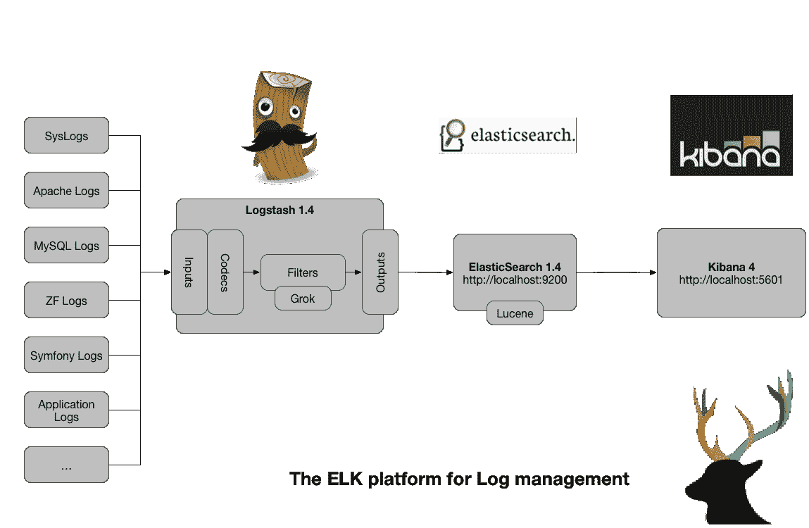

# 弹性叠加——简介

> 原文：<https://medium.com/hackernoon/elastic-stack-a-brief-introduction-794bc7ff7d4f>


如果你听说过 [Elastic Stack](https://hackernoon.com/tagged/elastic-stack) 并想探索一下，或者你是一个绝对的傻瓜，那么你正在阅读正确的博文。相信看完这个你就不会这样了！我们先来了解一下什么是弹力叠，为什么需要弹力叠。

**什么是弹力叠？**

ELK Stack 或 Elastic Stack — `ELK stack`已被重新命名为`Elastic Stack`。ELK stack 是三个开源项目- `**E**lasticsearch, **L**ogstash, and **K**ibana`的惊人而强大的集合。尽管这三种[技术](https://hackernoon.com/tagged/technologies)中的每一种都是独立的项目，但它们已经被构建为能够非常好地协同工作。

*弹性栈是一套完整的端到端日志分析解决方案，帮助深度* ***搜索*******分析*******可视化*** *不同机器生成的日志。***

****

**Log Analysis-Search-Visualize**

**是的，你没看错！Elastic stack 可靠、安全地从任何来源以任何格式获取数据，并实时搜索、分析和可视化这些数据。Elastic Stack 提供了一种强大的机制来执行集中式日志记录，这在识别 web 服务器和/或应用程序相关问题中起着重要的作用。它允许您在一个位置搜索所有日志，并通过在 It 环境(包括 web 分析、商业智能、合规性和安全性的使用案例)中找到的特定时间范围内关联日志来识别跨多个服务器的问题。**

****弹性叠加是用来做什么的？****

**在当今数据主导的世界中，无论组织的规模如何，每天都会有大量数据不断流入您的系统。随着数据集变得越来越大，您的分析将会变慢，从而导致洞察力迟钝。这些数据中有相当一部分是由公司的 web 服务器日志组成的。日志是最重要但经常被忽视的信息来源之一。每个日志文件都包含非常有价值的信息，这些信息大多是非结构化的，毫无意义。如果没有对这些日志数据进行仔细而详细的分析，组织可能会对其周围的机会和威胁视而不见。唉！**

**因此，大数据的大问题是:如何保持有价值的业务洞察力！对吗？别担心，这里是你需要一个日志分析工具的地方。**

****弹性堆栈用户****

****

> **现在，我有一个问题要问你。微软、LinkedIn、网飞、脸书和思科是如何监控他们的日志的？**
> 
> **答案显而易见。没错，不是别人，正是麋鹿！**

**弹力叠的威力在于它强大的组件- `Elasticsearch` - `Logstash` - `Kibana` - `Beats` - `X Pack`。该堆栈还包括一个名为 X-Pack 的付费组件和一个名为 Beats 的日志运送程序家族，这使得 Elastic 将 ELK 重新命名为 Elastic Stack。为了更好地理解 Elastic Stack，您需要理解它的组件。**

**简单来说，弹性堆栈的工作流程可以这样表述:**

> **L ogstash 和 Beats 家族一起收集和解析日志(比如用于 SEO 和 web 流量分析的 NGINX 日志)，然后这些信息被 Elasticsearch 索引和存储。最后，Kibana 将数据可视化，使我们能够提供决策见解。是不是很神奇？**

## **弹性堆栈使用案例**

**关于麋鹿的定义已经介绍得够多了，现在让我们看看它在解决现实生活中的问题时到底在哪里以及如何帮助我们。从跟踪简单的日志文件到全面、复杂、关键的业务分析，ELK stack 将为您扮演这一角色。下面列出了一些麋鹿减轻你相关头痛的场景:**

## **日志记录和日志分析**

**ELK Stack 已经成为最流行的开源日志平台。假设你必须找到一个错误。您需要登录到几台机器上，查看几个日志文件。现在假设您正在维护分布在几个节点上的大型应用程序。在这种情况下，在日志文件中搜索的过程会变得更加繁琐和混乱。是时候超越使用像 grep 这样的 Linux 工具了。**

****

**[https://digicm.wordpress.com/2014/12/31/mwd0701-log-management-with-elk/](https://digicm.wordpress.com/2014/12/31/mwd0701-log-management-with-elk/)**

> *****解决方案:***[*从 Beats，到 Logstash，再到摄取节点，Elasticsearch 为您提供了大量选项来抓取数据，无论数据位于何处，并将其编入索引。尾几个文件，或者几十亿。*](http://elastic.co)**

***[**一些成功的麋鹿日志分析用例包括:**](https://www.searchtechnologies.com/elk-log-analytics-applications)***

*   ***风险管理***
*   ***市场情报***
*   ***电子商务个性化***
*   ***服从***
*   ***证券分析***
*   ***欺诈检测***

## ***韵律学***

> ***谈到指标或分析，你会立即想到什么？提示:这是一个很小的 4 个字母的单词，但是很强大！！***
> 
> ***是的，“数据”***

***让我们以一所拥有多个系和相关院系的大学为例。要求是找出每个系的教员人数。***

> ******解决方案:*** Elasticsearch 的[聚合](http://www.elasticsearch.org/guide/en/elasticsearch/reference/current/search-aggregations.html)可以帮助找到查看数据的新方法。如果您在 Elasticsearch 中索引了院系，您可以使用术语聚合来查找在特定院系工作的教职工人数。该请求如下所示:***

```
***curl -XGET "http://localhost:9200/university/faculty/_search" -d'
{
   "size": 0,
   "aggregations": {
      "faculty": {
         "terms": {
            "field": "department"
         }
      }
   }
}'***
```

***使用关键字`aggregations` 或`aggs`请求聚合，`department`是标识结果的术语，`terms aggregation`对给定字段的不同术语进行计数。我将在以后的博客文章中讨论语法。你会得到类似这样的回答:***

```
***{
   "took": 1,
   "timed_out": false,
   "_shards": {
      "total": 1,
      "successful": 1,
      "failed": 0
   },
   "hits": {
      "total": 86,
      "max_score": 0,
      "hits": []
   },
   "aggregations": {
      "department": {
         "buckets": [
            {
               "key": "Mathematics",
               "doc_count": 16
            },
            {
               "key": "Information Technology",
               "doc_count": 20
            },
            {
               "key": "Geo Informatics",
               "doc_count": 25
            },
            {
               "key": "Zoology",
               "doc_count": 15
            },
            {
               "key": "Bio Technology,
               "doc_count": 10
            }
         ]
      }
   }
}***
```

***我们可以看到在“数学”系工作的有 **16** ，“信息技术”系的有 **20** 等等。这是 Elasticsearch 应用于指标的所有搜索超能力。***

## ***全文搜索***

***ELK Stack 的核心是 Elasticsearch，它是一个基于 JSON 的 RESTful 搜索引擎，旨在扩展每秒数百万的事件，提供最大的可靠性。***

***一些实时应用如下:***

*   *****维基百科**:搜索巨头维基百科使用 Elasticsearch 进行全文搜索。***
*   *****Stack Overflow**:Stack Overflow，这个巨大的知识共享网站依靠 Elasticsearch 作为支持全文搜索功能的手段，从而提供与源相关的问题和/或答案。***
*   ***网飞:网飞负责监控和分析客户服务相关操作和安全相关日志；严重依赖麋鹿来完成这一切。从它的自动复制或分片、漂亮的扩展模型和灵活的模式，ELK 是负责任的。***
*   *****LinkedIn:** LinkedIn， **t** 这家专注于商业的社交网络使用 ELK 和 kafka 来实时支持他们的负载，并监控性能和安全性。***
*   ***Medium:Medium 是我最喜欢的，也是最受欢迎的现代博客发布平台之一，它每月支持大约 2500 万独立读者，每周支持数万篇发布的文章。它使用弹性堆栈来调试生产问题。***
*   ***GitHub:项目主机能够通过搜索引擎查询数十亿行代码。***
*   ***Lyft 是亚马逊最大的托管弹性搜索客户。从 Amazon ES 转移到 Elasticsearch 后，为了更好的性能，它变成了自我管理和自我托管。***

***这些只是很少提及的。如果您有兴趣了解更多，我建议您浏览弹性堆栈文档，以便更清楚地了解[**【https://www.elastic.co】**。](https://www.elastic.co.)和**https://www.elastic.co/use-cases**和日用例***

***欢迎在下面的评论中提出任何建议和修改！:D***