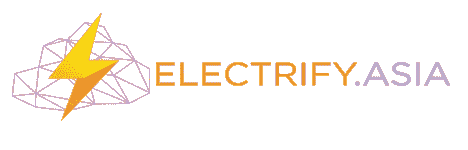

# 亚洲电气化(ELEC)亚洲分散的能源市场

> 原文：<https://medium.com/hackernoon/electrify-asia-elec-a-decentralized-market-place-for-energy-in-asia-f60680dc0bbb>

**人们为什么投资电气化亚洲**

几十年来，电力一直由大型发电站输送给消费者。这种电力基础设施多年来以便利的方式服务于全球人口，然而，随着技术的进步，这些电网及其后续网络尚未充分利用现代技术，因此，电力不仅以低效的方式管理，而且集中式市场还使得几乎不可能选择首选提供商，例如专门从事可再生能源的提供商。

Electrify 计划通过创建一个分散的网络来彻底改变我们消耗电力的方式，客户可以在众多的能源供应商中进行选择。

该平台能够创建微型电网，客户可以从当地供应商和拥有住宅屋顶太阳能系统和风力涡轮机的小规模生产商那里购买电力。

Electrify 自 2017 年开始运营，已为商业消费者交易了超过 30GWh 的电力，并建立了超过 500 万美元的 GMV。

**技术落后通电**

Electrify 建立在 Ehtereum 区块链之上，利用智能合约自动执行交易。智能合约取代了许多流程中对中间商的需求，从而降低了交易成本，减少了出错风险。

区块链允许发展一个分散的市场，客户最终可以选择从可再生能源供应商那里轻松购买电力。

web 和移动应用程序将用户连接到系统。用户被分为三种主要类型的参与者。其中包括:

买方

-住宅消费者

电力零售商

-跨国公司和小企业

卖方

-小型企业和住宅能源生产商(工厂、仓库、家庭)

-电动汽车和电池存储系统

其他人

-电网运营商

-第三方审计师

商品交易商

-风险管理团队

Electrify Marketplace 2.0 建立在团队创建的现有市场的基础上，凭借过去几年获得的经验，这为他们提供了战略优势。新的市场将托管一个名为 Synergy 的点对点平台，将用户与各种规模和类型的能源零售商联系起来。基于 CfD 的平台还允许*在全球主要城市和所有发达电网中实现*即插即用功能。

所有交易都将依赖于*差价* (CfD)结算机制。一旦建立起来，用户将能够准确地跟踪和审计从源头到最终目的地的电力生产。

该团队还开发了一种物联网智能设备，称为 PowerPod，通过 Synergy 智能合约来测量和实现 P2P 交易。

希望向使用分散电网的用户提供能源的生产商将被要求具有至少 200 ELEC/千瓦的容量，以将能源数据写入区块链。这种“存款”鼓励长期所有权，抑制篡改和不诚实的行为。

通电令牌 ELEC 和电子钱包

ELEC 令牌将成为 *Marketplace 2.0* 和 *Synergy* 中的支付标准。该 ERC20 令牌将用于平台上的任何交易，包括(但不限于):

列出能源生产商和零售商进入 Electrify 生态系统的保证金

能源供应商支付的电气化交易费

消费者忠诚度奖励

为了管理代币，Electrify 还将发布一款附送的钱包。电子钱包将用于支付服务，并可以自动管理付款。。

**电气化解决了什么问题？**

当前管理市场的系统是严格集中的，这导致了一些负面因素，例如

缺乏透明度——不明确的收费标准，提供商几乎没有选择，提供商使用匿名来源，几乎没有关于使用和碳足迹的信息

清洁能源的障碍——没有开放的市场，因此几乎没有选择，没有选择意味着没有机会选择更环保的可再生能源

消费者信用风险——区块链技术的分散、不可信架构使得过滤掉信用评级差的用户变得容易，从而降低了所有用户的费用。

一些国家正在放开他们的电网。日本在 2016 年就这样做了，中国也是如此，新加坡目前正在计划这一转变。随着越来越多的国家改变他们的电力市场，消费者在选择电力零售商时将有更多的选择。

虽然这是朝着更公平的市场的正确方向迈出的一步，但这些自由化的系统仍然依赖于由寻求利润最大化的大公司管理的集中电网。集中式系统在创新和替代方面也很落后，可再生能源和点对点能源等解决方案未能成为行业标准。

Electrify 相信，消费者可以获得 ELECTRIFY 的所有服务，这些服务可以直接从电力零售商那里购买，甚至可以从生产自己多余电力供应的同行(P2P)那里购买。

**路线图/未来**

2018 年的前两个季度将用于筹集资金。白名单期持续到 2018 年 1 月，令牌销售计划于 2018 年 2 月结束。第三季度将推出 Electrify Marketplace 2.0 和电子钱包的测试版，第四季度将推出 Synergy 和 Powerpod，并扩展到日本。预计 2019 年将进一步增长，计划扩展到菲律宾和澳大利亚。

**关于亚洲电气化的宝贵信息**

**币名:**通电。亚洲(ELEC)

**总供应量:**7.5 亿

**流通供应量:**6.12 亿

**市值:**3000 万美元的硬性上限

**Ico 价格:** 1 ELEC = 0.08 美元

**通过 ICO 筹集的代币/资金:**29 102 830 美元

**员工/团队信息**

姓名:朱利叶斯·谭

头衔:首席执行官

LinkedIn:https://www . LinkedIn . com/in/Julius-tan-69675144/

姓名:马丁·林

标题:首席运营官

LinkedIn:https://www . LinkedIn . com/in/martinator/

姓名:阿丽克西亚·李

标题:操作

LinkedIn:https://www . LinkedIn . com/in/alexiagermaine/

姓名:约翰·廉

标题:开发者

LinkedIn:https://www . LinkedIn . com/in/electrify/

姓名:ELEN·切兰

标题:业务发展

LinkedIn:https://www . LinkedIn . com/in/elencheran-subramaniam-12ba 28151/

姓名:莫汉·拉吉

标题:业务发展

LinkedIn:https://www . LinkedIn . com/in/Mohan-Raj-v-5337 a354/

姓名:林卓安

标题:业务发展

LinkedIn:https://www . LinkedIn . com/in/Adrian lam/

姓名:陈车恒

标题:开发者

LinkedIn:https://www . LinkedIn . com/in/Chea-hang-chan-45 a98a 99/

姓名:HARRY CHOONG

标题:订婚

LinkedIn:https://www . LinkedIn . com/in/Harry-choong-9b 684 b 68

姓名:林大卫

标题:金融

LinkedIn:https://www . LinkedIn . com/in/David-Lin-34520 a33

姓名:欧文·松

头衔:社区经理

LinkedIn:https://www . LinkedIn . com/in/Erwin-soon-75377666

姓名:TIMOTHY HAN

标题:订婚

LinkedIn:https://www . LinkedIn . com/in/Timothy-Han-3847 ba 83/

姓名:埃里克·BUI

标题:区块链铅