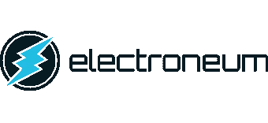

# 用于挖掘和交换加密货币的电子智能手机技术。

> 原文：<https://medium.com/hackernoon/electroneum-smartphone-technology-for-mining-and-exchanging-cryptocurrencies-8884d5bd5c5a>

**什么是 Elecroneum**

电子货币是一种补充性的加密货币，其开发目标是让任何人，无论技术知识如何，都能访问数字货币的功能。该技术旨在通过一款任何人都可以使用的用户友好型应用程序，将挖掘以及加密货币的买卖过程全部纳入智能手机。

大多数加密货币都是使用专业设备挖掘出来的，然而电子货币可以使用一种独特而简单的应用程序来挖掘，在它开始工作之前只需几分钟即可安装。

比特币的有限供应会推高单个硬币的价值，因此现实世界中的小额交易会将价值转换为小数点后很多位数的数字，与此不同，电子货币公司的区块链拥有 210 亿个硬币。这将向前移动小数位，使金额与大多数货币目前使用的两位小数位系统相匹配。

让心算变得更容易应该有助于采用这种货币，因为交易更容易进行，也更接近真实世界的情况。

为了使这项技术能够为更广泛的公众所用，Electroneum 故意避免使用可以用 ASICs 挖掘的区块链，这是最现代的比特币采矿设备中发现的超级强大的电路，而是创造了一种可以使用智能手机 CPU 的能力挖掘的区块链，从而使普通人能够参与进来。

Electroneum 易于访问的加密货币希望通过其用户友好的挖掘方法吸引大量用户。可能从使用 Electroneum 中受益的用户包括:

长期持有者，例如希望购买并持有货币以获取任何潜在未来价值的人。

密码爱好者希望成为数字货币运动下一阶段发展的一部分。

**电子神经如何工作**

随着新加密技术的实用性，该公司有了长期目标，开始将 API 与虚拟商品卖家集成，开始接受电子货币，发起全球社交媒体活动，并开发电子货币虚拟货币交易所。

配套的电子币应用程序将采用类似于 What's App、Line、微信等私人消息应用程序的设计方式，用户只需知道某人的电话号码，就可以轻松收发电子币。为了进一步促进全球采用，该应用程序推出了多种语言版本，包括标准中文、印地语、葡萄牙语、阿拉伯语、俄语、日语、德语、印度尼西亚语、西班牙语、法语和意大利语。

这家初创公司迅速计划进军游戏行业——这是一个自然的发展，因为它的许多用户群都熟悉游戏——通过与 Xbox 和 PlayStation 等游戏机的顶级开发商合作，创建世界上第一个游戏主机挖掘软件。这样做的话，6 . 2 亿多台游戏机在不使用的时候可以开采电子神经。

随着应用程序和控制台集成的成功实施，Electroneum 可以通过为 Windows 和 Mac 创建基于 GUI 的钱包和挖掘软件来进一步渗透市场。

下一步，该公司旨在通过整合 Groupon、TravelZoo 和 Wowcher 等流行的在线优惠券应用程序，以及亚马逊和阿里巴巴等电子商务网站，使硬币在日常生活中更加可行。

随着 Electroneum 继续建立合作伙伴关系和合资企业，它还将尝试与谷歌和脸书等互联网巨头合作。这将使用户在网上冲浪或在社交媒体网络订阅时有更多的机会挖掘硬币。

通过这种合作关系，电子币不仅可以让游戏玩家在他们的机器处于待机状态的时候挖矿，这项技术还可以让游戏玩家，比如玩《我的世界》游戏的玩家，在玩游戏的时候实际上挖矿。

通过这样做，玩家能够将他/她的游戏中虚拟货币转换成现实世界中接受的密码。与此同时，游戏公司开发了基于进入、退出的策略，通过在玩家离开游戏时收取佣金来赚钱。

超过 2.2。全球 10 亿游戏玩家将电子币作为互联网货币进行营销，旨在打造一个像贝宝一样被普遍接受的品牌。它还发现了为数百万目前没有银行账户但拥有智能手机的人提供这些服务的机会。

**有价值的信息**

**硬币名称:**电子币(ETN)

总供应量:5，195，262，064 ETN

流通供应量:4997507466 ETN

市值:464，703，227 美元

**Ico 价格:** 1 ETN = 0.0100 美元

**员工/团队**

**姓名**:理查德·埃尔斯

**头衔**:联合创始人

**领英**:[https://www.linkedin.com/in/richard-ells-8b0615b/](https://www.linkedin.com/in/richard-ells-8b0615b/)

姓名:詹姆斯·阿特金森

**头衔**:开发组组长

姓名:迪安·科尔

**标题**:区块链开发与维护

**LinkedIn**:【https://www.linkedin.com/in/deancole/ 

**姓名**:亚当·阿特金森

头衔 : Javascript 开发主管

姓名:本·沃姆斯利

**头衔**:UI/UX 负责人

**领英**:[https://www.linkedin.com/in/ben-whomsley-29bb8458/](https://www.linkedin.com/in/ben-whomsley-29bb8458/)

**姓名**:科斯丁·克里斯托

**头衔**:电子神经 App 开发团队

名字:罗伯特·霍普金斯

**头衔**:普通开发者

**领英**:[https://www.linkedin.com/in/robert-hopkins-27b99910a/](https://www.linkedin.com/in/robert-hopkins-27b99910a/)

姓名:特里·亨特

**头衔**:开发团队，后端

**领英**:[https://www.linkedin.com/in/terence-hunter-60424599/](https://www.linkedin.com/in/terence-hunter-60424599/)

姓名:伊莫金·戴尔

**标题**:插图和平面设计

**领英**:【https://www.linkedin.com/in/imogen-dale-8a3055123/】T42

姓名:迈克尔·威尔特希尔

**标题**:病毒式营销和社交媒体

**领英**:[https://www.linkedin.com/in/michael-wiltshire-65186923/](https://www.linkedin.com/in/michael-wiltshire-65186923/)

名字:娜塔莉·海恩

**头衔**:社交媒体团队负责人

**领英**:[https://www.linkedin.com/in/natalie-hayon-9b522666/](https://www.linkedin.com/in/natalie-hayon-9b522666/)

姓名:芭芭拉·索思韦尔

**标题**:营销

**LinkedIn**:[https://www.linkedin.com/in/barbara-southwell-1014a178/](https://www.linkedin.com/in/barbara-southwell-1014a178/)

**社交媒体/联系人**

**脸书**

网址:[https://www.facebook.com/electroneum](https://www.facebook.com/electroneum)

喜欢:84，233 个喜欢

过去 7 天有多少帖子/更新:8 次更新

**推特**

网址:【https://twitter.com/electroneum 

追随者:41.8 万名追随者

过去 7 天有多少条推文/转发:8 条更新

**电报**

网址:[https://t.me/joinchat/DxoSakHOdk5mqsE-LelfVg](https://t.me/joinchat/DxoSakHOdk5mqsE-LelfVg)

用户:31，826 名成员

**Reddit**

网址:[https://www.reddit.com/r/Electroneum/](https://www.reddit.com/r/Electroneum/)

读者:6，919 名读者

**GitHub**

网址:[https://github.com/electroneum/](https://github.com/electroneum/)

过去 7 天有多少次更新:3 次更新

**公司地址**:肯特郡梅德斯通市阿尔比恩广场 30-34 号林德大厦电子有限公司。联合王国 ME14 5DZ