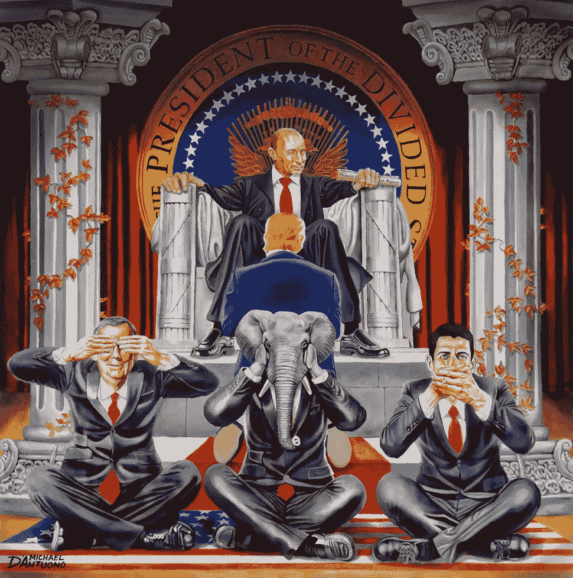

# 解决区块链房间里的大象

> 原文：<https://medium.com/hackernoon/elephant-in-the-blockchain-room-3d4b15093a6a>

## 那个小小的中间人问题

*“*It is well-known what a middleman is: he is a man who bamboozles one party and plunders the other.*” —* Benjamin Disraeli, Former British Prime Minister, 1804–1881. *Oil on canvas painting by* [Michael D’Antuono](https://artandresponse.com/paintings/the-elephant-in-the-room/).

atoshi 的白皮书引发了一场名副其实的区块链初创公司、ICO 和白皮书的海啸，承诺解决全球对“其他东西”的需求，这是解决全球问题激增的一种新方法。区块链创始人气喘吁吁地描述了一个中央权威或中介角色被消除的世界。我们被告知，这项技术有可能改变经济生态系统的基础，并从根本上颠覆每个行业，产生不同的影响。

在一次又一次的区块链会议上，人们提出了无数的乌托邦:开放的治理网络、人力和资源的对等参与、自我主权身份、激励性的问题解决以及消除腐败。我也成了炒作的受害者，并写下了没有中间人的[生活:](/postcards-from-2035/life-without-middlemen-6a67de21cf40)

 [## 没有中间人的生活

### 当没有人试图控制时，幸福会茁壮成长

medium.com](/postcards-from-2035/life-without-middlemen-6a67de21cf40) 

可悲的是，在所有的兴奋中，区块链社会忽略了一个难以忽视的人性真相:权力一旦获得，很少不经斗争就放弃。

央行、控制它们的人以及渴望权力的独裁者不太可能允许代币和加密货币篡夺它们作为垄断货币供应商的角色。中国已经关闭了比特币交易所，并禁止首次发行比特币，俄罗斯也表示，“我们不会将传销合法化”，“我们完全反对私人资金，无论是实物还是虚拟形式。”国际清算银行表示，“虽然加密货币可能伪装成货币，但它们不符合基本的教科书定义。”此外，没有“机构支持，最好由央行提供”，新的加密资产会危及对货币基本价值和本质的信任。在澳大利亚，当地加密投资者一直抱怨澳大利亚四大银行冻结了他们的账户，并阻止向比特币交易所转账。央行行长们显然担心，越来越多的散户投资者会将他们的储蓄投入各种形式的数字货币。

面对所有这些对加密的抵制，区块链社区将如何现实地解决解决治理中中间人的真正挑战呢？

> "要想获得自由，他们必须自己动手打击."—拜伦，经常被错误地认为是弗雷德里克·道格拉斯。

我相信“我们如何打击”这个问题有一个答案——一个可以用道德和非暴力方式来处理的打击。答案当然不是我愿意写的东西，但是这个对话需要开始。如果我们希望对人类产生有意义的影响，这很重要。

首先，为了让事情有个背景，我需要回到过去一点。

2002 年夏天，我通过住了三晚的酒店安排了一次巴黎城市之旅。在我所有的旅行中，我经常雇一个当地的司机开几个小时的车，因为这是发现当地非旅游景点和你在旅游指南上从未读到过的有趣事实的最佳方式。这一天也不例外。

## 黛安娜，威尔士王妃

碰巧的是，我的司机是亨利·保罗的私人朋友，1997 年 8 月 31 日戴安娜王妃不幸遇难的那辆车的司机。由于我一直对事故的官方解释持怀疑态度，所以我问他对事故知道些什么。原来他(和整个法国职业司机协会)有**许多**理论。

他提出带我们穿过隧道，以事故发生时的速度行驶。因为他显然以前做过很多次，我同意了。他非常喜欢重现事故发生前的瞬间，并不厌其烦地解释专业司机是如何无法控制事故发生时的速度(官方报告称约为 105 公里/小时)。他还强烈否认亨利受到任何物质的影响，正如当时报道的那样。

然后我问他是否认为事故是有计划的，他完全相信是有计划的。当我问他为什么时，他只说了一个词，“*恋童癖*”，并拒绝多说。

我随后发现，有人怀疑戴安娜可能揭露了查尔斯王子与一个精英恋童癖集团的关系。这一说法与美国类似的丑闻一致，包括[中情局发现者丑闻](https://archive.org/stream/ThisIsTheCiafindersFile/Finders_djvu.txt)和[富兰克林丑闻](https://www.amazon.com/Franklin-Scandal-Story-Powerbrokers-Betrayal/dp/1936296071)，这些丑闻都声称在政府、企业和教会的最高层普遍存在虐待儿童和卖淫现象。因为恋童癖和我没有直接关系(或者我是这么认为的)，我没有进一步考虑这件事。

## 弗拉基米尔·普京

2012 年末，俄罗斯总统弗拉基米尔·普京批准了[马頔·雅科夫列夫法](https://www.rt.com/politics/official-word/dima-yakovlev-law-full-995/)，禁止俄罗斯儿童被美国公民收养。这是一项有争议的法案，因为它立即剥夺了许多俄罗斯孤儿过上更好生活的权利。然而，在提出该法案时，普京解释说，俄罗斯不会对美国恋童癖者虐待俄罗斯儿童负责。普京显然警告说，这项禁令将一直存在，直到特朗普总统解决了性贩运流行病，并兑现他“排空沼泽”的承诺，特别是美国的恋童癖者。

2013 年 9 月，普京参加了瓦尔代国际讨论俱乐部的最后一次全体会议。在演讲中，普京以政治上罕见的坦率将矛头指向席卷西方的道德堕落:

0:35: “The excesses and exaggerations of political correctness in these counties indeed leads to serious consideration for the legitimisation of parties that promote the propaganda of pedophilia.” — Putin

(视频中的字幕可以用这个[官方翻译](http://russialist.org/transcript-putin-at-meeting-of-the-valdai-international-discussion-club-partial-transcript/)佐证。)

2017 年 6 月，在最近[与唐纳德·特朗普在 20 国集团峰会上的第二次会议之前，普京显然发出了警告，如果特朗普不揭露精英恋童癖网络，那么](https://www.vox.com/world/2017/7/19/15997938/trump-putin-second-meeting-g20-secret-russia)[他将“开始指名道姓”](https://web.archive.org/web/20180405020153/http://www.anonews.co/putin-western-pedophiles/)

基本上，普京似乎掌握了特朗普的丑闻，远远超出了“[尿尿磁带](https://news.vice.com/en_ca/article/4373nw/buzzfeed-pee-tape-donald-trump)”的范围，并威胁要揭露他。(你有没有想过为什么川普好像不是特别关心斯托米？他有更大的问题要处理。)

如果这是正确的，这意味着世界领导人为压制恋童癖所需要的勒索水平正在慢慢瓦解。请记住川普与[恋童癖亿万富翁杰弗里·爱泼斯坦](https://nypost.com/2016/10/09/the-sex-slave-scandal-that-exposed-pedophile-billionaire-jeffrey-epstein/)的长期关系[，后者又与](https://www.politico.com/story/2017/05/04/jeffrey-epstein-trump-lawsuit-sex-trafficking-237983)[英国皇室](https://www.theguardian.com/uk-news/2015/jan/02/prince-andrew-named-us-lawsuit-underage-sex-allegations)和其他高调的恋童癖者有联系。在一场“如果你揭发我，我就揭发你”的高风险游戏中，每个人都有彼此的丑闻最有权力的人——至少就恋童癖而言，似乎也有最清白的名声——是普京。这似乎是特朗普向普京磕头的原因。

## 为什么恋童癖对区块链社区很重要？

因为它可能是回答中间商问题的关键。

让我再次强调，这不是我喜欢写的话题，更不用说研究了。这个问题的规模和掩盖它的网络规模是巨大的。这是一个全球性的丑闻，几乎臭名昭著的 1%的每一个人都以某种方式卷入其中，或者至少意识到了这一点，却对此无动于衷。当我们如此迫切地需要在我们的集体道路上进行调解时，恋童癖是绝对缺乏道德领导力的根本原因。

恋童癖对于受害者来说是一个悲剧，揭露恋童癖更多的是为了驱逐那些滥用我们信任的全球领导人。这是一个重要的区别，从现有的运动试图揭露儿童的酷刑，为儿童着想。恋童癖是*也是*连接不再为人类服务的一切事物的领导人和代表的金线:大石油、大制药、大烟草、大汽水、大银行、大政府、大税收、大失业、大监视、大操纵、大变笨。具体来说，恋童癖是对区块链社区如何解决中间人的琐碎问题的道德的、非暴力的回答。如果我们能让一个人倒台，其他人很可能也会垮台，或者干脆辞职，消失以避免丑闻。

[Source](https://www.reddit.com/r/gifs/comments/1tyznz/cool_dominos/)

我们知道，政府可能会抵制区块链大声承诺的分权。我们也知道系统重置在过去发生过，但它们通常涉及战争、饥荒或瘟疫等创伤性事件——这些事件我们都非常希望避免。我花了很多时间思考和讨论这个问题，即我们如何过渡到一个由区块链主导的世界。我相信恋童癖可能是关键，一个令人兴奋的倡议正在进行中，我们可以相对容易地支持。

人口贩运和儿童性虐待司法调查委员会是第一个真正独立的司法委员会，并获得了巨大的国际政治和外交支持。委员会背后的主要意图不是煽动政治迫害或针对特定人物，而是启动一种文化，确保围绕人口贩运和儿童性虐待恢复真相、披露、和解和补救。

司法委员会的大胆目标是在 9 到 12 个月内实现揭发者、政府和世界领导人几个世纪以来未能实现的目标——揭露疫情人口贩运和儿童性虐待的真实性质和程度的*真相。就职听证会将于 2018 年 4 月 16 日至 18 日在伦敦威斯敏斯特大厅举行。*

由于这是一项独立调查(重要的是，它必须在现有系统之外进行，并且必须是全球性的)，该计划背后的团队需要我们的帮助。拜托，拜托，拜托，你能考虑让[签署他们的条约](https://www.itnj.org/treaty)以示支持吗？你可以在这里[见到委员们](https://www.itnj.org/commission/commissioners/)。你也可以向他们的[众筹活动](https://crowdfunding.itnjcommittee.org)捐款，一次性金额仅 3.00 美元起。我很少参与竞选活动，因为我很少看到有潜力实现大规模社会变革的活动。**这场运动确实如此。**

谢谢你的考虑。谢谢你读到一些对我来说不容易写出来的东西。

> “永远不要依靠机构或政府来解决任何问题。所有的社会运动都是由个人的激情创建、引导、推动和贯穿的。”—玛格丽特·米德，美国文化人类学家

Milestones in the history of the ITNJ