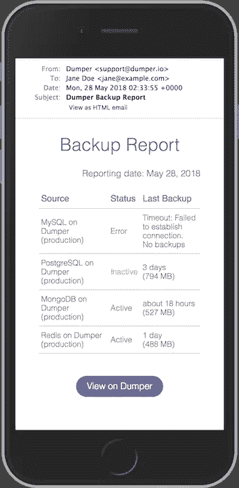

# 房间里的大象:数据库备份

> 原文：<https://medium.com/hackernoon/elephant-in-the-room-database-backup-574da50e6d88>

Photo by [Alexandre Chambon](https://unsplash.com/photos/A7fqqy2JkaE?utm_source=unsplash&utm_medium=referral&utm_content=creditCopyText)

> 披露: [**歧**](https://bit.ly/2lk2sCG) **，**开发商 marketplace，此前曾赞助黑客正午。 [**使用 code HACKERNOON2018 获得任何服务 10 美元优惠。**](https://bit.ly/2lk2sCG)

我们已经看过很多次了。然而，它仍然定期发生，好像这个慢性问题没有永久的治疗方法。

大约 9 年前， [Sidekick](https://en.wikipedia.org/wiki/Danger_Hiptop) ，一款当时流行的 T-Mobile 智能手机，[在云端丢失了所有用户数据](https://en.wikipedia.org/wiki/2009_Sidekick_data_loss)，导致 80 万用户无法访问他们自己的个人数据，如电子邮件、笔记、联系人、日历和照片。

后来，微软决定停止云服务，并最终停止销售该设备。

结果，一个庞大的企业及其生态系统不复存在。这是云计算历史上最大的灾难。

[GitLab 还遭遇了](https://about.gitlab.com/2017/02/10/postmortem-of-database-outage-of-january-31/)故障恢复程序，当时一名工程师在他们的主数据库上运行`rm -rf /important-data`，意外删除了错误服务器上的一个目录。

> 旁注:赞扬他们的透明度！GitLab 提供了房间里大象的完整图片和解剖结构，这在野外或临床环境中很难得到。他们的尸检具有巨大的教育价值。

引用自[现场笔记](https://www.theregister.co.uk/2017/02/01/gitlab_data_loss/):

> 换句话说，在部署的 5 种备份/复制技术中，没有一种能够可靠地工作，也没有一种是一开始就设置好的。

5 层冗余中有 5 层失效？对于一家当时筹集了 2500 多万美元的公司来说，这怎么可能呢？

一定有我们所有人都可以学习的东西。让我们深入研究一下。

# 那是怎么发生的？

[3–2–1 备份](https://www.backblaze.com/blog/the-3-2-1-backup-strategy/)是系统管理员公认的信条，这意味着至少要有 3 份数据副本，其中 2 份在本地但在不同的设备上，至少 1 份在异地。

GitLab 遵循这一原则，在本地快照和热备用的基础上进行异地备份。除了他们*认为他们做到了。*

*   【PostgreSQL 主机之间的复制用于故障转移目的，而不是用于灾难恢复。(当出现错误或人为错误时，它不会有所帮助——它只会立即复制错误。)
*   Azure 磁盘快照在文件服务器上运行，但不在数据库上运行。无论如何，恢复速度太慢，在一个这样的案例中，恢复一个快照需要一个多星期。
*   **LVM 快照**每 24 小时拍摄一次，但幸运的是，其中一个快照是在停机前大约 6 小时手动拍摄的，最终选择从该快照进行恢复。
*   使用 cron 和`pg_dump`的常规**异地备份**已经**无声地失败**，产生的文件只有几个字节大小。S3 桶是空的，而且没有最近的备份被发现在任何地方。
*   针对任何 cronjob 失败启用了通知，但是 [SMTP 认证](https://dmarc.org/)在 cronjobs 上不活动，导致所有通知电子邮件被收件人拒绝。这意味着他们从未意识到备份失败，直到为时已晚。

如果你认为这是样本量为 1 的边缘情况，请继续阅读。

你可能不熟悉**空备份**位，但实际上这很常见。

当服务器与客户端不兼容时，PostgreSQL 和 MySQL 的备份工具(`pg_dump`和`mysqldump`)会无声地失败，产生几乎(但不是完全)空的转储。

我甚至[报告了这个问题，并建议自己对 MySQL 进行修复](https://bugs.mysql.com/bug.php?id=67507)。

> 如果您只是 cp / tar / rsync 数据库文件，您很可能得到完全损坏的数据，除非您首先关闭数据库。详情见[此处](https://www.postgresql.org/docs/10/static/backup-file.html)。

当您第一次编写 cron 脚本时，一切都正常，但是几个月或几年后，随着您的业务增长、扩展和升级系统的某些部分，它将停止工作。

最糟糕的部分？就在你需要它们的时候，你发现没有备份。

**任何有足够经验的系统管理员在其职业生涯中都曾多次目睹 cronjobs 默默无闻地失败。**

GitLab 能够从停机前 6 小时拍摄的 LVM 快照中恢复，但如果是存储设备的物理损坏呢？LVM 快照不会有帮助，因为快照保存在同一个物理磁盘中。

> 顺便说一下，你知道攻击者可以通过[播放超声波来破坏你的硬盘](https://thehackernews.com/2018/05/hard-drive-failure-hack.html)吗？

如果没有异地备份，他们会留下一个空白数据库，从第一天起就丢失所有客户数据。

如果你正在亚马逊 RDS 上使用数据库快照，或者使用 [DigitalOcean](https://m.do.co/c/815fd3260251) 或 [Linode](https://www.linode.com/?r=3f9f0a7f1107a6d1ef1b88a247657f010604fdc6) 的备份功能，了解它们的局限性，并记住备份保存在同一个物理磁盘上。它们不是用于灾难恢复的。

到目前为止，您已经了解到即使在云计算时代，异地备份也是必须的。但与此同时，很难检测备份何时正在运行，而只是进行空转储。

最佳实践是什么？

# 接受任何东西都可能破碎

如果您是一家小型企业，无力聘请专门的开发人员和/或数据库管理员定期手动测试恢复程序，您能做些什么吗？

有太多可能的例外，你无法提前做好准备，这将打破 cronjob。例如，你无法知道所有东西的未来版本会发生什么。

系统升级是最临时的、一次性的程序之一，不能一概而论，很难为这种事情设定操作规则。

当出现问题时，最后一招似乎是可靠的通知。

但是**“没有消息就是好消息”并不适用于**当通知系统也可能崩溃的时候，正如 GitLab 的案例所示。

解决方案？除了实时的错误通知之外，以合理的频率发送备份报告，这不会造成“通知盲”，但会让您在停止接收它们时注意到。每周或每月一次是明智的。还要确保检测转储文件大小变化中的标准偏差异常。

或者你可以注册 [Dumper](https://dumper.io/) ，它就是这么做的。

# 即使备份看起来很好…

最后，即使您有一个工作的异地备份，也有转储可能被破坏的情况，直到您实际恢复数据库并浏览数据时，您才能注意到这一点。

例如，`mysqldump`将根据客户的字符集和您最喜欢的表情符号进行转储，例如🍣和🍺在`utf8mb4`可能会被破坏，由备份中的`?`替换。如果你从未检查过，现在就去做。设置`--default-character-set=binary`选项即可——不客气。

或者，如果您错过了`--single-transaction`选项，您可能会有不一致的备份(例如，物品易手，但资金未转移)，即使您定期手动测试恢复程序，也不容易发现这些备份。

当您的数据集增长到每天执行完整的逻辑转储太慢的程度时，您需要考虑归档 WAL/binlog 以实现增量备份和时间点恢复。(稍后详细介绍—注册我们的邮件列表！)

是的，我知道这听起来很疯狂。这也是为什么我建造了[Dumper](https://dumper.io/)——备份不应该这么难。

*如果你想阅读更多这样的内容，请访问* [*Dumper 博客*](https://blog.dumper.io/) *并订阅邮件列表。也可以在 Twitter 上* [*关注我*](https://twitter.com/@kenn) *。除非你 100%确定你的备份脚本在工作，否则请查看* [*转储器*](https://dumper.io/) *，异地备份即服务。*