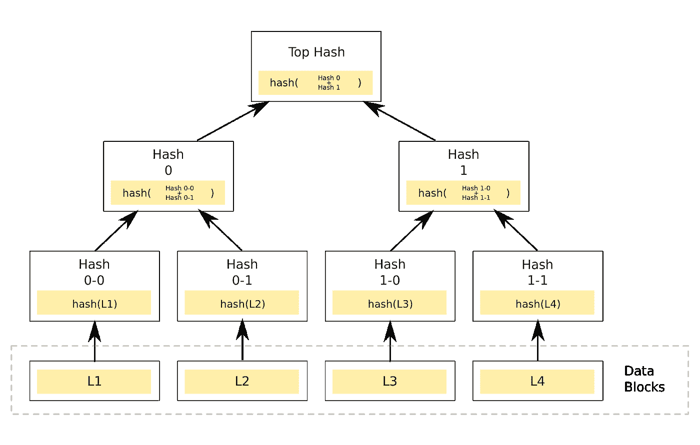
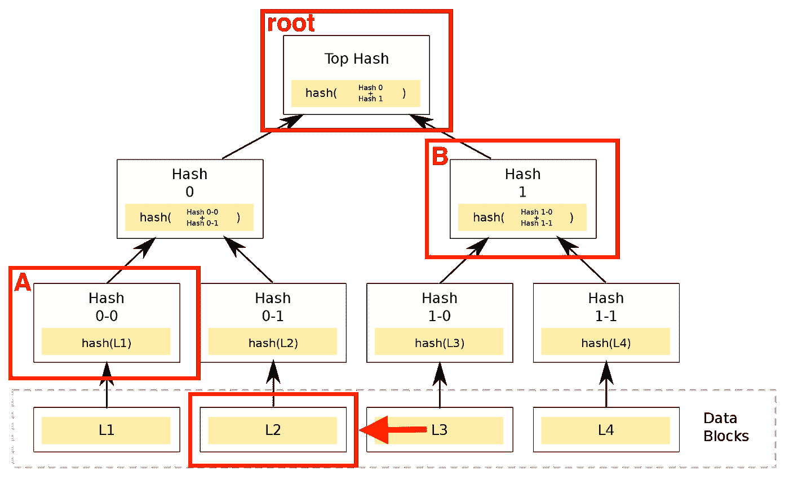

# ELI5:等离子现金——缩放以太坊

> 原文：<https://medium.com/hackernoon/eli5-plasma-cash-ff242c55e8de>

本文希望以清晰全面的方式解释什么是血浆现金，以及它如何帮助解决以太坊的可扩展性问题。它还将解释使用等离子体时的权衡。这篇文章面向初级和中级读者。

等离子现金是以太坊区块链的扩展解决方案。它利用侧链进行更快更便宜的交易，并定期向主以太网检查其状态，以利用主网络的安全性和去中心化。

血浆现金是血浆框架的一个变种。其他变体包括血浆借记和血浆 MVP。都有些相似。

# 问题是

以太坊区块链每秒可以处理大约 10–28 个交易。当网络拥塞时，用户不得不等待更长时间来处理他们的交易。即使网络没有超载，以太坊交易也是缓慢而昂贵的。

28 TPS 的限制来自以太坊的气体限制和块的处理速度。在以太坊，每笔交易都要使用一定量的气体。一个简单的交易，比如给某人送乙醚，要花 21，000 美元。更复杂的智能合约交易可能会耗费数百万天然气。

以太坊将允许每个区块最多 800 万天然气，开采一个区块平均需要 14 秒。这意味着每个块最多可以包含大约 400 个事务(大约 8，000，000 / 21，000)。这为我们提供了大约 28 TPS (400 / 14)的最大吞吐量。

在进行交易时，人们必须为所用的汽油付费。这笔费用支付给交易的矿工。人们可以选择他们希望的任何天然气价格，但如果没有适当的激励，矿商不会将交易纳入一个区块。此外，如果网络拥塞，一个区块已满，矿工必须选择包括哪些交易。矿商可能会选择支付更多天然气的交易。一般来说，一个人付的油钱越多，交易处理的速度就越快。

如今，天然气价格通常为 1-2 gwei(10^-9 乙醚)。这意味着使用 21，000 汽油的简单交易将花费发送者 0.01 美元(200 * 21，000 * 2 * 10^-9，假设乙醚的价格为 200 美元，汽油价格为 2 Gwei)。2018 年初，乙醚的价格为 1400 美元，在高峰时期，人们必须支付 50+ Gwei 才能在合理的时间内处理一笔交易。在这些条件下，简单的交易成本为 3.50 美元，复杂的智能合约交易成本超过 20 美元。繁殖你的小猫咪要付出很大的代价。

# 寻找解决方案

有几种不同的方法来解决这些问题。一些提议的解决方案对核心以太坊协议进行了修改。这些解决方案被称为第 1 层解决方案。

其他方法建立在现有基础设施之上，并将一些处理脱离链。这种类型的解决方案被称为第 2 层解决方案。

等离子现金是第 2 层扩展解决方案。

它利用了两个关键的见解:

1.  多个区块链可以处理比单个区块链更大的吞吐量。如果一个区块链可以处理 25 TPS，那么 10 个区块链可以处理 250 TPS。
2.  如果我们在安全性和去中心化方面不像以太坊那样严格，处理大得多的吞吐量是可能的。以太坊使用工作证明。如果我们不这样做，我们可以处理更大的负载。

然而，挑战在于确保事物保持安全、可信和分散。工作证明的存在是有原因的。

一个人可以创建一个系统，在这个系统中，一个人向另一个人转移价值所需要做的就是用私钥签署一个交易。这种系统的问题是，一个用户可以签署两项交易，向两个不同的人支付相同的款项，这就是“重复消费”问题。以不可信和分散的方式解决这个问题并不简单。比特币以及随后的以太坊使用工作证明解决了这个问题。

如果我们创建一个不使用工作证明或不太关心去中心化的侧链，它将能够处理大得多的吞吐量，但是什么将防止双重花费呢？有没有一种方法，我们可以利用主以太网来避免双重花费，同时使用侧链来执行快速和廉价的交易？

# 血浆现金解决方案

血浆现金建立在上述原则和利用两个区块链:主以太坊链和血浆侧链。主链为系统提供安全性。侧链提供了快速和廉价的交易。

等离子体侧链能够使用任何期望的一致机制，甚至可以完全集中。由于它能够使用任何共识机制，因此它可以处理更大的吞吐量——每秒钟可能处理数千个事务。

硬币可以在主链和侧链之间来回转移。一个人可以将资金从主链转移到侧链，然后将这些资金转移到侧链上的其他人，然后这个人再转移到其他人，如此类推。最终，有人可能会决定从侧链中取出资金，使其再次出现在主链账户中。

出现的一个问题是主链如何知道硬币的真正主人。如果 Alice 在侧链上将资金转移给 Bob，而 Alice 和 Bob 现在都试图将资金撤回到主链，那么主链如何知道哪一次撤回是有效的呢？如果 Charles 也试图兑现这枚硬币，并声称 Bob 后来将资金寄给了他，该怎么办？

一个简单的解决方案是让侧链在每次事务发生时更新主链。主链现在可以轻松地检查真正的所有者，并将锁定的资金释放给真正的所有者。但是这个解决方案有一个明显的缺陷。如果发生在侧链上的每一个事务都被发送到主链，系统仍然会很慢而且很昂贵，为什么还要使用侧链呢？

更好的解决方案是将许多侧链事务批处理在一起，然后将这个批处理的压缩版本一次性提交给主链。这是血浆现金解决方案。

例如，1，000 个交易在一分钟内在侧链上发生。然后，sidechain 操作员将所有 1，000 个事务分组在一起，压缩该组，并将压缩后的数据提交给主链。

使用 Merkle 树，我们可以将大型数据集压缩到极小的尺寸。在执行这种压缩时，我们实际上会丢失大量数据(这就是所谓的有损压缩算法)，这就是我们能够将数据压缩到如此之小的原因。但是 Merkle 树的魔力意味着我们仍然有足够的信息来验证硬币的真正主人。我们将在下面更详细地介绍 Merkle 树的魔力。

使用这个系统，我们现在可以处理 400 * 1，000 = 400，000 个事务，而不是局限于每个以太坊块 400 个事务。如果每批包含超过 1000 笔交易，我们可以处理更多。

现在，当 Bob 希望提款时，主链智能合同可以检查压缩数据，以验证 Bob 是资金的真正所有者。

# 安全性

我们提到侧链可以使用任何共识机制，这就是为什么它每秒可以处理如此多的事务。人们必须相信侧链操作者吗？

侧链操作员的工作是收集事务，将它们批处理在一起，并提交给主链。操作员不能为其他人签署交易，因为他们不拥有帐户的私钥。操作员也不负责主链上的撤回。这是用户的工作，侧链操作员不能阻止撤销请求。

然而，侧链运营商可以决定提交双重花费交易(例如，提交两个交易，一个是 Alice 向 Bob 发送硬币，另一个是 Alice 向 Charles 发送相同的硬币)。操作员还可以决定审查事务(例如，Alice 向 Bob 发送了一枚硬币，但是操作员从不将该事务放入提交给 mainchain 的块中)。

以上两种情况都有可能，但每种都可以处理。

在侧链操作员向主链提交双重花费的情况下，首先提交的交易被认为是有效的。如果从 Alice 到 Bob 的签名交易首先被提交，那么 Bob 将是可以在主链上兑现的人。

Charles 需要留意提交给主链的所有块。如果他看到包含 Alice 对 Bob 的传输的块已经被提交到主链，那么他将知道 Alice 对他的事务是无效的。

在侧链运营商决定审查交易的情况下，硬币所有者将不得不自己撤回他们的资金。例如，如果 Alice 希望给 Bob 发送一枚硬币，但是交易从未提交到主链，Bob 应该认为交易没有发生。如果 Alice 在任何情况下都希望将硬币发送给 Bob，她应该将硬币提取到主链，然后将资金发送给他。这显然是一件令人烦恼的事情，但问题是操作员无法阻止 Alice 向 Bob 转账。如果侧链运营商希望保持良好的声誉，他们不会审查交易，并意识到审查在任何情况下都是徒劳的。他们能做的最坏的事情是给用户带来一些轻微的烦恼。

如果你想阅读更多关于退出场景的文章，我推荐卡尔·弗罗施的这篇文章:

 [## 血浆现金简单规格

### 这是第一次通过血浆现金链的完整规范，基于对每个…

卡尔科技](https://karl.tech/plasma-cash-simple-spec/) 

# 履行

我们已经解释了血浆现金的核心部分。现在，我们将深入探讨上面提到的一些项目的更多细节。

当我们谈论将资金从主链转移到侧链时，实际上发生的是资金被锁定在主链上的智能合约中。然后侧链创造了一个同样价值的硬币。一旦有人决定从侧链中取出一枚硬币，硬币就会在侧链上被销毁，在一定的等待时间结束后，资金会在主链上解锁，并被发送到取款人的帐户。

每枚硬币都有一个独特的识别号。一枚硬币不能被分解成更小的碎片。两个独立的硬币也不能组合成一个硬币。这类似于物理硬币或纸币。一张 10 美元的钞票不能和另一张 10 美元的钞票组合成一张 20 美元的钞票。也不能把一张 10 美元的钞票破成两张 5 美元的钞票。如果一个人想付给某人 5 美元，但只有 10 美元的钞票，他们将不得不要求 5 美元的零钱。等离子现金币也是如此。

用户可以通过签署交易并将其提交给侧链操作员，将以太网转移给侧链上的另一个用户。

sidechain 运算符将事务分组到块中。用块事务作为 Merkle 树的叶子来创建稀疏 Merkle 树。一枚硬币的交易我将是这棵树的第一片叶子。例如，涉及 id 为 10 的硬币的交易将是树的第 10 片叶子。(更多关于 Merkle 树的信息见下文)。

sidechain 运营商将每个区块的 Merkle 根提交给 mainchain 智能合同。由侧链运营商决定他们提交块的频率。

当用户希望从侧链中提款时，他们提交提款请求，该请求包括他们收到硬币的交易以及 Merkle 证明。使用 Merkle 证明，智能合约可以验证该事务确实包含在由侧链操作者先前提交的侧链块中。智能合约还检查签署侧链交易的账户。

当提交撤销请求时，质询期开始(例如一周)。在此期间，任何人都可以质疑说，撤回请求是无效的。人们通过提交硬币真正主人的证明来做到这一点。例如，如果 Alice 在块 3 中向 Bob 发送了一枚硬币，并且在块 4 中向 Charles 发送了相同的硬币，那么如果 Charles 试图撤回该硬币，某人可以提交该硬币实际上在较早的块中被转移给其他人的证明，从而取消 Charles 的无效撤回。

提款请求和质询需要用户投入资金。如果提款请求或质询被发现是欺诈性的，这些资金将被削减，从而打消人们试图欺骗系统的念头。

如果没有成功的挑战，则在等待期结束后，资金可用于释放到取款人的账户中。

# Merkle 树

上面我们跳过的一个项目是 Merkle 树和样张。下面是更详细的解释，以填补缺失的部分:

> Merkle 树是一种防篡改数据结构，它允许将大量数据压缩到单个散列中，并且可以通过在对数空间中构造的证明来查询数据中特定元素的存在。
> 
> [*https://github.com/adjoint-io/merkle-tree*](https://github.com/adjoint-io/merkle-tree)

*Merkle 树看起来像这样:*

**

*Merkle Tree*

*上图中的每个矩形称为一个节点。二进制 Merkle 树有一个根节点(图像顶部的节点)，有两个分支指向另外两个节点。在到达树的底部之前，树中的每个节点都有两个子节点。上图在底层有四个节点，但是你可以有一个深度为 10 的树，在底层有 1024 个节点。*

*Merkle 树是一些数据的压缩版本，其中数据被分成一定数量的部分，每个叶节点是这些部分之一的散列。每个父节点是其两个子节点连接在一起的散列。*

*例如，在上图中，我们的数据分为 4 个数据块:L1、L2、L3 和 L4。我们有 4 个叶节点，分别是每个部分的散列。因此，节点 0–0 是 L1 的散列，节点 0–1 是 L2 的散列，依此类推。那么节点 0 是 0–0 和 0–1 的组合，根节点是节点 0 和节点 1 的组合。*

*在我们的例子中，每个哈希都是加密哈希，这意味着您无法从输出中判断出哈希函数的输入是什么。这类似于公钥和私钥的工作方式。在私钥上执行加密散列会给你一个公钥，但是只知道公钥，你就不能算出私钥是什么。*

*我们从所有这些中得到的是我们数据的压缩版本。从根节点，您将无法计算出数据块是什么，但如果您有根节点和数据，您将能够验证这个根节点确实是该数据的 Merkle 根。*

*我们示例中的数据是 L1、L2、L3 和 L4。这可以是四个字“你好我是 Satoshi”(我不是；))或者它可以是文本、图像或视频的段落。无论你喜欢什么。*

*榧树是另一个大量使用 Merkle 树的例子。当你通过 torrent 下载东西时，你会从很多不同的电脑上收到很多小的数据。有人可能会决定向您发送恶意代码。您的 torrent 客户端如何验证它正在接收它所期望的数据片段？它通过从可信来源下载数据的 Merkle 根来做到这一点。这是一个非常小的数据片段，但有了它，您可以验证您刚刚下载的 1GB 电影是您所期望的。如果有人给你发送了一个无效的数据，你的 torrent 客户端会向网络中的另一台计算机请求正确的数据，直到哈希与根节点匹配。*

*Merkle 树的一个很好的特性是你不需要下载整个树来验证它的一部分。您只需要验证一条沿树向上的路径。在我们的例子中，如果有人给我发送节点 0–0 和节点 1，我可以验证 L2 是树的一部分。然后，我可以做我需要的所有散列来验证根节点是否是预期的。我不需要被发送到树中的任何其他节点来做这件事。这个过程被称为 Merkle 证明——通过只发送树的一个分支来证明一个节点在树中。*

**

*Merkle Proof*

*如果你想了解更多关于 Merkle Trees 的信息，我推荐这篇文章:*

* [## Merkle Tree |卓越的数学和科学维基

### Merkle 树是一种基于散列的数据结构，是散列列表的推广。这是一个树形结构，其中…

brilliant.org](https://brilliant.org/wiki/merkle-tree/) 

# 血浆现金中的 Merkle 树

在 Plasma Cash 中，侧链操作符将每个块的 Merkle 根发布到主链。如果用户想要证明他们的交易包含在块中，他们将 Merkle 证明发送到智能合约，智能合约验证该交易实际上包含在块中。

在血浆现金中，Merkle 树的叶子代表交易。如果硬币 I 的交易发生，它被放置为树的叶子 I。例如，如果 Alice 将 id 为 17 的硬币发送给 Bob，则该事务被放置在树中的叶子 L17 中。如果在该块中没有进行硬币 17 的交易，则 L17 正好为 0。一枚硬币只能在一个区块内进行一次交易。如果 Bob 想要将硬币 17 转移给 Charles，则该交易将在下一个块或稍后进行。

# 血浆现金的问题

等离子现金对以太坊网络的规模有很大帮助，但它仍然存在一些问题。

一个问题是，人们不能汇任意多的钱。硬币不能分割或合并，所以如果爱丽丝只有一个 5 以太硬币，鲍勃只有一个 1 以太硬币，那么爱丽丝将不能给鲍勃 3 以太，因为他没有正确的零钱。

解决这个问题的一个办法是拥有一个变革者。爱丽丝会把她的 5 以太币寄给找零员，并会收到 3 以太币和 2 以太币作为回报，然后就可以付给鲍勃了。

另一个解决方案是血浆借记，允许任意规模的支付。它的工作方式类似于血浆现金，但略有不同的 Merkle 树，硬币中存储的金额可以波动，允许任意大小的支付。您可以在此了解有关血浆借记的更多信息:

 [## 血浆借记

### 一个学习 plasma 的教育资源，一个构建可扩展区块链应用的框架。

www.learnplasma.org](https://www.learnplasma.org/en/learn/debit.html) 

另一个需要处理的项目是监视欺诈性的出口。假设你能挑战欺诈性的退出，血浆现金是安全的，但是如果你不看或不注意，你的钱可能会被偷。一个解决方案是让一个服务代表你监视网络，但你必须信任这个服务来完成它的工作，以防有人试图窃取你的硬币。运行多种监视服务，并通过经济激励来阻止大型网络上的欺诈性退出，可能是一个足够好的解决方案。

第三个问题是交易的终结。如果你在侧链上被发送了以太网，你不能认为事务是最终的，直到侧链操作者向主链提交了包含事务的块的 Merkle 根。这意味着处理一个块的最快速度就是主链处理一个块的速度。如果 sidechain 操作符每小时发布一次块，那么您需要等待整整一个小时才能将事务视为最终事务。

如果您寻求快速终结，并且不介意为要处理的事务支付少量的以太网费用，那么在主链上处理事务仍然是您的最佳选择。如果你愿意相信侧链运营商发布块，那么侧链有他们的好处。在网络拥塞、侧链运营商经常向主链发布内容的情况下，这是侧链的最大优势所在。

**结论**

等离子现金使用一个聪明的系统，包括侧链和 Merkle 根来扩展以太网。对于等离子体来说，现在完成第一次实现还为时尚早。

**示例代码**

织机:【https://github.com/loomnetwork/plasma-cash 

https://github.com/omisego/plasma-cash

更多:[https://ethreseear . ch/t/wtf-is-plasma-link-and-info-repo-catching-people-up-on-plasma/2519/3](https://ethresear.ch/t/wtf-is-plasma-link-and-info-repo-catching-people-up-on-plasma/2519/3?u=elie222)

**延伸阅读**

[https://karl.tech/plasma-cash-simple-spec/](https://karl.tech/plasma-cash-simple-spec/)

[https://github . com/loom network/plasma-paper/blob/master/plasma _ cash . pdf](https://github.com/loomnetwork/plasma-paper/blob/master/plasma_cash.pdf)

[https://www.learnplasma.org/en/learn/cash.html](https://www.learnplasma.org/en/learn/cash.html)

[https://plasma.io/](https://plasma.io/)

**关于我**

我是一名全栈和区块链自由开发者。欢迎在评论中提出你的想法。*