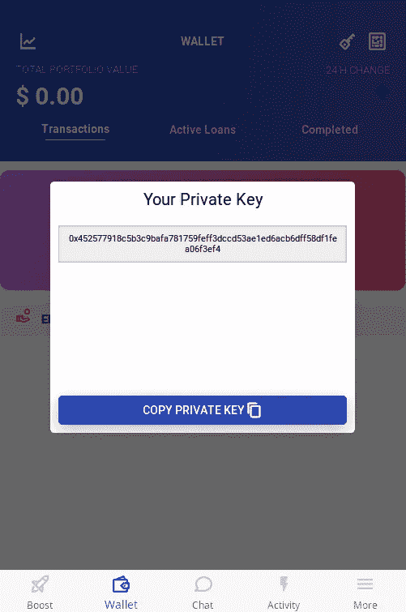
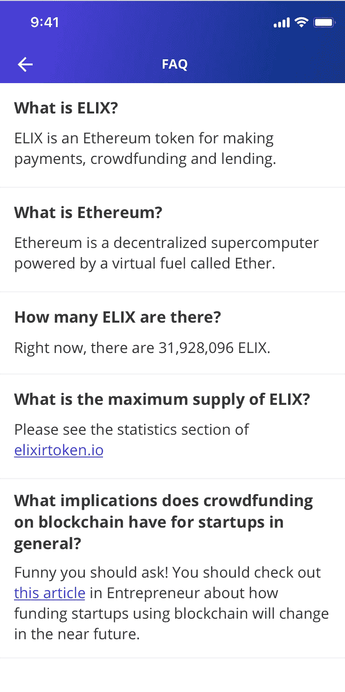
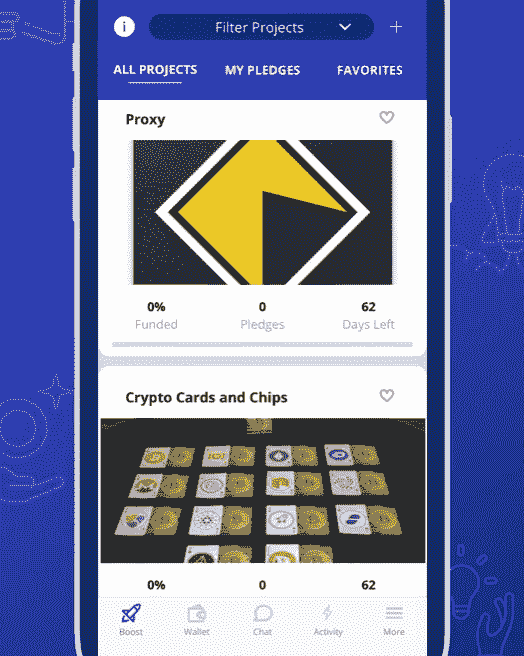
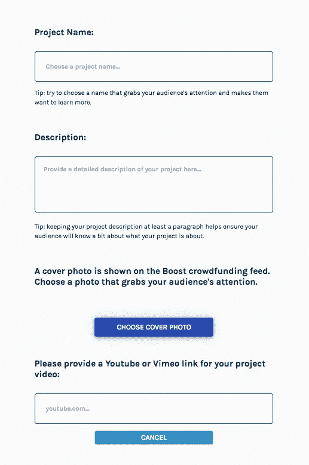

# ELIX 应用改进、自动化、第二次赠品+更多

> 原文：<https://medium.com/hackernoon/elix-app-improvements-automation-second-giveaway-more-26cc32efc276>

欢迎来到本周的 ELIX 更新！这是忙碌的一周，我们很高兴向我们的社区更新我们在 ELIX 方面的进展。

**下载 ELIX 应用**

点击下图下载 iOS 版。

点击下图下载安卓版。

**第二次赠送**

感谢大家参与最近的赠品。今天晚上结束前会给获胜者发电子邮件。恭喜所有赢的人！如果你没有机会赢得这个赠品，那么你会有另一个机会！

在接下来的一周，我们将向更多用户发放赠品和奖金，以便我们能够收集更多信息和反馈，做出数据驱动的决策。赠品旨在推动更多的应用程序下载，奖金旨在提高 Elixir 的品牌知名度。请务必在 Twitter、脸书和 Telegram 上关注我们，不要错过这些绝佳的机会！

**App 改进**

我们已经修复了大量的 bug，增加了一个 FAQ 页面，致力于显示新兼容的私钥，并致力于我们计划纳入我们网站的新博客文章。我们本周做的一个改进是在应用程序中加入了新的私钥显示。这将允许人们在不使用我们的平台的情况下访问他们的钱包。下面是新的私钥接口的外观:

这是应用程序中新的常见问题页面的示例:

我们还在应用程序中添加了几个新项目。点击下载链接[的应用程序，查看它们！](https://www.elixirtoken.io/)

Sample New Projects On The ELIX App

**自动化项目**

Creators can choose to feature a project video or several photos (shown upon selection) for their campaign. They can also select a cover photo for their campaign.

我们花了大量时间在应用程序上设置项目，但我们希望减少时间。为此，我们需要自动化在 ELIX 应用程序上列出和编辑产品的过程。设计团队目前正在设计一个网页来上传和编辑这些信息。自动化是关键的一步，因为它将允许我们的开发人员花更多的时间来构建新功能，而不是列出和编辑产品。从长远来看，这意味着我们只需要批准提交的项目，就可以在我们的应用程序上查看它们。

本周我们很兴奋地宣布，上传 Boost 众筹项目的 UI 现已完成。下一步是将这个页面连接到后端。

Building tools to speed up how creators and backers manage projects will allow many more creators to join the platform faster.

**菲亚特整合**

除了自动化之外，集成更容易使用的支付形式也是扩展该平台的一种方式。这意味着我们将能够接触到更多来自不同空间的创作者，并让他们使用我们的应用程序。如果合并了其他货币，ELIX 可以用作折扣和奖励令牌。我们目前正在探索和研究这一方案。

**向我们发送您的反馈**

如果您还没有，请在此向我们发送您对应用程序[的反馈。这有助于我们规划该应用程序的未来功能，并收集大家想看到的反馈。我们已经从社区得到了很多很好的反馈！](https://docs.google.com/forms/d/1pMpJzhoSdR_nt9Wsju8BF5JUJrrzFr9PsGTZcnLeetM)

**计时**

虽然我们不经常评论一般的市场情绪，因为我们关注的是效用而不是价格，但有时还是值得简单谈谈。对我们的应用和网站进行迭代和改进的最佳时机就是现在，即使市场在下跌。这意味着，一旦应用程序有足够的效用来实现有机增长，想必到那时市场将会复苏。总体而言，无论是在加密领域还是在 T4 经济领域都是如此。

请务必在我们的[主页](https://www.elixirtoken.io/)上注册，并通过社交媒体在 [Reddit](https://www.reddit.com/r/elixirtoken/) 、 [Twitter](http://twitter.com/elixtoken/) 、 [Discord](https://discord.gg/mu4EJaz) 和 [Telegram](https://t.me/ElixirToken) 上进行连接。我们还有[脸书](https://www.facebook.com/elixirtoken/)和 [Instagram](https://www.instagram.com/elixtoken/) 页面，你可以在我们的[网站](https://www.elixirtoken.io/)底部注册订阅时事通讯。要创建自己的项目，请在此注册成为早期创建者[。敬请关注我们的中型博客](https://www.elixirtoken.io/boost)以获得令人兴奋的更新！

