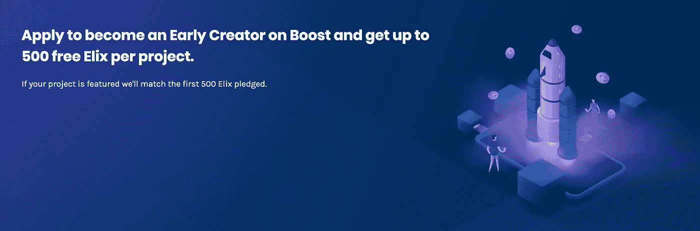
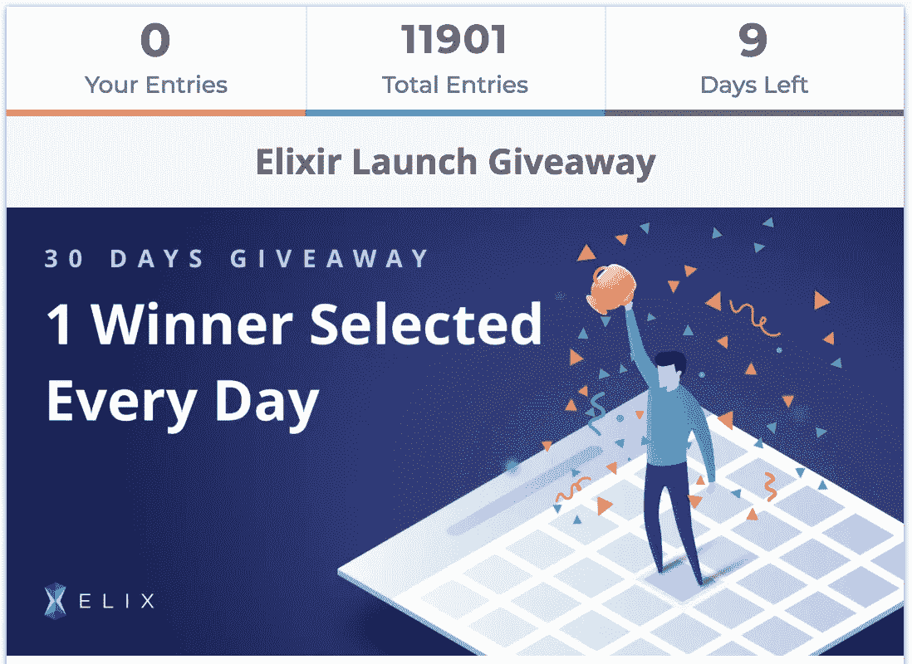
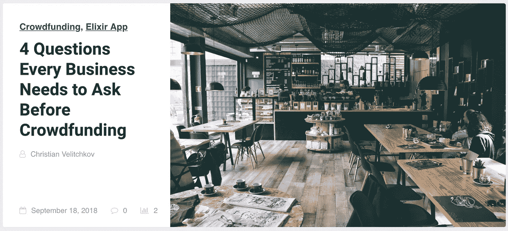
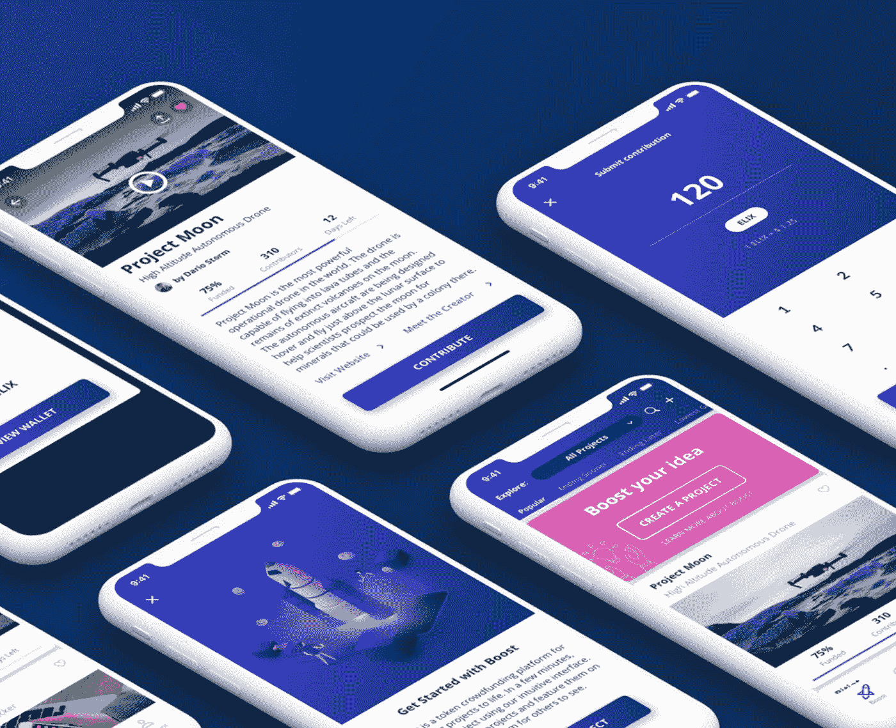

# ELIX 每周更新:创建者注册视频演示和新博客文章

> 原文：<https://medium.com/hackernoon/elix-weekly-update-creator-signup-video-demo-new-blog-article-710066be6a31>

欢迎来到本周的 ELIX 更新！请继续阅读，了解我们所做的所有最新改进。

**获取 ELIX 应用程序**

一定要试试我们的众筹 app。点击下图下载 iOS 版。

点击下图下载安卓版。

**创作者门户**

Click here to submit a crowdfunding project

如果你是一名创造者，并且正在寻求众筹项目，一定要向 https://www.elixirtoken.io/boost[提交一个众筹项目！](https://www.elixirtoken.io/boost)

**赠品**

Click on the image to participate in the latest giveaway

如果你还没有，请点击参与我们最新的赠品[。每天将选出一名获胜者。](https://www.elixirtoken.io/giveaway)

**视频演示**

在与许多创作者交谈后，我们发现他们希望有一种方式来添加、编辑和管理他们的活动和产品。本周，我们完成了注册流程，创建了一个新的创建者帐户并添加了一个新产品。这是一个演示视频，展示了实际操作:

**新博客文章**

Click on the image to check out our latest blog article

想知道前 10 大众筹中有多少是与区块链相关的吗？点击查看我们最新的博客文章[。你也可以在我们的](https://blog.elixirtoken.io/how-many-of-the-top-10-crowdfunding-projects-use-blockchain/)[网站博客](https://blog.elixirtoken.io/)上读到许多其他有趣的文章。

我们还刚刚发布了一篇文章，讨论了新企业在考虑众筹时应该问的问题。点击[此处](https://blog.elixirtoken.io/4-questions-every-business-needs-to-ask-before-crowdfunding/)或下图查看文章。

**营销**

我们拓展 Youtube、脸书和 Instagram 等推广渠道的营销工作进展顺利。我们的目标是为长生不老药创造一个草根运动。持续的奖金将有助于招募更好的 boost 项目，围绕 Elix 建立牵引力，更重要的是，创造更多的内容，建立我们的长期有机增长。请务必点击参与正在进行的赠品活动[，点击](https://www.elixirtoken.io/giveaway)下载应用[！](https://www.elixirtoken.io/)

这星期就这些了！请务必在我们的[主页](https://www.elixirtoken.io/)上注册该应用程序，并通过社交媒体在 [Reddit](https://www.reddit.com/r/elixirtoken/) 、 [Twitter](http://twitter.com/elixtoken/) 、 [Discord](https://discord.gg/mu4EJaz) 和 [Telegram](https://t.me/ElixirToken) 上进行连接。我们还有[脸书](https://www.facebook.com/elixirtoken/)和 [Instagram](https://www.instagram.com/elixtoken/) 页面，你可以在我们的[网站](https://www.elixirtoken.io/)底部注册订阅时事通讯。要创建自己的项目，请在此注册成为早期创建者[。敬请关注我们的中型博客](https://www.elixirtoken.io/boost)以获得令人兴奋的更新！

