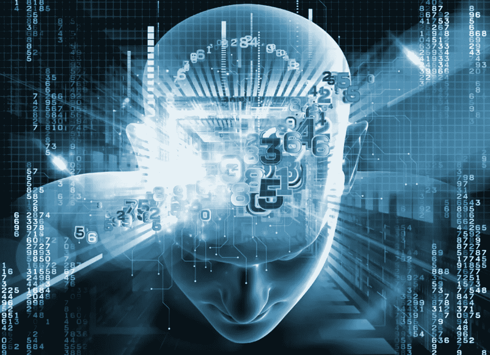

# 拥抱成为一个可编程的生物机器人，控制你自己的渴望。

> 原文：<https://medium.com/hackernoon/embrace-being-a-programmable-biorobot-hack-your-own-cravings-83fc7e79bf12>

有些事情，在某些时候，我开始强烈渴望。这些渴望是程序化的行为，总是以同样的机械的、线性的方式执行。

我不希望这种事发生。所以我花了很多时间仔细观察这些程序是如何执行的。并开发帮助重写它们的方法。

我已经能够完全永久地让自己不再沉迷于社交媒体。在网上与人争论。去玩扑克。对于糖、网飞和电子游戏，我也接近做到这一点。

## 为什么要黑自己？

有很多(不知情的)谈论 insta gram/脸书是如何黑你的。通常伴随着对现实的愤怒。或者否认，尽管证据确凿。

一个更有建设性的方法是接受现实。拥抱真实的自己——一个遵循一系列程序的生物机器人。

想办法观察程序是如何执行的。为你自己的目标服务。Instagram 试图黑你为他们服务的方式。

## 我说的“渴望”是什么意思？

基本上，当我知道某件事对我有害时，在特定时刻执行的程序会变得非常有吸引力，难以抗拒。

我认为“上瘾”是一个非常相似的概念。

## 我渴望什么，何时:

我目前渴望做三件事:吃**糖**，看**网飞**，玩**电子游戏**。

这只发生在晚上，当某些诱因出现，意志力较低的时候。

## 为什么我想摆脱这些？

*   糖对你非常不好。无论多少。原因很多。这是当今世界无可争议的事实。就像“香烟对你有害。”
*   网飞/视频游戏每天仍然需要 1-2 个小时，我想把这些时间花在更有用的休息上。和朋友在一起，冥想，阅读，睡觉，听播客，去温泉等等。如果我能够用后者永久取代前者，那将是我人生的一大胜利。

总的来说，我喜欢个人成长。我想更容易地重新编程和改变自己。很明显，对习惯重新编程的能力是一种“肌肉”。它本身是可以训练的。

所以每次我改变一个习惯都会产生二级后果。重新规划其他习惯变得更加容易。

最后一点非常有价值。

## 渴求程序执行的症状是什么？

我的渴望是一个持续的、精确的计划。它总是以相同的方式执行:

*   **启动程序**的触发器。通常吃晚饭，睡觉前放松一下，或者晚上回家。我排除了更明显的诱因，比如周围有变质的食物。上述情境触发因素不容易消除。
*   **幻想身体上表现出渴求**。我的大脑开始构建我去点一些甜点的场景。启动蒸汽和玩游戏。这似乎是各种欲望的标志。例如，如果我冥想很长时间，我会开始幻想站起来，然后腿上的疼痛变红。我和我的治疗师[保罗·孔蒂讨论了这个问题。这似乎是这种程序执行的一种非常常见的方式。大脑的运动中枢实际上开启了。向身体发出信号，让身体将程序付诸行动。](https://peterattiamd.com/paulconti/)
*   **为我为什么要做这件事编造理由**。例如"*我在一家米其林星级餐厅的酒店，我可以在那里吃甜点，这是我在其他地方吃不到的独特甜点*或"*我刚刚在健身房锻炼了 2 个小时，Peter Attia 说这是糖原储备耗尽的时候，糖的危害较小，因为它不会停留在血液中，而是快速进入肌肉/肝脏，所以我应该现在就吃它*或"*我的天才联合创始人在玩视频游戏！他妈的* ***伊隆马斯克*** *玩电子游戏，我要像那家伙一样所以我* ***要*** *玩他们！有趣的是，我的大脑在这里积极地寻找合理化。*

*如果你读过* [*【脑中之象】*](https://www.goodreads.com/book/show/28820444-the-elephant-in-the-brain)*[*【幸福假说】*](https://www.goodreads.com/book/show/96884.The_Happiness_Hypothesis) *或* [*【正义之心】*](https://www.goodreads.com/book/show/11324722-the-righteous-mind) *之类的(强烈推荐)书籍，你会记得这是我们一直在做的事情。首先决定我们想要什么样的结论。然后寻找支持它的论据。我们认为我们是理性的独立思考者。事实上，我们是执行确认偏见程序的机器人。**

*   ***在反对对渴望采取行动的争论中，一种强烈的情绪烦恼的感觉**。一想到在两个小时的健身房锻炼后，我不让自己看瑞克和莫蒂的比赛，我就感到心烦意乱。就 20 分钟！(尽管当然永远不会是 20 分钟)。*

## *渴望项目高度依赖于我是否在前一天采取了行动。结果，我连续多日复发或抗拒。*

*如果在过去的几天里，我屈服于对程序的渴望，它们会变得非常强大，而且通常会赢。除非有某种强大的外在因素驱使我反抗。*

*如果在过去的几天里我一直在抗拒，那么渴望的程序就会变弱或者消失。直到有某种强大的外在因素驱使我屈服，故态复萌。*

*因此，我往往会有几周的复发期和几周的抵制期混杂在一起。*

## *什么样的“强因素”导致了从一个连胜到另一个连胜的转变？*

*让我旧病复发并开始新一轮渴求计划的事情:*

*   *严重消耗意志力的事情——压力、时差、流感等。*
*   ***强有力的情境线索**——例如，我在一家很棒的餐厅，有独特的甜点，这成了故态复萌的借口。或者吃迷幻药吃起来味道 ***好得惊人*** 。一块酸巧克力是你能想象到的最佳口味的交响乐。不吃其实是一种耻辱。一旦我做了，我就会复发。*

*另外，迷幻药不会让人上瘾，这是个奇迹。*

*让我抗拒并开始新一轮忽视渴望项目的事情:*

*   ***强有力的情境线索**——例如，我刚刚和我的奶奶(她不幸患有老年痴呆症)呆了一段时间，还刚刚和我的医生[彼得·阿提亚](https://peterattiamd.com/)谈论了糖似乎是老年痴呆症的主要诱因。还是刚刚看了这篇[非常复杂但是很精彩的关于意志力崩溃的论文](http://picoeconomics.org/PDFarticles/Breakdown_Will.pdf)。它令人信服地指出，如果你今天决定吃糖，你会一直做出同样的选择，从而永远吃下去。而且在其他所有维度上，你也会一辈子意志力较低。哪个我觉得 ***真他妈的不能接受*** 。*
*   ***沉思**。观察 5 分钟的渴望会让它们消失。虽然此刻渴望似乎是永恒的，也是极其重要的。他们就这样消失了。*

# *那么这一切的结论是什么呢？我们如何抑制渴望？*

## *我最成功的渴望黑客——社交媒体*

*我曾经极度沉迷于脸书。*

*我通过禁止它很长时间来修复它。编辑 mac 主机文件，更改密码/2FA 并把它们给其他人，删除应用程序等。*

*在最初的几个星期里，感觉几乎是痛苦的。我会不停地在浏览器中输入“facebook ”,当它无法解决问题时，我会很恼火。我也不知道如何利用这些新发现的空闲时间。*

*一年没用，感觉对它零依恋。我对 Instagram 等也有类似的感觉。*

*我使用了一套类似的技巧来减少在网上和我的文章评论中与人争论的反应。变得越来越容易。*

*我以前也沉迷于网上扑克。*

## *关于黑客渴望的更一般的想法*

*你得观察你自己。注意你自己行为的模式。它们可能和我的不一样。但是模式是存在的。*

> *再说一遍:你是一个由进化构建的可黑客攻击、可编程的生物机器人。你只是在执行程序。拥抱真实的你。Instagram 黑你是为了得到他们想要的东西。所以你必须黑自己才能得到你想要的。*

*对于与我的模式类似的模式，以下内容有效:*

**

1.  ***移除可以移除的触发器**。我手机的主屏幕被设计成最大限度地减少不良触发(信使、instagram 等)。)并最大化好的触发器(书籍、播客)。不幸的是，不可能像我在 Instagram 上过滤我的设备那样过滤世界上的糖。*
2.  ***学会注意渴望的开始。**这是一个非常明显的程序，你可以观察到它被执行。一旦执行的症状出现，冥想 5 分钟。它会消失的。*
3.  ***为控制食欲设置人为障碍**。删除账户，删除游戏，告诉酒店从你的房间里拿走糖果，禁止你进入网上赌场。*
4.  *观察过去的情景行为，作为未来行为的指南。有时人们会说“*哦，所以当你因流感而倒时差时，你必须格外小心，不要做这些事情！*“真是他妈的蠢主意。你是一个不同的人，在倒时差的生病状态和健康的休息良好的状态下。如果你试图从你现在的状态合理化到你未来的状态，你会悲惨地失败。不要否认你的大脑如何执行程序的现实，幻想自己是一个独立的自由意志的实体。*
5.  ***观察什么样的线索驱动阻力。用这些暗示包围你自己。疯狂想法的例子:在厨房墙上挂一些癌细胞的画，并附上一篇关于[沃伯格效应](https://en.wikipedia.org/wiki/Warburg_effect)(糖优先滋养癌细胞)的文章。这里的主要挑战是日常生活的物流。就我而言，我经常旅行，住在酒店房间里，所以没有办法用怪异的艺术来预先装饰它们。***
6.  ***识别导致复发的情况。先发制人地采取行动阻止他们**。就像在开始 3 米其林晚餐时，对侍者和桌子说“*不要给我拿面包。我也不吃糖，请用一些奶酪/坚果/浆果代替我的甜点。*“然后，如果你后来让步了，服务员/你的朋友会认为你是一个混球、软弱的伪君子。这通常是不屈服的强大动力。*

**我想当我服用迷幻药的时候，我也应该去掉所有不好的食物，只留下一些蔬菜。这变得很难，因为其他人反对。再说一遍:日常生活中的后勤工作让这变得很有挑战性。所以，想出在你的生活环境中行得通的想法。**

*当然还有观察和迭代！*

**

*学习重写你的程序有很多好处。特别是在增强重写程序的元程序方面。*

*生物机器人伙伴们，祝你们成长愉快，自我破解成功！*

# *下面是我的一些其他文章。如果你喜欢它们，请分享并关注我，你的反馈有助于我写更多:)*

* [## 如何生物破解你的智力——从性到莫达非尼到摇头丸

### Serge 的其他深度文章:

hackernoon.com](https://hackernoon.com/biohack-your-intelligence-now-or-become-obsolete-97cdd15e395f)  [## 我 32 岁，花了 20 万美元在生物黑客上。变得更平静、更瘦、更外向、更健康、更快乐。

### Serge 的其他深度文章:

hackernoon.com](https://hackernoon.com/im-32-and-spent-200k-on-biohacking-became-calmer-thinner-extroverted-healthier-happier-2a2e846ae113)  [## 我如何设定和执行 50 年目标？

### Serge 的其他深度文章:

hackernoon.com](https://hackernoon.com/how-i-set-and-execute-50-year-goals-why-i-see-cutting-in-lines-as-morally-right-f4d0ce28574f)*