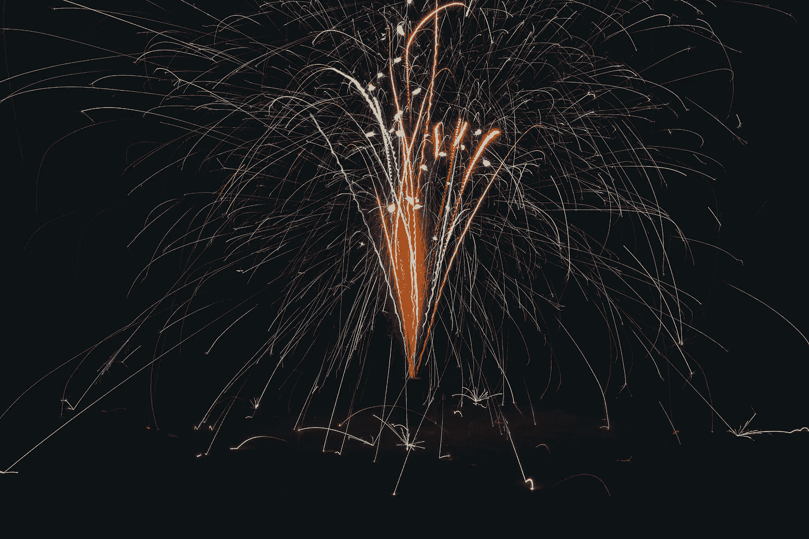
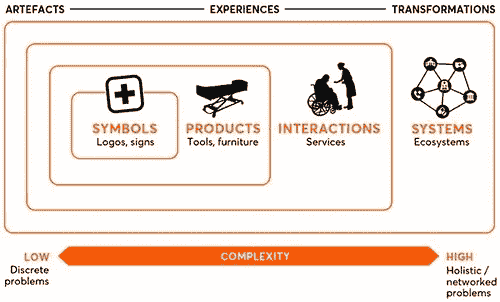
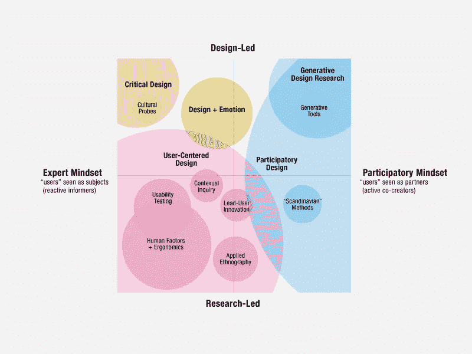
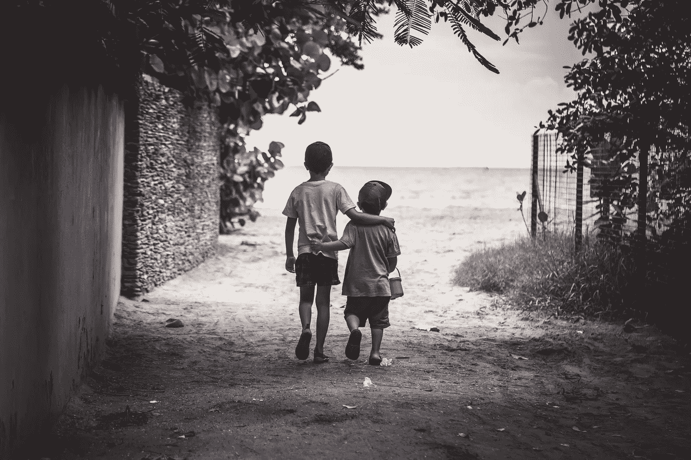

# 紧急设计和黑天鹅:为随机性和敬畏设计一个空间

> 原文：<https://medium.com/hackernoon/emergent-design-and-black-swans-designing-a-space-for-randomness-and-awe-755c3e3782f5>

## 纳西姆·尼古拉斯·塔勒布将黑天鹅定义为高调、难以预测、超出正常预期的事件。

How unpredictable…

黑天鹅对历史事件有不成比例的影响，因为它们的不可预测性，以及事后如何容易被合理化。

我认为这是一个奇妙的概念——延伸得更远一点，似乎存在于我们的生活中。例如，你碰巧在书店看到一本书，你偶然翻阅了一下，在这样做的过程中，你找到了灵感或你用余生去做的事情。这种完全随机和不可预测的事件对你的生活有着不成比例的影响。事后看来，这似乎是显而易见的——“嗯，我喜欢书，经常逛书店。所以为什么我读一本书是如此的不可思议。”

事后看来，所有的黑天鹅似乎都是如此。它们似乎是可以预测的，而且完全显而易见。然而反过来——想象你还没有去书店，也没有找到你喜欢的“东西”。今天是你找到它的日子吗？为什么在书里，而不是别的地方？在你找到之前，你有理由期待找到它吗？对我来说，这就是黑天鹅概念的不可思议之处。即使在我们的个人生活中，我们也有这些不可预测的关键时刻，这些时刻对我们的未来有着不成比例的影响。

## 紧急设计源于大卫·卡瓦洛的工作，他为学习环境中的系统级变化创建了一个理论框架。

我把为涌现而设计定义为通过系统或不可控变量的相互作用为不可预测或不太可能发生的事情创造一个空间。举个例子，我最近做了一些工作，为一个公共装置做体验设计，让用户创造一个自发的声音和灯光的管弦乐队，旁观者可以体验和参与。这创造了一种有趣的关系。装置使用者可以自由试验和玩弄旁观者的反应。不同的声光组合和不同的围观者会产生不同的复合反应。

This isn’t even close to representing what I’m talking about

作为一名设计师，我无法控制这个复合反应是什么。在 bound 内，我无法控制安装用户选择如何与系统交互。我也控制不了具体时间有哪些围观者在看。因此，我也不能控制这两个变量的组合，或者其他很多我不知道的变量。在这种情况下，为涌现而设计就是设计一个空间或系统，在那里这两个代理人可以创造他们之间的时刻。自发的敬畏。

我认为这个概念非常强大——其影响范围从品牌如何在社交媒体上互动，到教育系统如何设计以允许学生的天赋出现。

## 设计的四个层次

Leurs & Roberts(最初来自布坎南和他对邪恶问题的研究)创建了这个贯穿设计“秩序”的图表。

越来越复杂——从符号，到产品，到交互，最后到系统。很容易理解为什么订单变得越来越复杂。符号纯粹是象征性的，而产品既是符号又是实物，有自己的效用和人体工程学的考虑。交互是各种产品、符号和代理之间的接触点。最后，系统跟踪大量的交互(每一个都是交互、产品和符号)以及它们之间的资源流动。

借鉴 Greg Van Alstyne 的工作，我相信为紧急情况而设计是超越系统的一步。它设计了一个(不是物理的，而是有意义的)空间，在这个空间中，系统之间的自发交互可以产生敬畏。系统极其复杂和不透明，因此设计应急方案绝非易事。然而，它也是一种共同创造，而不是为最终使用它的人设计的东西。

桑德斯和设计机构 Dubberly 创建了一个地图，试图显示各种设计流派之间的关系，以及它们之间的区别和联系。

我认为紧急设计很好地落在了这张地图的生成设计研究角落。它创造了一个空间，在这里系统可以自发地互动，创造这些敬畏和有意义的时刻。这些黑天鹅。要做到这一点，你需要放松对这一过程的控制，让你想帮助的人自助。这是真实的设计，从我的经验来看，虽然有限，但这本身就是一个邪恶的问题。

我认为这是设计的发展方向，为涌现而设计——我认为这取决于我们确保我们设计的空间能让人类的美好事物——我们的亲密关系、对美的眼光、探索的倾向、勇气以及我们的养育和关怀——有空间自发涌现并蓬勃发展。

Can you design a space where moments like this are given more room to emerge?

## 安德鲁正在多伦多 OCAD 大学攻读设计硕士学位。我还写过其他关于企业家精神和领导力的文章。

## 或者为我的工作鼓掌！我每天都检查，并经常引用我积累的掌声作为我应该继续写作的理由。