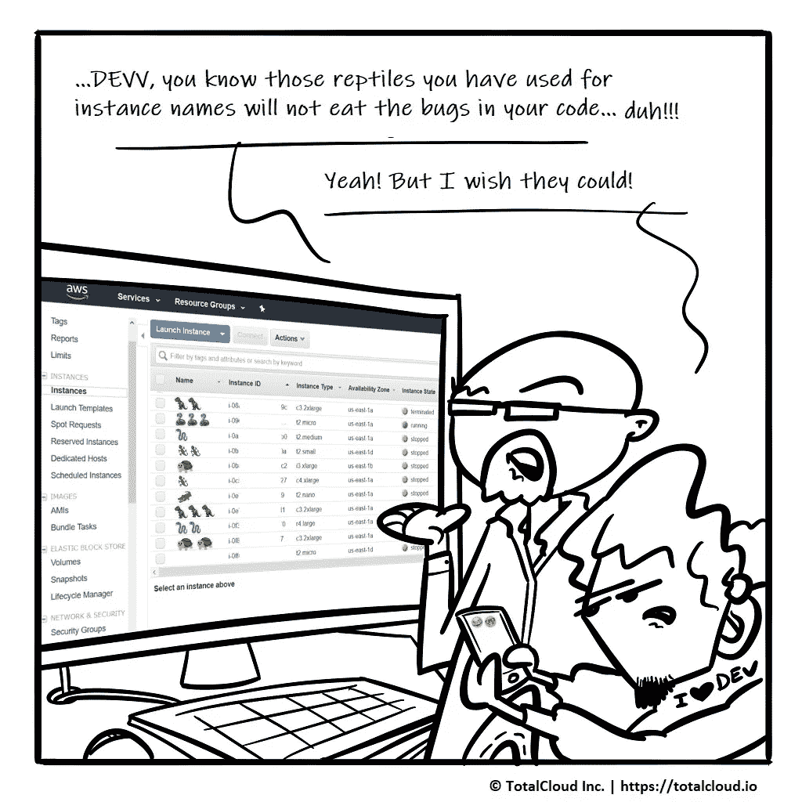

# AWS 实例名称中的表情符号

> 原文：<https://medium.com/hackernoon/emojis-in-aws-instance-names-b1a6cd63165e>



这个 Z Dev Gen 太沉迷表情符号了！他还将它们用于 AWS 实例名！他的 X 世代经理非常恼火。

> 你在 AWS 实例名中使用表情符号吗？？！！

或者，您是否在寻找设置实例名称的方法？如果有，下面有一个:

```
ec2addtag i-??????? --tag Name=a-fancy-name
```

有关更多信息，请查看此 [AWS CLI 命令参考文档](https://docs.aws.amazon.com/cli/latest/reference/ec2/describe-instances.html)。

## 订阅我们的时事通讯，让漫画和其他超级有用的 AWS 博客快速发送到您的收件箱。

*原载于 2018 年 10 月 23 日*[*blog . total cloud . io*](https://blog.totalcloud.io/emojis-aws-instance-names/)*。*