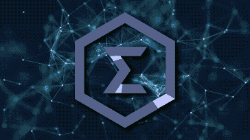

# Emotiq —直接来自 CryptoValley 的最新一代区块链…

> 原文：<https://medium.com/hackernoon/emotiq-the-latest-blockchain-3-0-straight-outta-cryptovalley-e49544c5b23d>

iPhone X 是最新最棒的 iPhone，直接来自苹果公司…

正如它在 [crypto](https://hackernoon.com/tagged/crypto) 中所呈现的那样，我们现在达到了“[区块链](https://hackernoon.com/tagged/blockchain)3.0”——如果不是 4.0 的话！

**2008 年，在 iPhone 3G**推出后不久，中本聪发布了[比特币白皮书](https://bitcoin.org/bitcoin.pdf),区块链 1.0 由此诞生****

The release of Bitcoin coincided with the iPhone 3G

**区块链 2.0 由以太坊**领导，其他几个智能合约区块链也加入了进来，它们都位于加密项目的前 10 大市值之列。

以太坊的白皮书发布于 2014 年*iPhone 6+向公众发布的同一时间。*

****

*Ethereum’s whitepaper release came out same time as the iPhone 6 (Plus)*

***2018 年，我们将迎来区块链 3.0**，涵盖下一波和下一代区块链人，他们正在寻求在其创始人的基础上进行变革和创新。*

*今天， [Emotiq](https://emotiq.ch/) 进入区块链 3.0 行列，成为迄今为止最新和最有前途的区块链之一。*

****

*Emotiq Chilling with the iPhone X (what’s next? 9, XI, X2?!)*

*在我们深入研究 Emotiq 和一切与“区块链 3.0”相关的东西之前，让我们后退一步，这样我们就可以调查一下*区块链*的情况，看看一切目前的状况。*

# ***2018 年加密区块链***

*如果你一直在关注加密市场，你可能已经注意到一类项目一直超越一切和所有人:**区块链项目**。*

*特别是，旨在解决区块链可伸缩性问题的项目，如 [Zilliqa](https://www.zilliqa.com/) ，以及最近的 [QuarkChain](https://quarkchain.io/) 和 [IoTeX](https://iotex.io/) 以及其他几个项目，在发布后都取得了显著的收益。*

*这是有充分理由的，因为在比特币和以太坊这样的大区块链，缺乏可扩展性和增加交易的能力是区块链技术更广泛采用的严重瓶颈。*

*简单来说，如果网速从未超过 56k(即每秒 56 千字节的下载速度！)，互联网永远不会像现在这样大，也不会像我们今天所知道的那样，通过全球贸易、通信、电子商务等方式彻底改变世界…*

**

*Gimme some of dat 56k please.*

# *每秒越来越多的事务！！！*

*由于这个可伸缩性瓶颈，每个人都把目光集中在“区块链可伸缩性”上。对区块链来说，每秒更大的交易量将会带来更多的使用案例，同时也会让更多的人能够真正使用和采用这项技术。*

## *尽管如此，我在*看来*还有一个问题。*

*似乎许多项目正在成为“认知隧道”的受害者，这是一个心理学术语，用来解释当人们过于专注于一个目标、任务或问题而对其他正在发生的事情视而不见时的**。***

*加密项目和投资者非常关注达到下一个最高的每秒区块链交易量；从 10 万到 100 万到现在甚至[每秒 1000 万次交易！](https://www.youtube.com/watch?v=IK5DMxDZ9M0)*

*如果区块链有能力处理这么多事务，那当然很好，但是，**更高的每秒事务数并不是区块链可伸缩性中唯一缺失的部分……***

**

# *一旦得到一个高通量的区块链会怎么样？*

## *1.你可能会失去权力下放*

*如果你有一个可扩展的区块链，每秒可以处理超过 10，000 个事务，你可能会发现区块链开始变得更加集中。*

*因为区块链现在每秒处理如此多的事务，这意味着大量数据现在必须以 [***分散*方式**](https://arewedecentralizedyet.com/) 传输、***存储，从而导致区块链不可扩展。****

**您需要:**

1.  **大规模的中央数据服务器，其存储容量能够跟踪区块链的账本；和**
2.  **正如[algrand 的测试原型所指出的，互联网下载速度高达每秒兆字节/兆兆字节，可以处理大量的交易。](https://coincrunch.io/algorand-ico-review/)**

## **2.必须解决阻碍收养的其他特征**

**考虑一下，有一个区块链允许:**

1.  ****每秒更高的交易量**；和**
2.  ****同时保持可接受的分权水平**。**

**我们现在面临的下一个问题是，我们如何让更多的人采用和使用这种区块链？**

**嗯，在我看来，当前区块链最紧迫的问题之一是*完全缺乏隐私*,这是由于区块链公共账簿的公开透明性质，在那里，加密资产的发送者和接收者之间的交易金额可以很容易地被每个人、他们的狗和他们的宠物豚鼠追踪、跟踪和分析。**

****

**Fun fact: Dogs and Guinea Pigs can be best friends**

**隐私是一个全球性的热门话题。你可能已经注意到，欧洲的 GDPR 隐私政策于 5 月生效，导致大量围绕隐私政策变化的电子邮件被发出。**

****个人隐私还包括*财务*隐私，这可以说是一个更加禁忌的话题。**如今，在许多国家，公开谈论金钱、某人挣了多少钱或存了多少钱都不是一种可接受的规范。**

**为了让区块链得到更广泛的采用，至少从金融角度来看，我认为金融隐私是必要的，尤其是如果企业和机构甚至会考虑采用公共区块链技术的话。**

****

**Bitcoin transactions being traced and tracked.**

## **3.你需要人们采纳和使用区块链！**

**即使您拥有世界上最好的区块链，解决了区块链的去中心化、安全性和可伸缩性三难问题，如果没有人使用它，甚至不知道它，它还有什么用处吗？**

**不，它根本没有多大用处或价值。**

**你可以拥有一个拥有最好的用户体验、界面、设计、客户支持的加密交易所，它可以立即列出每一个加密项目，但是如果没有人使用它，它就没用了。**

**加密交易所的一个关键属性是具有流动性，这是由大量相互交易的用户提供的。**

**当谈到区块链时，他们提供和拥有功能效用和价值的关键属性之一是让用户和开发者参与到网络中来，否则网络效应[或获得显著效用和价值的可能性很小。](https://en.wikipedia.org/wiki/Network_effect)**

# **从零开始构建区块链**

**我最近偶然发现了这个 [excel 表格，它汇集了已经或正在从零开始建设的区块链项目](https://docs.google.com/spreadsheets/d/1geg5HHgDO-ht0u6CSTHplJudr9kSGQYAoJvaKnfRhI4/edit#gid=0)。**

**从零开始建造区块链的项目的一个关键优势是，他们可以根据 [*第一原则*](https://jamesclear.com/first-principles) 进行工作，这意味着他们可以选择建造房屋的土地，按照他们的规格进行设计，奠定基础，然后完全按照他们的设想进行建造。**

**这类似于设计一个“梦想的房子”，然而在这种情况下，我们正在考虑如何最好地设计一个“梦想的区块链”。**

> **区块链最好的设计是什么，可以把加密带到主流采用的下一个难以捉摸的水平？**

**这是 Joel Rey mont(e motiq 的首席执行官和创始人)提出的问题，并通过创建 [Emotiq](https://emotiq.ch/) 来回答。**

****

# **Emotiq 的愿景**

**Reymont 认为，到 2019 年，大多数区块链将不再面临可扩展性问题，如果这是真的，这些可扩展的区块链将如何区分彼此？**

**这是一个根据*第一原则*和长期思维进行推理的明显例子，与那些简单追逐当前最热门趋势以寻求财富的人相反。**

**从基本原则出发的推理在生活的所有领域都提供了明显的优势，这同样适用于区块链。**

**通过考虑整合区块链设计中最重要的不同元素，这允许项目创建区块链的底层代码和架构，以便设计并集成所有最佳功能。**

**这与把胶带贴在所有东西上希望事情会得到解决正好相反，这可以说是关于比特币和闪电网络。**

****

***那么，Emotiq 对于一个建造良好的区块链的最佳设计的回答是什么？***

**很高兴你问了，因为不管你愿不愿意，我都要告诉你！**

## **分片+水平可扩展性**

**基于成熟的区块链架构 [OmniLedger](https://docs.google.com/viewer?url=https%3A%2F%2Feprint.iacr.org%2F2017%2F406.pdf) ，Emotiq 整合了分片技术，实现了更高交易吞吐量的水平可伸缩性。**

## ****隐私****

**零知识证明，或者具体地说[子弹证明](https://eprint.iacr.org/2017/1066.pdf)，将用于确保在 Emotiq 上接收和发送令牌的用户的交易匿名性。**

****

**Emotiq’s CEO Joel Reymont ensuring privacy of transactions using zero knowledge proofs.**

## ****区块链的采用和可用性****

**Emotiq 已经选择为他们的智能合约实现一种叫做 Ring 的自然编程语言。使用 Ring 的目的是让任何没有技术诀窍或编码知识的普通外行人能够轻松地编写、阅读和创建智能合同。**

**环形语言旨在消除障碍，这样人们就不需要接触特殊的程序员来撰写智能合同。这可以与 Wordpress 对于博客作者和希望轻松创建新网站的人的效用价值相提并论。**

**这些人不必从头开始学习如何编码和建立一个网站，或者雇人为他们做这些，Wordpress 让建立一个全新的网站变得像点击一个按钮一样简单。**

**Wordpress 的一键式安装完成后，用户可以立即开始发布他们的作品、文章和博客。**

**这类似于个人电脑的诞生，为全世界的个人提供了更大的计算能力和编程能力。**

**想和朋友打个赌，骑士 7 场拿下 NBA 总决赛？别担心！只需在几分钟内使用 Ring 编写一份新的智能合同，然后让您和您的朋友签署它！**

****

**Lebron James with his favorite Cleveland Cavalier’s teammate JR Smith**

# ****e motiq 的主要技术特性****

## **基于 OmniLedger 构建**

**[**OmniLedger**](https://eprint.iacr.org/2017/406.pdf)**是一款安全、可扩展的分散式分类账，已经过测试，使用分片和其他加密创新技术，每秒可扩展至 13，000 笔交易，1800 个节点。****

****基于 OmniLedger 技术的另外两个项目是 [Zilliqa](https://www.zilliqa.com/) 和 [Harmony](http://simple-rules.com/tech) 。****

********

## ****Stake +实用拜占庭容错(pBFT)的证明****

****Emotiq 的 consenus 模型基于 pBFT，并增加了强一致性，因此不存在分叉的可能性，允许快速完成和确认交易(低于 10 秒)。****

****利害关系证明使用加权的利害关系证明模型，其中验证者(或节点)对其 EMTQ 令牌进行赌注，并有机会根据他们所赌注的令牌相对于赌注总额的百分比被选为“主要”验证者。然后，这个百分比机会通过加密排序为每个块选择一个“领头”验证者，领头验证者因他们最终创建的块而获得交易费奖励。****

## ****不要改变现状——利用它！****

****智能合约区块链的老大无疑是以太坊。因此，Emotiq 将纳入机器翻译，以便任何现有的以太坊合同都可以轻松部署在 Emotiq 的平台上。****

****Solidity(以太坊的智能合约语言)到 Ring (Emotiq 的智能合约语言)的机器翻译将会推出，从而允许更广泛的采用。****

****Solidity 将被翻译成 Common Lisp——e motiq 的本地区块链编程语言——然后将从 Lisp 进入 Ring 的虚拟机，用于测试任何和所有移植的智能合约。****

********

****Top Doge and Ethereum!****

## ****"我说话口齿不清。"****

****Lisp 是高级编程语言，用于构建 Emotiq 的区块链。****

****每当有什么东西超出我的知识领域，我就向该领域的专家请教；如果你想从专家那里了解 Lisp，请参考保罗·格拉厄姆的文章。****

****主要的一点是，用 Lisp 编程的开发人员都是*能力很强的*，Lisp 是一种功能性和高效的编码语言，允许灵活和快速地编写代码。据我所知，目前还没有其他的区块链是用 Lisp 构建的。****

********

****I don’t know what the hell this “thing” is.****

## ****比特币的未用完交易输出(UTXO)模型+ MimbleWimble！****

****Emotiq 遵循比特币的 [UTXO 模型，允许集成 MimbleWimble，这有助于实现真正的隐私和更大的可扩展性。](https://www.investopedia.com/terms/u/utxo.asp)****

****再次提及外部专家，我会让 Andreas 快速向您解释 MimbleWimble:****

## ******奖励技术******

****Emotiq 集成了更多的加密解决方案和创新，但老实说，其中大部分超出了我的理解范围，还有一些有待 Emotiq 深入研究。****

******一些附加的技术特性包括:******

*   ****带有共同签名协议的集体签名****
*   ****使用 Boneh-Lynn-Shacham (BLS)签名取代 Schnorr 签名****
*   ****连接外部世界的神谕(将由 Emotiq 详细阐述)****
*   ****用于选择网络中的领导者和用户所扮演的角色的加密排序****
*   ****内置 EMTQ 令牌和子令牌的分散式交换(Emotiq 的 ERC20 等价物)，以及比特币和以太坊桥，因此您可以轻松地为 BTC 和 ETH 买卖 EMTQ 和/或子令牌。****

****欲知详情，请参考 Emotiq 的黄皮书****

# ******现在，让我看看团队！******

********

*   ****[**Joel Rey mont**](https://www.linkedin.com/in/joelreymont/)**、创始人& CEO:** 25 年多样的编程经验和 [**前 CTO**](https://www.aenews.io/aeternity-through-the-eyes-of-an-investor/)****a entenety**(30 强加密项目)******

************

*   ******[**弗拉基米尔列别杰夫**](https://www.linkedin.com/in/vlebedev/) **，**工程副总裁:拥有 25 年金融科技、电信和媒体公司高层管理经验的连续创业者。******

************

*   ******[**David MCC lain**](https://www.linkedin.com/in/david-mcclain-685669155/)**博士，首席火箭科学家:**[Lisp 高手，友情为大家。](https://youtu.be/TzaVd6zl2bA?t=73)******

> ******“大卫是名副其实的火箭科学家。除了计算机科学之外，他还接受了理论和观测天体物理学的培训，并带来了 50 年来无与伦比的独特编程专业知识。”******

************

*   ******[**Shannon Spires**](https://www.linkedin.com/in/shannon-spires-66b4ba44)，系统工程师:25 年 Lisp 编程经验。******

************

*   ******[**Paul Tarvydas**](https://www.linkedin.com/in/paultarvydas/)**，**电子和微处理器大师:从事软件开发 25 年的高级总监。******

************

*   ******[**Mark David**](https://www.linkedin.com/in/mark-david-75431/)**，**软件架构师:35 年 Lisp 程序员经验。******

************

*   ******[**Mark Evensen** ，](https://www.linkedin.com/in/maevenson/)软件架构师:25 年 Lisp、Python、Java 和 c 语言编程经验。******

******我通常不喜欢检查团队，因为我更喜欢喊着“全明星”然后结束它，但是从编程和开发的角度来看，这个团队显然更有能力，他们有几十年的编程经验。******

******这个团队似乎缺少的是具有强大营销和/或商业背景的人。******

## ******代码代码代码。******

******Emotiq 的 [Github](https://github.com/emotiq/emotiq) 自今年 2 月以来，有 6 个主要贡献者几乎每天都在更新 Github。******

******Andre cron je[审查了 Emotiq](https://cryptobriefing.com/emotiq-code-review-natural-smart-contracts/) 的代码，并提供了两个拇指以供批准，这表明了该团队作为强大的编程开发人员的可信度和能力。******

******在 Emotiq 的电报频道中，有人提到测试网将在 3 到 4 周内上线。总而言之，我不得不说，看到一个*实际上*致力于构建和发布代码的项目是一个令人耳目一新的变化。******

******这些家伙不只是坐在那里无所事事。******

************

# ********潜在考虑:********

## ********1。团队拥有丰富的开发经验，但没有展示出基于他们过去经验的长期项目承诺能力。********

******这带来了一个问题，即团队是否真正致力于长期构建和支持 Emotiq。******

******团队成员令牌有 18 个月的锁定期，这是锁定期的平均水平。******

## ********2。Lisp 作为 Emotiq 的主要编程语言面临利弊********

## ********优点:********

*   ******如果他们在用 Lisp 编程，团队清楚地知道他们作为开发人员在做什么。******
*   ******可能比其他语言/区块链发展得更快，更灵活。******
*   ******Lisp 有一个利基社区，Emotiq 是唯一一个建立在其上的区块链。这个团队可能会把最好的 Lisp 程序员吸引到他们的区块链。火箭科学家 McClain 也是 Common Lisp 社区的积极贡献者。 *)*******

## ******缺点:******

*   ******由于 Lisp 的开发人员较少，如果任何团队成员离开，可能很难找到其他类似能力的开发人员来填补他们的位置。******
*   ******Lisp 可能会成为外部开发人员的进入壁垒，这些开发人员正在寻求加入和/或帮助 Emotiq 的任何开源工作。******

## ******3.“自然”智能合约编程语言的使用未经测试******

******用日常英语写的合同可能会引起问题。******

******如果任何人都可以编写自己的合同，那么这些合同最终可能会变得非常模糊、不明确，或者容易出错。******

******然而，只要遵循良好的惯例和实践，避免“坏”合同的常见陷阱，可读、干净、直观和良好编码的合同就有明确的市场机会。******

******用简单的英语书写合同的简单性也可以极大地减少智能合同的攻击媒介和表面，正如在各种智能合同中所见证的那样，例如:******

*   ******[刀劈](https://www.coindesk.com/understanding-dao-hack-journalists/)******
*   ******[平价钱包 Bug](https://www.theregister.co.uk/2017/11/16/parity_flaw_not_fixed/)******

******随着复杂性的增加，漏洞和攻击面也越来越大，这使得一些智能合约风险太大，难以实施。******

************

## ******4.没有众筹！******

> ******“什么时候 ico，什么时候 moon，什么时候 lambo？”******

******今年早些时候，Emotiq 计划进行众筹销售，但由于监管风险和担忧，后来取消了这一计划。他们将只进行一次私人销售，筹集 3900 万美元，购买 51%的代币。******

******由于他们使用的是加权股份证明系统，可以说这是一种一般情况:******

> ******“富人越来越富，穷人越来越穷。”******

******我不认为我们会因此很快看到任何#occupyemotiq 抗议，但是这可能是一个潜在的损失，当涉及到围绕 emotiq 建立一个强大的社区以促进更广泛的采用时。******

************************

******Bankers Protesting in NYC at Consensus 2018******

## ********5。竞赛********

******有很多区块链项目都在努力成为由 T2 统治的区块链。每个人都采取了不同的立场和方法，他们认为什么是一个良好的建设和广泛采用的区块链功能和设计的最佳组合。******

******以太坊和比特币在采用和强大的社区方面处于领先地位，但在隐私和可扩展性等领域却落后了。******

******他们面临着构建和开发协议的更大挑战，因为他们已经启动并运行，而像 Emotiq 这样的新来者具有从头开始构建的优势，可以建立正确的基础，但是社区支持和采用是区块链 3.0 非常缺乏的地方。******

************

# ******那么…现在去哪里？******

******Emotiq 计划于 2018 年第四季度发布 mainnet，在此期间*不会*发布 ERC20 令牌。一旦他们的 mainnet 上线，本地 EMTQ 令牌将被解锁并可用于交易和进行交易。******

******他们目前通过几轮私人销售筹集了 3900 万美元，购买了 51%的代币，并且有传言称，由于取消了众筹，可能会对社区的早期支持者进行电报空投，但是没有任何事情得到团队的官方确认。******

******作为这篇文章的结尾，我将引用该领域另一位专家、Emotiq 首席执行官乔尔·雷蒙特的话:******

> ******Emotiq 的目标是成为最容易接近、最友好的区块链——其他区块链安卓和视窗系统的苹果。******
> 
> ******Emotiq 的目标是提供一个非常友好和自然的区块链界面，即使是孩子也可以使用。Emotiq 智能合约是用 Ring 编写的，这是一种简单的英语编程语言，像报纸一样容易阅读。******
> 
> ********Emotiq 提供强大的区块链引擎，使用零知识证明来保护交易隐私，并通过分片进行扩展。********
> 
> ******Emotiq 的区块链通过应用 MimbleWimble 以加密的方式安全清除失效的事务，保持了较小的规模和可维护性。******
> 
> ********Emotiq 为您提供一台与一级方程式赛车一样强大的区块链发动机，界面简单易用，无需培训即可驾驶！**
> ——乔尔·雷蒙特，Emotiq 的首席执行官******

# ******更多信息和资源:******

********Emotiq 的电报组:**https://telegram.me/emotiq******

********官网:**[https://emotiq.ch/](https://emotiq.ch/)******

********GitHub:**[https://github.com/emotiq/emotiq](https://github.com/emotiq/emotiq)******

********中等博客:**[https://medium.com/emotiq](https://medium.com/emotiq)******

********白皮书&黄纸:**https://emotiq.ch/#whitepaper T21******

******Don’t let the FOMO get to you! Sign up today so you don’t miss out ;)******