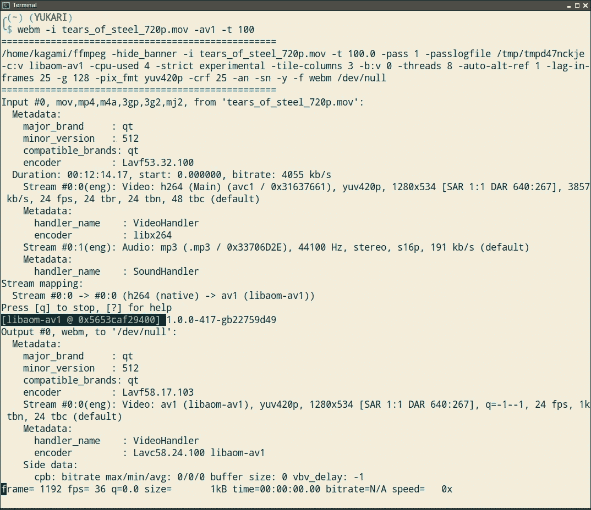
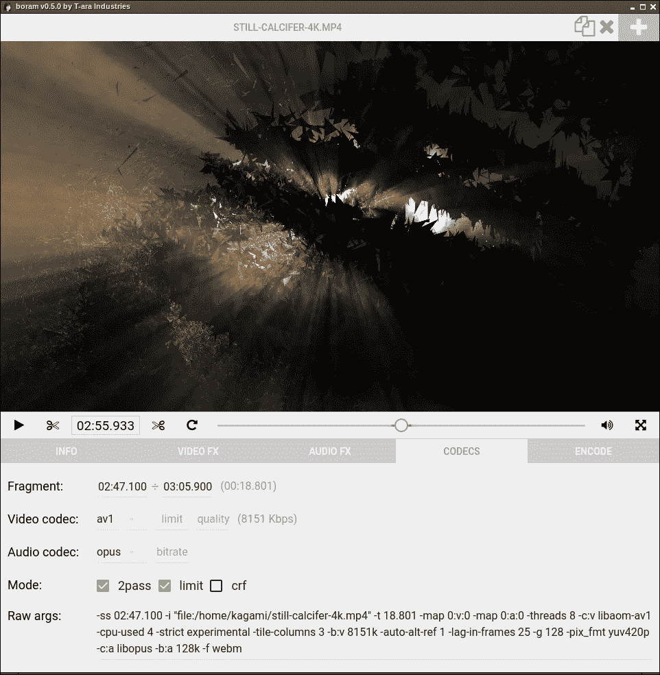
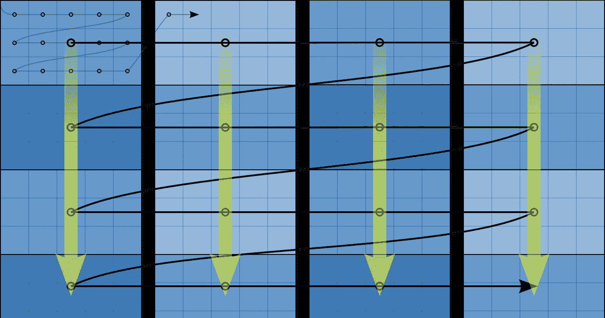

# 编码 AV1

> 原文：<https://medium.com/hackernoon/encoding-av1-700b6ee4210>


*本文介绍了两款支持 AV1 的工具，以及 AV1 格式背后的一些技术细节及其在 ffmpeg 中的支持。*

我很高兴地宣布，我的两个 WebM 转换器， [webm.py](https://github.com/Kagami/webm.py) (命令行)和 [boram](https://github.com/Kagami/boram) (图形)现在支持编码到新的 AV1 视频格式，相应地从版本 0.12.0 和 0.5.0 开始。他们都在所有三个主要平台(Windows，macOS，Linux)上工作，并且涵盖了视频点播编码的典型用例。

## AV1

如果你还没有听说过，AV1 是一种免版税的现代视频编码格式，旨在提供比受专利保护的 H.265 (HEVC)更好的质量。它是由谷歌、Mozilla 和网飞等大型 It 公司合作开发的，名为 [AOMedia](https://aomedia.org) ，于今年 3 月首次稳定发布。

您可以在本文[中了解 AV1 中使用的技术](https://jmvalin.ca/papers/AV1_tools.pdf)，这里提供了与竞争解决方案的一些测试比较[。](https://aomedia.org/news/av1-test-results/)

AV1 的压缩效率和计划的硬件支持看起来棒极了，它应该真的有利于添加到任何现代转换器。所以我继续前进，并立即在我的工具中实现支持，尽管它仍然是一项前沿技术。

## 工具

第一个工具 webm.py 是用 Python 编写的，它为 ffmpeg 提供了简单的包装和有用的默认值。例如，如果您想要达到特定的目标文件大小，您不必处理两次运行命令进行二次编码或手动计算比特率。webm.py 会帮你做到。

webm.py 的另一个优点是，它可以在 Python 2 和 3 中工作(Python 2 通常是今天安装在计算机上的唯一 Python)，除了在`PATH`中的 ffmpeg 可执行文件和包含在单个源文件中之外，没有任何依赖关系。因此，只需将该文件放在您想要的任何机器上，就可以立即开始使用。

但是，如果您有可用的 pip，通过运行

```
pip install webm
```

您将安装最新的稳定版本以及方便的`webm` 命令。(确保选中 Python for Windows installer 中的`Add to PATH`选项。)

webm.py 提供了命令行界面，因此它主要用于批量编码或在服务器上使用。然而，它也有互动模式的剪切和作物使用脚本化的 mpv 播放器。要编码 AV1 视频，只需运行

```
webm -i in.mkv -av1
```



webm.py

它将使用默认质量的两遍模式。要查看所有可用选项的运行情况

```
webm --help
```

请注意，您需要来自 git 的 ffmpeg，并在您的`PATH`中支持 AV1 以使其工作。此外，需要的补丁很少(稍后会详细介绍)，所以我建议您从 Windows 和 macOS 上的 [boram 版本](https://github.com/Kagami/boram/releases)中获取 ffmpeg 二进制文件(它们位于解压缩的归档文件的`resources/app`子目录中),并从 Linux 上的源代码进行编译。

第二个工具 boram 为编码提供了用户友好的图形界面，并支持基本的编辑选项，如缩放、裁剪、去交错等。它还包装了 ffmpeg，并使用电子框架用 JavaScript 编写。

> 如果你感兴趣的话，可以看看 Electron 的 [mpv.js](https://github.com/Kagami/mpv.js) 组件，它允许 boram 打开任何视频格式，不限于 Chrome 支持的格式。

在此下载您平台的最新版本[，解压并运行。界面和控制应该是不言自明的，只要确保在编解码器标签选择 AV1 编解码器。](https://github.com/Kagami/boram/releases)



boram

## 玩家支持

WebM 格式传统上是针对 Web 平台的，那么有哪些浏览器可以播放呢？根据 caniuse 网站的消息，AV1 在最新的火狐每夜的`media.av1.enabled`旗帜下得到支持，并且在 Chrome 69+中开箱即用。不幸的是还没有在 Edge 和 Safari 中。不多，但足够在野外玩了。

在桌面播放器中，至少 VLC 和 Windows 版 mpv 支持 AV1 格式的视频。

## FFmpeg 补丁

如前所述，转换器包装 ffmpeg 可执行文件，因为它是视频处理和编码的强大框架。然而，由于这种格式的新颖性，ffmpeg 现在还不太支持 AV1。所以我不得不为它写几个补丁。

第一个是利用编码并行性。AV1 的参考编码器被称为 [libaom](https://aomedia.googlesource.com/aom) ，需要注意的是，它基本上是基于 libvpx 代码，VP8 和 VP9 格式的参考编码器。libvpx 目前为 VP9 提供了两种多线程编码机制:`-tile-columns`和`-row-mt`。

`-tile-columns`基本上是将您的视频划分为独立的编码单元——瓦片——并在不同的内核上同时处理它们，以利用多核 CPU。



tile-columns schematic

ffmpeg 还不支持 AV1 的`-tile-columns`,但是补丁是微不足道的:

```
diff --git a/libavcodec/libaomenc.c b/libavcodec/libaomenc.c
index 9431179886..55cb7ff72e 100644
--- a/libavcodec/libaomenc.c
+++ b/libavcodec/libaomenc.c
@@ -68,6 +68,8 @@ typedef struct AOMEncoderContext {
     int static_thresh;
     int drop_threshold;
     int noise_sensitivity;
+    int tile_columns;
+    int tile_rows;
 } AOMContext;

 static const char *const ctlidstr[] = {
@@ -75,6 +77,8 @@ static const char *const ctlidstr[] = {
     [AOME_SET_CQ_LEVEL]         = "AOME_SET_CQ_LEVEL",
     [AOME_SET_ENABLEAUTOALTREF] = "AOME_SET_ENABLEAUTOALTREF",
     [AOME_SET_STATIC_THRESHOLD] = "AOME_SET_STATIC_THRESHOLD",
+    [AV1E_SET_TILE_COLUMNS]     = "AV1E_SET_TILE_COLUMNS",
+    [AV1E_SET_TILE_ROWS]        = "AV1E_SET_TILE_ROWS",
     [AV1E_SET_COLOR_RANGE]      = "AV1E_SET_COLOR_RANGE",
     [AV1E_SET_COLOR_PRIMARIES]  = "AV1E_SET_COLOR_PRIMARIES",
     [AV1E_SET_MATRIX_COEFFICIENTS] = "AV1E_SET_MATRIX_COEFFICIENTS",
@@ -449,6 +453,11 @@ static av_cold int aom_init(AVCodecContext *avctx,
     if (ctx->crf >= 0)
         codecctl_int(avctx, AOME_SET_CQ_LEVEL,          ctx->crf);

+    if (ctx->tile_columns >= 0)
+        codecctl_int(avctx, AV1E_SET_TILE_COLUMNS, ctx->tile_columns);
+    if (ctx->tile_rows >= 0)
+        codecctl_int(avctx, AV1E_SET_TILE_ROWS, ctx->tile_rows);
+
     codecctl_int(avctx, AV1E_SET_COLOR_PRIMARIES, avctx->color_primaries);
     codecctl_int(avctx, AV1E_SET_MATRIX_COEFFICIENTS, avctx->colorspace);
     codecctl_int(avctx, AV1E_SET_TRANSFER_CHARACTERISTICS, avctx->color_trc);
@@ -746,6 +755,8 @@ static const AVOption options[] = {
     { "static-thresh",    "A change threshold on blocks below which they will be skipped by the encoder", OFFSET(static_thresh), AV_OPT_TYPE_INT, { .i64 = 0 }, 0, INT_MAX, VE },
     { "drop-threshold",   "Frame drop threshold", offsetof(AOMContext, drop_threshold), AV_OPT_TYPE_INT, {.i64 = 0 }, INT_MIN, INT_MAX, VE },
     { "noise-sensitivity", "Noise sensitivity", OFFSET(noise_sensitivity), AV_OPT_TYPE_INT, {.i64 = 0 }, 0, 4, VE},
+    { "tile-columns", "Number of tile columns to use, log2", OFFSET(tile_columns), AV_OPT_TYPE_INT, {.i64 = -1}, -1, 6, VE},
+    { "tile-rows", "Number of tile rows to use, log2", OFFSET(tile_rows), AV_OPT_TYPE_INT, {.i64 = -1}, -1, 6, VE},
     { NULL }
 };
```

这还增加了`-tile-rows`选项，由于 AV1 中图块行之间的可配置预测依赖性，该选项可用于更多的并行化。libaom 的最新[补丁](https://aomedia.googlesource.com/aom/+/0e4a0986b9ca8704f4d8f5845d183ee283a0900d^!/)支持该特性。

在 libvpx VP9 中，我们有`-row-mt`选项来使用基于块行的线程方法在单列图块中启用[多线程。几天前，libaom 也增加了](https://groups.google.com/a/webmproject.org/forum/#!topic/codec-devel/oiHjgEdii2U)[和](https://aomedia.googlesource.com/aom/+/0ec03a4c128a53cc1275c376503fea1fe7723f82^!/)，但是目前没有什么有趣的东西，基本上是别名`-tile-columns`。

在 WebM 文件中启用 AV1 支持需要第二个补丁。这也很简单:

```
diff --git a/libavformat/matroskaenc.c b/libavformat/matroskaenc.c
index 09a62e1922..76cb124221 100644
--- a/libavformat/matroskaenc.c
+++ b/libavformat/matroskaenc.c
@@ -1296,11 +1296,12 @@ static int mkv_write_track(AVFormatContext *s, MatroskaMuxContext *mkv,

     if (mkv->mode == MODE_WEBM && !(par->codec_id == AV_CODEC_ID_VP8 ||
                                     par->codec_id == AV_CODEC_ID_VP9 ||
+                                    par->codec_id == AV_CODEC_ID_AV1 ||
                                     par->codec_id == AV_CODEC_ID_OPUS ||
                                     par->codec_id == AV_CODEC_ID_VORBIS ||
                                     par->codec_id == AV_CODEC_ID_WEBVTT)) {
         av_log(s, AV_LOG_ERROR,
-               "Only VP8 or VP9 video and Vorbis or Opus audio and WebVTT subtitles are supported for WebM.\n");
+               "Only VP8 or VP9 or AV1 video and Vorbis or Opus audio and WebVTT subtitles are supported for WebM.\n");
         return AVERROR(EINVAL);
     }
```

在 WebM 中对 AV1 的支持被推迟了一点，因为 libaom 的 WebM muxer 还没有更新到最新的规格，详见[这个 bug](https://bugs.chromium.org/p/aomedia/issues/detail?id=2027) 。但是 FFmpeg 已经做了正确的事情，所以它制作的 WebM 视频应该没有问题。

你也可以使用 [MP4 容器](https://en.wikipedia.org/wiki/ISO_base_media_file_format)来存储你的 AV1 视频(为此将`-f mp4`选项传递给 ffmpeg)。它已经可以在最新的 Chrome 和 Firefox 上运行了。另一方面，Matroska 容器(几乎与 WebM 相同，但有更多的功能，可以通过`-f matroska`启用)只能在 Chrome 中工作，并且由于其解复用器的限制，不能在 Firefox 中工作。

我把两个补丁都发送到 ffmpeg-devel 邮件列表，但是他们还没有被接受。然而，boram 的 Windows 和 macOS 版本包括已经应用了补丁的 ffmpeg 二进制文件，因此一切都可以开箱即用。如果你想自己构建 ffmpeg，请看下一节。

## FFmpeg 版本

我为我的工具编译 ffmpeg 的定制版本，因为它让我能够控制编码器和特性的包含。这也有助于极大地减少发布版本的下载量。

在 Windows 上，我使用 awesome[media-autobuild _ suite](https://github.com/jb-alvarado/media-autobuild_suite)脚本，它支持 ffmpeg 和许多其他工具的编译。只需按照自述文件和安装向导中的说明进行操作。

要应用上述补丁，请在`if do_vcs ["https://git.ffmpeg.org/ffmpeg.git](https://git.ffmpeg.org/ffmpeg.git)"; then`行之后的`build/media-suite_compile.sh`文件中添加以下代码:

```
do_patch "[https://gist.github.com/Kagami/8d42f7b9d6c3d7e87a6da40b0fee10dc/raw/5f6cc9391e2796d2b2056cb15f90394cd8c7bcee/0001-lavc-libaomenc-Add-tile-columns-tile-rows.patch](https://gist.github.com/Kagami/8d42f7b9d6c3d7e87a6da40b0fee10dc/raw/5f6cc9391e2796d2b2056cb15f90394cd8c7bcee/0001-lavc-libaomenc-Add-tile-columns-tile-rows.patch)" am
do_patch "[https://gist.github.com/Kagami/8d42f7b9d6c3d7e87a6da40b0fee10dc/raw/5f6cc9391e2796d2b2056cb15f90394cd8c7bcee/0002-lavf-matroska-Allow-AV1-in-WebM.patch](https://gist.github.com/Kagami/8d42f7b9d6c3d7e87a6da40b0fee10dc/raw/5f6cc9391e2796d2b2056cb15f90394cd8c7bcee/0002-lavf-matroska-Allow-AV1-in-WebM.patch)" am
```

在 macOS [上，自制软件](https://brew.sh)完成了几乎所有的工作，只需将 [libaom.rb](https://gist.github.com/Kagami/192705f026fd08bd904342788eb697c6/raw/d9fb96559449325c7df7c1f49232844f90b5375e/libaom.rb) 和 [ffmpeg.rb](https://gist.github.com/Kagami/192705f026fd08bd904342788eb697c6/raw/d9fb96559449325c7df7c1f49232844f90b5375e/ffmpeg.rb) 放入`/usr/local/Homebrew/Library/Taps/homebrew/homebrew-core/Formula`目录并运行

```
brew install ffmpeg --HEAD --with-libvpx --with-libaom --with-libvorbis --with-opus --with-libass
```

在 Linux 上，遵循您将找到的任何最新的发行版说明，例如[这个](https://trac.ffmpeg.org/wiki/CompilationGuide/Ubuntu)。一定要跑

```
wget [https://gist.github.com/Kagami/8d42f7b9d6c3d7e87a6da40b0fee10dc/raw/5f6cc9391e2796d2b2056cb15f90394cd8c7bcee/0001-lavc-libaomenc-Add-tile-columns-tile-rows.patch](https://gist.github.com/Kagami/8d42f7b9d6c3d7e87a6da40b0fee10dc/raw/5f6cc9391e2796d2b2056cb15f90394cd8c7bcee/0001-lavc-libaomenc-Add-tile-columns-tile-rows.patch)
git am 0001-lavc-libaomenc-Add-tile-columns-tile-rows.patch
wget [https://gist.github.com/Kagami/8d42f7b9d6c3d7e87a6da40b0fee10dc/raw/5f6cc9391e2796d2b2056cb15f90394cd8c7bcee/0002-lavf-matroska-Allow-AV1-in-WebM.patch](https://gist.github.com/Kagami/8d42f7b9d6c3d7e87a6da40b0fee10dc/raw/5f6cc9391e2796d2b2056cb15f90394cd8c7bcee/0002-lavf-matroska-Allow-AV1-in-WebM.patch)
git am 0002-lavf-matroska-Allow-AV1-in-WebM.patch
```

在带有 ffmpeg 源代码的目录中应用补丁。

## rav1e

AV1 存在替代编码器，名为 [rav1e](https://github.com/xiph/rav1e) ，用 Rust 编写。它还处于早期实验阶段，而且[还没有提供 C API](https://github.com/xiph/rav1e/issues/472) ，所以还不能嵌入到 ffmpeg 中。

为什么我们不能从命令行使用 rav1e 呢？为什么我们需要 ffmpeg？(这同样适用于 aomenc CLI 实用程序，它是 libaom 的一部分。)这完全是因为 ffmpeg 非常强大，所以您可以将任何视频文件作为输入传递给它，将视频、音频、字幕编码为任何格式和容器的组合，在它们之间进行过滤(缩放、去隔行、更改帧速率等)，并且使用一行 shell 就可以完成所有这些操作。

另一方面，rav1e 和 aomenc 接受数量非常有限的格式(如 [YUV4MPEG2](https://wiki.multimedia.cx/index.php?title=YUV4MPEG2) 容器中的原始未压缩视频)，根本不可能有音频或过滤。典型的输入视频在 MP4 容器中会有 H.264 视频，因此为了将其传递给 rav1e，您需要解压缩到单独的文件或动态解码并通过 stdin 传递，这是一个笨拙而混乱的过程。这就是为什么通过 ffmpeg 编码是首选方式。

此外，现在 rav1e 的重点是速度，所以最有用的测试目的。虽然事情发展很快，所以让我们希望在不久的将来，我们将有伟大的 AV1 替代编码器。

## 未来的想法

虽然你已经可以生产全功能的 AV1 编码，但还有几个方面需要改进，值得关注。

其中之一是 aomenc 命令为 libaom 提供了比 ffmpeg 接口多得多的编码器选项。这有可能为结果文件提供更好的压缩或更快的编码。希望 ffmpeg 最终能赶上并至少实现其中最重要的部分。

其次，现在 libaom 非常慢，所以要么编码非常耗时，要么影响压缩效率。例如，webm.py 和 boram 都使用`-cpu-used 4`速度参数，而`-cpu-used 1`是默认值。libaom 最终应该会变得更快，同样的事情发生在 libvpx VP9 编码器上，它在 2013 年非常慢。在最坏的情况下，我们仍然有 rav1e 作为 b 计划。

第三，在 libaom 的构建配置中有几个[有趣的选项](https://aomedia.googlesource.com/aom/+/10df8d1b586133d5c04ce8907cf2d23d43765521/build/cmake/aom_config_defaults.cmake#123)，默认情况下没有启用。尝试它们可能会很有趣，以实现更好的压缩。