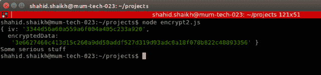

# 加密和解密 Node.js 中的数据

> 原文：<https://medium.com/hackernoon/encrypt-and-decrypt-data-in-node-js-7126829a217b>

Node.js 提供了名为“crypto”的内置库，您可以使用它对数据执行加密操作。您可以对字符串、缓冲区和流进行加密操作。

在本文中，我们将通过一些例子来说明如何在项目中进行这些操作。

您可以使用多种加密算法。点击查看 Node.js 官方文档[。](https://nodejs.org/api/crypto.html)

为了举例，我准备用 AES(高级加密系统)算法。

# 创建新的 node.js 项目

在系统中的任意位置创建一个新目录，并使用以下命令创建一个新项目:

如果您已经通过手动构建安装了 Node.js，那么它可能没有附带加密库。您可以运行此命令来安装加密依赖项。

```
npm install crypto — save
```

如果您已经使用预构建的包安装了它，则不需要这样做。

让我们继续前进。

# 加密和解密数据(字符串、数字等)

```
// Nodejs encryption with CTR
 const crypto = require(‘crypto’);
 const algorithm = ‘aes-256-cbc’;
 const key = crypto.randomBytes(32);
 const iv = crypto.randomBytes(16);function encrypt(text) {let cipher = crypto.createCipheriv(‘aes-256-cbc’, Buffer.from(key), iv);
 let encrypted = cipher.update(text);
 encrypted = Buffer.concat([encrypted, cipher.final()]);
 return { iv: iv.toString(‘hex’), encryptedData: encrypted.toString(‘hex’) };
 }function decrypt(text) {let iv = Buffer.from(text.iv, ‘hex’);
 let encryptedText = Buffer.from(text.encryptedData, ‘hex’);
 let decipher = crypto.createDecipheriv(‘aes-256-cbc’, Buffer.from(key), iv);
 let decrypted = decipher.update(encryptedText);
 decrypted = Buffer.concat([decrypted, decipher.final()]);
 return decrypted.toString();
 }var hw = encrypt(“Some serious stuff”)console.log(hw)
console.log(decrypt(hw))
```

以下是输出:



# 加密和解密缓冲区

您还可以加密和解密缓冲区。当你调用这个函数时，只需传递缓冲区来代替字符串，它就应该工作了。

像这样。

```
var hw = encrypt(Buffer.from(“Some serious stuff”,”utf-8"))
console.log(hw)
console.log(decrypt(hw))
```

您还可以将流通过管道传输到 encrypt 函数中，以使安全的加密数据通过流。

# 结论

我希望这些示例能够帮助您开始使用 nodejs 加密。

如果你有任何问题或疑问，请发微博给我@ codeforgeek 或留下评论。我会尽快回复。

*原载于 2018 年 10 月 31 日*[*【codeforgeek.com*](https://codeforgeek.com/2018/10/encrypt-and-decrypt-data-in-node-js/)*。*