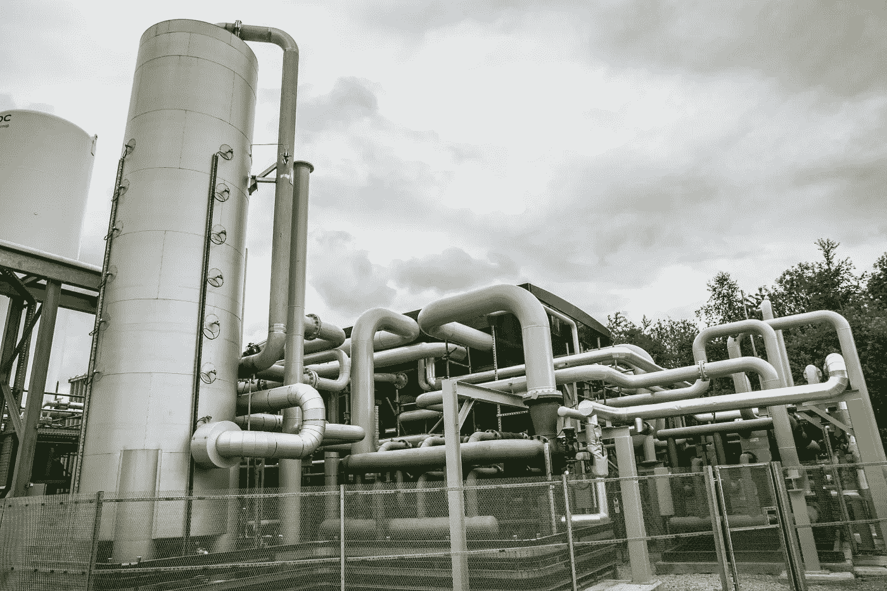
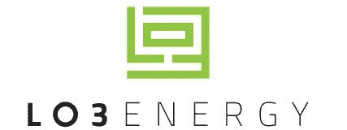
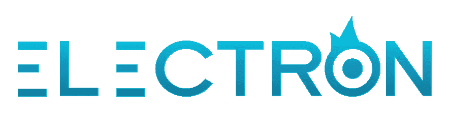
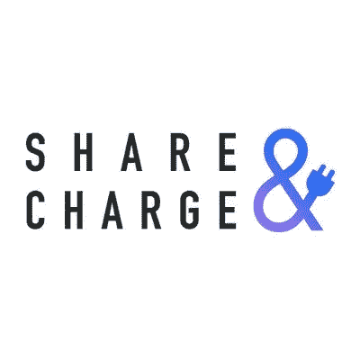
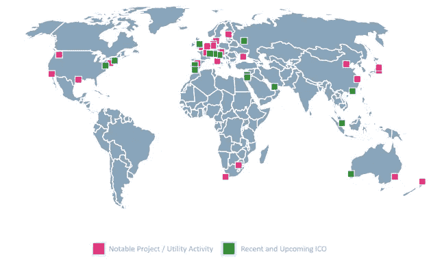
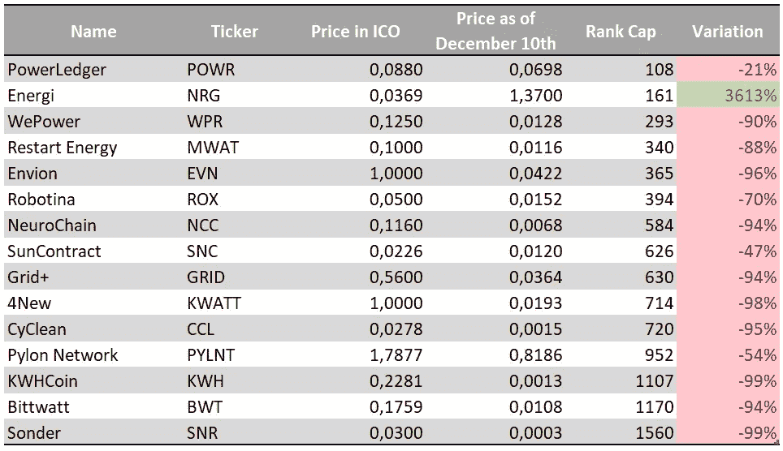

# 能源工业和区块链:概述和应用

> 原文：<https://medium.com/hackernoon/energy-industry-and-blockchain-overview-and-applications-c9c88e2039b>

自从 19 世纪第一次工业革命以来，我们的能源消耗一直在急剧增长。 ***一个多世纪以来，我们开采不可再生资源*** *如化石燃料、煤或石油。但在 1956 年，* [*马里恩·金·哈伯特发表了他的石油峰值理论*](https://www.britannica.com/topic/peak-oil-theory) *，这听起来像是一个警钟，并导致了一场积极的环境保护运动，* ***增加了对气候负面影响的认识*** *以及由于使用多种不可再生能源而导致的高污染率。* [*随着全球变暖引起人们的关注*](http://nymag.com/intelligencer/2017/07/climate-change-earth-too-hot-for-humans.html?gtm=bottom&gtm=top)*[*预计下一个世纪气温将上升 1.4 摄氏度至 5.5 摄氏度*](https://climate.nasa.gov/effects/)****我们从未像现在这样一直在寻找可持续、清洁、可再利用的能源*** *。气候变化的影响正在以比预期更快的速度增长，而从化石燃料向更清洁能源的转变却很缓慢。希望* ***创新正在实施*** *平稳而明智地实现这一转变。***

****

## **能源行业正在发生变化**

**这是我们在能源转型的道路上经常隐藏的东西，**与能源相关的产品数量呈指数级增长**:汽车、电脑、空调、智能手机、服务器、家用电器等。我们越来越多地使用我们的资源来创造能源，但主要是因为有越来越多的产品需要增强功能。**

****2015 年，可再生能源占全球能源消耗的 2%**。我们在全球生产了 109，613 太瓦时，其中 23，816 太瓦时(21.7%)用于发电，其中 6.3%来自可再生能源。从地理上看，在 21 世纪初，亚洲和大洋洲的能源消耗在看涨的印度和中国市场的引领下超过了北美。**

**当前的环境从未如此不稳定，未来也更加不确定。能源行业面临许多挑战:**

*   **碳排放的地缘政治难题**
*   **老龄化劳动力**
*   **能源需求的危害**
*   **能源供应中的商业问题**
*   **客户对高效能源供应的期望越来越高**
*   **监管系统和基础设施制约**

**另一方面，我们有创新突破和新兴技术，它们改变了能源部门以及我们生产、运输、分配和消费能源的方式。**

***那么，我们如何利用创新来克服上述挑战，增加可再生能源的使用，并以高效的方式转变能源消耗？***

## ****引发创新****

**虽然能源创新是一个宽泛的术语，包含了提高能源生产、管理、需求响应和灵活性的技术进步，但我们可以用全球范围内的几种实现来说明这一点。**

> **需求响应是指当消费者对电力的需求很高时，通过价格激励来改变最终用户的电力消费。作为个人，当需求高时，你会为你的电力容量支付更多的费用，或者因自愿减少这种容量而得到报酬。**

*****物联网和大数据*****

**在管道、阀门或其他资产上安装**传感器**可以帮助长时间监控设备，更快地识别缺陷，防止泄漏，并在全球范围内从描述性维护系统转变为预测性模型，物联网和传感器收集的数据可以预测事件，更好地管理和保护工人的安全。**

**为了获得商业智能和运行分析，**智能电表**是实现可观察、可控和集成电网的第一步，基本上是一个*智能电网*。智能电表有助于日常监控和记录电力消耗，从而增强消费者与公用事业公司互动的各个方面，并最终提高可靠性和效率。**

*****3D 打印*****

**3D 打印是**最具成本效益的方法**，尤其是对于原型制作过程。能源领域最先进最有用的 3D 打印项目就是太阳能电池板的打印。3D 打印的太阳能电池板显示出比常规太阳能电池板更好的能量捕获效果，尽管这在很大程度上取决于组件的质量。尽管太阳能电池和太阳能电池板的价格多年来一直在下降，但 3D 打印太阳能电池板肯定会降低制造成本。**

*****交付创新*****

**分布式发电使可再生能源的分配比集中式更有效率。与非常集中且需要远距离传输能量的传统发电站(燃煤、燃气或核电)相比，**分布式能源系统是分散的**，因此更接近需求且更灵活，尽管它们的发电量远小于大型集中式发电站。**

*****碳减排创新*****

**围绕**碳捕获和储存**的技术和工艺正在被开发，以从空气中提取二氧化碳(CO2)并将其储存在建筑材料中。这些利基创新受到了极大的关注，因为它们似乎是避免大规模化石燃料发电站关闭的关键。[加拿大的 Weyburn-Midale 项目是这一创新的最大例证之一](https://hub.globalccsinstitute.com/publications/what-happens-when-co2-stored-underground-qa-ieaghg-weyburn-midale-co2-monitoring-and-storage-project/what-weyburn-midale-project-wmp)。**

*****存储创新*****

****

**A Liquid Air Energy Storage plant (LAES)**

**因为太阳能和风能发电不规律，不一致，**储能就成了事**。根据 GTM Research 和储能协会的预测，储能市场预计将在 2017 年至 2023 年间增长 17 倍。液态空气能量储存(LAES)是一个有趣的创新。它在零下 196 摄氏度将空气转化为液态空气并储存起来，直到我们进一步需要更多的电力输入电网。当这种情况发生时，液态空气通过暴露在周围空气中再次变成气态。这些气体被用来转动涡轮机和发电。第一座电网规模的液态空气储能工厂[已于去年 6 月在英国](https://www.highviewpower.com/news_announcement/world-first-liquid-air-energy-storage-plant/)曼彻斯特附近见光。**

## *****区块链作为智能电网的推动者*****

> **因为直到最近我们开发能源的方式是我们担心未来全球变暖的原因之一，而且因为能源对人类发展至关重要，所以寻找新的革命性创新是一项不可避免的任务，以扰乱这个行业，找到可持续的目的并解决当前的问题。**

**最近，一项新的创新出现在雷达上:**区块链**。我们正在世界各地体验区块链的力量，以及它能为能源和公用事业带来什么。大多数已经测试或正在构建的应用程序都涉及电网和对等点之间的消耗。**

*****微网的兴起*****

**在描述一些最成功的应用之前，我们应该了解世界各地的电网管理正在发生什么变化，特别是随着微电网的兴起。**

**目前电力供应的“传统方法”是建立在由主要能源和公用事业公司运营的中央系统上。它由一个主电网组成，其中的能量由大型发电站产生，并通过一个广泛的传输网络分配给消费者。**

**提醒一下，电网是一个将电力从生产者输送到消费者的互联网络。它包括**

*   **产生电力的发电站**
*   **将电力从远处输送到需求中心的高压输电线路**
*   **连接单个客户的配电线**

**根据瑞典国际事务研究所的数据，尽管电网分布广泛，但仍有 14 亿人没有接入电网。**

**较小的电网(微电网)以分散模式连接到本地电源。例如，一个给定社区中自带太阳能电池板的建筑可能会连接到附近的住宅。**

*****区块链成就横跨能源行业*****

****LO3 能源和布鲁克林微电网项目****

**布鲁克林微电网是**第一个利用区块链**的能源相关项目之一。它是由 LO3 能源公司发起的，该公司是一家总部位于纽约的初创企业，旨在让人们通过一系列当地可再生能源为自己的家庭提供电力。拥有太阳能电池板的人可以将多余的电力卖给邻居。区块链介入了第一个点对点电力网络，以确保**准确的交易记录、分散的会计和计量以及向网络用户共享和透明的数据信息**。最初，布鲁克林微电网项目的目标是那些没有连接到国家电网的地区。安装太阳能电池板和电池是一种简单的方法，只要灵活性得到很好的管理，就可以为一个村庄提供基本的电力。这也是区块链可以提供帮助的地方，那就是确保用户和生产商之间的能源交易。此外，如果有一天这些独立的地区被连接到国家电网，区块链将能够跟踪居民消耗的电量和能源，从而使每个人都得到相应的支付。它提供了一个可靠、低成本的数字平台，用于在一个本地化和分散的能源系统中实时进行、验证、记录和结算能源交易。**

****

**[LO3 Energy](https://lo3energy.com/) logo**

> **区块链还解锁了**安全**。随着现代电网引入计算机、智能电表和传感器，很容易受到恶意入侵或攻击。如今，围绕数据管理和交易的网络威胁是区块链可以克服的。集中式发电站被视为黑客的潜在目标，这一事实促使政府加快向分布式能源的转变，从而降低恐怖袭击的风险。**

****电子****

**现在想象一下，作为一个生产商(本地或全球)，你可以通过一个平台管理你的资产，确定它们的特征、位置并优化它们。想象一下，你可以选择你想交易的资产，它的价格和条件。最后，想象一下您可以控制您的运营数据，并且只允许您选择的利益相关者访问。嗯，这就是总部位于伦敦的初创企业**electronic**试图实现的目标。Electron 成立于 2015 年 11 月，为天然气和电力供应提供一个电表注册平台，以促进**更快的切换和数据安全化**。电子公司还为生产者和消费者提供了一个**点对点交易平台**，以高效的方式交易剩余能源。在英国国家电网和西门子的支持下，他们与 EDF Energy 和 Shell 合作创建了一个财团，以确保英国能源市场持续的去碳化、数字化和去中心化。随着电力系统变得越来越分散，他们试图找到一种更有效、更透明的机制，让参与者根据其特点和位置进行资产交易。在当前的能源系统中，资产的位置从来都不是问题，但在分散和分布式模式中，它确实成为优化供应**必须考虑的新变量**。一句话:灵活性是电子项目的最终目标，区块链是推动者，在一个分散的系统中提供安全和认证。**

****

**[Electron](http://www.electron.org.uk/) logo**

****PowerLedger****

**在西澳大利亚，上周为弗里曼特尔的 40 名居民启动了一项试验，允许他们确定自己生产的太阳能的价格，并通过区块链的平台交易这种能源。这是一种创新的能源交易解决方案**，目的是通过公用事业**有效平衡能源供应和需求。作为 RENeW Nexus 项目的一部分，该项目旨在探索区块链和大数据在分布式能源系统中的集成，这项试验**将避免向电网中倾倒额外的太阳能**，而是在合适的时间为邻居提供这种电力。这个项目背后的澳大利亚初创公司 power ledger[去年 10 月通过他们的 ICO 为€筹集了 2150 万欧元。](https://www.smartcompany.com.au/startupsmart/news-analysis/power-ledger-raises-34-million-one-australias-first-successful-initial-coin-offerings/)**

****分摊&费用****

**随着电动汽车(EV)的数量在世界各地不断增加(今天美国有超过 800，000 辆 EV)**买家和潜在客户仍然担心充电站的可用性和位置**。无论何时何地，只要客户需要，能够轻松快速地为电动汽车充电将成为采用新型电动汽车的最决定性因素之一。人们发起了不同的倡议来创建交易平台**，允许人们在任何加油站**收费，不管是私人的还是公共的。因为目前美国有 17，000 个公共充电站(英国有 6，000 个)，连接电动汽车车主的私人充电器将增加数十万个网络。另一个挑战是**为电动汽车用户提供智能和安全的体验**。Share & Charge 来自 MotionWerk [的一款产品目前正在英国部署一个试点](https://markets.businessinsider.com/news/stocks/share-charge-revolutionises-ev-charging-infrastructures-in-the-uk-via-blockchain-1027503691)，与大众汽车(Volkswagen)或 Electric Blue 等几家合作伙伴携手，以克服多种类型的充电器和支付形式引发的互操作性问题。**

****

**[Share&Charge](http://shareandcharge.com/) logo**

**关于区块链在能源和公用事业中的应用，全球还采取了其他举措。Indigo Advisory Group 进行的研究显示，最活跃的地理区域是欧洲。**

****

**[https://www.indigoadvisorygroup.com/blockchain](https://www.indigoadvisorygroup.com/blockchain/)**

**我们还能从区块链期待什么？**

**除了点对点交易和电动汽车充电这两个最先进的试点，还可以想到其他依托区块链的用例。例如，电网运营商可以使用区块链来**优化网络中的供电**而不是关闭发电站，这是一种非常昂贵的行为，并通过整合整个电网的需求响应来相应地管理电力供应。**

**大公司开始关注区块链提供的机会。他们通常是一个财团的一部分，该财团包括银行、能源领袖或公共机构，他们提供商业专长和特定需求(商业案例)，科技初创企业带来技术知识或满足需求的综合平台。例如，作为一个更广泛的财团的一部分，壳牌和英国石油公司现在正在使用一个总部设在区块链的原油交易平台，他们希望这将解决贸易和结算效率低下的问题。**

**关于能源行业的 ico，据 ICObench.com 称，**约有 150 多个项目获得了总计 4 . 5 亿多美元** [的融资。目前，ICOs 的表现可能不是展示区块链对能源行业影响的最佳指标，但它有助于强调该行业不会闲置。越来越多的 ICO 正在推出，但投资者的财务回报非常低。](https://icobench.com/reports/ICO_Market_Analysis_October_2018.pdf)**

> **当然，关于加密货币的悲观情况，这种说法必须得到仔细的赞赏。**

**以下是在能源行业进行的 ico 样本及其截至 2018 年 12 月 10 日的表现。**

****

****Investment returns for ICOs in energy.** Source: Author based on ICObench.com and coinmarketcap.com datas**

## **对未来几年的乐观展望**

**电网的最终目标是变得足够智能，以发展灵活性市场和需求响应市场，从而**有效地平衡电网**和**最终整合更多的可再生能源**。根据用户需求,*智能电网*应该是高效电力输送(可靠、可持续和高质量)和经济实惠的结合。**

**考虑到这一点，**区块链和物联网**结合嵌入式处理、实时通信和合适的软件，**必将提高电网和网络的可靠性和效率**。**

> **未来的电网将跟踪能源生产和消耗，由物联网(IoT)监控，由智能合同执行，并记录在区块链上。**

**这个系统的分散模式也将激励人们和生产者通过市场交易产能。这个基于区块链的市场可以跟踪和保护参与者之间的交易，并保护每个人的交易活动和数据。**

**最后，区块链固有的**安全性和透明性**意味着它可以广泛应用于整个电力行业，从本地微电网项目到大规模跨境能源交易。**

**能源部门仍有许多问题需要解决，以确保一个可持续的系统，在这个系统中，能源生产、分配和消费是清洁资源、灵活市场和成本效益高的解决方案的明智结合。**