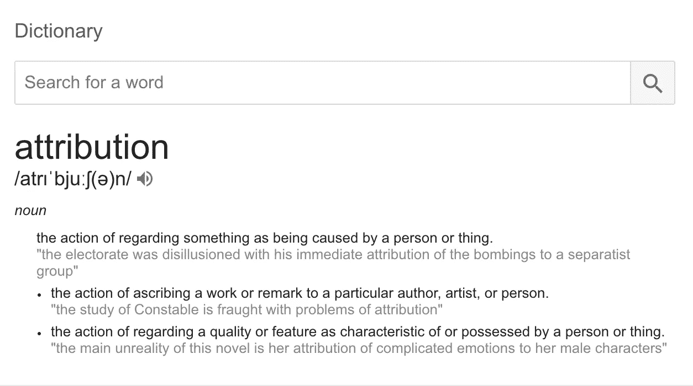

# 工程属性

> 原文：<https://medium.com/hackernoon/engineering-attribution-1b9974e4d921>

归因可能是一种有趣的描述方式，但是你如何向一个非技术人员描述什么是好的[工程](https://hackernoon.com/tagged/engineering)呢？你如何取得成果/行动，例如:

*   一行行的*品质*代码写好了
*   删除了代码行
*   可伸缩、可维护的代码
*   重组组件/功能
*   原型制作/评估新工具/技术
*   配对- [编程](https://hackernoon.com/tagged/programming)

然后贴上一美元的数字？像正常运行时间或上市速度这样的事情当然可以，但工程中更微妙的部分可能会产生最大的影响，这是一个更难表达的因素。我写了如何使[成为最快的，而不是第一个](https://hackernoon.com/be-the-fastest-not-the-first-9fc53242d8b7)是企业扩大规模的目标，但要做到这一点需要大量的前期投资，并且在一段时间内很少或没有表现出来——这就是很难将进展归因于工程的地方。因为不可能有明显的进步。

业务，尤其是非技术业务人员喜欢了解投资回报——他们询问的这个目标/计划/功能/新员工的投资回报是多少。然后，他们会深入研究，试图了解工程师花在建设和维护上的时间比例，以便他们可以资本化团队的成本，并使他们的 EBITDA 数字看起来更好，这是投资者通常会看的。值得注意的是，运营自由现金流(OFCF)可能是更好的数字，因为它不区分你在建设什么和你在维护什么，它只是用纯文本告诉你在给定的时间段内你在投资什么和什么回报。但是我跑题了。

Image: [Technocrazed](http://www.technocrazed.com/revolutionary-technology-to-produce-paper-from-plastic-bottles-in-trash)

现实是好的工程可以产生复合效应。糟糕的工程实际上会带来巨大的负投资回报和沉重的沉没成本。想象一下这发生在另一个行业？这就好比雇佣一个团队为你建造一栋房子，但他们却为你挖了一个洞，填上垃圾，然后在拿到工资后离开。不太可能，对吗？如果你曾经见过糟糕的工程，这是一个非常现实的结果，这可能是由糟糕的商业策略到那些最接近代码的人的糟糕决策所导致的。

如果我们要成功地向非技术业务人员证明[为什么软件正在吞噬世界](https://a16z.com/2016/08/20/why-software-is-eating-the-world/),那么我们最好开始能够清楚地说明这一点，否则我们在这些人经营的公司中的角色将永远受到业务人员对技术的看法的限制和束缚，甚至更糟的是“it”。我在[工程有效性](https://engineering.carsguide.com.au/engineering-effectiveness-3-e311519a5708)框架方面取得了相当大的成功，该框架是量化的，重要的是，是可重复的，但我很想听听你对如何赋予工程价值的看法，以及一些有所帮助的策略。

更多见解请查看 [Carsguide/Autotrader 工程博客](http://engineering.carsguide.com.au)。