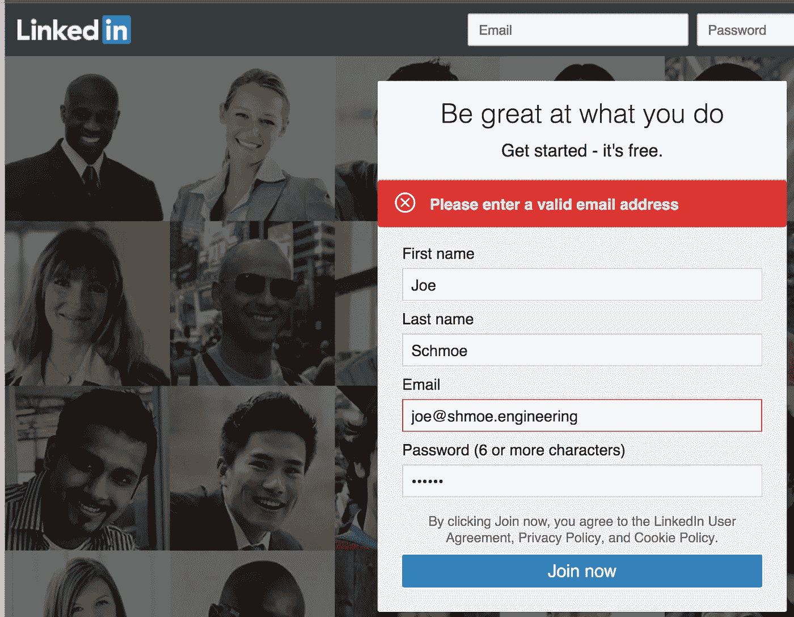
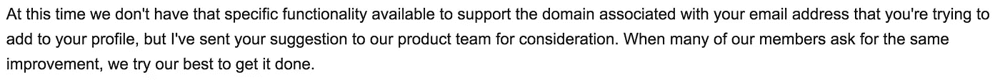

# 。被认为有害的工程领域

> 原文：<https://medium.com/hackernoon/engineering-domains-considered-harmful-ac41bc8c95fa>

我最近开始咨询如何帮我启动我的公司 [Monkey Test It](https://monkeytest.it) 并决定。工程”域名非常合适，因为:

*   虽然我也做产品和人力资源工作，但我主要专注于工程和开发相关的服务。
*   我的首选。com 被拿走了所以。工程会给我一个最小的领域，同时看起来干净和专业。
*   。工程学是一个新奇的领域，有一定数量的关于它的讨论(也是一个话题)。

有一件事我认为是理所当然的，那就是我可以注册并使用我所有必备的应用程序…我错了。商务关键服务 LinkedIn 不承认”。工程”作为有效的电子邮件地址。这似乎不是任何其他服务的问题。我既不能联想到。工程地址与我现有的帐户，也没有创建一个新的。这在网站和应用程序上都不起作用。我认为这肯定只是一个愚蠢的错误，所以我向 LinkedIn 报告了这个问题，经过一些来回和问题升级，我终于收到了一封可怕的电子邮件:

aka: tough luck.

看起来他们不会很快解决这个问题。我想知道他们的系统深处是否有一个神秘的电子邮件验证正则表达式，他们不想接触？雪上加霜的是，像“joe@shmoe.asdfg”这样完全无效的电子邮件地址是可以接受和使用的。🤦‍

我鼓励所有人”。工程”用户联系 LinkedIn——也许如果我们制造足够的噪音，他们就会倾听并优先考虑这个问题。在此之前，我建议不要使用这个 TLD。

# 更新

自从我贴出这篇文章后，有一些人指出应该避免使用 LinkedIn，而不是。工程 TLD。虽然我完全同意这是理想世界中的正确选择；然而，当在咨询/商业的世界里，LinkedIn 是至关重要的，如果不冒失去业务的风险，就不能轻易避开它。

# 更新#2

LinkedIn 工程部门的人联系了我，说他们认为这是一个严重的错误，并将向相关工程小组提出这个问题&希望很快得到解决！🎉