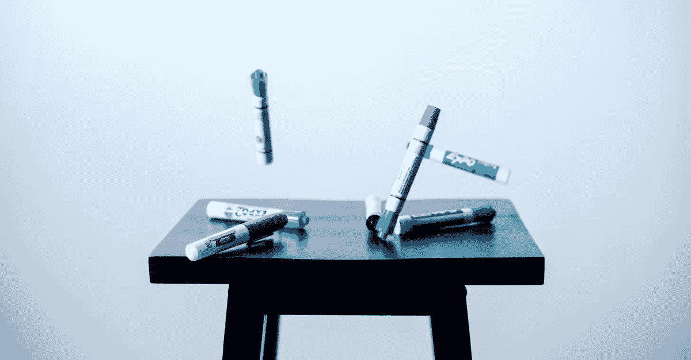

# 工程白板面试:是还是不是？

> 原文：<https://medium.com/hackernoon/engineering-whiteboard-interviews-yay-or-nay-7e4c5e7c6b88>

Originally published at [Key Values](https://www.keyvalues.com/blog/should-tech-companies-use-quotas-to-increase-diversity) on August 9th, 2018, image by [Mark Rabe](https://unsplash.com/photos/zCJrolkwRyE) on Unsplash.

软件工程师*讨厌*白板面试。我哪里知道？我们不断告诉完全陌生的人我们有多恨他们。但事情没那么简单。

问题是我们经常把几个问题混为一谈:使用随机的 CS 琐事/谜语来评估候选人，面试官故意为面试者创造一个紧张的环境，有能力的人碰巧面试不好，以及求职总体上很糟糕。

“白板”已经成为一个太大的总括术语，一个把面试过程中所有错误都集中在一起的术语。事实要复杂得多，这就是为什么我与几家科技公司的招聘经理交谈，听取他们的意见。

> *白板面试是评估工程候选人的最佳方式吗？*

# [杰米·卡拉克](https://www.linkedin.com/in/jamiekarraker/)

首席技术官在[奥拓](https://www.keyvalues.com/alto)，以前在脸书工程(解析)。

我不相信传统的关于数据结构和算法的白板问题，至少不相信我们的业务。面试应该尽可能地测试工程师在日常工作中会用到的技能。对我们来说，这意味着要有极高的生产力，因为我们处于初创阶段，需要用很少的工程师制造大量产品并产生巨大影响。但对谷歌来说，他们必须能够解决很少但非常复杂的技术问题，考虑到他们无限的资源，生产率不是问题。因此，对于他们来说，白板问题可能是正确的选择，因为这是一种高效且可扩展的方式来测试解决复杂技术问题的性能。

# 尤金妮亚·德拉佩娜

[中型](https://www.keyvalues.com/medium)的工程经理，之前在 Pivotal Labs 从事工程工作。

我不认为它们是评估候选人的最佳方式，但我也不认为它们像一些博客文章描述的那样毫无用处。实际上，我认为它们是询问某些类型的面试问题的最佳方式，例如高级系统设计问题，但它们不是询问编码问题的最佳方式，因为它与人们习惯于在日常基础上编写代码的方式非常不同。

现在，我倾向于使用协作编码环境，比如 CoderPad，来进行编码面试。CoderPad 很好，因为它允许您运行代码，因此您可以使用不同的输入快速测试代码，以查看是否处理了所有的边缘情况。这也让你作为面试官看到候选人如何调试真正的代码，以及他们如何解释诸如编译器错误和运行时异常之类的事情。不过，在这种编码环境下，完成面试问题通常需要更长的时间(因为要花时间调试)，所以你往往没有太多时间来构建最初的问题或讨论进一步的改进，这是一个警告。

如果候选人真的愿意，我通常会让他们选择在白板上写下他们的解决方案，因为有些人在准备面试时会特别练习，我希望人们尽可能感到舒服。我认为，总的来说，作为面试官，你的工作是帮助应聘者获得成功，这样你就能在面试中获得尽可能多的信号。做好这一点比你在笔记本电脑或白板上提问更重要。

# 布莱恩·惠勒

Braze 的高级工程总监，之前在微软工作。

我想说“最好”有点言过其实，但我确实认为这是面试过程中很有价值的一部分。如果处理得当，它们可以是对问题解决能力、沟通技巧和准备程度的合理一致的评估。有些问题不适合白板面试，但对所有其他问题来说，更重要的因素是你问什么、如何问以及如何对话。

# [丹·埃里克森](https://twitter.com/techwraith)

[Eaze](https://www.keyvalues.com/eaze) 的工程副总裁，之前是 Getable 的 CTO 和 Yammer 的工程师。

不，一点也不。白板面试很好地测试了一件事:应聘者在白板上写得有多好。我团队中的工程师从来不需要在白板上写代码(白板真的不擅长运行代码)，为什么我要让候选人做一些我不会让我团队中的工程师做的事情呢？

有人认为白板面试可以帮助你了解一个人的“软”技能(我讨厌这个词，因为它淡化了情商技能的重要性和难度)。根据我的经验，有更好的方法来评估这些技能，通常直接要求候选人给出这些技能的例子会更有效。

# [德斯蒙德品牌](https://twitter.com/dmnd_)

Flexport 的工程总监，之前在可汗学院和微软工作。

白板面试可能不会受到中间候选人的欢迎，但我认为凯文·拉克尔在这篇博文底部的[例子中找到了答案。](http://lacker.io/tech/2017/04/05/why-you-cant-say.html)

然而，白板本身并没有什么特别之处。在 [Flexport](https://www.keyvalues.com/flexport) ，我们让人们选择在他们自己的笔记本电脑上写代码，如果他们愿意的话，有些人会接受我们的建议。这对于那些使用 TDD 风格的过程或者只是喜欢在其他文本之前插入文本的人来说更好:)

但是如何以及在哪里编写代码是附带的。这些访谈的重要部分是交流(使用文字和图表)问题和解决问题的方法，然后也交流(使用文字和代码)教计算机解决该问题。

我们已经尝试了更激烈的变化，例如带回家的项目，但这些往往会对候选人施加不对称的时间投资，这是一些人非常不喜欢的。所以实际上，项目充其量只能是一个选项。然而，采用不同风格的面试也会有问题，因为这会增加评估候选人的噪音，从而增加无意识偏见渗入招聘决策的风险。

# 桑迪·詹

[Honor](https://www.keyvalues.com/honor) 的联合创始人，之前创立了 Meebo，并于 2012 年将其出售给谷歌。

从功能的角度来看，这不是很有用…没有人会把在白板上写代码作为他们的主要工作。然而，这是了解候选人如何沟通、表达想法和接受反馈的好方法。期望不是在白板问题上获得高分，而是更多地了解你这个潜在的团队成员。

# [常伟](https://www.linkedin.com/in/davidachang/)

在 [NerdWallet](https://www.keyvalues.com/nerdwallet) 工作的工程经理，之前在 aboutLife 工作。

没有一个最好的方法来评估工程候选人。所有的面试过程都有自己的优点和缺点，了解任何一个问题能告诉你多少关于候选人的信息是很重要的。

在 [NerdWallet](https://www.keyvalues.com/nerdwallet) ，我们通常在白板上提出架构和设计问题。它有助于我们更好地理解候选人如何构建和交流复杂的技术解决方案，设计的总体思路比任何特定代码行的细节都更重要。出于显而易见的原因，我们通常也会问几个笔记本电脑编码问题。最近，我们加入了一个拉请求问题，因为在 [NerdWallet](https://www.keyvalues.com/nerdwallet) 与他人一起工作并给出反馈是成为一名高效工程师的关键部分，而我们在之前的面试过程中遗漏了这一点。

然而，没有一个问题是完美的。一些工程师对按需设计全新的系统感到不舒服，编码问题可能恰好击中候选人的盲点，理解你从未见过的代码的 PR 可能具有挑战性。我们非常相信反馈和数据驱动的决策，所以我们总是努力更好地了解我们的面试过程可以告诉我们关于候选人的什么，并确定我们可以改进的方法。

Image by [Trent Erwin](https://unsplash.com/@tjerwin) on Unsplash.

# [齐莎·柯里布霍](https://www.linkedin.com/in/zeesha/)

[分支](https://www.keyvalues.com/branch)的产品工程总监，之前是 Evernote 增强智能团队的副总裁。

我整个职业管理生涯都在辩论面试候选人的最佳方式是什么。在我的理想世界中，候选人不应该为面试做“准备”,面试只是对工作中一天的模拟。在这种情况下，我尝试了不同的形式，带回家挑战，白板面试，算法和数据结构部分，现场编码会议，调试会议，等等。我对这个话题有很多看法(和其他经理一样)。但总而言之，在我看来，白板面试是评估候选人时使用的一个很好的“工具”。

没错，在我看来，白板会议应该被视为“一种工具”，让你能够与候选人一起解决问题。白板会议的好处在于它是一张空白的画布，受访者可以有效地大声思考、合作、绘制图表，还可以与面试官一起进行头脑风暴。在你的想法和能够交流它们之间没有摩擦。同时，这不应该是面试候选人的唯一方式，也绝对不是一刀切。一次有效的面试是用不同的评估方法对几个不同的维度进行评估。不管我们喜不喜欢，白板代表了技术交流的很大一部分，不仅在面试中，而且在作为工程师的日常工作中。

# 拉里·萨利布拉

[Blockstack](https://www.keyvalues.com/blockstack) 的工程合作伙伴，之前创立了 Pay4Bugs。

我不认为白板面试特别有用，因为它不能反映工作的实际情况。开放式编码挑战涉及到使用我们的软件来构建一些东西，这给了我们关于候选人的技能水平和他或她对项目的兴趣的更多信息。

作为一个开源项目，我们很幸运，因为对我们的项目真正感兴趣的候选人可以通过发送拉式请求或在我们的平台上构建应用来证明自己——在某些情况下，这意味着我们可以在不要求该人做额外的编码挑战的情况下提供服务。

# [德瑞克·哈里森](https://www.linkedin.com/in/derreksharrison/)

轮回公司的工程经理，之前是动力增长公司的工程总监。

伟大的工程师在解决问题时有许多工具可供选择——伟大的公司在寻找和评估有才华的团队成员时也有许多工具可供使用。当候选人需要一张大画布来描绘问题或设计系统时，白板面试是一个很好的工具。当询问系统设计/架构问题或要求候选人描述多个系统之间的交互时，尤其如此。

然而，在测试候选人编写代码的能力时，白板面试并不是一种合适的形式。如果你在面试中剥夺了调试和测试的能力，你会得到一个不能准确描述日常工程的场景。协作编码环境在这里是一个更好的选择——它让面试官能够在写作中清楚地定义一个问题，并让候选人能够在熟悉的环境中写作、调试和测试。

我们努力寻求一种面试形式，让候选人能够脱颖而出，并尽可能地向我们展示候选人作为团队成员的表现。这意味着有时，但不总是，白板面试是正确的形式。

# 亚当·麦克里

G 冒险的工程总监，之前是 G 冒险的工程经理和开发者。

多年来，我们不断重复面试过程，尝试不同的方法来评估一个人的技能和个性，我发现白板对整个面试过程没有什么帮助。它们有助于了解某人的工作方式，但更多的时候，我发现它们可以筛选出以前没有机会进行白板面试的真正优秀的候选人。我更喜欢与候选人就某个问题进行交谈，就像我们在现实生活中确定项目范围时讨论问题一样。我发现人们通常更容易接受这种方法，不会被语法、凌乱的文字或在“编码”时大声说话所束缚

# 找新工作？

这篇文章中引用的每个人都是一家公司的招聘经理，在[的关键价值观](https://www.keyvalues.com/)上。你可以通过阅读他们团队的简介来了解他们的工程文化，如果你仍然感兴趣，我鼓励你直接联系他们。

*原载于*[*www.keyvalues.com*](https://www.keyvalues.com/blog/engineering-whiteboard-interviews-yay-or-nay)*。*