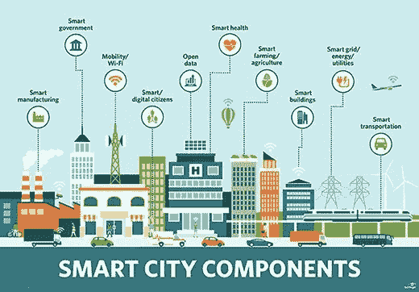
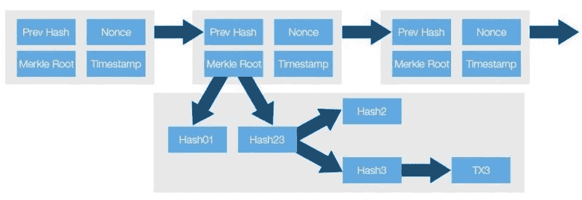
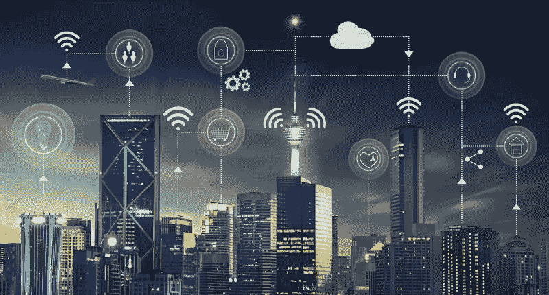

# 进入 23 世纪智能城市

> 原文：<https://medium.com/hackernoon/enter-the-23rd-century-smart-city-f1efb0b361b>

## 机器学习、区块链和物联网等新兴趋势将推动智能城市的崛起。

虽然想象智能手机、智能电视甚至智能汽车很容易，但典型的智能城市可能会在很大程度上引起公众的困惑。

理论上,“智能”这个词——就电子设备或数据而言——意味着这个电器被*编程为能够独立行动。*

考虑到这一点，智能城市将意味着一个特定的管辖区或区域，以处理、处理、利用该区域数千个智能传感器接收的数百万数据输入并做出决策。

例如，一款由州政府发布的智能停车应用程序，可以帮助司机找到可用的停车位，而无需为了几米的空间而在一条街又一条街上搜寻。

潜在的可能性是，汽车本身可能配备有处理数字支付的功能，这样就不需要携带零钱来为停车计时器加油。

对于涉及交通的其他用途，也许政府利用依赖传感器的交通系统，该系统分析道路上的车辆流量，并准确地确定哪些街区需要更多的绿灯，哪些不需要。

虽然这些例子更多的是智能交通系统，而不是智能城市，但重要的是要注意，城市是一组协调运行的各种过程。

简而言之，一个城市是由几个治理、行政、教育、社会和技术过程组成的。

事实上，将“智能”放在一个城市中意味着智能交通系统、智能治理系统、智能研究系统等等，以它们不变的数据库运行，这些数据库相互连接以共享信息来做出决策。

简而言之，智慧城市的每个方面都有一个潜在的唯一、不变的数据库。

效率和节能将成为未来城市的另一个因素。一些小事情，比如根据使用情况改善观察或规划或电网，或者当传感器检测不到任何车辆时调暗路灯(同时保持人行道照明良好)，所有这些都有助于打造智能城市。

因此，我们可以把这样一个城市分成三个不同的类别

1.  能够将地方立法与公民准确联系起来，以确保决策时的电子参与和集体智慧。
2.  通过新兴技术和数据分析有效利用现有的物理基础设施，并营造一个稳健的经济、文化和社会环境。
3.  通过提高城市的智能，随时学习、适应和创新不断变化的环境。

在这方面可以指出其他几个特点。智能技术可以评估和监测环境变化。智能技术可以通过互联网连接的垃圾车和物联网废物管理系统改善卫生功能。智能传感器可能是干旱、洪水、山体滑坡或飓风之前预警系统的关键组成部分。

这个清单还在继续。

如果你还没有立即意识到，这样一个未来派的系统需要后端巨大的数据处理能力。除此之外，不可变数据库需要存储所有这些信息，以便在需要时随时可用。

**那么——使用区块链是这里的解决方案吗？就像任何其他问题一样，把这个流行词和它自己联系起来？**

答案是令人不快的“不”

就像任何技术一样，区块链有一些用途，也有一些非用途。

例如，从理论上讲，你可以制造里克的黄油机器人，它能感应到你在桌子上，并拿起一把刀、一块黄油、一片面包，为你放上去。

*或者你可以自己做。*

同样，如此规模的区块链，处理如此大量的数据可能需要一套复杂的加密经济法则来管理它，甚至需要更广泛的参与者来维护它。

或者，我们可以只使用 DAG。

## 一条狗？

虽然我用简单的术语解释了智能城市将会做什么，即创建一个运行数千个其他定制数据库(侧链)的城市范围的数据库，但在区块链的能力有限的情况下，可以使用 **DAG 架构****。**

****所以 WTF 就是 DAG？****

**用加密术语来说，比特币被认为是区块链 1.0 版本。**

**它做了区块链能做的最基本的事情，即验证和确认交易，同时在一个可供全世界查看的巨大公共账本上记录所有交易。**

**然后是 Vitalik Buterin(和其他 19 名开发者)的创意，开源、去中心化的账本平台 Ethereum。**

**以太坊是一个平台，允许应用程序精确地按照编程运行，布特林自己将该平台比作可以在其上运行数千个无关应用程序的 Android/iOS 操作系统。**

**这被视为**区块链 2.0** 。**

**而现在，在 2018 年，Iota 的兴起让人们考虑一个有向循环图( **DAG** )系统作为**区块链 3.0。****

**但令人印象深刻的是，DAG 根本不是区块链，从某种意义上说，这个系统中没有数据块。**

****扩大-****

****D**directed =节点(边)之间的连接有方向。**

****A** cyclic = "non-circular" =沿着边从一个节点移动到另一个节点，*你永远不会第二次遇到同一个节点。***

****G** 图=由节点组成的结构，这些节点通过边相互连接。**

**下图显示了基本的 DAG 结构:**

****

**DAG 最适用于与数据处理、调度、在导航中寻找最佳路线和数据压缩相关的问题。也就是说，DAG**最适合**建设智能城市。**

**不管出于什么原因，这个术语和技术仍然相对不为人知，但是从我探索的各种论坛和子论坛中，我看到技术圈的兴趣越来越大。**

**像 NANO、IOTA、Byteball 和 Cybervein 这样的公司都在这种类型的架构上运营。**

****赛博-什么？****

**在 OKEx 上搜索代币时，我偶然发现了 Cybervein 项目，仔细观察后，它看起来很像 DAG 发电站。**

**虽然 NANO 以即时、零费用支付给 Reddit 留下了深刻印象，IOTA 继续通过在区块链获得基于物联网的设备来吸引技术圈，但如果考虑我前面提到的几点，Cybervein 最接近于建设智能城市。**

**该项目旨在通过创建一个不可变数据库的公共网络来交易、存储和货币化信息交换，从而“互联运行世界的数据”。**

**来自他们的白皮书—**

> **Cybervein 分类账是作为一个独立但相互联系的智能合同网络而不规则地构建的。合同被设计成私人分类账，不受无关的网络拥塞的影响，但能够容易地沟通和交换价值和信息。**

****很像互联网。****

**未来的智能城市需要这种设置/平台来充分发挥其最纯粹的功能。**

**底层架构本质上必须保持无数据块，并且事务需要直接进入 DAG 网络。城市不能等待网络参与者确认交易或验证区块。**

**虽然我不知道未来会是什么样子。我相信像 NANO 和 Cybervein 这样的 DAG 项目正在朝着这个方向努力。**

****一次零块。****

****