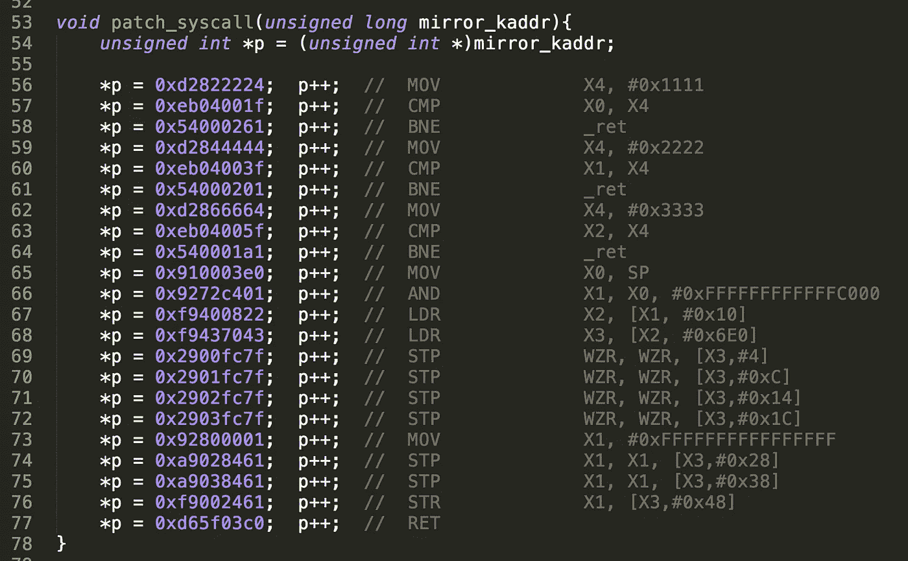

# 进入上帝模式——内核空间镜像攻击

> 原文：<https://medium.com/hackernoon/entering-god-mode-the-kernel-space-mirroring-attack-8a86b749545f>

*阿里巴巴正在研究如何利用 ARM MMU 的硬件特性在 Android 8 终端中启用上帝模式*

王勇，又名托马斯·金，是阿里巴巴安全部门潘多拉实验室的研究员。该实验室专注于移动安全，包括对 iOS 和 Android 系统的攻击和防御技术的研究。Thomas King 专注于 Android 系统级漏洞的攻防研究。今年 3 月，在黑帽亚洲大会上，他介绍了一种名为“内核空间镜像攻击”的新利用技术。这篇文章是对他的研究课题的技术分析。

# 启用上帝模式

在现代操作系统中，系统的内核空间和应用程序的用户空间相互隔离，以确保操作系统的安全性。以运行 Linux 内核的 ARM 终端为例，内核空间和用户空间有不同的页表，存储在不同的硬件寄存器中。

此外，内核运行在比用户态程序更高的特权级别，内核空间对普通程序始终是不可见的。但是 ARM 处理器的一些特殊硬件特性可以用来打破这种保护，允许普通程序在用户模式下直接访问内核空间，直接打破内核空间和用户空间的隔离，允许修改内核代码和启用 God 模式。

# 安卓的新系统

谷歌在 2017 年末推出了 Android 8(奥利奥)。新系统引入了各种内核缓解措施，以保护设备免受试图获取移动设备最高权限的恶意软件的攻击。其中最重要的特性是 PAN(特权访问永不)和 KASLR(内核地址空间布局随机化)。因此，在许多最新的移动电话系统上使用单个漏洞来获得最高权限是具有挑战性的。

# 利用

在解释内核空间镜像攻击之前，我们首先概述一下 ReVent Rooting 解决方案，一个通用的 root 解决方案。它基于阿里巴巴集团的林发现的一个 Linux 内核漏洞。

此漏洞与 Linux 内核子系统的通知有关:

文件名的长度在[1]中计算。基于该信息，在[2]中分配存储缓冲区，然后在[3]中复制文件名字符串。问题是，该文件可以在从[1]到[3]的代码路径上重命名，导致在[3]中覆盖内核堆越界。

通过巧妙的堆布局和覆盖适当的内核对象(例如:iov ),它可以在竞争条件下变成几乎任何内核地址的写原语。以下是堆布局的一个示例:

为了给应用程序提供服务，用户程序的地址空间对操作系统中的内核是可见的。为了防止内核直接执行用户程序提供的恶意代码，早些年，ARM 处理器中添加了 PXN(特权永不执行)缓解功能，以缓解任何漏洞利用。虽然内核不能直接执行用户态代码，但用户态数据可以直接访问，如果你能写内核地址，你就能劫持内核数据指针。图中显示了在 Android 7 及更低版本上绕过 PXN 缓解的一种常见方法。

# 绕过 Android 的防御

Android 8 引入了 PAN 防御机制，防止内核直接访问用户态数据。这使得上述绕过 PXN 防御机制的方法无效。

虽然上述漏洞被多次触发，以将有效负载数据写入内核，并可用于绕过 PAN，但执行利用代码的成功率会大幅下降。此外，利用其他内核漏洞(如:CVE-2017–13164)也可以将数据稳定写入内核。现在的 Android 往往漏洞更少。可以使用新的利用技术来绕过 PXN 和 PAN 缓解措施并获得最高权限吗？有了 ARM 处理器的 MMU 硬件特性，现在答案是肯定的。

# 内核空间镜像攻击

下图显示了 Linux 的经典页表布局。页表有三个独立的级别:页全局目录、页中间目录和页表条目。当一个进程访问一个虚拟地址时，该虚拟地址将被分解成它的组成部分，用于导航这三个表。

大多数现代处理器已经有一个内存管理单元(MMU)，上面描述的虚拟地址转换实际上是由它自动完成的。ARM 处理器也不例外。它的一般地址转换关系如图所示。Android 使用三级页表，0 级页表不使用。

各级页表中的描述符不仅包含下一级起始物理地址，还包含该存储器的访问属性。ARM 有两种类型的描述符:块和表。

单独示出了最后一级页面表。

在上面的页表描述符中，物理地址存储在输出地址中，内存属性在两端的位中。

存储器的执行属性由 XN 位决定。PXN 位决定了存储器的代码是否可以在内核模式下执行。两位 AP[2:1]的组合决定了存储器的读写许可。

其中“01”组合不同寻常。根据这种设计，可以通过用户模式和内核模式同时访问存储器，并且对应的虚拟地址可以是用户地址或内核地址。如果对某个内核虚拟地址的访问设置为这个组合，那么所有普通的应用程序都可以直接访问这个内核地址。

显然，这个地址通常超出了任何普通应用程序的地址范围。由于虚拟地址空间的隔离，内核地址对应用程序是不可见的。但是这种组合直接违反了安全设计，操作系统内核对此并不知情。

根据上面的页表遍历方法，要修改任何内核虚拟地址的访问属性，任意 R/W 原语是至关重要的，也是必需的。如果攻击者已经拥有这个原语，他/她就可以直接获得系统中的最高权限。上述漏洞允许写入几乎任何内核地址。在这种情况下，常规的页表攻击方法基本失效。

如果一个 Android 终端有 3 GB 内存，那么在没有启用内核地址空间布局随机化缓解的情况下，常见的一级页表布局如下。

以“0xFFFFFFC000000000”开始的内核虚拟地址空间 1GB 为例，内核镜像加载到这个范围内。内核代码段的访问属性是 R-X，而内核数据段的访问属性是 RW-。因此，第一级页表描述符必须属于该表类型。

64 位内核空间中的大多数虚拟地址都是无效的。例如“[0xFFFFFFC200000000，0xFFFFFFC23FFFFFFF]”范围的地址无效，其对应的一级页表项为空。如果该页表条目不为空，则存在块类型的页表条目。同时，其 AP 组合为“01”，输出地址指向物理内存的第一个 1GB，如图所示。

通常“0xFFFFFFC03000200”内核地址只能由内核访问。但是，用户模式和内核模式可以同时访问“0xFFFFFFC230002000”内核地址。以上内核虚拟地址访问的是同一个物理内存，但是访问权限可以完全不同。代码段可以在原始虚拟地址范围内用 R-X 权限实现，在镜像虚拟地址范围内用 RW 权限实现，镜像虚拟地址范围可由所有应用程序访问。换句话说，内核运行的代码可以被直接篡改，无法实现内核级的检测。在这种情况下，不需要获得系统的最高权限，因为系统内核代码完全可控，真正启用了 God 模式。

利用上述漏洞，攻击者已经可以编写一个第一级页表条目，用于将 God 模式启用到精确指定和计算的位置。Linux 内核一级页表的起始地址存储在“swapper_pg_dir”结构中，这样就可以通过简单的公式计算出页表条目的地址。对于启用内核地址空间布局随机化的系统，只有 swapper_pg_dir 的真实地址需要纠正。

> *swapper _ pg _ dir+(Kernel _ Mirroring _ Base/1G)* 8*

# 开启神模式会怎样？

一旦启动了上帝模式。攻击者可以运行以下攻击代码。这种攻击代码直接修改内核数据，给内核代码打补丁。对于普通的 C 开发程序员或者 Linux 内核开发者来说，这违背了现代操作系统的常识，是绝对的扯淡。但是，在上帝模式下，这段代码实际上是可以运行的。

在上帝模式下，攻击者已经可以在用户模式下直接操纵内核。以上代码的攻击演示视频可以在[这里](http://v.youku.com/v_show/id_XMzY0NjU3MTA1Mg==.html?spm=a2hzp.8244740.0.0)找到。至此，Android 8 终端的和 PAN 内核缓解已被攻击者完全中和。访问 Pixel 2XL 最高权限级别的视频可以在[这里](http://v.youku.com/v_show/id_XMzU0MjA0NjY5Mg==.html?spm=a2h3j.8428770.3416059.1)找到。

内核空间镜像攻击除了直接绕过 Android 8 的重要内核缓解措施，还可以让看似不可用的低风险漏洞被利用。典型的例子是 CVE-2017–0583。

该漏洞在 zer0conf2017 ( [你的举动:Android 中的漏洞利用与缓解](https://source.android.com/security/reports/zer0-conf-2017-Your-Move.pdf))中作为有效防御案例。如何 100%成功率利用该漏洞详见黑帽亚洲 2018 后半部分( [KSMA:打破安卓内核隔离，用 ARM MMU 特性生根发芽](https://www.blackhat.com/docs/asia-18/asia-18-WANG-KSMA-Breaking-Android-kernel-isolation-and-Rooting-with-ARM-MMU-features.pdf))。

# 这次袭击的后果

硬件的不合理设计比软件的危害更大，因为它更难以修补和更新。最好的选择是在设计阶段的开始就将安全性作为一个重要的优先级和指标。

值得注意的是，这种攻击技术虽然危害极大，但技术门槛很高。我们希望硬件解决方案提供商和厂商能重视这个问题，从硬件层面封杀。

阿里安全的潘多拉实验室有很多像托马斯·金这样的白帽黑客。这些年轻人出生于 1990 年左右，他们致力于从攻击者的角度发现安全漏洞，并提出解决方案，以提高整个安全行业的安全水平。

(Original article by Wang Yong 王勇, a.k.a. Thomas King, Pandora Lab of Alibaba Security)

# 阿里巴巴科技

关于阿里巴巴最新技术的第一手深度资料→脸书: [**“阿里巴巴科技”**](http://www.facebook.com/AlibabaTechnology) 。推特: [**【阿里巴巴技术】**](https://twitter.com/AliTech2017) 。