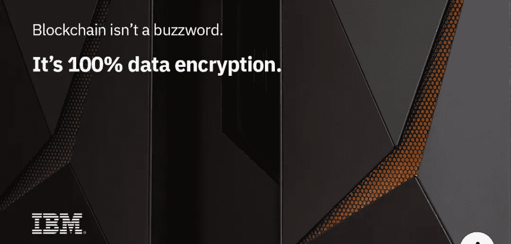
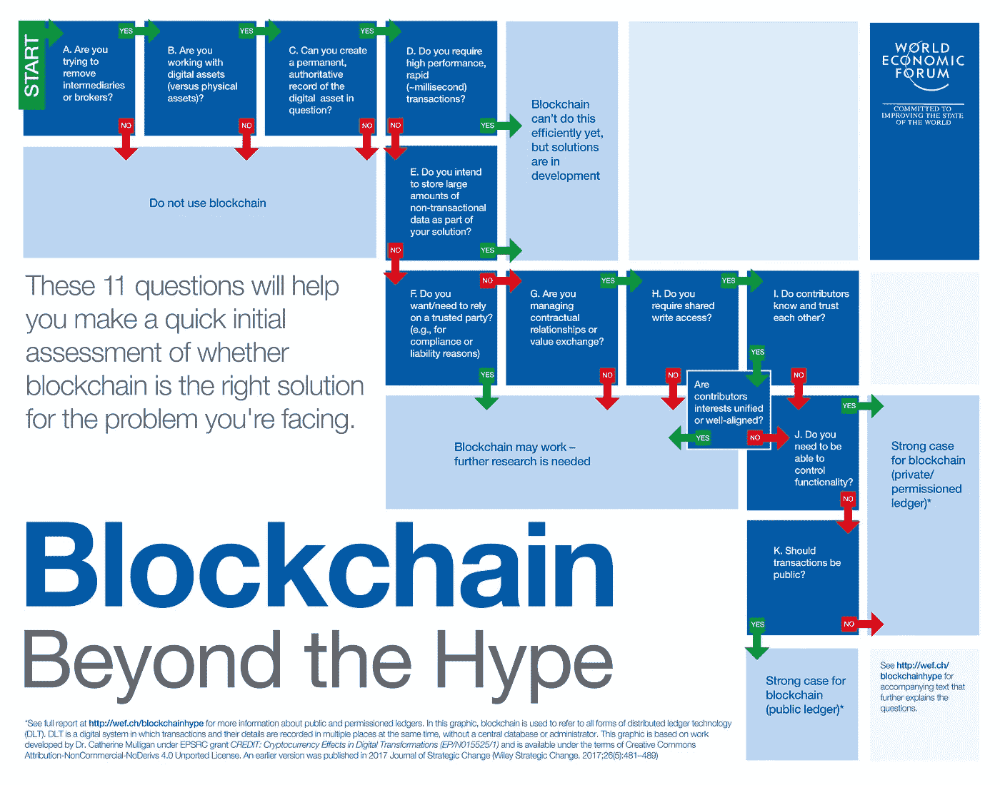

# 企业区块链——不是什么时候，是为什么？

> 原文：<https://medium.com/hackernoon/enterprise-blockchain-its-not-when-it-s-why-209d092164df>

“person holding sticky note” by [Hitesh Choudhary](https://unsplash.com/@hiteshchoudhary?utm_source=medium&utm_medium=referral) on [Unsplash](https://unsplash.com?utm_source=medium&utm_medium=referral)

> 从诞生**比特币:一种 P2P 电子现金系统到现在已经十年了。一个如此强大的系统，被许多人吹捧为当今世界上最安全的计算机网络。一个系统，建立在混合了社会工程结构的数学能力上，如博弈论和机制设计。一个系统把易犯错误的人变成值得信任的公民，让他们遵守系统的规则，让我们称他们为“特鲁西亚人”。**

比特币是[区块链](https://hackernoon.com/tagged/blockchain) [技术](https://hackernoon.com/tagged/technology)的第一个杀手级应用，它一手点燃了全球辩论，将“区块链”称为互联网 2.0，这是一台将改变商业的价值驱动机器，以及所有相关功能，包括让不可能成为可能。

然而，炒作周期几乎达到了临界质量——我们开始回到这样一个事实，即区块链只是数据结构，它将一组聪明的附加属性组合在一起，为数字商务提供了一个出色的解决方案。

迄今为止的进步是十年来聪明的开发人员竭尽全力尝试的结果，并且真正血腥地尝试使它工作。剩下的只是二手车推销员和垃圾会议，向消费者收取过高的相关费用——网络繁荣了吗？

是时候坦诚相待了。它不会彻底改变一切，取代一切，成为这种不可逾越的力量，可用于复杂的商业管道，以花生酱吐司。这并不神奇，但是对于没有数学头脑的 Zk-SNARKS 和 Bulletproofs 来说实际上很神奇。

那么，这种技术有什么价值呢？

*   金融
*   收藏品(不可替代的资产)
*   供应链
*   分散存储(非常昂贵)

那么什么可能不是:

*   人工智能/人工智能/自然语言处理融合的可穿戴区块链——我们都读过至少一份这样的白皮书
*   任何使用如下广告来愚弄消费者的公司…IBM

> 这比一个 16 岁的孩子学开手动挡车还难！

毫无疑问，IBM Linux Z 系列服务器是高性能、可伸缩和久负盛名的工作平台。这些可怜的企业仍然维护着一个有着华丽的黑色和绿色屏幕的 COBOL 主机。

然而，我们都知道区块链不是 100%加密，地狱它的推断，所有的计算在服务器内执行，而链上也是 100%同态加密。在服务器上是可能的，最好的一种，但还没有在区块链得到验证，也不可扩展——那么他们指的是什么呢？

# 让我们回到基础

事实是，在我们开始回到比特币和其他区块链网络的价值所在之后，它们的用途是:

*   经济学
*   社会工程
*   密码原语
*   拜占庭容错
*   激励和抑制因素
*   博弈论与机制设计

所有公共网络要想取得成功，通过网络效应实现指数级增长，就必须在区块链协议的基础架构内构建复杂的社会系统。

然而，我为什么带你到这里来，是因为我对企业、财团之类的一切都向区块链提出建议感到担忧。

# 许可链

许可的区块链网络就像企业内部网，只对内部人员有用。此类网络中的发布块必须由某个机构(集中或分散)授权，因此由这样的机构维护。它们仍然共享它们的无许可对等物的许多相同的令人兴奋的属性，包括共识模型，尽管由于它们的受控的更小的可信网络，维护成本更低。

然而，作为一个已经通读了数百份白皮书、研究了关键发现并听取了比我聪明得多的人的意见的人，我仍然对这些咨询公司甚至企业认为他们的投资回报率会是多少感到困惑。

这肯定不是用户体验(UX)，事实上，他们向他们的主管推销它，因为“哦，我们将使用一个区块链，或分布式账本”尖叫说它研究得不好，将被很好地实现，并呈现出缺乏光泽的结果。

这并不是针对分布式分类账、区块链、有向无环图或任何其他将成为本月交易风格的八卦协议。这是关于价值的。这些企业打算向消费者和利益相关者提供什么。

Jimmy Song 和许多其他受过高等教育的人已经尝试、测试并发现，基于不同的协议和模型(如 UTXO，或任何其他没有可靠用例的许可链协议)进行编码绝对是浪费时间。

有 1001 种不同的数据库、语言、库和支持可用于交付流畅、响应迅速、华丽的业务界面和复杂的逻辑，为目前存在的 99.9%的业务流程在本地或云中运行。所以，请帮我一个忙，不要相信推销员或女人。

> 花时间评估你的用例是什么？
> 
> 为什么您的企业需要它？

然后去回答下面的问题:

如果你还在这里，在看完这些问题之后，想想这个，

*   建立一个小型多学科团队(MDT)
*   使用敏捷方法，利用 Scrum、看板和 Sprints 的精华。
*   建立 CI/CD 渠道
*   找人帮忙。

我在这个领域花了很多时间，教育自己和他人，并抽出时间参加会议并在会上发言，以确保我们继续提供有价值的东西。试图阻止 ICO 为拙劣的创意和有内在缺陷的加密经济结构筹集数百万美元。

所以，请慢慢来，我希望看到你和你的企业取得胜利——但要有正确的理由。

感谢阅读，

本杰明·霍尔

 [## 本杰明·霍尔-澳大利亚政府部门敏捷(SAFe)高级业务系统分析师…

### 查看世界上最大的职业社区 LinkedIn 上本杰明·霍尔的个人资料。本杰明有 6 份工作列在…

www.linkedin.com](https://www.linkedin.com/in/benjaminhall-aus/)  [## 加密追赶

### 只是一名来自澳大利亚的普通 IT 分析师，喜欢探索加密货币和分布式账本空间…

www.youtube.com](https://www.youtube.com/channel/UCQOI9gH7hLiDtJHMnYcUGew)