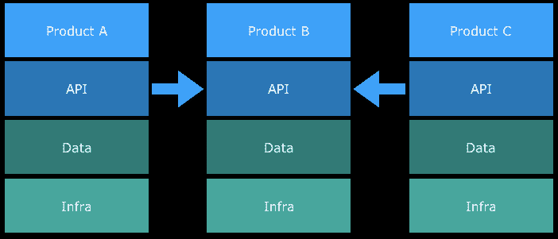

# 企业已死，敏捷万岁！

> 原文：<https://medium.com/hackernoon/enterprise-is-dead-long-live-agile-c4758f9049ff>

在公司中,“企业”一词经常给人一种重要性、复杂性、成本和规模的感觉。同样，高预算、高知名度的项目通常会导致技术部门用企业就绪的软件解决方案和基础设施来应对。

这意味着广泛的规划、评估、采购和时间框架，通常需要几年时间来“做好”。以这种方式构建企业级解决方案的成本通常为数百万。失败的风险是极端的。

当然，企业级解决方案不应该意味着高成本、高风险和长时间。这通常是传统思维和组织结构的结果。有时也是因为企业没有能力或不愿意转型和拥抱变化。

这篇文章考虑了传统企业需要做些什么来改变这种思维模式，变得更加敏捷。

# 什么是企业？

在本文的上下文中，企业意味着大规模交付的大规模复杂解决方案。它通常会产生企业就绪型软件解决方案，这种解决方案由解决整个组织特定业务需求的专业应用程序组成。

由于“企业”一词意味着规模、成本和复杂性，因此它通常会基于这些原因推动传统的部署和规划方法。它导致第三方应用程序的内部解决方案或管理。

传统的企业项目可能包括以下内容:

*   专门的破解团队
*   可行性研究
*   风险评估和缓解策略
*   预先确定所有功能性和非功能性需求
*   文件和项目规划
*   与其他系统和团队的集成策略
*   迁移策略
*   成本估算
*   评估和采购流程
*   履行
*   操作指南和检查站
*   灾难恢复规划
*   部署和发布计划
*   大爆炸发布
*   对出错原因的调查

# 为什么是企业？

具有讽刺意味的是，传统的企业方法旨在降低风险，确保寿命，可维护性，并提供整个业务的最大价值。

几十年前，这是有道理的。部署软件和维护服务器是一个复杂的过程，需要专业的团队和专业的应用程序。它需要专门的团队来保证正常运行时间、可用性并提供全天候支持。部署、监控、保护和管理这些企业系统是一项全职且复杂的挑战，需要很长的准备时间来实现新功能。企业围绕着这些依赖而成长，并形成了支持这种依赖的组织结构。

随着技术和现代实践的进步，这些挑战中的许多都不再存在，通过相对低成本的基于订阅的云提供商，可以轻松地购买到更优越、可扩展和高性能的解决方案。这使得采用精益原则的创业公司和公司能够快速获得竞争优势。尽管他们在产品开发方面面临同样的挑战，但他们能够更快、更便宜、更大规模地交付产品。

Monzo 等挑战者银行在实践中就是一个很好的例子，现在它们在规模上与巨头竞争。毫无疑问，这是一款企业级产品，但该产品基于敏捷原则，并利用了现代架构。它能够快速推出各种功能，并快速适应客户的需求。

事实上，采用传统企业方法的公司在市场上的竞争力较弱。他们对风险和变化的厌恶增加了实际的风险和成本。许多项目失败了，遗留系统被构建在它们要取代的系统之上或者与它们集成在一起。

这在很大程度上源于传统的组织结构，这种结构导致了 IT 优先的方法和与业务的分离。一旦确定了业务需求，IT 部门就会在业务实现任何价值之前构建庞大的企业解决方案。在此期间，市场或业务需求可能已经改变，或者关于客户需求的假设可能是错误的。

在传统的公司中，项目被水平分割成小团队。IT/运营团队提供企业软件解决方案来服务企业。结果是在整个项目生命周期中大量的沟通开销和交接点。

孤立的团队推动了对支持整个组织中许多需求的整体系统的需求。这增加了部署、升级和项目管理的复杂性。此外，由于推广这些系统需要大量投资，这也阻碍了变革。

Traditional enterprise

# 什么是敏捷？

敏捷是一种基于简单宣言的方法论。

*   过程和工具之上的个人和交互
*   综合文档之上的工作软件
*   合同谈判中的客户协作
*   响应变化而不是遵循计划

它基于十二项原则，将最终用户的需求置于一切之上，这是一项重要而有力的战略。这也是关于经常发布和推动自组织团队内部的架构决策，同时与业务密切协作。

敏捷方法实际上是促进团队内部协作和交流以及自我提高和学习的框架和惯例。它有助于快速实验和迭代开发。

精益原则与测试和学习相结合，补充了敏捷的工作方式，并进一步推动了在整个项目中以低成本验证用户价值和假设的能力。这使团队专注于做最少的必要工作，以达到满足客户的业务目标。这与传统企业相反，传统企业致力于规划和预测业务的未来需求。

# 为敏捷而组织

为了让一家公司[转变](https://hackernoon.com/tagged/transform)并拥抱敏捷，它需要从孤立的团队中进行重组。为了成功地做到这一点，需要将整个组织的水平切片分解并重组为小的垂直切片产品团队。

Agile Product Teams

敏捷产品团队应该:

*   自我组织
*   交付用户价值并验证该用户价值
*   由实现产品所需的所有技能组成
*   自主做出所有决策
*   负责产品数据集和产品基础设施
*   能够独立、快速和频繁地部署
*   通过产品服务与其他产品团队松散耦合

对于向敏捷原则转型的传统公司来说，由于跨产品的遗留系统的高度耦合，这些通常很难实现。随着时间的推移，应该消除这些交叉依赖，并将新系统迁移到拥有它们的单个团队的控制之下。

其他挑战当然是在整个过渡期间保持光明、知识转移和抵制变革。

选择正确的产品团队划分对于确保产品粒度的正确水平，以及最小化交叉依赖和约束是非常重要的。这些团队应该专注于特定的业务能力。

# 敏捷架构

我们在这里真正的意思是，为了变得更加敏捷，为持续交付构建架构。这支持产品团队实现其业务目标。持续交付是敏捷的 12 个原则之一。连续交付是它自己的一套实践和原则，以最小的风险、成本和开销实现这一目标。

一个拥有完全自主权的产品团队可以随着时间的推移自由地调整和改进其产品的架构，以满足其业务目标，并且没有孤岛式运营团队的约束和复杂性。这本身就消除了对涉及业务多个部分的企业软件的需求。它允许每个团队重新构建和简化生产路径，以满足业务需求。

# 扼杀企业

在转换过程中，重新架构和发展的需求受到遗留系统和产品间高度耦合的阻碍。扼杀者模式是这个问题的一个解决方案，它允许业务在整个转换过程中继续运行。

使用扼杀者模式，现有系统的小部分可以在小的增量变化中被替换，一次一部分。它需要最小的前期投资和风险。每个部分都是在一个新的架构上重新构建的，并允许旧的部分被慢慢蚕食，直到被完全取代。新切片可能包含新功能，并在过渡期间继续提供价值。

反向代理通常用于使这一过程对最终用户透明，并保持无缝的用户体验。

Strangler Pattern

这种方法避免了大规模重构、潜在的代码冻结和现有系统的大规模迁移。这样的项目会与敏捷原则相冲突，因为在重写过程中它不会为用户提供直接的价值。

英国的 TSB 银行在一次大规模的大爆炸式迁移项目中非常公开地失败了，这反过来又削弱了它的产品系列。这使得客户无法使用他们的账户或资金。

# 摘要

为了在不断发展的市场中保持竞争力，传统公司必须在整个组织中拥抱变革，打破企业传统。这需要从组织结构开始的大规模业务转型。这包括建立专门的跨学科产品团队和消除孤岛。

产品团队必须被给予自主权和信任来完全管理他们所拥有的产品，没有外部治理或架构约束。

为了在已建立的产品范围内实现必要的转换，扼杀者模式可以帮助团队开发产品，同时继续向客户交付价值。这是通过新成立的产品团队内部的现代云重新架构和迭代实现的。它可能需要简化和/或替换大型企业系统，以重新关注业务目标。

衡量这些团队的 KPI 包括上市速度和客户满意度。一个好的团队应该能够一天部署多次。它们应该通过快速实验和用户测试不断改进。这使得团队能够快速创新，真正了解他们的客户，并在必要时进行调整。